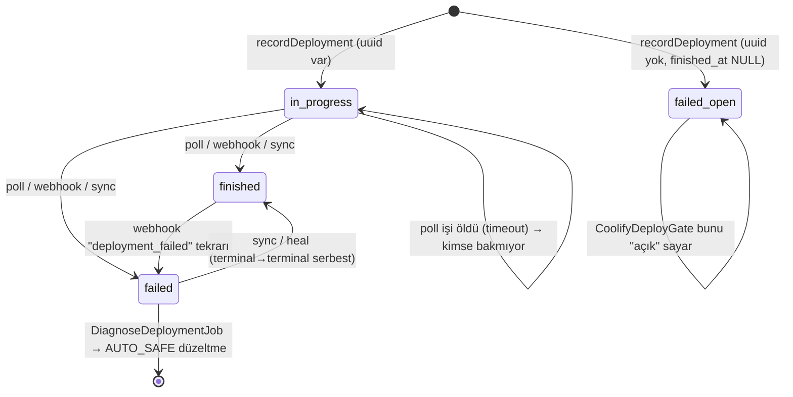

# 04 — Coolify, deploy ve teşhis denetimi

**Tarih:** 2026-09-24 · **HEAD:** 8484d37 · **Hazırlayan:** S3 — Coolify, deploy ve teşhis denetçisi (Dalga 1)
**Kapsam:** M2 ([01-envanter.md §11](01-envanter.md#11-modül--dosya-haritası-dalga-1-sahiplik-referansı)): `app/Services/Coolify/**` (Dto, EnvCatalog), `app/Services/Sites/{SiteProvisioner,ChannelSwitcher,ComposePackMigrator,CoolifyDeploySettings,DeploymentFailureText}`, `app/Services/Sites/Diagnosis/*`, `app/Services/Ops/OpsCoolifyDeployQueue`, Coolify/Deployment/Settings/DeamonGit controller'ları, Coolify webhook zinciri, `Deployment` modeli, `PollDeploymentJob`, `DiagnoseDeploymentJob`, `ProvisionSiteJob`, `SwitchSiteChannelJob`, `SyncCoolifyEnvCatalogJob`, `ops:import-coolify-apps`, `ops:heal-throttled-deploys`, `ops:sync-env-catalog`, `app/Support/{RetryAfter,CoolifyWebhookSignature}`.
**Kapsam dışı:** Tema dağıtımı (M4), app-health denetçisi ve agent (M3; yalnız `SiteAppHealthFixer` teşhisin çağırdığı kadarıyla okundu), Cloudflare/domain (M5), kuyruk/iş widget'ı UI (M8). Canlı Coolify'a istek atılmadı.

Ölçüm: `php artisan test --compact --filter="Coolify|Diagnos|ChannelSwitch|PollDeployment|HealThrottled|ComposePack|BulkDeployWaiting|EnvExampleParser|ProvisionSite"` → **308 geçti / 0 başarısız** (1715 assertion, 149,6 sn).

## Özet

- **Env kataloğu tek bir CMS commit'iyle filo çapında secret silebilir (Kritik).** Her Plane deploy'u `CoolifyAppEnvSync` ile katalogda olmayan her anahtarı Coolify'dan `DELETE` eder; `DB_PASSWORD` / `MYSQL_ROOT_PASSWORD` / `CONTROL_PLANE_AGENT_SECRET` korumalı değil ve Plane'de kopyası yok (S3-B01).
- **Deploy durum makinesinde birbirini besleyen dört hata var:** kanal geçişi webhook'u yanlış servise gidiyor (S3-B04), webhook bilinmeyen deployment'ı başka bir açık satıra yapıştırıyor (S3-B05), iş hatası yakalayıcısı ilgisiz eski deploy satırını `failed` yapıyor (S3-B02), toplu kanal geçişi prod kuyruğunda ilk siteden sonrakileri deploy kapısına takıp `error`'a düşürüyor — testler `sync` kuyrukla koştuğu için görünmüyor (S3-B03).
- **Takılı satırlar tüm bağlantıyı kilitleyebilir.** `PollDeploymentJob` 30 sn iş süresi HTTP zaman aşımı + retry'dan kısa; `failed()` yok; `finished_at`'sız `failed` satır da “açık” sayılıyor. `max_concurrent_per_server=1` olduğu için tek takılı satır o Coolify'daki tüm deploy'ları reddettirir (S3-B06, S3-B07). Önceki: A2 (Yapılmadı).
- **Otomatik teşhis+düzeltme (d804395) L4'te ama doğrulamasız:** site başına 24 saat döngü kilidi var; filo bütçesi, düzeltme sonrası doğrulama, çalışma zamanı kill switch'i, atlanan/başarısız düzeltme audit'i yok; webhook gövdesi sınıflandırıcıya doğrudan giriyor (S3-B08, S3-B11). `AUTO_SAFE` içindeki `redeploy` HEAD'i izleyen sitede başka bir commit'i canlıya çıkarabilir ve env prune'u tetikler; `bind_domains` hiçbir kuralın `auto` değeri değil (yalnız `compose_domains_before_raw` kuralında elle seçilebilir, `DeploymentFailureClassifier.php:246`) ama canlı hostları değiştirebilecek bir eylem (S3-B27).
- **En değerli öneriler:** env prune korkuluğu (S3-O01), `ops:reconcile-deployments` zamanlanmış görevi (S3-O06), iş zaman aşımı + `failed()` düzeltmesi (S3-O07), webhook'u “ipucu” yapıp Coolify'dan yeniden okumak (S3-O05) ve iki satırlık hata düzeltmeleri (S3-O02, S3-O04, S3-O08).

## 1. Mevcut durum

### 1.1 Akışlar

**Deploy (tekli / toplu / otomatik düzeltme)**
1. `SiteCoolifyOpsController::{deploy,pin,followHead}` (web isteği içinde senkron) veya toplu `queueOpsJob` → `ProcessOpsBackgroundJob` (`ops:coolify-bulk` kilidi, `app/Jobs/ProcessOpsBackgroundJob.php:55`) → `PacedFanout` → `CoolifyDeployGate::duringSweep`.
2. `CoolifyDeploySettings::{redeploy,pin,followHead}` → `CoolifyDeployGate::assertCanStartDeploy` → `CoolifyApplicationService::deploy` (yine kapı + `CoolifyAppEnvSync::sync` + `POST /deploy`) (`app/Services/Coolify/CoolifyApplicationService.php:227-247`).
3. `recordDeployment` → `deployments` satırı (`in_progress` ya da uuid yoksa `failed`) → `PollDeploymentJob` (15→60 sn jitter'lı, en çok 40 deneme) (`app/Services/Sites/CoolifyDeploySettings.php:208-233`).
4. Sonuç: webhook (`POST /webhooks/coolify` → `VerifyCoolifyWebhook` → `CoolifyWebhookHandler`) veya poll → `CoolifyDeploymentSync::applyExisting` (Manual/ThemeRollout) ya da `SiteProvisioner`/`ChannelSwitcher::applyRemoteDeployment`.
5. Satır `failed` olunca `Deployment::saved` → `DiagnoseDeploymentJob` (afterCommit) → `DeploymentDiagnoser` → sınıflandır → gerekirse konteyner logu → `AUTO_SAFE` düzeltme (`SiteAppHealthFixer::fix`) → `site.deploy_auto_fix` audit (`app/Models/Deployment.php:55-73`, `app/Services/Sites/Diagnosis/DeploymentDiagnoser.php:112-157`).

**Kanal geçişi:** `ChannelSwitcher::start` (kilitli işlem, `desired_channel`, `deploying`) → `SwitchSiteChannelJob` → `switchOnCoolify`: `PATCH git_branch` → `PATCH envs/bulk` → `deploy()` (kapı + env sync) → satır → poll (`app/Services/Sites/ChannelSwitcher.php:126-166`).

**Env kataloğu:** CMS push → `GitHubWebhookHandler` → `SyncCoolifyEnvCatalogJob`; saatlik `ops:sync-env-catalog` (`routes/console.php:23-26`); Settings “GitHub'dan yenile”; boş katalogda talep anında. `CoolifyEnvCatalogSync::replace` kanal satırlarını sil-yaz yapar (`app/Services/Coolify/EnvCatalog/CoolifyEnvCatalogSync.php:114-143`).

**Envanter:** yalnız manuel `POST /coolify/{connection}/sync` → `CoolifyInventorySync` (+ `CoolifySiteTargetSync::fill` + son 25 deployment). Zamanlayıcı yok (`routes/console.php:16-42`).

### 1.2 Ana dosyalar

| Dosya | Sorumluluk | Satır | Test dosyası |
|-------|------------|------:|--------------|
| `app/Services/Coolify/CoolifyClient.php` | HTTP, retry, 429 cooldown, uuid doğrulama | 697 | `tests/Unit/Coolify/CoolifyClientTest.php`, `CoolifyClientRateLimitTest.php` |
| `app/Services/Coolify/CoolifyRateGuard.php` | Host başına aralık + paylaşılan cooldown (süreç içi singleton) | 102 | `tests/Unit/Coolify/CoolifyRateGuardTest.php` |
| `app/Services/Coolify/CoolifyDeployGate.php` | Bağlantı/sunucu başına eşzamanlı build sınırı | 118 | `tests/Feature/Coolify/CoolifyDeployGateTest.php` |
| `app/Services/Coolify/CoolifyAppEnvSync.php` | Katalog → Coolify env upsert + prune | 352 | `tests/Feature/Coolify/CoolifyAppEnvSyncTest.php` |
| `app/Services/Coolify/EnvCatalog/*` | `.env.production.example` çek/ayrıştır/yaz | 424 | `CoolifyEnvCatalogSyncTest.php`, `EnvExampleParserTest.php` |
| `app/Services/Coolify/CoolifyDeploymentSync.php` | Uzak durum → satır, ops mail, site kurtarma | 271 | `CoolifySiteSyncTest.php`, `HealThrottledDeploysCommandTest.php` |
| `app/Services/Coolify/CoolifyWebhookHandler.php` | Webhook → satır eşleme | 175 | `tests/Feature/Webhooks/CoolifyWebhookTest.php` (17 test) |
| `app/Services/Coolify/CoolifyInventorySync.php` | Allowlist tabloları + site doldurma | 153 | `tests/Feature/Ops/CoolifyConnectionsTest.php`, `CoolifySiteTargetSyncTest.php`, `CoolifyInventoryListTest.php` |
| `app/Services/Sites/CoolifyDeploySettings.php` | Redeploy / pin / follow HEAD / auto-deploy | 308 | `tests/Feature/Sites/CoolifyDeploySettingsTest.php` (12) |
| `app/Services/Sites/ChannelSwitcher.php` | Kanal geçişi | 384 | `tests/Feature/Sites/ChannelSwitchTest.php` (16) |
| `app/Services/Sites/ComposePackMigrator.php` | Dockerfile → compose | 218 | `ComposePackMigrateTest.php` (8) |
| `app/Services/Sites/Diagnosis/*` | Sınıflandırıcı (23 kural), teşhis DTO, uygulayıcı | 862 | `DeploymentFailureClassifierTest.php` (11), `DeploymentDiagnosisTest.php` (8) |
| `app/Services/Ops/OpsCoolifyDeployQueue.php` | Widget kuyruğu, cancel/force-start, `refreshOpen` | 646 | `BulkDeployWaitingBucketTest.php` vb. |
| `app/Jobs/PollDeploymentJob.php` | Durum okuma, transient yeniden planlama | 250 | `PollDeploymentThrottleTest.php` (6) |
| `app/Console/Commands/HealThrottledDeploysCommand.php` | Throttle/timeout satırlarını Coolify'dan düzelt | 144 | `HealThrottledDeploysCommandTest.php` (8) |
| `app/Http/Controllers/Ops/CoolifyConnectionController.php` | Bağlantı CRUD, test, sync | 409 | `tests/Feature/Ops/CoolifyConnectionsTest.php` |
| `app/Http/Controllers/Ops/SiteCoolifyOpsController.php` | Site Coolify eylemleri (tekli senkron, toplu kuyruk) | 549 | `SiteBulkActionsTest.php` vb. |

### 1.3 Test kapsamı

| Testli | Testsiz |
|--------|---------|
| 429/Retry-After, transient poll yeniden planlama, POST'un 5xx'te tekrarlanmaması | Poll işinin zaman aşımıyla ölmesi; `failed()` yolu |
| Webhook imza/token matrisi, secret loglanmaması, failed webhook'ta log çekme | Webhook'un ChannelSwitch satırına gelmesi; bilinmeyen uuid + farklı uuid'li açık satır; terminal→farklı terminal tekrar |
| Teşhis otomatik düzeltme + 24 sa tekrar kilidi + yenilemenin fix çalıştırmaması | Filo bütçesi, iş ortasında ölme, düzeltme sonrası doğrulama |
| Kanal geçişi PATCH hatası (önceden deploy satırı olmayan site) | Önceden deploy satırı olan sitede hata (S3-B02); toplu geçişte deploy kapısı (S3-B03) |
| Env sync upsert/prune, katalog parse | Katalogdan secret anahtar düşmesi; `desired_channel` ile yanlış katalog |
| Deploy kapısı sweep muafiyeti | Kapı yarışı (TOCTOU), `finished_at`'sız `failed` satır |

Not: `phpunit.xml:32` `QUEUE_CONNECTION=sync`. Toplu işlemlerde ardışık dispatch edilen işler testte sweep içinde satır içi koşar; prod'da (`docker-compose.coolify.yml:30` redis, `docker/supervisor/supervisord.conf:27` tek worker) koşmaz. Kapı/kuyruk etkileşimleri bu yüzden testte görünmüyor.

### 1.4 Teşhis kural kataloğu ve otomatik düzeltme sınırları

Kaynak: `app/Services/Sites/Diagnosis/DeploymentFailureClassifier.php` (23 kural, `'code' =>` satırları 31–266; eşleşme yoksa `unknown`, `:315`). Yalnız 7 kod otomatik düzeltme taşır; geri kalan 16'sı operatöre adım + sunucu komutu verir (L2).

| Kod (satır) | Otomatik | Log çeker | S3 değerlendirmesi |
|-------------|----------|-----------|--------------------|
| `mysql_no_root_password` (:31) | `sync_env` | hayır | Güvenli ama yarım: env yazılır, redeploy yok → site `failed` kalır; sync_env prune'u da çalıştırır (S3-B01) |
| `registry_rate_limited` (:106) | `redeploy` | hayır | Anında force redeploy; filo olayında yük + HEAD kayması (S3-B27) |
| `app_db_unreachable` (:148) | `restart_app` | evet | Geçici ise doğru; şifre uyuşmazlığında 24 sa kilidi döngüyü keser, doğrulama yok |
| `app_redis_unreachable` (:161) | `restart_app` | evet | Aynı |
| `compose_domains_before_raw` (:242) | `redeploy` | hayır | Belgelenmiş doğru düzeltme; HEAD kayması riski aynı |
| `no_deployment_uuid` (:250) | `sync_deployments` | hayır | Açık kalan satırı kapatmaz (S3-B07) |
| `coolify_timeout` (:258) | `sync_deployments` | hayır | Coolify hâlâ çalışıyorsa hiçbir şey değişmez, tekrar kontrol yok (S3-O06) |
| `coolify_rate_limited` (:266) | `sync_deployments` | hayır | Aynı |
| `mysql_*` sürüm/kilit/bozulma, `git_*`, `disk_full`, `port_conflict`, `docker_daemon`, `volume_permission`, `build_failed`, `migration_failed`, `oom_killed` | yok | kısmen | Doğru: veri/commit/sunucu kararı. `disk_full`/`docker_daemon`/`oom_killed` filo olayı adayı (§4) |
| `mysql_exited`/`redis_exited`/`app_exited` (:190/:202/:214) | yok | evet | Semptom → log ile alt koda iner; log boşsa (`container_logs_error=empty`) L2'de kalır |

### 1.5 Zaman bütçesi (kod okumayla üst sınır)

Tek Coolify GET: `timeout 30 sn` × 3 deneme + backoff (≤1,5 sn) + host cooldown (≤30 sn) ≈ **120 sn** (`config/ops.php:156,183,185-188`; `app/Services/Coolify/CoolifyClient.php:431-481`). POST/PATCH bağlantı hatasında tekrar edilmez, 429'da edilir.

| İş | `$timeout` | İçindeki Coolify çağrıları | Aşım sonucu |
|----|-----------:|-----------------------------|-------------|
| `PollDeploymentJob` | 30 (`app/Jobs/PollDeploymentJob.php:29`) | 1 GET | İş ölür, yeniden planlama yok → satır açık (S3-B06) |
| `DiagnoseDeploymentJob` | 90 (`app/Jobs/DiagnoseDeploymentJob.php:23`) | log GET + düzeltme (env GET + PATCH + DELETE'ler + POST) | Düzeltme yapılmış, kayıt yok (S3-B11) |
| `ProvisionSiteJob` | 120 (`app/Jobs/ProvisionSiteJob.php:19`) | Cloudflare + create + inject + env sync + deploy | Site `provisioning`'de kalır (S3-B22) |
| `SwitchSiteChannelJob` | 120 (`app/Jobs/SwitchSiteChannelJob.php:19`) | PATCH + env PATCH + env sync + deploy | Site `deploying`'de kalır (S3-B22) |
| `ProcessOpsBackgroundJob` | 300 (`app/Jobs/ProcessOpsBackgroundJob.php:18`) | N site × (3–5 çağrı) | Kilit 900 sn tutulur; `retry_after=90` (`config/queue.php:71`) |

### 1.6 Mevcut guardrail / kill switch envanteri

| Anahtar | Varsayılan | Kaynak | Not |
|---------|-----------|--------|-----|
| `OPS_DIAGNOSIS_ENABLED` / `OPS_DIAGNOSIS_AUTO_FIX` | açık / açık | `config/ops.php:229-230` | Yalnız env; değiştirmek Plane redeploy/config yenileme ister |
| `OPS_DIAGNOSIS_REPEAT_HOURS` | 24 | `config/ops.php:233` | Site + düzeltme başına; filo bütçesi yok |
| `COOLIFY_MAX_CONCURRENT_PER_SERVER` | 1 | `config/ops.php:165` | “Açık” = `finished_at IS NULL` (S3-B07) |
| `COOLIFY_MIN_INTERVAL_MS` / `COOLIFY_MAX_COOLDOWN_MS` | 120 / 30000 | `config/ops.php:182-183` | Süreç içi; web ve worker ayrı sayar |
| `COOLIFY_BULK_SITE_ATTEMPTS` / `COOLIFY_BULK_LOCK_SECONDS` | 6 / 900 | `config/ops.php:193-194` | Tekli eylemler kilide girmez (S3-B19) |
| `COOLIFY_DEPLOY_POLL_MAX_ATTEMPTS` / `..._TRANSIENT_ATTEMPTS` | 40 / 8 | `config/ops.php:203,206` | ≈35 dk sonra “Timed out” ile `failed` |
| `COOLIFY_AUTO_REBIND_DOMAINS` | açık | `config/ops.php:157` | Site sync'te domain yeniden bağlama |
| Bağlantı `is_enabled` | — | `app/Models/CoolifyConnection.php:204-211` | Siteye bağlı çağrılarda uygulanmıyor (S3-B20) |

### 1.7 Önceki inceleme maddeleri (bu alan)

| Önceki ID | Durum ([15](15-onceki-inceleme-durum-takibi.md)) | Bu rapordaki karşılığı |
|-----------|--------|-----------------|
| A1 Gece bakım zamanlayıcısı | Kısmen | Envanter + heal zamanlanmamış → S3-B18, S3-O06, S3-O13 |
| A2 Deployment reconcile | Yapılmadı | S3-B06, S3-B07, S3-O06 |
| A7 Self-healing | Kısmen (`d804395`) | S3-B11, S3-O09 |
| C1 Webhook `?token=` kapatılabilir | Yapılmadı | S3-B08, S3-O05 |
| D4 Deploy süresi / başarı oranı | Yapılmadı | §5 |
| E1 `failed_jobs` görünürlüğü | Yapılmadı | S3-B22 (işler sessiz ölüyor) |
| Öneri-B9 Sunucu kapasite kartı | Yapılmadı | §5 |
| Öneri-B11 Deploy penceresi / dondurma | Yapılmadı | §5 |
| Boşluk-B11 Canlı bakım aracı | Kısmen | Restart + log okuma teşhiste var |

## 2. Bulgular

| ID | Tür | Önem | Bulgu | Kanıt | Etki |
|----|-----|------|-------|-------|------|
| S3-B01 | Risk | Kritik | Her Plane deploy'u env prune çalıştırır: katalogda olmayan, `SERVICE_`/`COOLIFY_`/3 sabit anahtar dışındaki her Coolify env'i `DELETE` edilir. Katalog tek dosyadan sil-yaz ile gelir; yalnız “0 satır” korunur. CMS `.env.production.example`'dan bir satır düşerse / yorum satırı yapılırsa / küçük harfe dönerse o kanaldaki tüm siteler bir sonraki deploy'da (toplu, otomatik düzeltme dahil) anahtarı kaybeder. `DB_PASSWORD`, `MYSQL_ROOT_PASSWORD`, `CONTROL_PLANE_AGENT_SECRET` Plane'de saklanmaz; anahtar geri eklenince `{{generated}}` yeni değer üretir → mevcut MySQL volume'üyle şifre uyuşmaz. Katalog değişikliği audit'lenmez, fark gösterilmez. | `app/Services/Coolify/CoolifyAppEnvSync.php:87`, `:151-190` (prune), `:25-39` (korumalı liste), `:250-257` (generated); `app/Services/Coolify/EnvCatalog/CoolifyEnvCatalogSync.php:82-87,114-135`; `app/Services/Coolify/EnvCatalog/EnvExampleParser.php:55-60,67` (`# KEY=` satırı düşer; anahtar deseni yalnız büyük harf); `app/Services/Coolify/CoolifyApplicationService.php:227-247` | Kanal çapında kesinti + DB erişim kaybı; secret geri getirilemez |
| S3-B02 | Hata | Yüksek | `SwitchSiteChannelJob` ve `ProvisionSiteJob` hata yakalayıcısı, bu denemede satır oluşmadıysa bile sitenin **en son** deployment satırını `markFailed`'a verir. PATCH/env/deploy-kapısı hatası satır oluşmadan olduğu için geçmişteki başarılı bir satır `failed` + yeni hata metni + `finished_at=now` olur; `DiagnoseDeploymentJob` tetiklenir (otomatik düzeltme dahil), “son çalışan sürüm” (`rollback_last_good`) adayı kaybolur. | `app/Jobs/SwitchSiteChannelJob.php:41-51`; `app/Jobs/ProvisionSiteJob.php:44-51`; `app/Services/Sites/ChannelSwitcher.php:273-281`; `app/Services/Sites/SiteAppHealthFixer.php:341-356`; test yalnız satırsız sitede: `tests/Feature/Sites/ChannelSwitchTest.php:386-421` | Deploy geçmişi bozulur, yanlış teşhis/otomatik eylem |
| S3-B03 | Hata | Yüksek | Toplu kanal geçişi yalnız `start()` çağırır; `SwitchSiteChannelJob`'lar sweep dışında (muafiyetsiz) koşar. `max_concurrent_per_server=1` iken ikinci site ilk sitenin açık satırını görür → `CoolifyDeployBusyException`. Kapı `deploy()` içinde, **`PATCH git_branch`'ten sonra** kontrol edildiği için Coolify dalı değişmiş ama deploy başlamamış, site `error`'da kalır (+ S3-B02). Testler `sync` kuyrukta işi sweep içinde koşturduğundan görünmez. Doğrulanmadı (canlıda gözlenmedi); kod yolu kesin. | `app/Services/Ops/OpsJobRunner.php:132-153`; `app/Services/Sites/ChannelSwitcher.php:139-145`; `app/Services/Coolify/CoolifyApplicationService.php:229`; `app/Services/Coolify/CoolifyDeployGate.php:57-68,79-88`; `config/ops.php:165`; `phpunit.xml:32` | Toplu geçişte N−1 site hata, Coolify dalı/Plane kanalı ayrışır |
| S3-B04 | Hata | Yüksek | Webhook, `trigger=channel_switch` satırlarını `SiteProvisioner::applyRemoteDeployment`'a yollar (yalnız Manual/ThemeRollout ayrılır). Başarıda `channel` güncellenmez, `desired_channel` temizlenmez, audit `site.provision_succeeded` yazılır; başarısızlıkta `site.provision_failed`. Satır terminal olduğu için poll erken çıkar ve düzeltmez. Webhook doğru kurulduğunda (hızlı yol) her kanal geçişi bu yoldan biter. Test yok. | `app/Services/Coolify/CoolifyWebhookHandler.php:41-45`; `app/Services/Sites/SiteProvisioner.php:246-299`; karşılaştır `app/Services/Sites/ChannelSwitcher.php:204-248`; `app/Jobs/PollDeploymentJob.php:52-54` | Kanal etiketi yanlış, `desired_channel` asılı, audit yanlış |
| S3-B05 | Hata | Yüksek | Webhook uuid'i bilinmeyen bir deployment için sitenin herhangi bir açık (`queued`/`in_progress`) satırını döndürür — o satırın **farklı** uuid'i olsa bile. Coolify auto-deploy (git push) bildirimi, kuyrukta bekleyen Plane redeploy satırını `finished`/`failed` yapar; poll terminal satırı bırakır, gerçek sonuç kaybolur. | `app/Services/Coolify/CoolifyWebhookHandler.php:133-147` (`blank()` kontrolü yalnız uuid yazmayı koşullar, eşlemeyi değil); `app/Jobs/PollDeploymentJob.php:52-54` | Sessiz yanlış durum; yanlış teşhis/otomatik düzeltme |
| S3-B06 | Risk | Yüksek | `in_progress` satırlar kalıcı takılabilir: `PollDeploymentJob` `timeout=30`, `tries=1`, `failed()` yok; oysa tek GET `ops.coolify.timeout=30` sn × 3 deneme + 8 sn'ye kadar uyku + 30 sn'ye kadar host cooldown alabilir → worker işi öldürür, yeniden planlama olmaz. Kurtarma yalnız `/jobs` widget'ı açıkken ve satır **son 2 saat** içindeyse (`refreshOpen`); zamanlanmış reconcile yok. Önceki: A2 (Yapılmadı). | `app/Jobs/PollDeploymentJob.php:27-29,133-134`; `config/ops.php:156,185-188`; `app/Services/Coolify/CoolifyClient.php:431-481`; `app/Services/Coolify/CoolifyRateGuard.php:27-44,88-91`; `app/Http/Controllers/Ops/OpsJobController.php:28-34`; `app/Services/Ops/OpsCoolifyDeployQueue.php:286-317`; `routes/console.php:16-42` | Satır sonsuza dek “çalışıyor”; S3-B07 ile tüm bağlantı kilitlenir |
| S3-B07 | Hata | Yüksek | Deploy kapısı “açık”ı `finished_at IS NULL` ile sayar, statüye bakmaz. `recordDeployment` uuid dönmediğinde satırı `failed` ama `finished_at`'sız yaratır; bu satırı kapatan yol yok (poll dispatch edilmez, webhook yalnız `queued/in_progress` eşler). Varsayılan `max=1` ile o bağlantıdaki **tüm** deploy'lar “meşgul” reddedilir. `no_deployment_uuid` kodu katalogda olduğundan olay gerçek. | `app/Services/Sites/CoolifyDeploySettings.php:218-226`; `app/Services/Coolify/CoolifyDeployGate.php:93-98`; `app/Services/Sites/Diagnosis/DeploymentFailureClassifier.php:250-255` | Filo çapında deploy durur, neden görünmez |
| S3-B08 | Güvenlik | Yüksek | Webhook gövdesi Coolify gerçeğinden üstün tutulur: `mergedWith` durum/mesajı payload'dan alır; terminal→farklı terminal (`finished`→`failed`) serbest; replay koruması yok. Üretimde tek mod `?token=` (Coolify imzalamaz) ve token = HMAC secret'ı, proxy erişim loglarına düşer. Token'ı ele geçiren biri bilinen app uuid'i için `deployment_failed` + seçtiği mesajı gönderip ops maili, site `error` ve sınıflandırıcı üzerinden **otomatik redeploy/restart** tetikleyebilir. Her bağlantının secret'ı her sitenin satırını günceller (bağlantıya bağlı değil). Önceki: C1 (Yapılmadı). | `app/Http/Middleware/VerifyCoolifyWebhook.php:36-41`; `app/Services/Coolify/CoolifyWebhookHandler.php:36-45,98-113`; `app/Services/Coolify/Dto/CoolifyDeployment.php:64-75`; `app/Services/Coolify/CoolifyDeploymentSync.php:244-256`; `app/Models/CoolifySetting.php:65-86`; `docs/modules/coolify-webhooks.md` “Coolify native” | Durum sahteciliği + uzaktan tetiklenen otomatik eylem |
| S3-B09 | Güvenlik | Orta | Bağlantı **test**i, formdan gelen `base_url` ile **kayıtlı** token'ı birleştirir; **update** `base_url`'i token yeniden girilmeden değiştirir. Operatör rolü filo Coolify token'ını kendi sunucusuna gönderebilir (SSRF + kimlik sızıntısı). | `app/Http/Controllers/Ops/CoolifyConnectionController.php:177-191,349-357` | Filo Coolify token'ı dışarı sızabilir |
| S3-B10 | Eksik | Orta | Kimlik/bağlantı değişiklikleri audit'lenmiyor: Coolify bağlantısı oluştur/güncelle/kopar/varsayılan yap/aktif-pasif, Deamon Git PAT kaydet/sil/bağla/kopar, env kataloğu anahtar kümesi değişimi. | `grep -n auditLogs` boş: `app/Http/Controllers/Ops/{CoolifyConnectionController,CoolifyInventoryController,SettingsController,DeamonGitConnectionController}.php`; `app/Services/Coolify/EnvCatalog/CoolifyEnvCatalogSync.php:114-143` (yalnız re-inspect) | Olay sonrası “kim değiştirdi” cevapsız |
| S3-B11 | Risk | Orta | Otomatik düzeltme guardrail boşlukları: (a) filo/bağlantı bütçesi yok (yalnız site+fix başına 24 sa); (b) düzeltme sonrası doğrulama yok, `applied` = istisna atmadı; (c) kill switch yalnız env (`OPS_DIAGNOSIS_*`), Plane redeploy/config reload ister; (d) audit yalnız `applied`; `skipped`/`failed` yalnız satırda; (e) iş 90 sn'de öldürülürse düzeltme uygulanmış ama teşhis kaydı yazılmamış olur → döngü kilidi bir sonraki hatada onu göremez. | `app/Services/Sites/Diagnosis/DeploymentDiagnoser.php:112-157,171-197`; `app/Jobs/DiagnoseDeploymentJob.php:21-25,38-47`; `config/ops.php:228-234` | Filo olayında kontrolsüz eylem; iz eksik |
| S3-B12 | Hata | Orta | `deploy_failed` ops maili yalnız `CoolifyDeploymentSync::writeRemoteState` içinde, teşhisten **önce** ve ham hata metniyle gider. Create/kanal geçişi hataları (`markFailed`) ve poll'un `failWithoutSiteChange` yolu mail göndermez. Runbook “mail teşhis başlığını gösterir” der. Heal komutu gerçek hatalar için maili yeniden gönderir. | `app/Services/Coolify/CoolifyDeploymentSync.php:98-109,173-202`; `app/Services/Sites/SiteProvisioner.php:303-345`; `app/Console/Commands/HealThrottledDeploysCommand.php:85-91`; `docs/runbooks/deploy-failure-triage.md` Akış adım 6 | Kritik hatalar sessiz, rutin olanlar tekrar tekrar |
| S3-B13 | Hata | Orta | `ops:heal-throttled-deploys` satırı önce `in_progress`/`finished_at=NULL` yapar; Coolify hâlâ çalışıyor derse satır açık kalır, poll dispatch edilmez → S3-B06/B07 durumu komutla üretilir. | `app/Console/Commands/HealThrottledDeploysCommand.php:85-103` | Onarım komutu kilit üretebilir |
| S3-B14 | Hata | Orta | 401/403 (token iptal/rotasyon) “transient” değil → poll açık her satırı build hatası olarak kaydeder, teşhis + mail tetikler. Bağlantı düzeyinde “kimlik bozuk” durumu yok. 429 için düzeltilen sınıfın aynısı. | `app/Jobs/PollDeploymentJob.php:80-100`; `app/Services/Coolify/CoolifyApiException.php:44-49` | Token değişince sahte hata dalgası |
| S3-B15 | Risk | Orta | Kısmi başarı telafisi yok: pin/follow HEAD'de `PATCH` başarılı, `deploy` hatalı → Coolify'da pin + auto-deploy kapalı kalır, Plane aynası ve audit yazılmaz. Kanal geçişinde `PATCH git_branch` + env yazıldıktan sonra deploy reddedilirse dal geri alınmaz. | `app/Services/Sites/CoolifyDeploySettings.php:93-111,121-139`; `app/Services/Sites/ChannelSwitcher.php:139-145` | Coolify–Plane sessiz ayrışma |
| S3-B16 | Hata | Orta | Başarısız geçişte `desired_channel` bilerek tutulur; `CoolifyAppEnvSync` kanal olarak önce `desired_channel`'ı kullanır. Sonraki her redeploy/otomatik düzeltme, eski dalda duran uygulamaya **hedef kanalın** kataloğunu ve `{{site.channel}}`/`{{site.app_env}}` değerlerini yazar (+ o katalogda olmayan anahtarları prune eder). | `app/Services/Coolify/CoolifyAppEnvSync.php:314-325,286-299`; `docs/runbooks/channel-switch.md` adım 9; `app/Services/Coolify/CoolifyApplicationService.php:229-247` | Yanlış anahtar yayılımı |
| S3-B17 | Borç | Düşük | Kanal geçişi `git_commit_sha=HEAD` yazar ama `coolify_pinned_sha` / `coolify_auto_deploy` aynasını güncellemez; Sites listesi eski pini gösterir. | `app/Services/Sites/ChannelSwitcher.php:133-139`; ayna: `app/Services/Sites/CoolifyDeploySettings.php:269-293` | Liste yanıltıcı |
| S3-B18 | Eksik | Orta | Envanter yalnız manuel; eskime yalnız `last_synced_at` metni. Coolify'da silinen uygulama sitede sessizce atlanır (`catch` → `continue`), yetim bayrağı yok. Envanter HTTP çağrıları (`listEnvironments` proje başına) DB transaction içinde; tüm listeler boş dönerse (ör. yetkisi daraltılmış token) allowlist'in tamamı silinir. Önceki: A1 (Kısmen). | `routes/console.php:16-42`; `app/Services/Coolify/CoolifyInventorySync.php:36,73,108-132`; `app/Services/Coolify/CoolifySiteTargetSync.php:24-31` | Bayat hedef listesi, yetim siteler görünmez |
| S3-B19 | Risk | Orta | Deploy kapısı “say, sonra POST et” — kilit yok. Tekli eylemler web isteğinde senkron ve `ops:coolify-bulk` kilidi dışında; otomatik düzeltme ayrı worker işinde. Aynı anda iki çağıran kapıyı geçip limitin üstünde build başlatabilir. | `app/Services/Coolify/CoolifyDeployGate.php:57-68`; `app/Http/Controllers/Ops/SiteCoolifyOpsController.php:150-160,411-435`; `app/Jobs/ProcessOpsBackgroundJob.php:28-40,55` | Paylaşılan VPS'te paralel build/OOM |
| S3-B20 | Eksik | Orta | Bağlantının `is_enabled=false` durumu yalnız varsayılan seçiminde okunur; siteye bağlı tüm çağrılar pasif bağlantıya gitmeye devam eder. Bağlantı başına “duraklat” kill switch'i fiilen yok. | `app/Services/Coolify/CoolifyApplicationService.php:37-45`; `app/Models/CoolifyConnection.php:204-211` | Olay anında Coolify trafiğini kesmenin yolu yok |
| S3-B21 | Risk | Orta | Compose geçişinde env anlık görüntüsü yalnız bellekte; `PATCH build_pack` başarılı + geri yükleme (N×`listEnvs`+`POST/PATCH`) yarıda kalırsa görüntü kaybolur, geri alma ve hata audit'i yok; yeniden denemede uygulama zaten compose olduğundan geri yükleme hiç çalışmaz. | `app/Services/Sites/ComposePackMigrator.php:40-49,56-84,127-148` | `DEAMON_*` / `APP_KEY` eksik compose uygulaması |
| S3-B22 | Risk | Orta | Hiçbir işte `failed()` yok; `ProvisionSiteJob`/`SwitchSiteChannelJob` `timeout=120` içinde Cloudflare + Coolify + env sync çağrıları yapar, öldürülürse site `provisioning`/`deploying`'de kalır; sync bu durumları çözmez (yalnız `error→active`). Tek worker (`docker/supervisor/supervisord.conf:27`), `retry_after=90` < `ProcessOpsBackgroundJob::$timeout=300`. Önceki: E1 (Yapılmadı) — bu hatalar `failed_jobs`'a düşer, UI'da görünmez. | `grep -rn "function failed" app/Jobs` boş; `app/Jobs/ProvisionSiteJob.php:17-19`; `app/Jobs/SwitchSiteChannelJob.php:17-19`; `config/queue.php:71`; `app/Jobs/ProcessOpsBackgroundJob.php:16-18`; `app/Services/Coolify/CoolifyDeploymentSync.php:226-242` | Takılı site durumları, sessiz iş ölümleri |
| S3-B23 | Borç | Düşük | `ops:import-coolify-apps` yalnız varsayılan bağlantıyı okur, `--connection` yok; oluşturulan siteye `coolify_connection_id` yazılmaz (sonraki envanter sync'i doldurur). Varsayılan değişirse bu siteler yanlış Coolify'a gider. | `app/Console/Commands/ImportCoolifyAppsCommand.php:26,34`; `app/Console/Commands/ImportCoolifyApps/CoolifyFleetImporter.php:209-219` | Çoklu bağlantıda yanlış hedef |
| S3-B24 | Hata | Düşük | Kuyruk gecikmesinde operatör “Teşhisi yenile”ye iş koşmadan basarsa `allowAutoFix=false` → düzeltme `skipped/disabled` olarak kaydedilir; iş `diagnosis !== null` görüp çıkar → otomatik düzeltme hiç çalışmaz ve neden “disabled” görünür. | `app/Http/Controllers/Ops/DeploymentDiagnosisController.php:31`; `app/Services/Sites/Diagnosis/DeploymentDiagnoser.php:116-118`; `app/Jobs/DiagnoseDeploymentJob.php:47` | Yanıltıcı durum |
| S3-B25 | Borç | Düşük | `RetryAfter` `X-RateLimit-Reset`'i (Laravel'de Unix zaman damgası) saniye sayar — yalnız `Retry-After` yoksa devreye girer ve 8 sn tavanla sınırlı. | `app/Support/RetryAfter.php:18-27`; `config/ops.php:185-188` | Bakım gürültüsü |
| S3-B26 | Risk | Orta | Env sync yalnız Plane'in tetiklediği deploy'da koşar. CMS push'u hem kataloğu yeniler hem Coolify auto-deploy'u (follow HEAD siteler) başlatır; auto-deploy yeni zorunlu/generated anahtar olmadan build eder. Doğrulanmadı: CMS'in eksik anahtarla açılış davranışı (CMS repo'sunda `.env.production.example` + boot kontrolü okunmalı). | `app/Services/Coolify/CoolifyApplicationService.php:227-247`; `app/Services/GitHub/GitHubWebhookHandler.php:37-42` | Push sonrası toplu hata dalgası olasılığı |
| S3-B27 | Risk | Orta | `AUTO_SAFE` listesindeki iki eylem “veriye dokunmaz” tanımına uymuyor (S4 notu üzerine değerlendirildi). **`redeploy`**: `POST /deploy?force=true` (cache'siz tam build) + `deploy()` içindeki env sync/prune (S3-B01) + HEAD'i izleyen sitede o an HEAD neyse onu build eder — başarısız commit'ten **farklı** bir commit canlıya çıkabilir; docblock'lardaki “commit taşımaz” iddiası bu sitelerde doğru değil. `registry_rate_limited` için anında force redeploy, Docker Hub limiti dolmuşken yeniden image çekmeye çalışır (Doğrulanmadı: Coolify `force` base image'ı yeniden çeker mi — Coolify kaynak kodunda `force_rebuild` yolu okunmalı). **`bind_domains`**: hiçbir kural kullanmıyor (ölü giriş); ama listede durduğu için ileride bir kurala eklenirse `setDomains` `docker_compose_domains`'i Plane'in bildiği hostlarla **tamamen değiştirir** — Coolify UI'dan eklenmiş canlı hostu proxy'den düşürebilir. | `app/Services/Sites/Diagnosis/DeploymentFailureClassifier.php:17-23,106-111,242-247`; `app/Services/Sites/Diagnosis/DeploymentDiagnoser.php:21`; `app/Services/Sites/CoolifyDeploySettings.php:149`; `app/Services/Coolify/CoolifyApplicationService.php:227-233`; `app/Services/Sites/SiteLanding.php:200-221`; `docs/modules/coolify-client.md` Redeploy satırı (“Rebuild current pin or HEAD”) | Otomatik eylemle istenmeyen commit/host değişimi, limitli kaynakta yük |

**Kırılım:** Kritik 1 · Yüksek 7 · Orta 15 · Düşük 4 → toplam 27.

## 3. İyileştirme ve güncelleme önerileri

Öncelik = Etki×2 − Risk + (S=3, M=2, L=1, XL=0).

| ID | Öneri | Çözdüğü bulgu | Etki (1–5) | Efor | Risk (1–5) | Öncelik puanı | Kabul kriteri |
|----|-------|---------------|-----------:|------|-----------:|--------------:|---------------|
| S3-O01 | Env prune korkuluğu: (1) `generated`/`#@secret` olarak **bir kez** görülmüş anahtarı asla prune etme (`coolify_env_tombstones`); (2) katalog anahtar **kaldırması** “bekleyen değişiklik” olur, Settings'te farkla gösterilir, Super Admin onayına kadar prune uygulanmaz; (3) silinen değeri 30 gün şifreli sakla; (4) katalog değişimi audit. | B01, B10 | 5 | M | 2 | 10 | Test: katalogdan `DB_PASSWORD` çıkınca deploy `DELETE /envs/{uuid}` göndermez; Settings bekleyen kaldırmayı listeler; onay sonrası prune + `env_catalog.keys_removed` audit |
| S3-O02 | İş hata yakalayıcılarına yalnız bu denemede oluşan satırı ver (`switchOnCoolify`/`provisionOnCoolify` satır id'sini dönsün veya iş `null` geçsin). | B02 | 4 | S | 1 | 10 | Test: finished satırı olan sitede PATCH 500 → eski satır `finished` kalır, yeni `channel_switch` `failed` satır oluşur |
| S3-O04 | Webhook yönlendirmesi: `ChannelSwitch` → `ChannelSwitcher`; açık satırı yalnız `coolify_deployment_uuid` boşsa sahiplen, aksi halde yeni `manual` satır aç. | B04, B05 | 4 | S | 1 | 10 | İki yeni webhook testi: geçiş başarıda `channel` güncellenir + `site.channel_switched`; farklı uuid'li açık satır dokunulmadan kalır |
| S3-O06 | `ops:reconcile-deployments` (5 dk, `onOneServer`, `withoutOverlapping`): >10 dk açık satırları Coolify'dan oku; uuid'siz açık satırları kapat; son satırı terminal olan `deploying/provisioning` siteleri sahibinin (`ChannelSwitcher`/`SiteProvisioner`) geçişiyle çöz; poll işini yeniden kur. Önceki: A2. | B06, B07, B13, B22 | 5 | M | 2 | 10 | Tohumlanmış 3 takılı senaryo (uzak finished, uzak running, uuid yok) tek çalıştırmada doğru duruma gelir; `ops.reconcile` özet logu |
| S3-O07 | İş zaman aşımı hizası: durum GET'lerine ayrı kısa timeout (ör. 10 sn) + `PollDeploymentJob::$timeout` ≥ en kötü retry toplamı; tüm Coolify işlerine `failed()` (poll → yeniden kur; provision/switch → `markFailed` yalnız kendi satırıyla); `retry_after` > en uzun iş. | B06, B22 | 4 | S | 1 | 10 | Test: `getDeployment` ConnectionException ×3 → iş öldürülmeden yeniden planlanır; `config/queue.php` `retry_after` ≥ 360 |
| S3-O08 | `recordDeployment` uuid yoksa `finished_at=now`; `CoolifyDeployGate` açık tanımını `status IN (queued,in_progress)` + yaş tavanı (ör. 2 sa) yap. | B07 | 4 | S | 1 | 10 | Test: uuid'siz `failed` satır sonraki deploy'u engellemez; 3 saatlik `in_progress` satır kapıyı tutmaz ama widget'ta “eski” rozetiyle görünür |
| S3-O03 | Kanal geçişinde kapı + env ön kontrolü **PATCH'ten önce**; meşgulse işi `release(delay)` ile beklet (hata değil). Toplu geçiş işleri bağlantı başına sıralı kuyruğa. | B03, B15 | 4 | M | 2 | 8 | `database` kuyrukla 3 sitelik toplu geçiş testi: 3 site de hedef kanalda, hiçbiri `error` değil, Coolify'a sırayla 3 `POST /deploy` |
| S3-O05 | Webhook = ipucu: her olayda satırı site bağlantısıyla `GET /deployments/{uuid}` üzerinden Coolify'dan oku; payload yalnız Coolify erişilemezse durum için, **asla** sınıflandırma/otomatik düzeltme girdisi olarak kullanılmaz; secret'ı eşleşen bağlantının sitelerine sınırla; `OPS_COOLIFY_WEBHOOK_TOKEN_MODE` (on/off). Önceki: C1. | B08 | 4 | M | 2 | 8 | Test: payload `failed`, Coolify `finished` → satır `finished`, teşhis yok; A bağlantısının token'ı B sitesini güncelleyemez; token modu kapalıyken `?token=` 401 |
| S3-O09 | Otomatik düzeltme guardrail seti: bağlantı başına saatlik bütçe (ör. 5), niyet kaydı (`auto_fix.status=running`) eylemden önce, `skipped/failed` audit, Settings'ten DB kill switch (genel + kod başına), düzeltmeden 10 dk sonra doğrulama işi (bkz. §4). Önceki: A7. | B11, B24 | 4 | M | 2 | 8 | Test: 6. otomatik düzeltme `budget` nedeniyle atlanır; Settings anahtarı kapalıyken iş fix çağırmaz; öldürülmüş iş sonrası tekrar kilidi yine devrede |
| S3-O10 | Bildirimi tek yere taşı: `DiagnoseDeploymentJob` sonunda (tüm tetikler) teşhis başlığı + otomatik düzeltme sonucuyla `deploy_failed`; site+kod başına 6 sa tekilleştirme; heal/sync yeniden okuması mail atmaz. | B12 | 3 | S | 1 | 8 | Test: provision/geçiş/poll hatası birer mail; aynı kod 2. hata mail atmaz; mail gövdesinde teşhis başlığı |
| S3-O11 | 401/403'ü bağlantı durumu yap: satırı düşürme, `coolify_connections.auth_failed_at` + banner + poll uzun backoff. | B14 | 3 | S | 1 | 8 | Test: poll 401 → satır `in_progress` kalır, bağlantı `auth_failed_at` dolu, UI uyarısı |
| S3-O12 | Bağlantı kimlik sertleştirmesi: `base_url` değişince token zorunlu; test kayıtlı token'ı yalnız kayıtlı `base_url` ile kullanır; bağlantı/PAT/secret değişiklikleri redakte audit. | B09, B10 | 3 | S | 1 | 8 | Test: farklı `base_url` + boş token → 422; `coolify.connection_updated` audit'te token yok |
| S3-O16 | `desired_channel` yalnız `deploying` sırasında env kanalı sayılsın; başka durumda Coolify `git_branch` / `channel` esas. | B16 | 3 | S | 1 | 8 | Test: başarısız geçiş sonrası redeploy `main` kataloğunu yazar |
| S3-O17 | Deploy kapısını bağlantı başına `Cache::lock` ile atomik yap (kontrol + `POST /deploy` + satır). | B19 | 3 | S | 1 | 8 | Paralel iki `redeploy` testi (lock'lu fake): yalnız biri `POST /deploy` gönderir |
| S3-O22 | Kuyruk etkileşim testleri `database` kuyruk sürücüsüyle (sync değil) — toplu kanal, toplu deploy, otomatik düzeltme. | B03 | 3 | S | 1 | 8 | En az 3 test `Queue::` gerçek sürücüyle koşar ve S3-B03'ü mevcut kodda kırmızı gösterir |
| S3-O23 | `AUTO_SAFE` politikasını sıkılaştır: `bind_domains`'i listeden çıkar (ölü + canlı trafiği değiştirir); otomatik `redeploy`'u “aynı commit'i yeniden dene” yap (başarısız satırın `commit_sha`'sı HEAD'den farklıysa atla veya o SHA ile deploy et), `force=false`, `registry_rate_limited` için anında değil gecikmeli (ör. 45 dk) ve O09 bütçesine bağlı; docblock'ları gerçeğe göre düzelt. | B27, B11 | 3 | S | 1 | 8 | Test: HEAD ilerlemiş sitede otomatik redeploy `skipped/head_moved`; `AUTO_SAFE` `bind_domains` içermez; registry kodu için `POST /deploy` anında gönderilmez, gecikmeli iş kurulur |
| S3-O15 | Kısmi başarı telafisi: pin/follow'da deploy hatasında aynayı yine yaz + `site.git_pin_partial` audit + flash; geçişte deploy hiç başlamadıysa dalı eski haline PATCH. | B15, B17 | 3 | S | 2 | 7 | Test: PATCH 200 + deploy 500 → `coolify_pinned_sha` güncel, audit var |
| S3-O18 | `forSite`/`forConnection` pasif bağlantıda `CoolifyConnectionPaused` atsın; UI “duraklatıldı” rozeti. | B20 | 3 | S | 2 | 7 | Test: `is_enabled=false` bağlantıdaki site redeploy → HTTP gönderilmez, anlamlı flash |
| S3-O13 | Envanter gecelik zamanlama + yetim tespiti: app 404 → `sites.coolify_app_missing_at` + dikkat listesi; tüm listeler boşsa ve önceki dolu ise silme yapma; HTTP'yi transaction dışına al. Önceki: A1. | B18 | 3 | M | 2 | 6 | Zamanlama `schedule:list`'te; 404 dönen site rozetli; boş yanıt allowlist'i silmez |
| S3-O14 | Heal komutu: hâlâ açıksa poll kur, mail atma; O06'ya katlanınca komut ince sarmalayıcı kalsın. | B13 | 2 | S | 1 | 6 | Test: uzak `running` → satır `in_progress` + `PollDeploymentJob` dispatch |
| S3-O19 | Compose geçişi: anlık görüntüyü şifreli kalıcı sakla, PATCH öncesi yaz; yeniden denemede geri yükle; `site.compose_pack_failed` audit. | B21 | 2 | S | 1 | 6 | Test: restore 429 → ikinci deneme snapshot'ı yazar, audit var |
| S3-O20 | `ops:import-coolify-apps --connection=` ve `coolify_connection_id` yazımı. | B23 | 2 | S | 1 | 6 | Test: iki bağlantıda import doğru bağlantı id'sini yazar |
| S3-O21 | Katalogda yeni `required/generated` anahtar görülünce kanal sitelerine **deploy'suz** env sync kuyruğu (O01 korkuluğuyla). | B26 | 3 | M | 3 | 5 | Test: katalog +1 generated anahtar → kanal sitelerinde `PATCH envs/bulk`, `POST /deploy` yok |

## 4. Otonomi fırsatları

| Akış | Bugünkü seviye | Hedef | Tetik | Ön koşul | Güvenli otomatik adım | Doğrulama | Geri alma | Guardrail/bütçe | Kill switch | Audit | Bildirim |
|------|----|----|-------|----------|------------------------|-----------|-----------|-----------------|-------------|-------|----------|
| Throttle/timeout ile düşmüş deploy satırı | L3 (CLI `ops:heal-throttled-deploys`) + L4 kısmi (teşhis `sync_deployments`, tek sefer) | L5 | Satır `failed` + kod `coolify_timeout`/`coolify_rate_limited`; ayrıca reconcile turu | Satırda uuid; bağlantı token'ı geçerli (`auth_failed_at` boş) | `GET /deployments/{uuid}` → uzak durumu yaz; hâlâ çalışıyorsa poll kur | Satır terminal ve uzakla eşit; site `error→active` yalnız son satır `finished` ise | Yazma öncesi eski durum + hata metni audit `before`'da | Tur başına ≤50 satır, host rate guard | Settings `deploy_reconcile_enabled` (DB) | `deployment.reconciled` (before/after) | Yalnız gerçek hata kalanlar teşhis mailinde |
| Takılı `in_progress` / uuid'siz açık satır (A2) | L1 (`/jobs` açıkken, son 2 sa) | L5 | 5 dk'lık zamanlama | Satır >10 dk açık | Coolify'dan oku; uuid yoksa `finished_at` ile kapat | Kapı sayacı düşer; widget'ta satır terminal | Gerekmez (salt okuma + kapatma); kapatma audit'te | Tur başına ≤50, bağlantı başına sıralı | Aynı DB anahtarı | `deployment.reconciled` | Kapatılan uuid'siz satır sayısı günlük özet |
| Takılı site `deploying`/`provisioning` | L0 | L4 | Reconcile turu | Son satır terminal ve >15 dk | Sahibinin geçişini uygula (`ChannelSwitcher::markSucceeded/markFailed`) | Site durumu satırla tutarlı; kanal = Coolify `git_branch` | Durum geçişi audit'ten elle geri alınabilir | Tur başına ≤20 site | Aynı | `site.status_reconciled` | Ops mail (günlük toplu) |
| Teşhis + güvenli düzeltme | L4 (doğrulamasız, env kill switch) | L5 | Satır `failed` | `AUTO_SAFE`, bütçe var, daha yeni deploy yok, niyet kaydı yazıldı | Kodun tek düzeltmesi | 10 dk sonra doğrulama işi: yeni deploy `finished` / app-health `ok` / restart sonrası `running` | Doğrulama başarısızsa aynı kodu **bir daha deneme**, `rollback_last_good`'u **öner** (otomatik değil) | Bağlantı başına saatte 5, site+fix başına 24 sa | Settings genel + kod başına (DB) | `site.deploy_auto_fix` + `..._skipped/_failed/_verified` | Teşhis maili: neden + eylem + doğrulama sonucu |
| Env kataloğu yayılımı | L4 (saatlik + push, deploy'da otomatik prune) | L4 ekleme / **L3 kaldırma** | Katalog yenileme | Ayrıştırma ≥1 satır; önceki katalogla fark | Ekleme/değişiklik uygula; kaldırmayı “bekleyen” yap | Deploy sonrası app-health “missing env” boş | Silinen değer 30 gün şifreli; tek tık geri yaz | Kaldırma Super Admin onayı; secret/generated asla | Settings `env_prune_enabled` | `env_catalog.changed` (anahtar listesi, değer yok) | Kaldırma bekliyorsa Settings rozeti + mail |
| Envanter senkronu | L3 (buton) | L4 | Gecelik, bağlantı başına | Token geçerli; bağlantı `is_enabled` | Allowlist + site hedef doldurma | Sayılar önceki turdan %50'den fazla düşmedi | Silme yerine `inactive` işaretleme | Liste boşsa silme yok | Bağlantı `is_enabled` (O18 ile gerçek) | `coolify.inventory_synced` (sayılar) | Yetim site çıkarsa dikkat listesi |
| Yetim site (Coolify app 404) | L0 | L2 | Envanter/site sync | 2 ardışık 404 | Bayrak + neden + öneri (arşivle / yeniden bağla) | — | Bayrak 200 alınca kalkar | — | — | `site.coolify_app_missing` | Fleet dikkat kartı |
| Toplu deploy “bekleyen kova” | L3 (liste; operatör yeniden çalıştırır) | L4 | Sweep sonunda bekleyen var | Kapı slotu boşaldı | Bekleyenleri sıraya al, slot başına bir deploy | Her biri `in_progress`'e geçti | İptal = widget'tan satır iptali | Sweep başına ≤ ilk seçim; 6 deneme | Ops job iptali | Mevcut ops job özeti | Widget |
| Bağlantı kimlik hatası (401/403) | L1 (tekil hata metinleri) | L2 | Herhangi Coolify çağrısında 401/403 | — | Bağlantıyı `auth_failed` işaretle, poll'ları beklet | Sonraki başarılı çağrı bayrağı temizler | Otomatik | — | — | `coolify.connection_auth_failed` | Banner + mail (bir kez) |
| Filo geneli registry/disk olayı | L4 site başına (registry → redeploy) | L4 + filo farkındalığı | Aynı kod 15 dk'da ≥3 sitede | — | Site başına düzeltmeyi durdur, olayı tek “filo olayı” olarak aç | Olay kapanınca toplu redeploy **önerisi** | — | Olay açıkken aynı kod için otomatik düzeltme yok | Aynı DB anahtarı | `fleet.incident_opened` | Tek mail + fleet kartı |

## 5. Yeni özellik fikirleri (bu alana özgü)

- **Deploy istatistik kartı** (Önceki: D4): bağlantı/kanal başına p50/p95 süre, 7 gün başarı oranı, en sık 5 teşhis kodu — `deployments.diagnosis->code` zaten var.
- **Deploy dondurma penceresi** (Önceki: Öneri-B11): bağlantı veya kanal başına zaman aralığı; otomatik düzeltme ve toplu deploy uymak zorunda, tekli deploy Super Admin onayıyla.
- **Sunucu kapasite kartı** (Önceki: Öneri-B9): Coolify `GET /servers/{uuid}/resources` (Doğrulanmadı: 4.x'te uç var mı) + bağlantıdaki açık build sayısı.
- **Env kataloğu fark/onay ekranı**: son iki commit arasında eklenen/kaldırılan/tür değiştiren anahtarlar, etkilenecek site sayısı (S3-O01'in UI'ı).
- **Bağlantı sağlık kartı**: son başarılı çağrı, son 24 sa 429 sayısı, cooldown, auth durumu, webhook son alım zamanı.
- **Site deploy zaman çizelgesi**: satır + teşhis + otomatik düzeltme + doğrulama tek akışta.
- **Plane tarafı deploy kuyruğu**: kapı reddetmek yerine bağlantı başına FIFO; widget'ta “sıradaki 3”.
- **`failed_jobs` görünümü** (Önceki: E1): özellikle `PollDeploymentJob`/`DiagnoseDeploymentJob`/`SwitchSiteChannelJob` ölümleri.

## 6. CMS handoff

| Konu | CMS tarafında gereken |
|------|------------------------|
| S3-B01 / S3-O01 | `.env.production.example`'da secret/generated anahtarları kaldırma veya yeniden adlandırma bir “göç” adımı olarak yapılmalı (önce yeni anahtar eklenir, eski en az bir sürüm boyunca kalır); isteğe bağlı `#@deprecated` yönergesi — ayrıştırıcı Plane'de, dosya CMS'te. |
| S3-B26 | Yeni zorunlu env anahtarı eklenen sürümlerde CMS'in eksik anahtarla açılış davranışı (hızlı hata mı, varsayılan mı) belgelenmeli; Plane bu bilgiye göre O21'i tetikler. |
| S3-O09 doğrulama adımı | Health payload'ında çalışan commit SHA'sı (varsa alan adı teyidi) — otomatik düzeltme sonrası “doğru sürüm ayakta” kontrolü için. Doğrulanmadı: mevcut payload'da `deamon_version` dışında SHA var mı. |

## 7. Açık sorular

| Soru | Neden karar gerekir | Önerilen default |
|------|---------------------|------------------|
| Env anahtar kaldırması otomatik mi, onaylı mı? | Bugün tamamen otomatik ve geri alınamaz | Ekleme otomatik; kaldırma Super Admin onaylı; secret/generated hiç prune edilmez |
| Webhook token modu kapatılsın mı? | Coolify native imzalamıyor; kapatmak için imzalayan proxy gerekir | Token modu açık kalsın ama S3-O05 ile webhook yalnız “yeniden oku” tetikleyicisi olsun; HMAC-only anahtar sunulsun |
| Otomatik düzeltme varsayılanı ve bütçesi | Filo olayında yayılma riski | Açık; bağlantı başına saatte 5; filo olayı algısında dur |
| `AUTO_SAFE` kapsamı | `redeploy` HEAD'i izleyen sitede commit değiştirebilir; `bind_domains` canlı hostları değiştirir | `bind_domains` çıkarılsın; `redeploy` yalnız başarısız satırın commit'i HEAD ile aynıysa ve gecikmeli (S3-O23) |
| `max_concurrent_per_server=1` korunacak mı? | Kapı tüm toplu akışları seri yapıyor; takılı satırda tüm bağlantı durur | 1 kalsın, ama S3-O08 (yaş tavanı) + S3-O03 (reddetme yerine bekletme) ile |
| Başarısız kanal geçişinde dal geri alınsın mı? | Bugün Coolify hedef dalda kalıyor, Plane eski kanalda | Deploy hiç başlamadıysa otomatik geri al; deploy başlayıp düştüyse operatöre bırak |
| Reconcile eşiği | Uzun build'ler (tema, compose) meşru olarak >30 dk sürebilir | Okuma 10 dk sonra başlar; kapıyı tutma tavanı 2 sa |
| Tekli eylemler de ops job kuyruğuna mı? | Web isteğinde senkron Coolify çağrıları uyku + 30 sn timeout ile istek süresini şişiriyor ve kilit dışında | Evet, tekli redeploy/pin/follow için de kısa ops job; UI zaten widget'ı gösteriyor |
