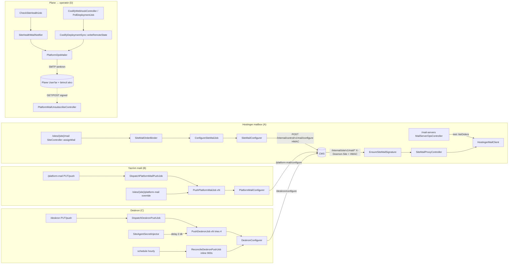

# 08 — Mail, bildirimler ve Deskron

**Tarih:** 2026-09-24 · **HEAD:** 8484d37 · **Hazırlayan:** S7 — Mail, bildirimler ve Deskron denetçisi (Dalga 1)
**Kapsam:** M6 ([01-envanter.md §11](01-envanter.md)): `app/Services/{Mail,Hostinger,Deskron}/**`, `MailServerOpsController`, `PlatformMailSettingsController`, `PlatformMailUnsubscribeController`, `DeskronSettingsController`, `Internal/SiteMailProxyController` + `EnsureSiteMailSignature`, 6 mail/Deskron job'u, 5 model, `app/Mail/*`, `SiteHealthMailNotifier`, `PlatformNotificationCatalog`, ilgili view/route/test'ler. Ayrıca Plane'in operatöre gönderdiği tüm bildirimler (bildirim altyapısı özeti, §1.4).
**Kapsam dışı:** Mailcow ([related-infra.md](../../related-infra.md), ADR-9), CMS tarafı mail modülü ve CMS unsubscribe, Coolify webhook imzası (M3/1.3-a), `RestrictOpsByIp`/Fortify (M7), kuyruk/iş altyapısı genel ayarı (M8 — yalnız bu alana etkisi yazıldı).

Önceki inceleme: [../../plans/2026-09-14-plane-review-and-proposals.md](../../plans/2026-09-14-plane-review-and-proposals.md). Durumlar [15-onceki-inceleme-durum-takibi.md](15-onceki-inceleme-durum-takibi.md)'den alındı: **Boşluk-B5** (yalnız e-posta) Yapılmadı, **D1** (Telegram/Slack) Yapılmadı, **D2** (bastırma/eskalasyon) Yapılmadı, **A9** (haftalık ops özeti) Yapılmadı, **Öneri-B6** (stopped siteleri hariç tut) Kısmen, **C4** (secret tarama testi) Kısmen. Burada yeniden keşfedilmedi; bulgulara referansla bağlandı.

Hedefli test: `php artisan test --compact --filter='SiteMailProxyTest|PlatformMailUnsubscribeTest|ReconcileDeskronPushTest|DeskronPushTest|PlatformMailPushJobTest|PlatformMailStateTest|SiteMailboxRequestDecisionTest|MailServerOpsTest|PlatformMailSettingsTest|SiteMailAssignTest|DeskronSettingsTest|SitePlatformMail'` → **68 passed (314 assertion), 29,7 sn**. Canlı sisteme istek atılmadı.

## Özet

- **Kritik — proxy yetki sınırı açık (S7-B01):** CMS ters proxy'sinde `PATCH …/mailboxes/{id}/password` ve `DELETE …/mailboxes/{id}`, mailbox ID'sinin çağıran sitenin bağlı Hostinger order'ına ait olup olmadığını kontrol etmiyor. Hostinger çağrısı hesap düzeyinde ve order'a bağlı değil. Aynı mail sunucusu token'ını paylaşan bir site, ID'sini bildiği başka bir sitenin mailbox parolasını değiştirebilir ya da o mailbox'ı silebilir.
- **Sessiz alarm kaybı zinciri (S7-B03, B04, B05, B02):**
  - Worker içindeki `platform_ops` mailer'ı önbellekte kalıyor. SMTP değişikliği en fazla 1 saat uygulanmıyor (tinker ile doğrulandı).
  - Gönderim hatası yutuluyor, notifier durumu yine de ilerletiyor. Down maili bir daha denenmiyor.
  - `deploy_failed` maili 4 deploy tetikleyicisinden yalnız 2'sinde gidiyor.
  - Unsubscribe linki GET ile durum değiştiriyor. Mail tarayıcıları linki açınca alarm abonelikten sessizce çıkıyor ve geri alma ekranı yok.
- **Yayım boşlukları (S7-B06, B14):**
  - Yeni siteye platform (yazılım) maili hiç push edilmiyor ve reconcile yok. Buna rağmen durum çipi "Etkin" gösteriyor.
  - Provizyonda Hostinger mail configure, CMS daha ayağa kalkmadan inline çalışıyor ve sonra tekrar denenmiyor.
- **Reconcile timeout (S0 sorusu, S7-B08):**
  - Canlı kuyruk `redis`, `retry_after` 90 sn, tek worker.
  - Tek worker'da iş iki kez çalışmıyor. Asıl etki, kuyruğun 900 sn'ye kadar tıkanması: health taraması ve down maili gecikiyor.
  - Hesap: site başına en kötü durum ≈25 sn. 36 erişilemeyen site 900 sn'yi doldurur.
- **Bildirim altyapısı bugün L1:**
  - Tek kanal (mail) ve tek gönderici var (`PlatformOpsMailer`), yalnız 4 olay kapsanıyor.
  - Teslim kaydı, tekrar deneme, bastırma ya da eskalasyon yok.
  - Push hataları, mailbox istekleri, Hostinger token geçersizliği ve alıcısız kalma gibi olaylar hiç bildirilmiyor (L0).
- **En değerli öneriler:**
  - S7-O01: proxy'de mailbox sahiplik kontrolü (puan 12).
  - S7-O03: `Mail::purge` (10).
  - S7-O04: kuyruklu, tekrar denenen ve teslim kaydı tutan bildirim (10).
  - S7-O06: platform mail reconcile (10).
  - S7-O02: güvenli unsubscribe + geri alma (9).
  - S7-O05: tüm deploy hata yollarında bildirim (9).
  - S12 bildirim merkezi, O04 + O15 + O16'nın üzerine kurulmalı.

## 1. Mevcut durum

### 1.1 Akışlar

- **A. Hostinger:**
  1. Mail sunucusu kaydı (`MailServerOpsController::store`, token şifreli).
  2. Test, katalog tazeler, bağlanmamış siteleri bağlar ve **inline** push yapar (`MailServerOpsController.php:184-190`).
  3. Site detayından bağlama, ardından kuyrukta `ConfigureSiteMailJob` (`a868a01`, `SiteController.php:1250`).
  4. CMS bu job ile mailbox CRUD'u Plane üzerinden proxy'ler.
  5. CMS mailbox **isteği** açar (`storeRequest`). Operatör istek için yalnız `fulfill` ya da `reject` durumu işaretler (`19b3916`, `SiteController.php:916-962`).
- **B. Platform maili:**
  1. Kayıt ve audit, ardından `DispatchPlatformMailPushJob`.
  2. Bu job agent secret'ı olan her site için `PushPlatformMailJob` başlatır.
  3. Sonuç `sites.platform_mail_push_*` kolonlarına yazılır, `PlatformMailState` çipi bunu gösterir.
  4. Test maili istek içinde senkron gönderilir (`PlatformMailSettingsController.php:127`).
- **C. Deskron:**
  1. Kayıt veya push, ardından fan-out.
  2. Yeni agent secret gelince 2 dk gecikmeli push (`aab3e73`, `SiteAgentSecretInjector.php:51-55`).
  3. Saatlik inline reconcile (`d553413`, `ReconcileDeskronPushJob.php:39-58`).
- **D. Operatöre bildirim:**
  - Health tarafında ok↔unhealthy kenar geçişi ve sürüm değişimi (`SiteHealthMailNotifier.php:21-55`).
  - Deploy tarafında yalnız `writeRemoteState` yolu (`CoolifyDeploymentSync.php:186-202`).

### 1.2 Ana dosyalar

| Dosya | Sorumluluk | Satır | Test |
|-------|-----------|------:|------|
| `app/Http/Controllers/Internal/SiteMailProxyController.php` | CMS→Plane mailbox proxy + istek kuyruğu | 254 | `tests/Feature/Mail/SiteMailProxyTest.php` |
| `app/Http/Middleware/EnsureSiteMailSignature.php` | Site header + HMAC + nonce | 96 | aynı |
| `app/Services/Hostinger/HostingerMailClient.php` | Hostinger Mail API (7 çağrı) | 386 | `MailServerOpsTest`, `SiteMailProxyTest` |
| `app/Services/Mail/SiteMailOrderBinder.php` | Order↔site bağlama | 271 | `SiteMailAssignTest` |
| `app/Services/Mail/SiteMailConfigurer.php` | Plane→CMS mail configure | 221 | `SiteMailAssignTest` |
| `app/Services/Mail/PlatformMailConfigurer.php` | Plane→CMS platform-mail configure | 161 | `PlatformMailStateTest` |
| `app/Services/Mail/PlatformOpsMailer.php` | Plane'in tek operatör mail göndericisi | 151 | `PlatformMailUnsubscribeTest`, `PlatformMailSettingsTest` |
| `app/Services/Mail/SiteHealthMailNotifier.php` | down/up/sürüm kenar tetikleri | 135 | **yok** |
| `app/Services/Mail/PlatformNotificationCatalog.php` | 11 anahtar (7 `cms`, 4 `plane`) | 130 | dolaylı |
| `app/Services/Mail/PlatformMailUnsubscribe.php` | imzalı opt-out URL / uygula | 56 | `PlatformMailUnsubscribeTest` |
| `app/Services/Mail/PlatformMailState.php` | 4 durumlu çip | 74 | `PlatformMailStateTest` |
| `app/Services/Deskron/DeskronConfigurer.php` | Plane→CMS Deskron push | 106 | `DeskronPushTest`, `ReconcileDeskronPushTest` |
| `app/Http/Controllers/Ops/MailServerOpsController.php` | Mail sunucusu CRUD/test | 254 | `MailServerOpsTest`, `MailListEmptyStatesTest` |
| `app/Http/Controllers/Ops/PlatformMailSettingsController.php` | SMTP + katalog + push + test | 202 | `PlatformMailSettingsTest` |
| `app/Http/Controllers/Ops/DeskronSettingsController.php` | Deskron ayar + push | 91 | `DeskronSettingsTest`, `DeskronPushTest` |
| `app/Jobs/{ConfigureSiteMail,DispatchPlatformMailPush,PushPlatformMail,DispatchDeskronPush,PushDeskron,ReconcileDeskronPush}Job.php` | kuyruk | 53/33/50/32/49/60 | `PlatformMailPushJobTest`, `DeskronPushTest`, `ReconcileDeskronPushTest` |
| `routes/internal-site.php`, `routes/ops/{mail-servers,deskron}.php`, `routes/web.php:15-20` | 6 iç + 11 ops + 2 imzalı route | 14/18/8 | — |

### 1.3 Test kapsamı

| Testli | Testsiz |
|--------|---------|
| Proxy: geçerli HMAC ile list/create/password/delete, kötü imza, yanlış site header, `mail_not_configured`, istek oluşturma, audit'te parola/token yok (`SiteMailProxyTest.php:34-162`) | Nonce replay, zaman kayması (skew), **başka sitenin mailbox ID'si**, throttle |
| Unsubscribe: imzalı GET opt-out, imzasız 403, anahtar filtresi, opted-out kullanıcı atlanır, header, parola redaksiyonu | GET'in tarayıcı ön-getirmesi, geri abonelik (UI yok) |
| Platform push: kaydetme kuyruğa atar, job hata atar, çip 4 durumu, push sonucu kaydı | Yeni siteye push; `last_pushed_at` anlamı |
| Deskron: push imzalı, hata kaydı, fan-out, reconcile 5 senaryo | Reconcile süre bütçesi |
| Mailbox isteği: fulfill tek sefer, reddedilen fulfill edilemez, çift reject tek audit | Eşzamanlı karar, bildirim |
| — | **`SiteHealthMailNotifier` kenar geçişleri ve sürüm eşiği, `deploy_failed` maili, SMTP ayar değişikliğinden sonra gönderim** (`grep -rln "SiteHealthMailNotifier\|last_notified_deamon_version" tests` → boş) |

### 1.4 Bildirim altyapısı envanteri (S11/S12 için taban)

Plane'de operatöre mail gönderen tek sınıf `PlatformOpsMailer`. `grep -rn "Mail::\|Notification::\|->notify(" app` sorgusu yalnız bu sınıfı döndürüyor. `User` modeli `Notifiable` trait'ini kullanıyor ama çağıran bir yer yok (`app/Models/User.php:18`).

| Olay | Üretici | Kanal | Alıcı | Tekilleştirme | Teslim kaydı | Test |
|------|---------|-------|-------|---------------|--------------|------|
| `site_down` | `SiteHealthMailNotifier.php:21-35` | SMTP (senkron) | birincil alıcı + ilk 20 `User` (`PlatformOpsMailer.php:93-122`) | yalnız kenar geçişi; tek başarısız tarama yeter | yok (başarısızlık yalnız `Log::warning`, `:79-86`) | yok |
| `site_up` | `:37-49` | aynı | aynı | kenar | yok | yok |
| `site_version_update` | `:58-107` | aynı | aynı | major/minor/patch eşiği | yok | yok |
| `deploy_failed` | `CoolifyDeploymentSync.php:186-202` | aynı | aynı | `isDirty('status')` | yok | yok |
| Test maili | `PlatformMailSettingsController.php:101-137` | SMTP senkron | form `to` | — | yok (audit de yok) | var |
| **Bildirilmeyen (L0):** mail configure hatası, platform/Deskron push hatası, yeni mailbox isteği, Hostinger token 401, alıcı listesinin boşalması, SMTP'nin kendisinin çökmesi | kolon veya log var, bildirim yok | — | — | — | — | — |

Kullanıcı tercihi: `users.mail_notification_opt_outs` (`User.php:56-70`), yalnız 4 `plane` anahtarı için geçerli. Opt-out bütün siteleri kapsıyor. Ekranda görüntülenmiyor ve geri alınamıyor (`grep -rn mail_notification_opt_outs resources app/Http` → boş).

## 2. Bulgular

| ID | Tür | Önem | Bulgu | Kanıt | Etki |
|----|-----|------|-------|-------|------|
| S7-B01 | Güvenlik | **Kritik** | Proxy'nin parola değiştirme ve silme uçları gelen `mailboxId`'nin çağıran sitenin order'larına ait olup olmadığına bakmıyor. Yalnız biçim kontrolü var (`validMailboxId`). Hostinger çağrısı `/api/mail/v1/mailboxes/{id}` biçiminde ve order'a bağlı değil. Aynı `MailServer` token'ını kullanan her site, ID'sini bildiği başka bir sitenin mailbox parolasını değiştirebilir veya o mailbox'ı silebilir. Parola değişince o posta kutusu da ele geçirilmiş olur. | `SiteMailProxyController.php:72-103,148-166,237-240`; `HostingerMailClient.php:215-225`; test yalnız aynı sitenin ID'siyle çalışıyor (`SiteMailProxyTest.php:34-80`). **Doğrulanmadı:** Hostinger mailbox ID'lerinin tahmin edilebilirliği ve API'nin başka order'ın ID'sini reddedip reddetmediği. Doğrulama: sandbox hesapta 2 order ile `PATCH` denemesi. | Bir CMS ihlali filodaki diğer müşterilerin postasına sıçrayabilir |
| S7-B02 | Güvenlik/Hata | Yüksek | Unsubscribe `GET` isteği durumu doğrudan değiştiriyor. Outlook Safe Links / Defender gibi kurumsal mail tarayıcıları linki önceden açarak alıcıyı `site_down`/`deploy_failed`'den sessizce çıkarabilir. `List-Unsubscribe-Post` header'ı yok. Opt-out audit'e yazılmıyor, ekranda görünmüyor ve geri alınamıyor. | `routes/web.php:15-17`; `PlatformMailUnsubscribeController.php:14`; `PlatformMailUnsubscribe.php:34-55`; `PlatformOpsMail.php:34-39`; UI referansı yok (§1.4) | Alarmlar fark edilmeden kesilir |
| S7-B03 | Hata | Yüksek | `applyRuntimeMailer` yalnız `Config::set` yapıyor. `MailManager` `platform_ops` mailer'ını süreç boyunca önbellekte tutuyor. Uzun ömürlü worker'da (`--max-time=3600`) SMTP host/parola değişikliği en fazla 1 saat uygulanmıyor. Health ve poll job'larındaki alarmlar eski kimlikle gidiyor ya da düşüyor. | `PlatformOpsMailer.php:136-150`; `vendor/laravel/framework/src/Illuminate/Mail/MailManager.php:74-100`; `supervisord.conf:27`. Komut: `php artisan tinker --execute='Config::set(...a.invalid); $a=Mail::mailer("platform_ops"); Config::set(...b.invalid); $b=Mail::mailer("platform_ops"); …'` → `SAME_INSTANCE host=a.invalid` | Parola rotasyonundan sonra alarmlar sessizce gitmez |
| S7-B04 | Hata | Yüksek | Gönderim hatası yutuluyor (`catch Throwable` → `false`). `SiteHealthMailNotifier` dönüş değerine bakmadan `last_health_notify_status`'u ilerletiyor, bu yüzden down maili bir daha denenmiyor. Tek `try` bütün alıcı döngüsünü sarıyor: ilk alıcıda hata olursa kalanlara hiç gönderilmiyor. Teslim kaydı yok. | `PlatformOpsMailer.php:48-86`; `SiteHealthMailNotifier.php:21-55`; `CoolifyDeploymentSync.php:186-201` (ikinci `catch` da yutuyor) | Kesinti alarmı kalıcı olarak kaybolur |
| S7-B05 | Eksik | Yüksek | `deploy_failed` maili yalnız `CoolifyDeploymentSync::writeRemoteState` içinde gönderiliyor. Webhook bu yola yalnız `Manual`/`ThemeRollout` tetikleyicilerinde giriyor. `Create`/`ChannelSwitch` hataları (`SiteProvisioner::markFailed`, `ChannelSwitcher::markFailed`) ve `PollDeploymentJob::failOpen` → `failWithoutSiteChange` mail göndermiyor. | `CoolifyWebhookHandler.php:41-45`; `PollDeploymentJob.php:216-225`; `CoolifyDeploymentSync.php:98-109`; `grep -rn "PlatformOpsMailer::class" app` → yalnız `CoolifyDeploymentSync.php:188` ve test maili | Provizyon ve kanal değişimi hataları sessiz kalır |
| S7-B06 | Hata | Yüksek | Yeni siteye (secret inject veya provizyon) platform maili push edilmiyor. Deskron'da bu var, platform mailinde yok. Reconcile job'u da yok. Hiç push edilmemiş site hata sayılmadığı için çip "Etkin" kalıyor. Yeni CMS, operatör "Sitelere gönder"e basana kadar yazılım SMTP'si olmadan çalışıyor: şifre sıfırlama ve hoş geldin mailleri gitmiyor. | `SiteAgentSecretInjector.php:51-55` (yalnız `PushDeskronJob`); `grep -rn "PushPlatformMailJob::dispatch" app` → `SiteController.php:905` (override) + `DispatchPlatformMailPushJob.php:24`; `PlatformMailState.php:38`; `PlatformMailStateTest::test_a_site_that_was_never_pushed_is_not_counted_as_a_failure` | Yeni müşteride admin mailleri sessizce çalışmaz |
| S7-B07 | Risk | Yüksek | Paylaşılan sırlar her CMS'e dağıtılıyor: platform SMTP parolası (Plane'in kendi alarmlarında kullandığı hesapla aynı) ve DeskRon `master_key`. Tek bir CMS ihlali filonun destek kanalına ve Plane'in alarm göndericisine erişim verir. Rotasyon da bütün filoya push gerektiriyor. | `PlatformMailConfigurer.php:48-57`; `PlatformOpsMailer.php:38,49`; `DeskronConfigurer.php:43-48`. **Doğrulanmadı:** DeskRon'un site başına kısıtlı anahtar desteği | Etki alanı (blast radius) bütün filo |
| S7-B08 | Perf/Risk | Orta | **S0 sorusu.** Detayı aşağıda. Özet: canlıda iki kez çalışma yok, asıl etki kuyruğun tıkanması. | `ReconcileDeskronPushJob.php:36-58`; `config/queue.php:71`; `docker-compose.coolify.yml:30`; `supervisord.conf:26-27`; `config/ops.php:119-123` | Kesinti alarmı gecikir |
| S7-B09 | Güvenlik | Orta | HMAC kanonik metni yalnız `{ts}.{nonce}.{body}`: metot, yol ve yön imzaya dahil değil. Aynı `agent_secret` iki yönde de kullanılıyor. Plane'in her health turunda gönderdiği boş gövdeli `GET /internal/control/v1/health` imzası, 60 sn boyunca Plane'in `DELETE /internal/site/v1/mail/mailboxes/{id}` ucunda da geçerli. Header'ları görebilen bir ara katman (TLS'i sonlandıran proxy veya header loglayan CMS) bu imzayı B01 ile birleştirebilir. | `ControlPlaneAgentSignature.php:10-13`; `SiteAgentClient.php:39-42`; `EnsureSiteMailSignature.php:41`. **Doğrulanmadı:** header'ların herhangi bir logda tutulup tutulmadığı | İmza başka bir istekte yeniden kullanılabilir (replay) |
| S7-B10 | Güvenlik | Düşük | Nonce kontrolü atomik değil (`Cache::has` → imza → `Cache::put`): aynı nonce'la gelen iki eşzamanlı istek ikisi de geçebilir. TTL'in `2×skew` altına inmesini engelleyen bir kısıt yok (`max(30, …)`): env ile TTL<120 verilirse replay penceresi açılır. | `EnsureSiteMailSignature.php:35-45,57-80`; `config/ops.php:110,134` | Dar replay penceresi |
| S7-B11 | Risk | Orta | `throttle:60,1` imza doğrulamasından önce ve IP'ye göre çalışıyor. Aynı Coolify host'undaki bütün CMS'ler aynı IP'den çıkıyorsa 60/dk kotayı paylaşırlar. Gürültülü bir site diğerlerinin mailbox ekranını 429'a düşürür. | `routes/internal-site.php:7`. **Doğrulanmadı:** sitelerin Plane'e ortak egress IP'siyle gelmesi. Doğrulama: `audit_logs.ip` dağılımı (`action like 'mail.%'`) | Siteler arası hizmet reddi |
| S7-B12 | Risk | Orta | Aynı Hostinger order'ı birden fazla siteye bağlanabiliyor: tekillik yalnız `(site_id, order)` üzerinde, bağlarken başka siteler kontrol edilmiyor. `storeRequest`'teki `domain` da sitenin bağlı domainleriyle sınırlı değil. | `2026_09_10_220000_create_site_mail_bindings_and_requests.php:20-21`; `SiteMailOrderBinder.php:67-106`; `SiteMailProxyController.php:120` | Operatör yanlışlıkla iki müşteriye aynı posta alanını verebilir |
| S7-B13 | Perf/UX | Orta | Mail sunucusu `update`/`destroy`/`test` işlemleri, atanmış bütün sitelere istek içinde sırayla configure push yapıyor: site başına 10 sn'ye kadar, 429 geri çekilmesiyle daha uzun. `a868a01`'de "asla inline değil" kararı alınmıştı; bu uçlar bu karara uymuyor. Sonuç flash mesajına yansımıyor. | `MailServerOpsController.php:146,168,190`; `SiteMailConfigurer.php:158-172`; karar: `ConfigureSiteMailJob.php:12-17` | İstek zaman aşımı, kısmi push |
| S7-B14 | Hata | Orta | Provizyon başlarken mail configure, CMS uygulaması daha oluşturulmadan inline çalışıyor ve başarısızlık kaydı düşüyor. `markSucceeded` sonrasında yeniden push yok. `ConfigureSiteMailJob` `tries=1` ve reconcile yok. | `SiteProvisioner.php:86-89,395-409`; `grep -rn ConfigureSiteMailJob app` → yalnız `SiteMailConfigurer::queue`; `ConfigureSiteMailJob.php:22` | Yeni sitede H-Posta eklentisi kapalı kalır; elle "tekrar gönder" gerekir |
| S7-B15 | UX | Orta | Fan-out'ta kısmi hata yeterince görünmüyor: 1) Platform mail sayfası yalnız sayı gösteriyor, `platform_mail_push_error` hiçbir view'da render edilmiyor (Deskron'da liste var). 2) `last_pushed_at` job'lar kuyruğa atılırken yazılıyor, sonuç beklenmiyor. 3) Fan-out `OpsBackgroundJob` ile izlenmiyor. 4) Bütün filoyu etkileyen push veya kapatma işleminde onay yok. | `grep -rn platform_mail_push_error resources/views` → boş; `deskron/edit.blade.php:74`; `DispatchPlatformMailPushJob.php:27-31`; `DispatchDeskronPushJob.php:26-30`; `platform-mail/edit.blade.php:13`, `deskron/edit.blade.php:7` (`data-confirm` yok) | Operatör hangi sitenin neden düştüğünü bilmez |
| S7-B16 | Perf | Orta | SMTP gönderimi senkron: 1) `CheckSiteHealthJob` (`timeout=30`) içinde, health çağrısından sonra SMTP (her biri `timeout=30`) × en fazla 21 alıcı. Job zaman aşımına uğrarsa worker öldürülür ve bildirim durumu kaydedilmez. 2) Coolify webhook HTTP isteği içinde. | `CheckSiteHealthJob.php:15-17,37`; `SiteHealthChecker.php:49`; `PlatformOpsMailer.php:148`; `CoolifyWebhookController.php:19` → `CoolifyWebhookHandler.php:42` → `CoolifyDeploymentSync.php:188`. **Doğrulanmadı (çalışma zamanı):** yavaş SMTP'de job öldürülmesi | Health turu kaybı, tekrar ve kısmi mailler, webhook gecikmesi |
| S7-B17 | Eksik | Orta | Bastırma/eskalasyon yok (önceki **D2 — Yapılmadı**): 1) Tek başarısız tarama mail üretiyor. 2) Hiç "ok" görmemiş site (`''` → unhealthy) hiç alarm üretmiyor. 3) Tekrar hatırlatma yok. 4) Stopped/bakımdaki site hariç tutulmuyor (**Öneri-B6 — Kısmen**). Host steal oranı yüksekken tek zaman aşımı çift mail (down+up) üretir. | `SiteHealthMailNotifier.php:18-35`; `DispatchSiteHealthChecksJob.php:19-27` (15'teki kanıt) | Gürültü; ilk kurulumda kör nokta |
| S7-B18 | Eksik | Orta | Tek kanal var (**Boşluk-B5/D1 — Yapılmadı**). Plane alarmları yazılım mailinin `enabled` anahtarına ve aynı SMTP'ye bağlı: CMS'lere yazılım mailini kapatan operatör Plane'in kendi down alarmlarını da kapatmış olur. SMTP çökerse bunu bildirecek başka bir kanal yok. | `PlatformOpsMailer.php:38-41` (`isReady()` → `enabled`); `PlatformMailSetting.php:67-74`; `PlatformNotificationCatalog.php` kanal boyutu yok | Tek hata noktası |
| S7-B19 | Eksik | Orta | Mailbox istekleri: 1) Yeni istek için bildirim ve filo düzeyinde sayaç yok, istek yalnız site detayında görünüyor. 2) `fulfill` mailbox oluşturmuyor ve `fulfilled_mailbox_id` hiç yazılmıyor. 3) Durum geçişi atomik değil (`isPending` → `save`). 4) CMS dakikada 60 istek açabiliyor; yinelenenler ayıklanmıyor. | `SiteMailProxyController.php:115-146`; `SiteController.php:916-962`; `grep -rn fulfilled_mailbox_id app` → yalnız model; `_mail.blade.php:147-171` | Müşteri isteği günlerce bekleyebilir |
| S7-B20 | Eksik | Orta | Hostinger token'ının geçerliliği izlenmiyor: probe yalnız elle "Test" ile çalışıyor. Hostinger 401'i proxy'de `unauthorized`/401'e dönüşüyor, HMAC reddiyle aynı kod ve durum. CMS, sorunun Plane imzası mı token mı olduğunu ayırt edemez. | `HostingerMailException.php:17-29`; `SiteMailProxyController.php:208-220`; `EnsureSiteMailSignature.php:88-95`; schedule'da mail probe yok (`routes/console.php:16-42`) | Teşhis gecikir; müşteri "mail çalışmıyor" der |
| S7-B21 | Eksik | Orta | Audit boşlukları: `platform_mail` push, test maili, Deskron push, opt-out ve ops mail teslimi kaydedilmiyor. Mevcut 20 mail/Deskron action'ının hiçbiri bu olayları kapsamıyor. | `PlatformMailSettingsController.php:90-137`; `DeskronSettingsController.php:26-35`; `PlatformMailUnsubscribe.php:52`; action listesi `grep -o "'(mail\|platform_mail\|deskron\|mail_server)\.[a-z_]*'"` | Olay sonrası inceleme yapılamaz |
| S7-B22 | Borç | Orta | Kritik yollarda test yok: `SiteHealthMailNotifier`, `deploy_failed` maili, nonce replay/skew, başka sitenin mailbox ID'si, SMTP değişikliğinden sonra gönderim. (**C4 — Kısmen** ile ilişkili.) | §1.3; `grep -rln "SiteHealthMailNotifier" tests` → boş | B01/B03/B04 regresyonu yakalanmaz |
| S7-B23 | Borç | Düşük | `966af11` sonrasında Plane'de allowlist kalıntısı yok (`grep -rni allowlist app` → ilgisiz eşleşmeler). Ancak platform-mail push hatasında CMS mesajı atılıyor ve yalnız `http_422` kalıyor; site mailinde mesaj saklanıyor. Eski CMS'ler "URL host is not on the allowlist." ile 422 dönerse platform mail çipi nedeni göstermez. | `PlatformMailConfigurer.php:93-100` vs `SiteMailConfigurer.php:101-115`; `git show 966af11` | Teşhis zor. CMS min sürümü bilinmiyor (CMS handoff) |
| S7-B24 | UX | Düşük | Alıcı seçimi: rolüne bakılmadan ilk 20 `User` (id sırasıyla, 21. kullanıcı sessizce dışarıda kalıyor). Konu ve gövde sabit Türkçe ("Siteniz düştü"), müşteriye hitap ediyor ve `locale` yalnız şablon kabuğuna uygulanıyor. | `PlatformOpsMailer.php:104-120,55-63`; `SiteHealthMailNotifier.php:25-33` | Gürültü, dil tutarsızlığı |
| S7-B25 | Borç | Düşük | `PlatformMailConfigurer::syncAllSites` ölü kod; ayrıca inline fan-out için yanlış bir örnek. | `PlatformMailConfigurer.php:108-128`; `grep -rn syncAllSites app tests` → yalnız tanım | Yanlışlıkla inline kullanılabilir |

### S7-B08 ayrıntısı — `ReconcileDeskronPushJob` 900 sn ile `retry_after` 90 sn

| Soru | Cevap | Kanıt |
|------|-------|-------|
| Canlı kuyruk sürücüsü | `redis` (S0 `database` varsaymıştı). `retry_after` varsayılanı yine 90 sn | `docker-compose.coolify.yml:30`; `config/queue.php:67-74`. **Doğrulanmadı:** canlıda `REDIS_QUEUE_RETRY_AFTER` override'ı |
| Worker sayısı | 1 (`numprocs` yok) | `supervisord.conf:26-27` |
| Aynı iş ikinci kez çalışır mı? | Tek worker'da **hayır**. Laravel redis süresi dolmuş rezervasyonları yalnız `pop` sırasında geri taşır, meşgul worker da `pop` çağırmaz | `RedisQueue::pop` → `migrate` |
| İkinci worker olursa (ölçekleme / örtüşen konteyner) | 90 sn sonra ikinci worker işi alır. `attempts=2 > tries=1` olduğu için `MaxAttemptsExceeded` → `failed_jobs`'a yazılır. İlk çalışma devam eder | `ReconcileDeskronPushJob.php:36`. **Doğrulanmadı:** Coolify compose deploy'unda eski ve yeni konteynerin örtüşmesi |
| Bugünkü gerçek etki | **Kuyruk tıkanır.** Tek worker 900 sn'ye kadar bu işe bağlı kalır. Site başına en kötü süre = 2 deneme × 10 sn + ≤5 sn backoff ≈ 25 sn → 36 erişilemeyen site 900 sn'yi doldurur. Bu sürede health taraması (10 dk cron), deploy poll ve push job'ları bekler. `site_down` maili 15 dk'ya kadar gecikebilir | `config/ops.php:111,119-123`; `RetriesThrottledAgentRequests.php:21-51` |
| 900 sn aşılırsa | Worker öldürülür ve supervisord yeniden başlatır. İlerleme site bazında kolonlara yazıldığı için kayıp yok ama `failed()` da yok | `DeskronConfigurer.php:90-105` |

## 3. İyileştirme ve güncelleme önerileri

Öncelik = Etki×2 − Risk + (S=3, M=2, L=1, XL=0). Puana göre sıralı.

| ID | Öneri | Çözdüğü bulgu | Etki | Efor | Risk | Puan | Kabul kriteri |
|----|-------|---------------|:---:|:---:|:---:|:---:|---------------|
| S7-O01 | Proxy `password`/`destroy` öncesi sahiplik kontrolü: `listAllMailboxes($site)` sonucunda (60 sn önbellekli) ID yoksa 404 dön ve Hostinger'a hiç istek atma | B01 | 5 | S | 1 | **12** | Başka order'ın ID'siyle PATCH/DELETE → 404, `Http::assertNotSent(…/mailboxes/{id}…)`; mevcut 6 proxy testi yeşil |
| S7-O03 | `applyRuntimeMailer` içinde `Mail::purge('platform_ops')` (veya her gönderimde transport'u yeniden kur) | B03 | 4 | S | 1 | **10** | Aynı süreçte ayar değişince ikinci `Mail::mailer('platform_ops')` yeni host'u kullanıyor (unit test) |
| S7-O04 | Kuyruklu ve tekrar denenen bildirim: `SendOpsNotificationJob` (tries 3, backoff) + `ops_notifications` tablosu (olay, site, alıcı, durum, deneme, hata kodu). Alıcı başına ayrı `try`. Notifier durumu yalnız iş kuyruğa alındıktan sonra ilerler | B04, B16, B21 | 5 | M | 2 | **10** | SMTP hata verince iş yeniden deneniyor, 3 denemeden sonra `failed` satırı ve UI rozeti çıkıyor; health job ve webhook SMTP'ye dokunmuyor; 1 alıcının hatası diğerlerini engellemiyor |
| S7-O06 | Platform mail: secret inject ve provizyon başarısında `PushPlatformMailJob`, saatlik `ReconcilePlatformMailPushJob` (Deskron deseniyle). Çip, agent secret'ı olup hiç push edilmemiş siteleri `not_pushed` sayar | B06 | 4 | S | 1 | **10** | Yeni site inject → 2 dk içinde push kuyruğa alınıyor; `platform_mail_pushed_at` null + secret var → çip "Etkin" değil |
| S7-O02 | Unsubscribe: GET yalnız onay sayfası, durum POST ile değişir. `List-Unsubscribe-Post: List-Unsubscribe=One-Click` eklenir. Opt-out audit'e yazılır (`user.mail_opted_out`). Hesap tercihlerinde abonelikler görünür ve geri açılabilir | B02, B21 | 4 | M | 1 | **9** | GET isteği `mail_notification_opt_outs`'u değiştirmiyor; POST değiştiriyor ve audit satırı yazıyor; tercih sayfasında geri açma testi |
| S7-O05 | Tek `DeploymentFailed` olayı ve listener: `markFailed` (provisioner, channel switcher), `failWithoutSiteChange` ve `writeRemoteState` aynı bildirimi üretir | B05 | 4 | S | 2 | **9** | 4 tetikleyici × hata yolu için `deploy_failed` bildirimi kuyruğa giriyor (feature test matrisi) |
| S7-O10 | İç proxy için site bazlı rate limiter: imzadan sonra `X-Deamon-Site` anahtarıyla 60/dk; imzasız trafiğe IP başına ayrı sınır | B11 | 3 | S | 1 | **8** | A sitesi 61. istekte 429 alırken B sitesi 200 alıyor |
| S7-O11 | Bir order'ı ikinci siteye bağlamayı engelle (ya da açık onay iste); `storeRequest.domain` sitenin `mailDomains()` listesinde olmalı | B12 | 3 | S | 1 | **8** | Başka sitede bağlı order seçilince doğrulama hatası; bağlı olmayan domain isteği 422 |
| S7-O12 | Mail sunucusu `update`/`destroy`/`test` → site başına `ConfigureSiteMailJob`; flash'ta kuyruğa alınan site sayısı | B13 | 3 | S | 1 | **8** | Controller içinde `Http` çağrısı yok (`Http::assertNothingSent` + `Queue::assertPushed` × N) |
| S7-O13 | Provizyonda: başlangıçtaki inline `syncMail` → yalnız bind; `markSucceeded` sonrası `ConfigureSiteMailJob` (+O06 push) | B14 | 3 | S | 1 | **8** | Provizyon başlangıcında agent'a HTTP isteği yok; başarıdan sonra configure kuyrukta |
| S7-O07 | Reconcile işini süre bütçesiyle sınırla (örn. 240 sn, kalan siteler sonraki tura), ayrı `sweeps` kuyruğu veya siteye göre paced `PushDeskronJob`; `$timeout < retry_after` kuralı | B08 | 3 | S | 1 | **8** | Job tek çalışmada ≤240 sn; health job'u reconcile sırasında ≤60 sn bekliyor (test: sahte saat) |
| S7-O15 | Bastırma ve eskalasyon (**D2**): N ardışık hata eşiği (varsayılan 2), 30 dk / 2 sa hatırlatma, stopped/bakım modu sessiz (**B6**), ilk taramada unhealthy olan site de alarm üretir | B17 | 4 | M | 2 | **8** | Tek zaman aşımı mail üretmiyor; 2 ardışık hata üretiyor; 30 dk sonra tek hatırlatma; stopped site sessiz |
| S7-O19 | Test açıklarını kapat: notifier geçişleri, deploy_failed, nonce replay/skew, başka site ID'si, mailer yenileme | B22 | 3 | S | 1 | **8** | 5 yeni test; B01/B03/B04 düzeltmesi geri alınınca testler kırmızı |
| S7-O21 | Günlük Hostinger token probe (liste sayfası 1). 401 → `mail_servers.last_probe_error` + bildirim. Proxy Hostinger 401'ini `provider_unauthorized`/502 olarak döner | B20 | 3 | S | 1 | **8** | Sahte 401 → sunucu satırında hata çipi + bildirim; CMS'e 502 `provider_unauthorized` |
| S7-O14 | Push görünürlüğü: platform-mail sayfasında hatalı site listesi + neden (Deskron gibi); `last_pushed_at` yerine `last_push_queued_at` + tamamlanma (Bus batch); filo push'u `OpsBackgroundJob`/`BulkResultSummary` ile izlenir; kapatma ve toplu push için `PlaneConfirm` | B15 | 3 | M | 1 | **7** | Başarısız site adı + kod görünüyor; batch bitince özet flash/rozet; onaysız form yok |
| S7-O16 | Kanal soyutlaması (**D1**): `OpsNotificationChannel` arayüzü, `mail` + imzalı `webhook` (Slack/Telegram uyumlu); olay×kanal matrisi `PlatformNotificationCatalog`'da | B18 | 4 | L | 2 | **7** | Aynı olay iki kanala gidiyor; kanal hatası diğer kanalı engellemiyor; imza testi |
| S7-O17 | Plane alarmını yazılım mailinden ayır: `ops_alerts_enabled` + isteğe bağlı ayrı SMTP (yoksa aynı). Alıcı kalmayınca (hepsi opt-out) panelde uyarı | B18, B04 | 3 | S | 2 | **7** | Yazılım maili kapalıyken `site_down` hâlâ gidiyor; alıcısız anahtar için uyarı |
| S7-O09 | Nonce için `Cache::add` (atomik) + `nonce_ttl >= 2×skew` zorlaması | B10 | 2 | S | 1 | **6** | Aynı nonce ile paralel 2 istekten biri 401; TTL<2×skew iken config uyarısı/clamp |
| S7-O18 | Audit: `platform_mail.push_queued`, `platform_mail.test_sent` (alıcı domain maskeli), `deskron.push_queued`, `user.mail_opted_out` | B21 | 2 | S | 1 | **6** | 4 action Activity akışında görünüyor, `lang/*/ops.php` etiketleri var |
| S7-O20 | Mailbox isteği: yeni istek bildirimi + Sites özetinde "bekleyen istek" sayacı; fulfill `update … where status='pending'` ile atomik; yinelenen istek birleştirme | B19 | 3 | M | 2 | **6** | Aynı `local_part@domain` ikinci istek 409/birleşiyor; eşzamanlı iki fulfill → tek audit |
| S7-O08 | İmza v2: kanonik metne `METHOD\nPATH\nDIRECTION` eklenir; geçiş boyunca v1 kabul edilir, sonra kapatılır (CMS handoff) | B09 | 3 | L | 3 | **4** | Health imzası DELETE'e uygulanınca 401; v1 bayrağı kapatılınca eski CMS açıkça reddediliyor |
| S7-O22 | Paylaşılan sırlar: rotasyon runbook'u + site başına SMTP/DeskRon anahtarı fizibilitesi (karar gerekir) | B07 | 3 | L | 3 | **4** | Runbook var; karar kaydı `docs/plans` altında |
| S7-O23 | `syncAllSites` kaldır; platform mail push hatasında CMS mesajını sakla (SiteMailConfigurer gibi, secret filtreli) | B25, B23 | 1 | S | 1 | **4** | `grep syncAllSites` boş; 422 mesajı site satırında görünüyor |

## 4. Otonomi fırsatları

| Akış | Bugün | Hedef | Tetik | Ön koşul | Güvenli otomatik adım | Doğrulama | Geri alma | Guardrail/bütçe | Kill switch | Audit | Bildirim |
|------|:---:|:---:|-------|----------|----------------------|-----------|-----------|-----------------|-------------|-------|----------|
| Site down alarmı | L1 | L4 | N ardışık başarısız health (O15) | site `active`, bakım bayrağı yok | Bildirimi kuyruğa al; 30 dk sonra hâlâ down ise hatırlat; app-health fix önerisini ekle (L2) | Sonraki health `ok` → `site_up` | Hatırlatma zinciri iptal | site başına 3 hatırlatma/gün | `ops.notifications.escalation_enabled` | `ops_notifications` satırı | mail + webhook (O16) |
| Platform mail push | L1 | L4 | Saatlik reconcile; secret inject; provizyon başarısı | ayar `isReady()`, site secret var | `PushPlatformMailJob` (paced) | CMS 2xx → `platform_mail_pushed_at`; CMS health'te config hash (CMS handoff) | Önceki ayarı yeniden push (ayar sürümü) | tur başına ≤240 sn, site başına 24 deneme/gün | `ops.platform_mail.reconcile_enabled` | `platform_mail.push_queued` + site sonucu | 24 sa başarısız site → özet bildirimi |
| Deskron push | L4 | L5 | Saatlik reconcile (var) | ayar hazır | Paced push + süre bütçesi (O07) | CMS health `deskron_configured` (CMS handoff) | `enabled:false` push | ≤240 sn/tur | `ops.deskron.reconcile_enabled` (yeni) | `deskron.push_*` | 24 sa üst üste 405 → "CMS güncellenmeli" |
| Hostinger mail configure | L3 (resend butonu) | L4 | Saatlik: `mail_configure_failed_at` dolu veya `not_pushed` | secret + bağlama var | `ConfigureSiteMailJob` | 2xx + `mail_configured_at` | Bağlama kaldırılırsa `enabled:false` push | site başına 24/gün | `ops.mail.reconcile_enabled` | `site.mail_configure_requeued` (sistem) | 24 sa başarısız → bildirim |
| Hostinger token sağlığı | L0 | L2 | Günlük probe (O21) | token var | `listOrders` sayfa 1 (salt-okunur) | 200 → `last_probe_ok_at` | — | günde 1 çağrı/sunucu | config bayrağı | `mail_server.probed` | 401/403 → bildirim + çip |
| Mailbox isteği | L1 | L2 | Yeni `storeRequest` | — | Bildirim + filo sayacı | Operatör kararı | — | istek başına 1 bildirim | — | `mail.mailbox_requested` (var) | mail/webhook |
| Alarm kanalının sağlığı | L0 | L2 | Ops bildirimi 3 denemede başarısız (O04) | — | Panel banner'ı + ikinci kanala düş | Sonraki başarılı gönderim banner'ı kapatır | — | — | — | `ops_notifications.failed` | ikinci kanal |
| Haftalık ops özeti (**A9**) | L0 | L4 | Pazartesi 08:00 | ayar hazır | Özet üret + gönder | Teslim kaydı | — | haftada 1 | katalog anahtarı `ops_weekly_digest` | gönderim satırı | mail |

Unsubscribe ve mailbox oluşturma için otomatik adım önerilmedi. Bunlar kullanıcı iradesine ve parolaya dayandığı için en fazla L2'de kalmalı.

## 5. Yeni özellik fikirleri (bu alana özgü)

- **Bildirim merkezi sayfası** (`/notifications`): `ops_notifications` akışı, filtreler (olay/site/durum), "yeniden gönder", kanal sağlığı. S12'nin tabanı: O04 + O16.
- **Kişisel abonelik matrisi** (hesap tercihleri): anahtar × kanal × (tüm siteler | seçili siteler). Opt-out'ları geri açma.
- **Bakım penceresi**: site bazında başlangıç–bitiş; health alarmı ve deploy_failed bu sürede sessiz, pencere sonunda özet.
- **Mail sağlık kartı** (site detayı): MX/SPF/DKIM/DMARC okuma. Doğrulanmadı: Cloudflare DNS modülünden (M5) veri alınabilir mi. Yalnız gösterme, yazma yok.
- **Mailbox isteğinden oluşturma**: onaylanan istekte Hostinger `createMailbox` + tek seferlik parola CMS'e iletilir. Parola Plane'de saklanmaz. Karar gerekir (§7).
- **Haftalık ops özeti** (A9): yeni siteler, başarısız deploy'lar, unhealthy geçişleri, bekleyen mailbox istekleri, push hataları.

## 6. CMS handoff

| # | Plane önerisi | CMS'ten beklenen |
|---|---------------|------------------|
| 1 | S7-O08 imza v2 | CMS'in Plane'e giden isteklerde (mail proxy) ve Plane'den gelenleri doğrularken yeni kanonik metni (metot + yol + yön) desteklemesi; sürüm bayrağı |
| 2 | S7-O06/Deskron L5 | Health yanıtında `platform_mail_config_hash`, `deskron_configured`, `mail_plugin_enabled` alanları (secret içermeyen), Plane'in push'u doğrulayabilmesi için |
| 3 | S7-B23 | `CONTROL_PLANE_HOST_ALLOWLIST` kontrolünün kaldırıldığı CMS sürümünün bildirilmesi. Plane "min CMS sürümü" uyarısını buna göre gösterebilir |
| 4 | S7-O20 | CMS mailbox istek ekranının 409 (yinelenen) ve `fulfilled_mailbox_id` alanını göstermesi |
| 5 | S7-B20/O21 | CMS'in `provider_unauthorized` kodunu "Plane imzası" hatasından ayrı mesajla göstermesi |
| 6 | Spesifikasyon (2026-09-12) | CMS tarafı unsubscribe ve admin başına tercihler companion planda. Plane'de uygulanmadı (`platform-mail.md`, "CMS-sent platform mail …") |

## 7. Açık sorular

| Soru | Önerilen varsayılan |
|------|---------------------|
| Site down alarmı hangi kullanıcılara gitmeli? Bugün rol ayrımı olmadan ilk 20 kullanıcıya gidiyor | Yalnız `ops.write` rolü + açık abonelik; birincil alıcı her zaman |
| Plane ops alarmı ile yazılım SMTP'si ayrılsın mı? | Ayrı "ops alarmları açık" anahtarı; SMTP alanı boşsa aynı SMTP'yi kullan |
| DeskRon `master_key` ve SMTP parolasının her CMS'e dağıtılması kabul edilen bir risk mi? | Kısa vadede kabul + rotasyon runbook'u; site başına kimlik için DeskRon/SMTP sağlayıcı fizibilitesi (O22) |
| İkinci kanal: Slack mi, Telegram mı, genel webhook mu? | İmzalı genel webhook (Slack/Telegram adaptörüyle); ilk hedef Telegram |
| Eskalasyon eşikleri | 2 ardışık hata; 30 dk ve 2 sa hatırlatma; günde en fazla 3 hatırlatma |
| Mailbox isteği Plane'den tek tıkla oluşturulsun mu? | Hayır (L2): bildirim + sayaç. Oluşturma CMS'teki mevcut proxy üzerinden müşteri admininde kalır |
| Aynı Hostinger order'ının iki siteye bağlanması meşru bir senaryo mu (ör. ortak kurumsal domain)? | Varsayılan engel; "paylaşımlı" bayrağı ile açık onay |
