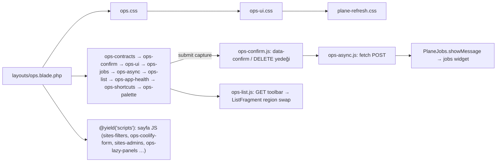

# 09 — UI/UX, i18n ve erişilebilirlik

**Tarih:** 2026-09-24 · **HEAD:** 8484d37 · **Hazırlayan:** S8 — UI/UX, i18n ve erişilebilirlik denetçisi (Dalga 1)
**Kapsam:** `resources/views/**` (layouts, components/ops, ops/**, auth), `public/css/{ops,ops-ui,plane-refresh}.css`, `public/js/*.js`, `lang/{tr,en}`, UI testleri (`tests/js/ops-contracts.test.js`, `tests/Unit/Lang/*`, `ConfirmMatrixTest`, `WorkspacePatternTest`, `*EmptyStatesTest`), UI'a metin taşıyan controller/servis mesajları · **Kapsam dışı:** iş mantığı doğruluğu (M1–M8 raporları), CMS arayüzü, e-posta şablonları (`resources/views/mail/**`).

> **Görsel doğrulama yapılmadı (kod okumaya dayalı).** Tarayıcı açılmadı, giriş yapılmadı. Genişlik/renk davranışı CSS kurallarından ve özgüllük (specificity) hesabından çıkarıldı; görsel teyit gerektirenler "Doğrulanmadı" etiketli.

Ölçüm betikleri yalnız `%TEMP%\s8\` altına yazıldı (`i18n.js`, `css.js`, `labels.js`, `iconbtn.js`, `contrast.js`, `lang.php`); repo'da değişiklik yok.

## Özet

- **i18n sızıntısı Blade'de değil, sunucu ve katalog tarafında.** Blade işaretlemesinde gerçek sabit metin neredeyse yok (261 aday → elle eleme sonrası 3 gerçek sızıntı: 2'si `platform-mail/edit`, 1'i `_admins_body` placeholder-only alan adı). Buna karşılık 13 controller flash'ı sabit (10 TR, 3 EN), 39 servis exception metni TR/EN karışık ve Ops controller'larındaki 49 `getMessage()` çağrısıyla ekrana taşınabiliyor (tek tek izlenmedi); `PlatformNotificationCatalog` 11 etiket + 11 açıklamayı İngilizce sabit veriyor. EN kullanıcı Türkçe, TR kullanıcı İngilizce görüyor (S8-B01, S8-B02).
- **Onay modalının İngilizce "Delete site" varsayılanı yanlış işlemlerde çıkıyor.** `data-confirm` taşımayan iki DELETE formu (avatar kaldır, kolon düzenini sıfırla) `ops-confirm.js`'in site'a özgü İngilizce yedeğine düşüyor: "Soft-delete this site? Coolify is not contacted." (S8-B03).
- **Otomatik işlemler ve kill switch'ler arayüzde görünmüyor.** Deploy teşhisi auto-fix, core tema otomatik restart, domain auto-rebind yalnız `.env` bayrağı; Settings'te yok, Activity'de "Sistem" aktörüne filtre yok (S8-B04). Otonomi arttıkça en değerli iş bu görünürlük katmanı (S8-O01).
- **CSS üç katmanlı ve kısmen birbirini eziyor.** Token paleti 3 kez tanımlı, 90 seçici ≥2 dosyada, ~%5 ölü sınıf, `ops-content-wide` işlevsiz. Somut hata: `ops-ui.css`'teki eski açık/yarı-koyu alert override'ları Fleet'teki kırmızı (danger) dikkat panellerini sarıya çeviriyor (S8-B06).
- **Erişilebilirlik temeli iyi, dinamik kısımları eksik.** İkon butonlarının 32/32'sinin adı var, 141/150 form kontrolünün etiketi var, reduced-motion var. Eksikler: `<main>`/skip link yok, özel select ekran okuyucuya vurgulanan seçeneği bildirmiyor, async liste/bildirim güncellemeleri `aria-live` değil, açık temada `--text-faint` kontrastı 3.04:1 (S8-B09…B13).
- **Mobil kabuk referans tasarımdan sapıyor.** ≤768 px'te nav yatayda satır satır kırılıyor (referans: off-canvas çekmece), topbar sabit yükseklikte ve kırılmıyor, 761–768 px aralığında kabuk mobil ama Sites tablosu kart moduna geçmiyor (S8-B14, S8-B15).

## 1. Mevcut durum

### 1.1 Akış: sayfa yükü ve etkileşim

Kanıt: yükleme sırası `resources/views/layouts/ops.blade.php:28-30` (CSS), `:249-257` (JS); guest düzeni yalnız iki CSS yükler `resources/views/layouts/guest.blade.php:24-25`.

### 1.2 Ana dosyalar

| Dosya | Sorumluluk | Satır | Test |
|-------|-----------|-------|------|
| `resources/views/layouts/ops.blade.php` | Kabuk: sidebar, kullanıcı menüsü, topbar, flash, modal/palette/widget include | 260 | `NavPagesTest`, `PreferencesAppearanceTest` |
| `public/css/ops.css` | İlk token seti + sayfa stilleri (eski) | 1599 | — |
| `public/css/ops-ui.css` | Tema token'ları (light/semidark), kabuk, select, menü, sekme | 2204 | — |
| `public/css/plane-refresh.css` | Yeniden token'lama + Sites çalışma alanı (metric, toolbar, list/compact/card) | 2038 | — |
| `public/js/ops-ui.js` | 20+ `setup*`: tema, menüler, satır tıklama, select, kopya, Settings arama, pending, sekme, favicon, toplu seçim, hint, mail binding | 1505 | `tests/js/ops-contracts.test.js` (yalnız çıkarılmış saf fonksiyonlar) |
| `public/js/ops-jobs.js` | Arka plan işleri widget'ı + genel bildirim (`showMessage`) | 1054 | `JobsPollPressureTest`, node test |
| `public/js/ops-confirm.js` | Onay modalı, focus trap | 195 | `ConfirmMatrixTest` (yalnız Blade öznitelikleri) |
| `public/js/ops-list.js` | Async liste bölgesi, kolon sıralama | 484 | node test |
| `public/js/ops-site-tabs.js` | Eski sekme betiği — **hiçbir yerde yüklenmiyor** | 98 | — |
| `lang/{tr,en}/*.php` | 15 dosya, 2286 anahtar (eksik 0) | — | `tests/Unit/Lang/TurkishSiteLabelsTest.php` |

### 1.3 Test kapsamı

| Davranış | Test | Durum |
|----------|------|-------|
| `data-confirm` başlık/etiket/danger sözleşmesi | `tests/Feature/Ops/ConfirmMatrixTest.php:38-245` (8 ekran) | Account, Archived, Settings, Activity, kolon seçici **kapsanmıyor** |
| Çalışma alanı deseni (tile+search+segment) | `tests/Feature/Ops/WorkspacePatternTest.php:39-91` | Sites + Fleet |
| Boş durumlar | `SiteListEmptyStatesTest`, `DomainListEmptyStatesTest`, `MailListEmptyStatesTest` | Themes/Coolify/Activity boş durumu testsiz |
| TR etiketleri | `tests/Unit/Lang/TurkishSiteLabelsTest.php:10-26` | Yalnız `sites.php`, büyük/küçük harf duyarlı |
| JS davranışı | `tests/js/ops-contracts.test.js` 22 test | ADR-11 kapsamı; `ops-confirm` yedek metni, select klavyesi, menüler testsiz |
| Hedefli koşu | `php artisan test --compact --filter="ConfirmMatrixTest\|WorkspacePatternTest\|EmptyStatesTest\|KeyboardShortcutsTest\|TurkishSiteLabelsTest\|PreferencesAppearanceTest\|NavPagesTest\|AccountPageTest\|SiteListViewModeTest"` | **62 geçti**, 542 assertion, 28.7 s; `node --test` 22/22; `node --check public/js/*.js` hatasız |

### 1.4 Önceki kayıtlarla ilişki

| Kaynak | Madde | Durum (bu denetim) | Not |
|--------|-------|--------------------|-----|
| [önceki inceleme](../../plans/2026-09-14-plane-review-and-proposals.md) Öneri-B12 | Runbook'ları UI'a bağla | Kısmen ([15](15-onceki-inceleme-durum-takibi.md)) | Deploy teşhisinde düz metin; tıklanabilir link yok. S8-O13 ile otomatik işlem izine bağlanabilir |
| önceki inceleme C4 | Blade secret taraması | Kısmen | UI tarafında yeni yüzey: `data-*` kopya öznitelikleri; bu denetimde secret sızıntısı görülmedi |
| [todo_sites_uiux.md](../../todo_sites_uiux.md) U1–U12 | Sites UI | Yapıldı (hepsi `[x]`) | **U4 artığı:** `lang/tr/sites.php:633` "Hard delete", `:348` "Live Site", `lang/tr/ops.php:215` "Live Sync". **U9 kardeş ekran:** global `platform-mail/edit` aynı ham giriş desenini koruyor (S8-B02) |
| [ui-ux-remediation](../../plans/2026-09-10-ui-ux-remediation.md) Done criteria | 10 kriter | 8 tam, 2 kısmen | Kısmen: "every table row opens a show page" (Domains detay yok), "user-facing copy is translation-backed" (S8-B01/B02) |
| ui-rollout-shared-requests-* | `site-*` → `ops-*` yeniden adlandırma, sekme primitive'i | Kısmen | Sekme `ops-ui.js:973` içine alındı; `ops-*` alias'ları CSS'te var ama Blade kullanmıyor (S8-B07) |

### 1.5 Ekran ekran puan tablosu

Sütunlar skill "Acceptance checklist" maddeleridir: **Kabuk** (standart shell/boşluk) · **Prim.** (ortak token/primitive) · **i18n** · **Satır→detay** · **Select** (Plane select) · **Klavye/odak** · **Durumlar** (loading/empty/error/success) · **Onay** (yetki + yıkıcı onay) · **Responsive**. ✅ uygun · ⚠️ kısmen · ❌ ihlal · — uygulanamaz.

| Ekran | Kabuk | Prim. | i18n | Satır→detay | Select | Klavye/odak | Durumlar | Onay | Responsive | Kanıt (dosya:satır) |
|-------|-------|-------|------|-------------|--------|-------------|----------|------|-----------|--------------------|
| Shell: nav | ✅ | ✅ | ✅ | — | — | ⚠️ `aria-current` yok | — | — | ⚠️ mobil nav satır kırılıyor | `layouts/ops.blade.php:71-118`; `public/css/ops.css:1394-1436` |
| Shell: kullanıcı menüsü | ✅ | ✅ | ✅ | — | — | ✅ Esc + dış tık | ⚠️ tercih kaydı sessiz hata | — | ⚠️ mobilde sticky etkisiz (Doğrulanmadı) | `layouts/ops.blade.php:122-210`; `public/js/ops-ui.js:206-253`, `:309-311`; `public/css/ops-ui.css:923-937` |
| Shell: palet (Ctrl+K) | ✅ | ✅ | ✅ | — | — | ⚠️ Tab tuzağı yok, `aria-expanded` sabit | ⚠️ ağ hatası = "sonuç yok" | — | ✅ | `ops/partials/palette.blade.php:28`; `public/js/ops-palette.js:147-152` |
| Shell: kısayollar | ✅ | ✅ | ✅ | — | — | ✅ focus trap | — | — | ✅ | `public/js/ops-shortcuts.js:153-172` |
| Shell: jobs widget / bildirim | ✅ | ⚠️ widget = toast | ✅ | — | — | ✅ butonlar adlı | ⚠️ `aria-live` yok, hata 30 sn'de kaybolur | ✅ | ✅ | `ops/partials/jobs-widget.blade.php:1-65`; `public/js/ops-jobs.js:916-944` |
| Shell: flash | ✅ | ✅ | ❌ controller metinleri sabit | — | — | ✅ `role=status/alert` | ✅ | — | ✅ | `layouts/ops.blade.php:232-240`; `app/Http/Controllers/Ops/CoolifyConnectionController.php:78` |
| Fleet | ✅ | ⚠️ KPI elle yazılmış, `x-ops.metric` değil | ✅ | ✅ (liste link; istek gereği) | — | ✅ | ✅ | ✅ | ⚠️ danger ton açık temada kayıp | `ops/fleet/index.blade.php:18-45`; `ops/dashboard/kpis.blade.php:19-50`; `public/css/ops-ui.css:896-903` vs `:1362` |
| Sites liste (list/compact/card) | ✅ | ✅ | ⚠️ "Hard delete" | ✅ | ✅ | ✅ satır Enter; ⚠️ menüde ok tuşu yok | ✅ | ✅ `ConfirmMatrixTest:38` | ⚠️ 761–768 px boşluğu | `ops/sites/_region.blade.php:79`, `:160-211`; `public/css/plane-refresh.css:1587`, `:1836` |
| Sites filtre paneli / kayıtlı görünüm | ✅ | ✅ `_segment` | ✅ | — | ✅ aranabilir | ✅ `aria-current` segmentte | ✅ | ✅ | ✅ | `ops/sites/_segment.blade.php:35-53`; `public/js/sites-filters.js` |
| Sites toplu işlemler | ✅ | ✅ | ✅ | — | ✅ | ⚠️ `role=menu` ok tuşsuz | ✅ `aria-live` özet | ✅ | ✅ | `ops/sites/_region.blade.php:238-423` |
| Sites kolon seçici | ✅ | ✅ | ❌ sıfırla onayı "Delete site" | — | — | ✅ yukarı/aşağı butonları + `aria-live` | ✅ | ❌ | ✅ | `ops/sites/_columns-picker.blade.php:55-76`, `:86-93`; `public/js/ops-confirm.js:128-132` |
| Site detay: Genel/Deploy/Tema/Admin/Altyapı/Tehlike | ✅ | ⚠️ `site-*` sınıfları | ⚠️ "Live Site" | — | ✅ | ✅ sekme ok/Home/End | ✅ lazy panel `aria-busy` | ✅ `ConfirmMatrixTest:79` | ✅ | `ops/sites/show.blade.php:97-107`; `public/js/ops-ui.js:973-1097`; `ops/sites/_coolify-ops.blade.php:9`; `ops/sites/_header-actions.blade.php:97` |
| Site create / edit | ✅ form modu | ✅ | ⚠️ servis exception'ları | — | ✅ | ✅ | ⚠️ Coolify seçenek yükleme hatası sessiz | ✅ | ✅ | `ops/sites/create.blade.php:30`; `public/js/ops-coolify-form.js:131-133` |
| Site arşiv | ⚠️ breadcrumb yok | ✅ | ✅ | — (arşivde detay yok) | — | ✅ | ✅ | ✅ | ✅ | `ops/sites/archived.blade.php:23-33` |
| Coolify bağlantıları / detay / envanter | ✅ | ⚠️ `site-*` | ❌ 10 TR sabit flash | ✅ | ✅ | ✅ | ✅ | ✅ `ConfirmMatrixTest:120` | ✅ | `app/Http/Controllers/Ops/CoolifyConnectionController.php:78-250`; `ops/coolify/show.blade.php:264` |
| Cloudflare hesap / zone / varsayılanlar | ✅ | ⚠️ `site-*` | ✅ | ⚠️ DNS satırları inline editör (belgelenmiş) | ✅ | ✅ | ✅ | ✅ `ConfirmMatrixTest:245` | ✅ | `ops/cloudflare/zone.blade.php:50`; `docs/plans/ui-rollout-shared-requests-coolify-cf.md:15` |
| Domains | ✅ | ✅ | ✅ | ⚠️ domain detay route'u yok | ✅ | ✅ | ✅ | ⚠️ bind = redeploy, onaysız | ✅ | `routes/ops/domains.php:6-11`; `ops/domains/_region.blade.php:115-119`; `app/Http/Controllers/Ops/DomainController.php:134` |
| Themes katalog / detay | ✅ | ⚠️ `site-*` | ❌ 3 EN sabit flash | ✅ | ✅ | ✅ | ✅ | ✅ `ConfirmMatrixTest:205` | ✅ | `app/Http/Controllers/Ops/ThemeController.php:215`, `:238`, `:257`; `ops/themes/_region.blade.php:61` |
| Themes git bağlantıları | ✅ | ✅ | ✅ | ✅ | ✅ | ✅ | ✅ | ✅ | ✅ | `ops/themes/partials/connections.blade.php` |
| Site tema sekmesi | ✅ | ✅ | ✅ | — | ✅ | ✅ | ✅ | ✅ | ✅ | `ops/sites/_themes.blade.php` |
| Mail sunucuları | ✅ | ✅ | ✅ | ✅ | ✅ | ✅ | ✅ `MailListEmptyStatesTest` | ✅ `ConfirmMatrixTest:148` | ✅ | `ops/mail-servers/_region.blade.php:47` |
| Platform mail | ✅ | ❌ ham giriş | ❌ katalog EN, "None" | — | ⚠️ etiketsiz select | ⚠️ 2 etiketsiz kontrol | — | ✅ | ✅ | `ops/platform-mail/edit.blade.php:72`, `:120-142`; `app/Services/Mail/PlatformNotificationCatalog.php:39-52` |
| Deskron | ✅ | ✅ | ✅ | — | — | ✅ | ✅ | ✅ | ✅ | `ops/deskron/edit.blade.php:39-62` |
| Settings | ✅ | ✅ | ✅ | — | — | ⚠️ 4 salt-okunur alan etiketsiz | ✅ | ✅ | ✅ | `ops/settings/index.blade.php:57-63`; `ops/settings/partials/github.blade.php:17-19`, `:106-108` |
| Activity + job/deploy/audit detay | ✅ | ⚠️ çalışma alanı deseni yok (ham filtre satırı) | ✅ | ✅ | ✅ | ✅ `aria-sort` | ✅ | ✅ | ✅ | `ops/activity/index.blade.php:20-47`; `ops/activity/_region.blade.php:28`, `:42` |
| Account / Preferences | ✅ | ✅ | ✅ | — | ✅ | ✅ | ⚠️ tercih hatası sessiz | ❌ avatar kaldır onayı "Delete site" | ✅ | `ops/account/show.blade.php:63-67`; `public/js/ops-ui.js:309-311` |
| Auth (login) | ⚠️ `plane-refresh.css` yok | ⚠️ eski token paleti | ✅ | — | — | ✅ etiketler, `role=alert` | ✅ | — | ✅ | `layouts/guest.blade.php:24-25`; `auth/login.blade.php:16-37` |

Özet sayım (27 ekran satırı × 9 kriter; hücre başına ilk işaret): ❌ 8 · ⚠️ 32 · ✅ 164 · kalan hücreler —.

### 1.6 Ölçümler

#### 1.6.1 i18n sızıntısı

| Katman | Yöntem | Aday | Gerçek sızıntı | Örnek |
|--------|--------|------|----------------|-------|
| Blade metin + `aria-label`/`title`/`placeholder`/`alt`/`data-confirm*` | `i18n.js` (Blade ifadeleri, `@php`, yorum, çok satırlı tag ayıklanarak) + elle eleme | 261 | **3** | `ops/platform-mail/edit.blade.php:72` `'None'`, `:138` `patch (x.y.Z)` etiketleri, `ops/sites/_admins_body.blade.php:135` placeholder-only ad |
| Blade veri örnekleri (kabul edilebilir) | aynı | 7 | 0 | `ops/cloudflare/show.blade.php:216` `example.com`, `ops/sites/_themes.blade.php:94` `main` |
| Controller flash | `grep -E "with\('(status\|error\|warning)', *['\"]"` | 13 | **13** | TR: `CoolifyConnectionController.php:78`; EN: `ThemeController.php:215` |
| Servis exception metni → UI | `grep -E "Exception\(['\"][A-Z]" app/Services` = 39; `getMessage()` Ops controller'larda 49 | 39 | Doğrulanmadı (hepsinin UI'a ulaştığı tek tek izlenmedi) | `app/Services/Coolify/CoolifyProvisionPreflight.php:20`, `app/Services/Sites/SiteAgentSecretInjector.php:19` |
| Katalog etiketleri | okuma | 22 | **22** | `app/Services/Mail/PlatformNotificationCatalog.php:39-52` |
| `lang/tr` içinde EN = TR çok kelimeli değer | `lang.php` | 54 | **3** (kalanı marka/komut) | `lang/tr/sites.php:633` "Hard delete", `:348` "Live Site", `lang/tr/ops.php:215` "Live Sync" |
| JS yedek metinleri (data-* yoksa) | `grep "\|\| '…'"` | 36 | 2 ekranda görünür | `public/js/ops-confirm.js:44-46`, `:128-132` |
| Enum `label()` | 15 enum | 15 | 1 (marka) | `app/Enums/CoolifyGitSourceKind.php:21-22` "Deploy key" |

#### 1.6.2 CSS katman borcu

Komut: `node %TEMP%\s8\css.js` (seçici → `resources/views` + `public/js` + `app` + `lang` içinde sınıf adı araması; dinamik `status-{{…}}`/`is-{{…}}` önekleri elle ayıklandı).

| Ölçü | ops.css | ops-ui.css | plane-refresh.css | Toplam |
|------|---------|------------|-------------------|--------|
| Bayt / satır (`wc -c` / `wc -l`) | 28 134 / 1599 | 51 431 / 2204 | 48 497 / 2038 | 128 062 / 5841 |
| Kural | 249 | 382 | 288 | 919 |
| Benzersiz sınıf | 166 | 239 | 167 | 445 |
| Ölü sınıf (literal + dinamik yok) | — | — | — | **~22 (%5)**: `ops-logout`, `ops-user-name`, `kpi-grid`, `spec-list`, `ops-skeleton`, `ops-detail-*`, `ops-next-action`, `ops-operation*`, `ops-pin-status`, `ops-danger`, `ops-kicker` … |
| `!important` | 3 | 12 | 0 | 15 |
| Token tanımı (`--x:`) | 30 | 21 | 40 | palet 3 kez |
| Token dışı hex | 3 | 10 | 5 | 18 |
| `html[data-theme=…]` override | 0 | 18 | 4 | 22 |
| `@media` genişlik kırılımı | 1024, 768, 1440+ | 769+, 900, 1024, 768, 1120 | 1280, 1100, 768, 761+, 1360, 760 | **9 farklı değer** |

| Override zinciri örneği | ops.css | ops-ui.css | plane-refresh.css (kazanan) |
|-------------------------|---------|------------|------------------------------|
| `--radius` | `6px` (`public/css/ops.css:27`) | — | `9px` (`public/css/plane-refresh.css:42`) |
| `--sidebar` / `--topbar` | `224px` / `48px` (`public/css/ops.css:28-29`) | — | `244px` / `64px` (`public/css/plane-refresh.css:44-45`) |
| `--accent` | `#5e6ad2` (`public/css/ops.css:10`) | — | `#5b5ce2` (`public/css/plane-refresh.css:23`) |
| `.btn-sm` yükseklik | `28px` (`public/css/ops.css:636`) | — | `34px` (`public/css/plane-refresh.css:270`) |
| `:root`, `.ops-sidebar`, `.ops-nav`, `.ops-sidebar-foot`, `.ops-content` | tanımlı | tanımlı | tanımlı — 3 dosyada ortak 5 seçici; ≥2 dosyada 90 seçici |

#### 1.6.3 Kontrast (token değerlerinden, WCAG 2.x oranı)

Komut: `node %TEMP%\s8\contrast.js`.

| Çift | Oran | AA (4.5) |
|------|------|----------|
| Açık `--text-faint #8c8d98` / `--surface-base #f5f6f8` | **3.04** | ❌ |
| Açık `--text-faint` / `--surface-raised #fff` | **3.29** | ❌ |
| Koyu `--text-faint #75757d` / `--surface-raised #111113` | **4.13** | ❌ (sınırda) |
| Koyu `--text-faint` / `--surface-base #0a0a0b` | 4.33 | ❌ (sınırda) |
| Açık `--text-muted` / raised | 5.94 | ✅ |
| Beyaz / `--accent #5b5ce2` (birincil buton) | 5.15 | ✅ |
| Açık `--warning #a96f00` / raised | 4.23 | ❌ (metin olarak kullanılırsa) |
| Açık `--warning-text` / warning-surface | 5.04 | ✅ |

`var(--text-faint)` kullanımı: ops.css 15, ops-ui.css 28, plane-refresh.css 19 (= 62); 9–11 px font-size bildirimi 55 yerde (`grep "font-size: \(9\|10\|10.5\|11\)px"`). Küçük + soluk metin (kicker, breadcrumb, meta) en riskli bölge.

#### 1.6.4 Erişilebilirlik sayımları

| Ölçü | Sonuç | Komut / kanıt |
|------|-------|---------------|
| Form kontrolü etiketi | 150 kontrolden **9** etiketsiz | `labels.js`: `ops/coolify/show.blade.php:264`, `ops/platform-mail/edit.blade.php:126`, `:137`, `ops/settings/index.blade.php:58`, `:62`, `ops/settings/partials/github.blade.php:18`, `:108`, `ops/sites/_admins_body.blade.php:135`, `ops/sites/_platform-mail.blade.php:48` |
| İkon-only kontrol adı | 32/32 adlı | `iconbtn.js` |
| `role="menu"` / `menuitem` | 13 / 38; ok tuşu yok | `public/js/ops-ui.js:141-204` yalnız Escape |
| `aria-live` | 6 yer; liste bölgesi ve jobs widget'ta yok | `grep -rn aria-live resources/views` |
| `<main>` / skip link | yok (guest'te `<main>` var) | `layouts/ops.blade.php:214-243`; `layouts/guest.blade.php:28` |
| Tablo adı (`caption`/`aria-label`) | 0/27 | `grep "<table"` |
| `<th scope>` | 12/154 | `grep "<th"` |
| `aria-sort` | Sites + Activity | `ops/sites/_sort-header.blade.php:13`, `ops/activity/_region.blade.php:28` |
| `prefers-reduced-motion` | geçiş (global) + animasyon (widget, popover) | `public/css/ops.css:1595-1599`, `public/css/ops-ui.css:1699-1705`, `public/css/plane-refresh.css:1426-1430` |
| Dokunma hedefi | kolon taşı 24 px, segment 28 px, ikon buton 28 px; mobil büyütme yok | `public/css/plane-refresh.css:1496-1497`, `:846`; `public/css/ops.css:1221-1222` |

#### 1.6.5 Responsive (kod okumaya dayalı, Doğrulanmadı)

| Genişlik | Beklenen davranış (CSS'ten) | Kanıt | Risk |
|----------|------------------------------|-------|------|
| 390 | Kabuk tek kolon, nav yatayda çok satır; Sites her modda kart, görünüm anahtarı gizli; topbar 64 px sabit, kırılma yok | `public/css/ops.css:1394-1436`; `public/css/plane-refresh.css:1836-1870`, `:218-228`, `:1273-1276` | Topbar aksiyonları taşar; kullanıcı menüsü sidebar ile birlikte kaybolur |
| 768 | Kabuk mobil (≤768) ama Sites tablo/compact modu aktif (kart ≤760) | `public/css/ops.css:1394`; `public/css/plane-refresh.css:1587`, `:1643` | 761–768 aralığında yatay kaydırmalı tablo |
| 1280 | Metric 3 kolon; kart modu 2 kolon (≤1360) | `public/css/plane-refresh.css:1256-1259`, `:1828-1832` | — |
| 1440 | Kart 3 kolon; `ops.css` 1440+ kuralı | `public/css/ops.css:338` | — |
| 1920 | İçerik tam genişlik (`max-width: none`) | `public/css/ops-ui.css:104-108` | Formlar iç sınırlı (`ops.css:481`, `:560`) — ✅ |

Referans tasarım `docs/examples/ui/sites-redesign.html:275-281` ≤760'ta off-canvas sidebar + scrim + hamburger tanımlıyor; uygulama bunu almadı.

#### 1.6.6 JS

| Ölçü | Değer | Kanıt |
|------|-------|-------|
| Global | 7 (`PlaneConfirm`, `PlaneJobs`, `PlanePalette`, `PlaneShortcuts`, `PlaneFavicon`, `PlaneUI`, `PlaneOpsContracts`) | `public/js/ops-confirm.js:194`, `ops-jobs.js:1038`, `ops-palette.js:283`, `ops-shortcuts.js:249`, `ops-ui.js:1181`, `:1454` |
| `fetch(` çağrı yeri | 9 dosya | `grep -c "fetch("` |
| CSRF yardımcısı kopyası | 4 | `ops-ui.js:9`, `ops-async.js:4`, `ops-jobs.js:76`, `ops-app-health.js:93` |
| Dialog focus-trap uygulaması | 2 ayrı (confirm, shortcuts); palette'te yok | `ops-confirm.js:71-95`, `ops-shortcuts.js:153-172` |
| Lazy panel yükleyici | 2 ayrı (`sites-admins.js`, `ops-lazy-panels.js`) | `public/js/sites-admins.js:20-81`, `public/js/ops-lazy-panels.js:36-48` |
| Önbellek kırıcısız script/CSS | `ops-confirm.js`, `ops-coolify-form.js` (3 view), guest CSS | `layouts/ops.blade.php:250`; `ops/sites/create.blade.php:30`; `ops/sites/edit.blade.php:47`; `ops/coolify/show.blade.php:409`; `layouts/guest.blade.php:24-25` |
| Ölü dosya | `ops-site-tabs.js` (98 satır) | yüklenmiyor; yerine `ops-ui.js:973` |
| Sayfaya özgü kod genel dosyada | `setupSettingsSearch`, `setupMailBindings` | `public/js/ops-ui.js:831`, `:1465` |

## 2. Bulgular

| ID | Tür | Önem | Bulgu | Kanıt | Etki |
|----|-----|------|-------|-------|------|
| S8-B01 | Eksik | Yüksek | Controller flash'ları ve servis exception metinleri sabit; dil karışık (Coolify TR, Themes EN) | `app/Http/Controllers/Ops/CoolifyConnectionController.php:78`, `:154`, `:170`, `:183`, `:192`, `:195`, `:204`, `:212`, `:225`, `:250`; `app/Http/Controllers/Ops/ThemeController.php:215`, `:238`, `:257`; `app/Services/Coolify/CoolifyProvisionPreflight.php:20`; `app/Services/Sites/ChannelSwitcher.php:355` | EN operatör Türkçe, TR operatör İngilizce hata/başarı mesajı görür; `lang` anahtar eşitliği testi bunu yakalamaz |
| S8-B02 | Eksik / UX | Orta | Platform mail ekranı: bildirim adları ve açıklamaları katalogda EN sabit; kapsam ham (`cms`); haftalık rapor günü 0–6 / saat 0–23 ham sayı; sürüm eşiği `patch (x.y.Z)` ve TLS `None` sabit; checkbox ve select etiketsiz. U9 yalnız site sekmesinde düzeltilmiş | `app/Services/Mail/PlatformNotificationCatalog.php:39-52`; `ops/platform-mail/edit.blade.php:72`, `:120-142`; `ops/sites/_platform-mail.blade.php:43-48` | Global bildirim ayarları TR'de İngilizce; gün 0'ın hangi gün olduğu belirsiz |
| S8-B03 | Hata | Yüksek | `data-confirm` taşımayan DELETE formları `ops-confirm.js`'in site'a özgü İngilizce yedeğine düşüyor: başlık "Delete site", metin "Soft-delete this site? Coolify is not contacted." | `public/js/ops-confirm.js:100-135`; `ops/account/show.blade.php:63-67` (avatar kaldır); `ops/sites/_columns-picker.blade.php:86-93` (kolon sıfırla) | Operatör kolon düzenini sıfırlarken "siteyi sil" onayı görür; yanlış iptal veya yanlış güven |
| S8-B04 | Eksik | Yüksek | Otomatik işlemlerin kill switch'leri yalnız env; Settings'te görünmüyor; Activity'de "Sistem" aktörüne filtre yok | `config/ops.php:116` (`core_theme_auto_restart`), `:157` (`auto_rebind_domains`), `:230` (`auto_fix`); `ops/settings/index.blade.php:42-79`; `ops/activity/index.blade.php:28-33`; `app/Support/Ops/ActivityRow.php:51` | Operatör Plane'in konteyner restart / deploy düzeltmesi yaptığını ve bunun açık olup olmadığını panelden bilemez |
| S8-B05 | Hata | Orta | `lang/tr` U4 artıkları; `TurkishSiteLabelsTest` büyük/küçük harf duyarlı olduğu için "Hard delete"i kaçırıyor | `lang/tr/sites.php:633`, `:348`; `lang/tr/ops.php:215`; `tests/Unit/Lang/TurkishSiteLabelsTest.php:22-24` | Toplu kalıcı silme özeti ve canlı senkron işi TR panelde İngilizce |
| S8-B06 | Hata | Orta | Açık/yarı-koyu temada `html[data-theme] .fleet-attention` (özgüllük 0,2,1) `.fleet-attention.is-danger` (0,2,0) kuralını eziyor → Unhealthy/Failed panelleri sarı (warning) görünür; aynı blok `.ops-alert`/`.ops-flash` için yenilenmiş token'ları da eziyor. Yorum "ops.css tokenize olana kadar" diyor, ama `ops.css:449-473` zaten token'lı. Görsel Doğrulanmadı | `public/css/ops-ui.css:881-916`, `:1362-1365`; `ops/dashboard/attention.blade.php:41`, `:74`; `public/css/ops.css:449-473` | Tehlike ve uyarı aynı tonda; renk kodlu tarama bozulur |
| S8-B07 | Borç | Orta | Token paleti 3 dosyada; 90 seçici ≥2 dosyada; `ops-*` alias'ları eklenmiş ama kullanılmıyor, Coolify/Cloudflare/Themes/Fleet hâlâ `site-*`; ~22 ölü sınıf; `ops-content-wide` 23 view'da işlevsiz | §1.6.2; `public/css/ops.css:1-31`, `:286-288`; `public/css/ops-ui.css:9-78`, `:104-108`; `public/css/plane-refresh.css:8-106` | Her değişiklik 3 dosyada aranıyor; kazanan kural sırayla belirleniyor |
| S8-B08 | Borç | Düşük | Login `plane-refresh.css` yüklemiyor ve önbellek kırıcısı yok → eski palet/radius; ops-confirm/ops-coolify-form da `?v=` almıyor | `layouts/guest.blade.php:24-25`; `layouts/ops.blade.php:250`; `ops/sites/create.blade.php:30`; `ops/sites/edit.blade.php:47`; `ops/coolify/show.blade.php:409` | Deploy sonrası eski JS (onay/Coolify form) tarayıcıda kalabilir; login görsel olarak farklı ürün |
| S8-B09 | UX (a11y) | Orta | Özel select vurgulanan seçeneği yalnız CSS sınıfıyla işaretliyor; odak tetikte kalıyor, `aria-activedescendant` yok | `public/js/ops-ui.js:494-506`, `:538-545`; `grep activedescendant` yalnız `ops-palette.js:43` | Ekran okuyucu ok tuşlarıyla gezinirken seçeneği duyurmuyor — tüm formlar/filtreler etkilenir |
| S8-B10 | UX (a11y) | Orta | Async liste güncellemesi ve bildirimler duyurulmuyor: liste bölgesi yalnız `aria-busy`; jobs widget ve `showMessage` `aria-live` değil; hata mesajı 30 sn, başarı 8 sn'de kendiliğinden kayboluyor | `public/js/ops-list.js:309-360`; `ops/partials/jobs-widget.blade.php:1-65`; `public/js/ops-jobs.js:916-944` | Filtre sonucu ve işlem başarısızlığı ekran okuyucu kullanıcısına ulaşmaz |
| S8-B11 | UX (a11y) | Orta | Açık temada `--text-faint` 3.04–3.29:1; koyu temada 4.13–4.33:1; 62 kullanım, çoğu 10–11 px | §1.6.3; `public/css/plane-refresh.css:65`, `:22` | Kicker, breadcrumb, meta satırları AA altında |
| S8-B12 | UX (a11y) | Düşük | Kabukta `<main>` landmark ve skip link yok; nav'da `aria-current` yok (yalnız sınıf) | `layouts/ops.blade.php:72`, `:214-243` | Klavye kullanıcısı her sayfada 11 nav öğesini geçer |
| S8-B13 | UX (a11y) | Orta | 13 popover `role="menu"` ama ok tuşu/menü deseni yok; kolon seçici `role="menu"` içinde form + checkbox barındırıyor; palet `aria-modal` ama Tab tuzağı yok | `public/js/ops-ui.js:141-204`; `ops/sites/_columns-picker.blade.php:16`; `ops/partials/palette.blade.php:12`, `:28` | Ekran okuyucu menü modunda ok tuşuyla gezinemez; yanlış rol bildirimi |
| S8-B14 | UX | Orta | Mobil kabuk: nav ≤768'de yatay satırlara kırılıyor (referans: off-canvas); topbar sabit 64 px, `flex-wrap` yok; mobil sticky kullanıcı menüsü statik sidebar içinde olduğundan etkisiz. Görsel Doğrulanmadı | `public/css/ops.css:224-233`, `:1394-1436`; `public/css/ops-ui.css:923-937`; `public/css/plane-refresh.css:218-228`, `:1273-1276`; `docs/examples/ui/sites-redesign.html:275-281` | 390 px'te içerik nav'ın altında başlar; topbar aksiyonları taşar; skill §15/§2 mobil kuralı |
| S8-B15 | UX | Düşük | Kırılım değerleri dağınık (9 değer); 761–768 aralığında kabuk mobil, Sites tablo modunda | §1.6.2; `public/css/plane-refresh.css:1587`, `:1836`; `public/css/ops.css:1394` | Tablet dikeyde yatay kaydırmalı tablo |
| S8-B16 | UX | Orta | Sessiz hatalar: tercih kaydı (tema/dil) hatası yutuluyor; Coolify seçenek yükleme hatası eski seçenekleri bırakıyor; palet ağ hatasında "sonuç yok" gösteriyor | `public/js/ops-ui.js:309-311`; `public/js/ops-coolify-form.js:131-133`; `public/js/ops-palette.js:147-152` | Operatör yanlış listeden seçim yapabilir / kaydın başarısız olduğunu bilmez |
| S8-B17 | UX | Düşük | Domain "bağla" tek tıkla redeploy tetikliyor, onaysız; tek site redeploy'u 8484d37 ile danger onayı aldı | `ops/domains/_region.blade.php:115-119`; `app/Http/Controllers/Ops/DomainController.php:134`; `git show 8484d37 --stat` | Onay politikası ekranlar arasında tutarsız |
| S8-B18 | Eksik | Düşük | Domains tablosunun detay route'u yok; satır tıklanmıyor (skill §6) | `routes/ops/domains.php:6-11`; `ops/domains/_region.blade.php:81` | Tablo→detay kuralının tek istisnası (arşiv hariç) |
| S8-B19 | Borç | Düşük | `ops-ui.js` 1505 satır, 20+ sorumluluk (sayfaya özgü Settings arama, mail binding dahil); 4 CSRF kopyası, 9 ayrı fetch, 2 focus-trap, 2 lazy panel yükleyici; ölü `ops-site-tabs.js` | §1.6.6 | Yeni ekran eklerken hangi desenin kullanılacağı belirsiz; ADR-11 test kapsamı dar |
| S8-B20 | Borç | Düşük | Fleet KPI'ları `x-ops.metric` bileşeni yerine elle yazılmış 6 kart | `ops/dashboard/kpis.blade.php:19-98`; `resources/views/components/ops/metric.blade.php:1-39` | Tile görünümü Sites/Domains/Themes ile ayrı bakım |
| S8-B21 | UX (a11y) | Düşük | 9 form kontrolü programatik etiketsiz (salt-okunur webhook/URL alanları `` ile) | §1.6.4 | Ekran okuyucu alan adını okumaz |
| S8-B22 | Eksik | Düşük | `ConfirmMatrixTest` 8 ekranla sınırlı; tüm GET sayfalarında "her DELETE formu `data-confirm-title` taşır" genel testi yok (B03'ü yakalardı) | `tests/Feature/Ops/ConfirmMatrixTest.php:38-245` | Yeni DELETE formu İngilizce yedek onaya sessizce düşer |
| S8-B23 | UX | Düşük | Küçük dokunma hedefleri (24–28 px) mobilde büyütülmüyor; `tr[data-href] tabindex=0` her satıra ek sekme durağı ekliyor | `public/css/plane-refresh.css:1496`, `:846`; `ops/sites/_region.blade.php:79` | Mobilde yanlış dokunma; uzun listelerde Tab yolu uzun |

Önem kırılımı: Kritik 0 · Yüksek 3 · Orta 10 · Düşük 10 (toplam 23).

## 3. İyileştirme ve güncelleme önerileri

Öncelik puanı = Etki × 2 − Risk + (S=3, M=2, L=1, XL=0).

| ID | Öneri | Çözdüğü bulgu | Etki (1–5) | Efor | Risk (1–5) | Öncelik puanı | Kabul kriteri |
|----|-------|---------------|-----------|------|-----------|---------------|---------------|
| S8-O01 | **Otomasyon görünürlüğü:** Settings'e "Otomasyon" bölümü (auto_fix, core_theme_auto_restart, auto_rebind_domains, tema auto_update_default — önce salt-okunur env durumu), Activity'ye "Sistem (otomatik)" aktör filtresi, otomatik satırlara "Otomatik" rozeti | B04 | 4 | M | 1 | **9** | Settings'te 4 bayrak açık/kapalı görünür; `activity?actor=system` yalnız `user_id=null` satırlarını döner; feature test |
| S8-O02 | Sunucu tarafı mesajlarını `lang`'a taşı: 13 flash `__()`; servis exception'ları çeviri anahtarı + parametre taşısın, controller `__($e->key, $e->params)` göstersin | B01 | 4 | M | 1 | **9** | `grep -E "with\('(status\|error\|warning)', *['\"]" app` boş; EN kullanıcıyla Coolify test/sync akışı İngilizce flash döner (feature test) |
| S8-O03 | Onay yedeğini genelleştir: modal varsayılan başlık/metin/etiketini `confirm-modal.blade.php` `data-*` çevirisinden al; site'a özgü metni sil; avatar ve kolon sıfırla formlarına açık `data-confirm*` ekle | B03 | 3 | S | 1 | **8** | `ops-confirm.js` içinde "site" geçmez; iki form `ConfirmMatrixTest`'te; TR kullanıcıda İngilizce onay yok |
| S8-O04 | Platform mail U9 eşitliği: katalog `label/description/scope` → `lang/*/platform_mail.php`; gün/saat select, sürüm eşiği ve TLS "yok" çevirili; checkbox/select etiketli | B02, B21 | 3 | S | 1 | **8** | `PlatformNotificationCatalog` sabit metin içermez; `platform-mail/edit` ham `min=0 max=6` girdisi yok; label taraması 0 |
| S8-O05 | Erişilebilir kabuk: `<main id="content">`, skip link, nav `aria-current="page"`, liste bölgesi için gizli `aria-live="polite"` sonuç sayısı, jobs widget mesaj alanı `role="status"`/hata `role="alert"`; hata mesajı otomatik kaybolmasın | B10, B12 | 3 | S | 1 | **8** | Layout testinde `<main` ve skip link var; filtre sonrası canlı bölge metni güncellenir (jsdom testi ADR-11 kapsamında) |
| S8-O06 | Stale tema override'larını sil (`ops-ui.css:881-916`), danger/warning ayrımını token'la ver | B06 | 3 | S | 2 | **7** | Açık temada `.fleet-attention.is-danger` hesaplanan arka planı `--danger-surface`; `html[data-theme]` override sayısı ops-ui.css'te ≤10 |
| S8-O07 | `lang/tr` artıkları + testi büyük/küçük harf duyarsız yap; tüm `lang/tr` için "EN = TR çok kelimeli değer" testi (izinli liste: marka/komut) | B05 | 2 | S | 1 | **6** | `TurkishSiteLabelsTest` `mb_stripos` kullanır; yeni test 54 → ≤allowlist |
| S8-O08 | Tek varlık yardımcısı (`@opsAsset('js/…')` veya `Vite`suz `asset()+filemtime` helper); guest layout `plane-refresh.css` yükler | B08 | 2 | S | 1 | **6** | `grep "asset('js/" resources/views \| grep -v "?v="` boş; login token'ları ops ile aynı |
| S8-O09 | Select enhancer'a option id + `aria-activedescendant`; action menüler için ya ok tuşu (menü deseni) ya da `role="menu"` kaldırılıp disclosure deseni; palete Tab tuzağı | B09, B13 | 3 | M | 2 | **6** | Açık select'te tetikteki `aria-activedescendant` vurgulu seçeneği gösterir; `role="menu"` içeren popover'larda ArrowDown bir sonraki öğeye gider (jsdom testi) |
| S8-O10 | Kontrast düzeltmesi: açık `--text-faint` ≥4.5:1 (örn. `#6e6f7a` civarı), koyu `--text-faint` ≥4.5:1; token değişikliği tek dosyada | B11 | 2 | S | 1 | **6** | `contrast.js` benzeri Node testi dört çift için ≥4.5 |
| S8-O11 | Sessiz hataları görünür kıl: tercih kaydı, Coolify seçenek yükleme, palet ağ hatası → `PlaneJobs.showMessage(…, "error")` veya satır içi hata | B16 | 2 | S | 1 | **6** | Üç yolda fetch reddinde kullanıcıya çevrili hata metni görünür |
| S8-O12 | Domain bind formuna danger olmayan onay (redeploy uyarısı) ekle; ConfirmMatrix'e ekle | B17 | 2 | S | 1 | **6** | `ops/domains/_region.blade.php` bind formunda `data-confirm-title`; test yeşil |
| S8-O13 | Genel onay sözleşmesi testi: tüm auth GET route'larını gez, her `@method('DELETE')` ve `data-confirm` formunda başlık+etiket+danger iste | B22, B03 | 2 | S | 1 | **6** | Test 30+ view'u kapsar; `account/show` formu olmadan kırmızı |
| S8-O14 | CSS borcu: `ops.css`/`ops-ui.css` `:root` paletini sil (tek kaynak plane-refresh), ölü ~22 sınıfı ve `ops-site-tabs.js`'i kaldır, `site-*` → `ops-*` adlandırmasını Blade'de tamamla, `ops-content-wide`'ı ya sil ya `standard/form/full` semantik moduna çevir | B07, B19 | 2 | M | 2 | **4** | Token tanımı tek dosyada; `css.js` ölü sınıf ≤5; `grep site-hero resources/views/ops/{coolify,cloudflare,themes}` boş |
| S8-O15 | Mobil kabuk: ≤760 off-canvas nav + hamburger (referans tasarım), topbar aksiyonları taşma menüsüne, kırılımları 3 değere indir (760/1100/1360) | B14, B15, B23 | 3 | L | 3 | **4** | 390/768 px'te yatay kaydırma yok (görsel kontrol listesi); kullanıcı menüsü mobil çekmecede |
| S8-O16 | Fleet KPI'larını `x-ops.metric` bileşenine geçir | B20 | 1 | S | 1 | **4** | `kpis.blade.php` içinde `kpi-card` elle markup yok; `WorkspacePatternTest` yeşil |
| S8-O17 | JS ortak katman: `PlaneUI.http()` (CSRF + JSON + hata → showMessage), tek `trapFocus()`, tek lazy panel yükleyici; sayfaya özgü kodu `ops-ui.js`'ten çıkar | B19 | 2 | L | 3 | **2** | CSRF yardımcısı 1 kopya; `ops-ui.js` < 1100 satır; node testleri yeşil |
| S8-O18 | Domain detay sayfası (salt-okunur: site, Cloudflare kaydı, Coolify bağ durumu, geçmiş) ve satır tıklama | B18 | 2 | M | 2 | **4** | `tr[data-href]` → `ops.domains.show`; policy testi |

## 4. Otonomi fırsatları (UI görünürlüğü açısından)

L seviyeleri burada "operatör bunu arayüzde ne kadar görüyor/denetliyor" ölçüsüdür. Bugünkü eylem seviyesi başka raporlarda; bu tablo görünürlük boşluğunu kapatır.

| Akış | Bugünkü seviye (L0–L5) | Hedef | Tetik | Ön koşul | Güvenli otomatik adım | Doğrulama | Geri alma | Guardrail/bütçe | Kill switch | Audit | Bildirim |
|------|------------------------|-------|-------|----------|-----------------------|-----------|-----------|-----------------|-------------|-------|----------|
| Deploy teşhisi auto-fix izi | Eylem L4, görünürlük **L1** (yalnız deployment detayı `ops/deployments/show.blade.php:100`, `lang/tr/deploy_diagnosis.php:27`) | L4 + görünür iz | Başarısız deploy → `DiagnoseDeploymentJob` | `config/ops.php:230` açık | UI: Fleet'te "Son 24 sa otomatik düzeltmeler" satırı; site detay Deploy sekmesinde rozet | Sonraki deploy durumu rozetin yanında | Rozetten "yeniden deploy" / "teşhisi yok say" (L3) | Site başına 24 saatte 1 auto-fix (config) | Settings → Otomasyon (önce env okuma, sonra DB ayarı) | Mevcut deployment satırı + `audit_logs` `deployment.auto_fix_*` (Doğrulanmadı: action adı) | Jobs widget + (D1 kanalı gelince) sohbet |
| Core tema otomatik restart | Eylem L4, görünürlük **L1** (Activity'de "Sistem" `app/Support/Ops/ActivityRow.php:51`) | L4 + görünür iz | Health `core_theme_in_sync=false` (`app/Services/Agent/CoreThemeHealer.php:25`) | `core_theme_auto_restart` açık, app UUID var (`:29`) | Site detayında "Plane bu siteyi X önce otomatik yeniden başlattı" bandı | Sonraki health `core_theme_in_sync=true` | Yok (restart geri alınmaz) — UI'da "bu site için kapat" | `core_theme_restart_window_hours` (varsayılan 6, `:33`) | Settings → Otomasyon satırı (`config/ops.php:116`) | `site.core_theme_restarted` / `_failed` (`CoreThemeHealer.php:46`, `:56`) | Jobs widget mesajı (sayfa açıksa) |
| Domain auto-rebind | Görünürlük **L0** (Doğrulanmadı: audit yazıyor mu) | L1 | Coolify senkronu / redeploy sonrası | `COOLIFY_AUTO_REBIND_DOMAINS` (`config/ops.php:157`) | Domains listesinde "otomatik bağlandı" zaman damgası | `verified_at` güncel | Manuel "kaldır" (mevcut) | — | Settings → Otomasyon | Eklenmeli: `domain.auto_rebound` | Activity |
| Otomasyon kontrol paneli (kill switch) | **L0** (yalnız `.env`) | L3 (tek tık aç/kapat, audit'li) | Operatör | Super Admin rolü | Bayrak DB ayarına taşınır; env varsayılan olarak kalır | Kaydedilen değer ayar sayfasında ve bir sonraki iş çalıştırmasında okunur | Aynı ekrandan geri aç | Değişiklik başına audit; yalnız Super Admin | Kendisi | `settings.automation_changed` (önce/sonra) | Flash + Activity |
| "Otomatik" filtre ve rozet | **L1** (satır görünür, filtre yok `ops/activity/index.blade.php:28-33`) | L2 (neden + öneri) | Activity açılışı | — | `actor=system` seçeneği + satırda neden metni (audit `after.reason`) | Filtre yalnız `user_id=null` döner | — | — | — | Okuma | — |
| UI kalite bekçisi (i18n/onay/kontrast) | L0 (elle denetim) | L4 (CI testi) | Her `php artisan test` / `node --test` | — | S8-O07, O10, O13 testleri | Test kırmızı → merge yok | Commit revert | — | Test allowlist'i | Test çıktısı | — |

Ek öneri: otomatik işlem izleri için tek bir Blade bileşeni (`<x-ops.auto-trace :audit="…">`: "Plane otomatik: {eylem} · {neden} · {zaman} · [geri al/kapat]") — Fleet, site detay ve Activity aynı dili kullanır.

## 5. Yeni özellik fikirleri (bu alana özgü)

- **Otomasyon sayfası** (`/settings#automation`): bayraklar + son 7 gün otomatik işlem sayısı + Activity bağlantısı (S8-O01'in genişlemesi).
- **Kalıcı bildirim geçmişi**: jobs widget'ta kaybolan hata mesajları için "son 20 bildirim" çekmecesi (sessionStorage değil, sunucu tarafı `ops_background_jobs` + flash).
- **Yoğunluk tercihi**: skill'de "optional density preference later" — Sites'taki compact modu tüm tablolara hesap tercihi olarak yay.
- **Klavye ile satır aksiyonu**: odaklı satırda `.` ile satır menüsünü aç (kısayol overlay'ine eklenir).
- **i18n kapsam raporu**: `php artisan ops:i18n-audit` — sabit flash, EN=TR değerleri, katalog metinleri için sayım (CI'da eşik).

## 6. CMS handoff

Yok. Bu alandaki tüm bulgular ve öneriler Plane'in kendi Blade/CSS/JS/lang katmanında. (Platform mail katalog metinleri Plane'de tanımlı; CMS'e giden `scope` değerleri değişmemeli — yalnız sunum etiketi çevrilir.)

## 7. Açık sorular

| Soru | Önerilen default |
|------|------------------|
| Kill switch'ler env'de mi kalsın, DB ayarına mı taşınsın? | Önce salt-okunur görünürlük (S8-O01, S), sonra Super Admin'e özel DB ayarı + audit; env varsayılan olarak kalsın |
| Mobil kullanım hedefleniyor mu (skill §15 "when the route is expected to be usable there")? | Fleet, Sites liste/detay ve Activity mobil hedef; Settings/Coolify formları yalnız "kırılmadan okunur" |
| `role="menu"` kalsın mı? | Kaldır ve disclosure (buton + liste) desenine geç; ok tuşu menü deseni bakım yükü getirir |
| `site-*` → `ops-*` yeniden adlandırma tek seferde mi? | Hayır: yeni ekranlar `ops-*`, mevcutlar dokunulduğunda; alias'lar 1 sürüm kalır |
| Servis exception'ları çeviri anahtarı mı taşısın, yoksa controller mı eşlesin? | Exception `translationKey()` + `params()`; controller yalnız `__()` çağırır — log'a ham anahtar yazılır |
| Kontrast için `--text-faint` koyulaştırılırsa hiyerarşi kaybolur mu? | Faint yalnız ≥12 px ve dekoratif meta için; 10–11 px kicker'lar `--text-muted`'a geçsin |
