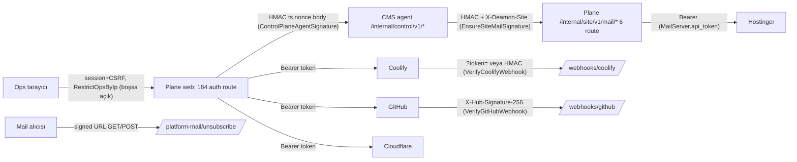

# 10 — Güvenlik, yetki ve denetim (audit)

**Tarih:** 2026-09-24 · **HEAD:** 8484d37 · **Hazırlayan:** S9 — Güvenlik, yetki ve denetim denetçisi (Dalga 2)
**Kapsam:** rol/policy matrisi (144 yazma + 59 GET route), imzalı çağrılar (giden agent HMAC, gelen mail proxy HMAC, Coolify/GitHub webhook, OAuth state), secret saklama/redaksiyon/log, web güvenliği (CSRF, XSS, SSRF, açık yönlendirme, mass assignment, upload, rate limit, header), kimlik doğrulama/oturum, audit kapsamı, bağımlılıklar · **Kapsam dışı:** CMS agent tarafı (yalnız §6 handoff), Mailcow, çok kiracılılık, canlı sistem testi (hiçbir canlı uca istek atılmadı)

Kaynak raporlar: [01](01-envanter.md), [02](02-mimari-ve-kod-sagligi.md), [03](03-sites-ve-yasam-dongusu.md), [04](04-coolify-deploy-ve-teshis.md), [05](05-agent-saglik-ve-izleme.md), [06](06-temalar-ve-rollout.md), [07](07-domain-cloudflare-dns.md), [08](08-mail-ve-bildirimler.md), [09](09-ui-ux-i18n-erisilebilirlik.md), [15](15-onceki-inceleme-durum-takibi.md). Dalga 1 bulguları yeniden keşfedilmedi; ID ile anılıp güvenlik açısından yeniden puanlandı (§0.2).
Yöntem: `php artisan route:list --json` + reflection betiği (her yazma route'unun controller metodu ve FormRequest `authorize()` gövdesi taranarak), ardından elle doğrulama. Hedefli test: `php artisan test --compact --filter='SiteMailProxyTest|CoolifyWebhookTest|GitHubWebhookTest|SecurityHardeningTest|RoleGateTest'` → **40 geçti / 132 assertion / 12.18 s**.

## Özet

- **Rol modeli iki basamaklı çalışıyor:** 144 yazma route'unun 116'sı rol olarak yalnız `canWriteOps()` (Operator = Super Admin) istiyor. Super Admin'e ayrılmış işlem yalnız 4: restore, CMS admin sil ve aktif/pasif yap, zorla kanal geçişi. Kalıcı silme (tekli ve toplu purge), Coolify/Cloudflare/GitHub bağlantısını silme, Cloudflare zone silme, secret rotate ve fleet çapındaki SMTP/DeskRon sırlarını değiştirme Operator'a açık. Policy matrisinde **16 ❌** var. Viewer'ın yazabildiği route yok (§1.4, S9-B01).
- **Kritik açık hâlâ duruyor:** S7-B01. Mail proxy'nin parola ve silme uçları mailbox'ın çağıran siteye ait olup olmadığına bakmıyor (`SiteMailProxyController.php:72-103`, `:148-166`). `docs/security.md:33` tersini söylüyor, yani doküman yanlış güvence veriyor (S9-B17).
- **Yeni Yüksek (S9-B02):** Kimlik bilgisinin gittiği hedef secret yeniden girilmeden değiştirilebiliyor. Üç yolu var: Coolify `base_url` (S3-B09), platform SMTP `host` ve sitenin `primary_domain`'i. Sonuncuda domain değişince `agent_base_url` de yeni domaine geçiyor ve bir sonraki push SMTP parolasını ve DeskRon `master_key`'ini oraya gönderiyor. Bu yollarla tek bir Operator oturumu fleet çapındaki sırları dışarı çıkarabilir. 2FA olmadığı için (Öneri-B2 Yapılmadı) çalınan bir parola bunun için yeterli.
- **Yeni Yüksek (S9-B03):** Coolify bağlantısı silinince sitelerin `coolify_connection_id` alanı NULL oluyor ve çağrılar sessizce varsayılan veya legacy kimlik bilgisine düşüyor. Silmeden önce "kaç site kullanıyor" kontrolü de, audit kaydı da yok.
- **İyi durumdakiler:** XSS: Blade kaçışı temiz, tek istisna `base_url` `href` şema kontrolü (S9-B04) (5 `{!! !!}` kullanımının hepsi statik/escape'li, JS `innerHTML` yalnız sunucuda render edilen parçaları alıyor), CSRF'den muafiyet yok, mass assignment yok, avatar yüklemesi kısıtlı, 16 secret alanın tamamı `encrypted` ve `$hidden`, log çağrılarında token/gövde yok, TLS doğrulaması hiçbir yerde kapatılmamış. Kalan sorunlar: güvenlik header'ları (CSP/HSTS) eksik, `TRUSTED_PROXIES='*'` (S9-B06) ve oturum yaşam döngüsü (S9-B07/B08).
- **En değerli öneriler:** S9-O01 (mailbox sahiplik kontrolü, 12 puan), S9-O20 (env prune korumalı anahtar listesi, 11), S9-O02 + O21 (`ops.danger` Gate'i ve route→rol matris testi, 10), S9-O03 (hedef değişince secret yeniden istensin, 10), S9-O05 (GitHub teslimat idempotency'si, 10), S9-O08 (2FA ve kullanıcı yönetimi, 10), S9-O11 (kullanımdaki bağlantının silinmesini engelle, 10).

## 0. Kritik ve Yüksek güvenlik bulguları

### 0.1 Liste (yeni + Dalga 1'den konsolide)

| ID | Önem | Sınıf | Tek satır | Kanıt (özet) |
|----|------|-------|-----------|--------------|
| S7-B01 | **Kritik** | Yetki (IDOR) | CMS mail proxy'si başka sitenin mailbox parolasını değiştirebiliyor veya o mailbox'ı silebiliyor: yalnız ID biçimi kontrol ediliyor | `app/Http/Controllers/Internal/SiteMailProxyController.php:72-103`, `:148-166`, `:237-240`; test yok (`tests/Feature/Mail/SiteMailProxyTest.php:34-162` yalnız kendi mailbox'ı) |
| S3-B01 | **Kritik** | Bütünlük/erişilebilirlik | Katalogda olmayan env anahtarları her deploy'da siliniyor; `DB_PASSWORD`/`CONTROL_PLANE_AGENT_SECRET` gibi Plane'de saklanmayan sırlar geri gelmez | [04](04-coolify-deploy-ve-teshis.md) S3-B01 |
| S5-B01 | **Kritik** | Tedarik zinciri | Herhangi bir branch'e yapılan push, auto-update açık canlı sitelere gidiyor (branch koruması fiilen yok) | [06](06-temalar-ve-rollout.md) S5-B01 |
| S6-B01 | **Kritik** | Bütünlük (e-posta güvenliği) | DNS şablonu müşterinin SPF/DMARC/TXT kayıtlarını içeriğe bakmadan eziyor → sahte gönderime karşı koruma kaybolabilir | [07](07-domain-cloudflare-dns.md) S6-B01 |
| S9-B01 | Yüksek | Yetki | 16 tehlikeli yazma route'u Super Admin yerine Operator'a açık (purge, bağlantı silme, zone silme, secret rotate, SMTP/DeskRon sırları). S2-B10 ve S6-B10'u kapsıyor | §1.4; `app/Policies/SitePolicy.php:45-48`, `app/Policies/CoolifyConnectionPolicy.php:25-43` |
| S9-B02 | Yüksek | Secret sızıntısı | Hedef URL/host değişiyor, saklı secret yeni hedefe gidiyor (Coolify token, SMTP parolası, DeskRon master key). S3-B09'u kapsıyor | `app/Http/Controllers/Ops/CoolifyConnectionController.php:177-181`; `app/Http/Controllers/Ops/PlatformMailSettingsController.php:58-63`; `app/Services/Sites/SitePrimaryDomain.php:86-93` |
| S9-B03 | Yüksek | Bütünlük | Coolify bağlantısı silinince siteler başka kimlik bilgisine düşüyor; kullanım kontrolü ve audit yok | `database/migrations/2026_09_10_001000_create_coolify_connections_and_inventory.php:78`; `app/Http/Controllers/Ops/CoolifyConnectionController.php:157-171`; `app/Services/Coolify/CoolifyApplicationService.php:37-45` |
| S3-B08 | Yüksek | Kimlik doğrulama | Coolify webhook'u üretimde `?token=` ile doğrulanıyor (token = HMAC secret'ı), replay koruması yok. Sahte `deployment_failed` otomatik düzeltmeyi tetikleyebiliyor. Önceki: 1.3-a / C1 (Yapılmadı) | `app/Http/Middleware/VerifyCoolifyWebhook.php:36-41`; `app/Support/CoolifyWebhookSignature.php:67-86` |
| S5-B03 | Yüksek | Replay | GitHub teslimat ID'si saklanmıyor: "Redeliver" veya sırası karışan teslimat `latest_sha`'yı geri alabiliyor | [06](06-temalar-ve-rollout.md) S5-B03; `app/Http/Middleware/VerifyGitHubWebhook.php:23-28` (yalnız imza) |
| S7-B07 | Yüksek | Etki alanı | Platform SMTP parolası (Plane'in kendi alarm hesabı) ve DeskRon `master_key` her CMS'e gönderiliyor | `app/Services/Mail/PlatformMailConfigurer.php:48-57`; `app/Services/Deskron/DeskronConfigurer.php:43-48` |
| S7-B02 | Yüksek | Bütünlük | İmzalı unsubscribe linki `GET` ile durum değiştiriyor: mail tarayıcıları alarmları sessizce kapatabilir, audit yok | `routes/web.php:15-20` |
| S6-B08 | Yüksek | Denetim | Domain/Cloudflare yazma yüzeylerinin hiçbiri audit yazmıyor (zone ve DNS silme dahil) | §1.6; `app/Http/Controllers/Ops/CloudflareOpsController.php` (0 audit çağrısı) |

### 0.2 Dalga 1 bulgularının güvenlik açısından yeniden puanlanması

| ID | Dalga 1 önemi | Güvenlik önemi | Gerekçe |
|----|---------------|----------------|---------|
| S7-B01 | Kritik | Kritik | Teyit edildi. Ayrıca doküman tersini söylüyor (`docs/security.md:33`) |
| S3-B01 | Kritik | Kritik | Secret kaybı + fleet çapında kesinti |
| S3-B09 | Orta | **Yüksek** (S9-B02) | Filo Coolify token'ı (tam yetkili) tek formla dışarı gidebilir. Hata mesajı uzak JSON `message`'ı operatöre yansıtıyor (`app/Services/Coolify/CoolifyApiException.php:55-56`) |
| S2-B10 | Yüksek | Yüksek (S9-B01) | Restore Super Admin istiyor, geri alınamaz purge istemiyor: rol modeli ters |
| S6-B10 | Orta | **Yüksek** (S9-B01) | Zone silme `ops.write` ile yapılabiliyor, kullanım kontrolü ve audit yok |
| S2-B17 | Düşük | **Orta** (S9-B08) | Açık metin parola `sessions` tablosunda duruyor ve DB yedeklerine giriyor |
| S1-B08 | Yüksek | Orta | Doğrudan açık değil; tespit edilemeyen hata (yutulan istisna) gözlemlenebilirlik açığı |
| S4-B05 / S4-B06 | Yüksek | Orta | Rotate kesinti yaratıyor → operatörler rotate'ten kaçınır, secret hijyeni bozulur. Önceki: Öneri-B4 (Yapılmadı) |
| S7-B09 / S7-B10 / S4-B16 | Orta/Düşük | Orta (S9-B09) | HMAC'e yol/metot bağlı değil ve nonce kontrolü atomik değil. S7-B01 ile birleşince etki büyüyor |
| S4-B15 | Düşük | Düşük | Doğrulanmadı. Güvenlik etkisi yok; sahte `bad_signature` (erişilebilirlik) üretebilir |
| S7-B11 | Orta | Orta | IP bazlı throttle imza doğrulamasından önce çalışıyor → siteler arası hizmet reddi (Doğrulanmadı: ortak egress IP'si) |

## 1. Mevcut durum

### 1.1 Güven sınırları

### 1.2 Ana dosyalar

| Dosya | Sorumluluk | Satır | Test |
|-------|------------|-------|------|
| `app/Providers/AppServiceProvider.php` | `Gate::define('ops.write')` + 4 policy | 47 | `tests/Feature/Ops/RoleGateTest.php` (3 test) |
| `app/Policies/SitePolicy.php` | Site yetkileri; SA: restore, admin toggle/destroy | 79 | Dağınık viewer testleri (61 dosyada `viewer` geçiyor) |
| `app/Policies/CoolifyConnectionPolicy.php`, `ThemeGitConnectionPolicy.php`, `ThemePolicy.php` | Yazma = `canWriteOps()` | 44 / 34 / 34 | — |
| `app/Http/Middleware/EnsureSiteMailSignature.php` | Gelen HMAC, skew, nonce | 96 | `tests/Feature/Mail/SiteMailProxyTest.php` (6 test; replay/skew yok) |
| `app/Http/Middleware/VerifyCoolifyWebhook.php` + `app/Support/CoolifyWebhookSignature.php` | HMAC veya query token | 49 + 102 | `tests/Feature/Webhooks/CoolifyWebhookTest.php` (17) |
| `app/Http/Middleware/VerifyGitHubWebhook.php` + `app/Support/GitHubWebhookSignature.php` | `X-Hub-Signature-256` | 32 + 61 | `tests/Feature/Webhooks/GitHubWebhookTest.php` (8) |
| `app/Support/ControlPlaneAgentSignature.php` | Giden imza | 51 | Agent testleri |
| `app/Http/Middleware/RestrictOpsByIp.php` | IP allowlist (boşsa açık) | 48 | `tests/Feature/Security/SecurityHardeningTest.php:57,67` |
| `app/Support/SecretRedactor.php` | Redaksiyon desenleri | 63 | `tests/Feature/Security/SecurityHardeningTest.php:25` |
| `app/Support/ThemeGitOAuthState.php` | OAuth `state` (HMAC, 30 dk) | 57 | ThemeGit/DeamonGit testleri |
| `app/Http/Controllers/Internal/SiteMailProxyController.php` | CMS → Hostinger proxy | 254 | `tests/Feature/Mail/SiteMailProxyTest.php` |
| `config/session.php`, `config/fortify.php`, `docker/nginx/default.conf` | Oturum, auth özellikleri, header | 217 / — / 45 | — |

### 1.3 Test kapsamı

| Davranış | Testli mi | Kanıt |
|----------|-----------|-------|
| Viewer → settings POST 403 | Evet | `tests/Feature/Ops/RoleGateTest.php:22-30` |
| Route→rol matrisi (tüm yazma route'ları) | **Hayır** (Önceki: C5 Yapılmadı) | `tests/Feature/Ops/RoleGateTest.php` yalnız 3 test |
| Mail proxy: geçersiz imza, yanlış site header'ı | Evet | `tests/Feature/Mail/SiteMailProxyTest.php:82,102` |
| Mail proxy: **başka sitenin mailbox ID'si**, nonce replay, skew | **Hayır** | aynı dosyada yok (S7-B22) |
| Coolify webhook HMAC/token/boş secret | Evet | `tests/Feature/Webhooks/CoolifyWebhookTest.php` |
| GitHub teslimat tekrarı | **Hayır** | S5-B03 |
| Login throttle, oturum iptali | **Hayır** | `tests/Feature/Auth/LoginPageTest.php` yalnız sayfa/redirect (3 test) |
| Genel Blade secret taraması | **Hayır** (Önceki: C4 Kısmen) | — |

### 1.4 Rol/policy matrisi — yazma route'ları (144)

Rol tanımı: `app/Enums/OpsRole.php:24-27` (`canWrite` = Viewer değil), `app/Models/User.php:132-138` (`canWriteOps` = SuperAdmin|Operator). Route'larda `role:` middleware'i hiç kullanılmıyor (alias `bootstrap/app.php:46-50`).
Beklenen rol ölçütü: **SA** = geri alınamaz, fleet çapında ya da kimlik bilgisi/hedef değiştiren işlem. **Op** = rutin site işlemi. **Kendi** = kullanıcının kendi kaydı. **İmza** = makine uç noktası.
Kısaltma: `C/` = `app/Http/Controllers/Ops/`, `R/` = `app/Http/Requests/Ops/`. Satır numarası `authorize` satırıdır.

| Route (metot URI) | Controller@action | Beklenen | Gerçek kontrol | Uyum |
|-------------------|-------------------|----------|----------------|------|
| PUT `account`, PUT `account/password`, POST/DELETE `account/avatar` | AccountController@update/updatePassword/updateAvatar/destroyAvatar | Kendi | `$request->user()` `C/AccountController.php:26,38,50,67`; FR `R/UpdateAccountPasswordRequest.php:22` | ✅ (oturum iptali yok → S9-B07) |
| POST `account/appearance`, POST `account/locale`, PUT `account/preferences` | PreferencesController | Kendi | `C/PreferencesController.php:29,47,69` | ✅ |
| POST `sites/list-mode`, POST/DELETE `sites/list-preferences`, POST `sites/list-views`, DELETE `sites/list-views/{view}` | SiteListPreferencesController | Kendi | `C/SiteListPreferencesController.php:29,48,65,105,157` | ✅ |
| POST `sites` | SiteController@store | Op | FR `R/StoreSiteRequest.php:19` (`create`) | ✅ |
| PUT `sites/{site}` | SiteController@update | Op (hedef değişimi SA) | FR `R/UpdateSiteRequest.php:19`; ham UUID override yalnız SA `R/Concerns/ValidatesCoolifySiteTargets.php:38` | ⚠️ canlı sitede bağlantı/sunucu değişimi Op'a açık (S2-B05); domain değişimi agent URL'ini taşıyor (S9-B02) |
| DELETE `sites/{site}` (arşiv) | SiteController@destroy | Op | `C/SiteController.php:1114` | ✅ |
| POST `sites/{site}/restore` | SiteController@restore | SA | `C/SiteController.php:1152` → `app/Policies/SitePolicy.php:40-43` | ✅ |
| DELETE `sites/{site}/purge` | SiteController@purge | **SA** | `C/SiteController.php:1176` → `forceDelete` = `canWriteOps` `app/Policies/SitePolicy.php:45-48` | ❌ |
| POST `sites/bulk/purge` | SiteCoolifyOpsController@bulkPurge | **SA** | `C/SiteCoolifyOpsController.php:277` (`forceDelete`) + FR `R/BulkSiteIdsRequest.php:9` | ❌ |
| POST `sites/{site}/activate`, `deactivate` | SiteController | Op | `C/SiteController.php:1088,1101` | ✅ |
| POST `sites/{site}/provision` | SiteController@provision | Op | `C/SiteController.php:610` | ✅ |
| POST `sites/{site}/channel` | SiteController@switchChannel | Op (zorla: SA) | FR `R/SwitchSiteChannelRequest.php:12`; zorla geçiş SA `app/Services/Sites/ChannelSwitcher.php:68-69` | ✅ |
| POST `sites/bulk/channel` | SiteCoolifyOpsController@bulkChannel | Op | `C/SiteCoolifyOpsController.php:352` | ⚠️ `all=1` ile tüm filo, sunucuda sayı onayı yok (S2-B10) |
| POST `sites/{site}/health` | SiteController@checkHealth | Op | `C/SiteController.php:649` | ✅ |
| POST `sites/{site}/agent-secret` | SiteController@injectAgentSecret | Inject: Op / **Rotate: SA** | `C/SiteController.php:675` (`update`); rotate dalı `:677` | ❌ (rotate kesinti yaratıyor, S4-B05/B06) |
| POST `sites/bulk/agent-secret` | SiteController@bulkInjectAgentSecret | Op | `C/SiteController.php:699` (yalnız eksik secret; runbook: "never rotates") | ✅ |
| POST `sites/{site}/app-health` | SiteAppHealthController@refresh | Viewer | `C/SiteAppHealthController.php:26` `view`; canlı Coolify çağrısı yalnız `update` ile (`:28`) | ✅ |
| POST `sites/{site}/app-health/fix`, `sites/bulk/app-health-fix` | SiteAppHealthController | Op | `C/SiteAppHealthController.php:36,67` | ✅ |
| POST `sites/{site}/deploy`, `pin`, `follow-head`, `auto-deploy`, `compose`, `sync`, `live-sync` | SiteCoolifyOpsController | Op | `C/SiteCoolifyOpsController.php:426,152,413,106,66,165,240` | ✅ |
| POST `sites/bulk/deploy`, `bulk/follow-head`, `bulk/pin` | SiteCoolifyOpsController | Op | yalnız FR `R/BulkSiteIdsRequest.php:9` (site başına `authorize` yok) | ⚠️ `all=1` + filtre genişlemesi (S2-B10) |
| POST `sites/bulk/sync`, `bulk/live-sync`, `bulk/auto-deploy`, `bulk/compose` | SiteCoolifyOpsController | Op | `C/SiteCoolifyOpsController.php:195,304,125,85` | ✅ |
| POST `sites/{site}/deployments/{deployment}/diagnose` | DeploymentDiagnosisController | Op | `C/DeploymentDiagnosisController.php:21,23` (site eşleşmesi) | ✅ |
| POST `sites/{site}/publish-status`, `sites/bulk/publish-status` | SitePublishStatusController | Op | `C/SitePublishStatusController.php:26,50` | ✅ |
| POST `sites/{site}/cloudflare/zone`, `cloudflare/dns` | SiteCloudflareController | Op | `C/SiteCloudflareController.php:21,92` | ✅ |
| POST `sites/{site}/domains`, DELETE `…/domains/{domain}`, POST `…/primary` | SiteDomainController | Op | FR `R/StoreSiteDomainRequest.php:16`; `C/SiteDomainController.php:84,157`; `scopeBindings` `routes/ops/sites.php:68,71` | ✅ |
| POST `sites/{site}/mail`, `mail-configure`, `mail-order`, `platform-mail` | SiteController | Op | `C/SiteController.php:805,781,741,856` | ✅ |
| POST `…/mailbox-requests/{id}/fulfill`, `reject` | SiteController | Op | `C/SiteController.php:918-919,942-943` (site eşleşmesi) | ✅ |
| POST `sites/{site}/admins`, `…/password`, `…/password-invite` | SiteAdminController | Op | `C/SiteAdminController.php:40,107,85` | ✅ (reset onaysız: S2-B16) |
| POST `…/admins/{id}/activate`, `deactivate`; DELETE `…/admins/{id}` | SiteAdminController | SA | `C/SiteAdminController.php:142,135,149` → `app/Policies/SitePolicy.php:70-78` | ✅ |
| POST `sites/{site}/themes` | SiteThemeController@assign | Op | `C/SiteThemeController.php:20-21` | ✅ |
| POST `…/themes/{installation}/update`, `sync`, `sync-rollback`, `files-rollback`, `activate`, `auto-update` | SiteThemeController | Op | `assertInstallation` + `C/SiteThemeController.php:50,60,98,116,134,152` | ✅ |
| POST `domains`, PATCH `domains/{domain}`, POST `domains/{domain}/bind` | DomainController | Op | `C/DomainController.php:66,97,131` + FR `R/StoreFleetDomainRequest.php:12` | ✅ |
| POST `domains/bulk-bind`, `domains/bulk-clear` | DomainController | Op | `C/DomainController.php:148,172` | ⚠️ clear, CF kaydını bırakıyor (S6-B11), audit yok |
| POST `coolify` | CoolifyConnectionController@store | SA | `C/CoolifyConnectionController.php:64` → `app/Policies/CoolifyConnectionPolicy.php:20-23` | ⚠️ |
| PUT `coolify/{connection}` | …@update | **SA** | `C/CoolifyConnectionController.php:119` | ❌ (base_url + saklı token, S9-B02) |
| DELETE `coolify/{connection}` | …@destroy | **SA** | `C/CoolifyConnectionController.php:159` | ❌ (S9-B03) |
| POST `coolify/{connection}/test` | …@test | Op (yalnız saklı URL ile) | `C/CoolifyConnectionController.php:175`; formdan URL + saklı token `:177-181` | ❌ |
| POST `coolify/{connection}/default`, `…/sync`, `…/{servers,projects,environments,git-sources}/*/toggle` | CoolifyConnectionController | Op | `C/CoolifyConnectionController.php:246,209,255,266,277,288` | ⚠️ audit yok (S3-B10) |
| POST `cloudflare` | CloudflareOpsController@store | SA | `C/CloudflareOpsController.php:48` (`ops.write`) | ⚠️ |
| PUT `cloudflare/{account}` | …@update | **SA** | `C/CloudflareOpsController.php:89` | ❌ (token değişimi, audit yok) |
| DELETE `cloudflare/{account}` | …@destroy | **SA** | `C/CloudflareOpsController.php:104` | ❌ (siteler başka hesaba düşüyor, S6-B09) |
| POST `cloudflare/{account}/default`, `…/test`, `…/zones` | CloudflareOpsController | Op | `C/CloudflareOpsController.php:157,123,216` | ✅ |
| DELETE `cloudflare/{account}/zones/{zone}` | …@destroyZone | **SA** | `C/CloudflareOpsController.php:295` | ❌ (S6-B10) |
| POST `…/zones/{zone}/apply-defaults`, `…/dns`; PUT/DELETE `…/dns/{record}` | CloudflareOpsController | Op | `C/CloudflareOpsController.php:281,311,327,344` | ⚠️ kullanım kontrolü ve audit yok (S6-B08, S6-B12) |
| POST `cloudflare/dns-defaults`, `…/reset`; PUT/DELETE `…/{record}` | CloudflareOpsController | Op | `C/CloudflareOpsController.php:176,207,188,198` | ✅ |
| POST `themes/git/connect`, `connect-another`, `pat` | ThemeGitConnectionController | Op | `C/ThemeGitConnectionController.php:28,68,105` | ⚠️ PAT = kimlik bilgisi, audit yok |
| PATCH `themes/git/{connection}`, POST `…/sync-repos` | ThemeGitConnectionController | Op | `C/ThemeGitConnectionController.php:139,156` | ✅ |
| DELETE `themes/git/{connection}` | …@destroy | **SA** | `C/ThemeGitConnectionController.php:169` | ❌ (katalog sync CASCADE, S5-B12) |
| POST `themes/sync`, PUT `themes/{theme}`, POST/DELETE `themes/{theme}/access…` | ThemeController | Op | `C/ThemeController.php:158,185,220,243` | ✅ |
| POST `settings/deamon-git/connect`, `settings/deamon-git/pat` | DeamonGitConnectionController | Op | `C/DeamonGitConnectionController.php:22,114` | ⚠️ |
| POST `settings/deamon-git/disconnect`, DELETE `settings/deamon-git/pat` | DeamonGitConnectionController | **SA** | `C/DeamonGitConnectionController.php:102,130` | ❌ ×2 (env kataloğu kaynağı kopuyor) |
| POST `settings/env-defaults/sync` | SettingsController@syncEnvCatalog | Op | `C/SettingsController.php:82` | ⚠️ S3-B01 prune girdisi |
| POST `settings`, `settings/coolify/test`, `settings/github`, `settings/github/test` | Settings/GithubSettingsController (stub) | — | `C/SettingsController.php:65,72`; `C/GithubSettingsController.php:13,22` | ✅ (ölü yüzey, S9-B16) |
| PUT `platform-mail` | PlatformMailSettingsController@update | **SA** | `C/PlatformMailSettingsController.php:33` | ❌ (SMTP host/parola, S9-B02) |
| POST `platform-mail/push`, `platform-mail/test` | PlatformMailSettingsController | Op | `C/PlatformMailSettingsController.php:92,103` | ⚠️ fleet push onaysız (S7-B15) |
| PUT `deskron` | DeskronSettingsController@update | **SA** | `C/DeskronSettingsController.php:39` | ❌ (master key tüm CMS'lere) |
| POST `deskron/push` | DeskronSettingsController@push | Op | `C/DeskronSettingsController.php:28` | ✅ |
| POST `mail-servers`, `…/test` | MailServerOpsController | Op | `C/MailServerOpsController.php:110,177` | ✅ |
| PUT `mail-servers/{mailServer}` | …@update | **SA** | `C/MailServerOpsController.php:138` | ❌ (Hostinger token) |
| DELETE `mail-servers/{mailServer}` | …@destroy | **SA** | `C/MailServerOpsController.php:153` | ❌ |
| POST `jobs/deployments/{d}/cancel`, `force-start`; POST `jobs/coolify-deployments/{uuid}/cancel`, `force-start` | OpsJobController | Op | `C/OpsJobController.php:108,117,126,135` | ⚠️ cancel audit'siz (S9-B10) |
| DELETE `jobs/{job}` | OpsJobController@destroy | Kendi | `C/OpsJobController.php:97-99` (sahip + terminal durum) | ✅ |
| POST `internal/site/v1/mail/mailboxes`, `mailbox-requests` | SiteMailProxyController | İmza | `app/Http/Middleware/EnsureSiteMailSignature.php:15-48` | ✅ |
| PATCH `internal/…/mailboxes/{id}/password`, DELETE `internal/…/mailboxes/{id}` | SiteMailProxyController | İmza + **sahiplik** | yalnız biçim `app/Http/Controllers/Internal/SiteMailProxyController.php:237-240` | ❌ (S7-B01; yetki değil nesne sahipliği, ❌ sayısına dahil değil) |
| POST `webhooks/coolify`, `webhooks/github` | Webhook controller'ları | İmza | `app/Http/Middleware/VerifyCoolifyWebhook.php:14-45`; `app/Http/Middleware/VerifyGitHubWebhook.php:14-30` | ⚠️ token modu / replay (S3-B08, S5-B03) |
| POST/GET `platform-mail/unsubscribe` | PlatformMailUnsubscribeController@show | İmzalı URL | `C/PlatformMailUnsubscribeController.php:14` + `signed` `routes/web.php:15-20` | ⚠️ GET durumu değiştiriyor (S7-B02) |
| PUT `storage/{path}` | Framework closure | — | imza `vendor/laravel/framework/src/Illuminate/Filesystem/ReceiveFile.php:28-29` | ⚠️ gereksiz yüzey (S9-B13) |
| POST `login`, `logout`, `user/confirm-password` | Fortify | — | `throttle:login` `app/Providers/FortifyServiceProvider.php:23-27` | ✅ |

**Sayım:** 144 yazma route'unun 16'sı ❌ (yetki: beklenen SA, gerçek Op). Tabloda ❌ işaretli mail proxy satırı rol değil nesne sahipliği sorunu olduğu için bu sayıya dahil değil. Viewer'ın yazabildiği route: **0**. GET'te yan etki olarak `GET sites/{site}`, viewer tarafından açılsa bile `recoverSiteIfLatestFinished` yazıyor (`app/Http/Controllers/Ops/SiteDetailController.php:34-35`, S2-B14).
**GET özeti (59):** 51 ops GET'i `view`/`viewAny` (her rol) ya da `ops.write` (`jobs`, `*/create`, callback'ler) istiyor. `activity/export` her role açık (`app/Http/Controllers/Ops/ActivityController.php:60`). Internal GET 2 route, imza ile korunuyor. `storage/{path}` GET imzalı. `up` açık.

### 1.5 İmzalı çağrılar

| Kanal | Doğrulama | Replay / zaman | Açık | Kanıt |
|-------|-----------|----------------|------|-------|
| Plane → CMS agent | HMAC-SHA256 `{ts}.{nonce}.{body}`, nonce UUID | ts/nonce kontrolü CMS'te; 429 tekrarında aynı nonce | Yol ve metot imzaya dahil değil; iki yönde aynı secret | `app/Support/ControlPlaneAgentSignature.php:10-18,36-37`; `app/Services/Agent/SiteAgentClient.php:42-48` |
| CMS → Plane mail proxy | Site ULID header'ı, skew ≤ `skew_seconds`, nonce biçimi, `hash_equals` | `Cache::has` → imza → `Cache::put` (atomik değil); TTL alt sınırı 30 sn | TOCTOU; throttle imzadan önce IP'ye göre | `app/Http/Middleware/EnsureSiteMailSignature.php:17-20,51-60,72-81`; `routes/internal-site.php:7` |
| Coolify → Plane | HMAC header **veya** `?token=`/`?secret=` = secret | Yok (ts/ID yok) | Tüm bağlantıların secret'ları her siteyi günceller | `app/Http/Middleware/VerifyCoolifyWebhook.php:16,23-41`; `app/Support/CoolifyWebhookSignature.php:67-86` |
| GitHub → Plane | `X-Hub-Signature-256`, boş secret reddi | `X-GitHub-Delivery` saklanmıyor | Redeliver = yeniden fan-out | `app/Http/Middleware/VerifyGitHubWebhook.php:16-28` |
| GitHub OAuth geri dönüşü | `state` HMAC(app.key), 30 dk, tek kullanımlık (`pull`) | Install'da `state` eksikse kabul ediliyor, ama installation App JWT ile doğrulanıyor | Düşük | `app/Support/ThemeGitOAuthState.php:28-51`; `app/Services/GitHub/DeamonGitConnectionService.php:110,120` |
| Unsubscribe | `signed` middleware | — | GET yan etkili | `routes/web.php:15-20` |

### 1.6 Audit kapsamı (S0 + S6 + yeni tarama birleşik)

Yöntem: yazan dosya sayımı. Controller'lardan 9'u audit yazıyor (`grep -cE "auditLogs\(\)->create|AuditLog::query\(\)->create|->audit\("`). Servis ve komutlardan 16 dosya audit yazıyor. Audit şeması: `actor_user_id, action, subject_*, before, after, ip, created_at`. `reason` alanı yok (Önceki: C3 Yapılmadı).

| Mutasyon yüzeyi | Audit | Kanıt | Kaynak |
|-----------------|-------|-------|--------|
| Site CRUD, arşiv, restore, purge, provision, kanal, deploy, pin, compose, publish, agent secret, site domain, CMS admin, tema işlemleri, mail atama | ✅ | `app/Http/Controllers/Ops/SiteController.php` (10 çağrı), `app/Services/Sites/*` (13 dosya), `app/Services/Themes/ThemeRolloutService.php` | — |
| Mail server CRUD/test, platform mail güncelleme, DeskRon güncelleme, mail proxy (CMS) | ✅ | `C/MailServerOpsController.php` (5), `C/PlatformMailSettingsController.php:73`, `C/DeskronSettingsController.php:62`, `app/Http/Controllers/Internal/SiteMailProxyController.php` (5) | — |
| Coolify bağlantısı CRUD/toggle/sync, Deamon Git, env kataloğu | ❌ | `C/CoolifyConnectionController.php`, `C/CoolifyInventoryController.php`, `C/DeamonGitConnectionController.php`, `C/SettingsController.php` (0) | S3-B10 |
| Cloudflare hesap/zone/DNS/şablon, fleet domain ekle/bind/clear/taşı | ❌ | `C/CloudflareOpsController.php`, `C/DomainController.php` (0) | S6-B08 |
| Tema Git bağlantısı, katalog sync (silme dahil), webhook alındısı | ❌ | `C/ThemeGitConnectionController.php` (0) | S5-B15 |
| Platform mail push/test, DeskRon push, unsubscribe | ❌ | S7-B21 | S7-B21 |
| Coolify sync/envanter kaynaklı `channel`/uuid değişimi; GET detay kurtarma | ❌ | `app/Http/Controllers/Ops/SiteDetailController.php:34-35` | S2-B14 |
| App-health `bind_domains` düzeltmesi | ❌ | S6-B04 | S6-B04 |
| Teşhis otomatik düzeltmesi | ⚠️ yalnız `applied` | S3-B11 | S3-B11 |
| **Deploy iptali (yerel + uzak)** | ❌ | `app/Services/Ops/OpsCoolifyDeployQueue.php:320-362,481-516` (audit çağrısı yok) | **S9-B10** |
| **Deploy zorla başlatma** | ⚠️ `ip => null` | `app/Services/Ops/OpsCoolifyDeployQueue.php:421-427` | **S9-B10** |
| **Hesap: parola, e-posta, avatar** | ❌ | `C/AccountController.php:24-45` | **S9-B10** |
| **Login / logout / başarısız login** | ❌ | `app/Listeners` yok; `grep -rn "Auth\\\\Events" app` boş | **S9-B10** |
| Sağlık down/up geçişi | ❌ | S4-B13 | S4-B13 |

### 1.7 Web güvenliği kontrol listesi

| Konu | Durum | Kanıt |
|------|-------|-------|
| CSRF | ✅ `web` grubunda varsayılan; `except` listesi yok. Webhook ve internal route'lar `web` dışında | `bootstrap/app.php:20-27,29-54` |
| Blade `{!! !!}` (5) | ✅ Hepsi statik veya `e()` ile | `resources/views/mail/platform-ops.blade.php:2`; `resources/views/ops/sites/_cloudflare.blade.php:59`; `resources/views/ops/sites/_form.blade.php:170,181`; `resources/views/ops/sites/_view-switch.blade.php:35` |
| JS `innerHTML` (6) | ✅ Yalnız sunucuda render edilen parçalar ve sabit SVG | `public/js/ops-lazy-panels.js:33`; `public/js/ops-list.js:334`; `public/js/sites-admins.js:67`; `public/js/ops-ui.js:394,1476`; `public/js/ops-coolify-form.js:15` |
| Dinamik `href` | ❌ Coolify `base_url` şema doğrulamasız → S9-B04 | `resources/views/ops/coolify/show.blade.php:64` |
| SSRF | ❌ `base_url` (S9-B04); ⚠️ live probe/smoke redirect'leri takip ediyor (S9-B12); ✅ smoke yolları temizleniyor | `app/Services/GitHub/ThemeManifest.php:58` |
| Açık yönlendirme | ✅ `redirect()->away` yalnız ayarlardan üretilen GitHub install URL'ine; `back()` yalnız CSRF'li POST'larda | `C/DeamonGitConnectionController.php:59,76`; `C/ThemeGitConnectionController.php:63,79` |
| Mass assignment | ✅ `$guarded = []` yok, `fill($request->all())` yok; `fill($request->validated())` | `C/AccountController.php:27` |
| Dosya yükleme | ✅ `image`, `mimes:jpg,jpeg,png,webp`, `max:2048`; rastgele adla public diske | `R/UpdateAccountAvatarRequest.php:20`; `C/AccountController.php:55` |
| `storage/{path}` | ⚠️ `serve => true` (imzalı), IP allowlist dışında | `config/filesystems.php:36` |
| Rate limit | ⚠️ Login 5/dk (e-posta+IP); webhook/internal 60/dk IP; imzadan önce | `app/Providers/FortifyServiceProvider.php:23-27`; `routes/webhooks.php:10,14`; `routes/internal-site.php:7` |
| Güvenlik header'ları | ⚠️ Yalnız `X-Frame-Options`, `nosniff` | `docker/nginx/default.conf:14-15` |
| TLS doğrulaması | ✅ `verify => false` / `withoutVerifying` yok | `grep -rn "'verify'\s*=>\|withoutVerifying" app` boş |
| `APP_DEBUG` | ✅ Üretimde debug açıksa uygulama boot'ta duruyor; compose `false` | `app/Support/ProductionDebugGuard.php:11-17`; `docker-compose.coolify.yml:16` |
| Üretim imajı | ✅ `composer install --no-dev` | `Dockerfile:13-14` |

### 1.8 Kimlik doğrulama ve oturum (yalnız bayrak tipleri; değer yazılmadı)

| Ayar | Kod varsayılanı | Üretim (compose) | Kanıt |
|------|-----------------|------------------|-------|
| Fortify özellikleri | `[]`: parola sıfırlama, 2FA, kayıt yok | — | `config/fortify.php:162-164` (Önceki: 1.3-f, Öneri-B1/B2 Yapılmadı) |
| `driver` | database | database | `config/session.php:21`; `docker-compose.coolify.yml:32` |
| `lifetime` / `expire_on_close` | env (varsayılan 120 dk) / false | — | `config/session.php:35,37` (Önceki: C2 Kısmen) |
| `encrypt` | **false** | ayarlanmamış | `config/session.php:50` |
| `secure` / `http_only` / `same_site` | env / true / lax | secure=true | `config/session.php:172,185,202`; `docker-compose.coolify.yml:33` |
| Remember-me | Formda var | — | `resources/views/auth/login.blade.php:35` |
| Oturum iptali (parola değişince) | Yok (`AuthenticateSession` yok, `logoutOtherDevices` yok) | — | `C/AccountController.php:35-45` |
| IP allowlist | Liste boşsa herkese açık; tam eşleşme (CIDR yok) | env | `app/Http/Middleware/RestrictOpsByIp.php:20-27` |
| Proxy güveni | `TRUSTED_PROXIES` varsayılanı `*`, X-Forwarded-* dahil | `*` | `bootstrap/app.php:30-38`; `docker-compose.coolify.yml:34` |

### 1.9 Secret saklama

- `encrypted` cast + `$hidden`: 9 modelde 16 alan var: CloudflareSetting, CoolifyConnection (2), CoolifySetting (2), DeskronSetting (2), GithubSetting (4), MailServer, PlatformMailSetting, Site (2), ThemeGitConnection. Örnek: `app/Models/Site.php:97-100,117-118`; `app/Models/GithubSetting.php:33-38,46-49`. Şifrelenmemiş secret kolonu bulunamadı. `coolify_env_defaults.value` katalog örnek değeri tutuyor, gerçek secret değil (`app/Models/CoolifyEnvDefault.php:90`).
- Log: 47 `Log::` çağrısı tarandı. Token, gövde veya URL query'si loglanmıyor. SMTP hatası redakte ediliyor (`app/Services/Mail/PlatformOpsMailer.php:83`).
- Redaktör: sabit desenler ve site başına 3 bilinen secret (`app/Support/SecretRedactor.php:44-52`; `app/Services/Sites/DeploymentFailureText.php:181-196`). Kapsam S9-B11'de.
- `APP_KEY` rotasyonu: Laravel `previous_keys` destekliyor (`config/app.php:105-108`). Runbook ise bunu "break-glass" sayıyor ve yalnız 4 kolon grubunu listeliyor (`docs/runbooks/token-rotation.md:36`), S9-B18.

### 1.10 Bağımlılıklar (lock'tan okundu; `composer audit` ağ gerektirdiği için çalıştırılmadı — **Doğrulanmadı**)

| Paket | Sürüm (lock tarihi) | Not |
|-------|---------------------|-----|
| laravel/framework | v12.66.0 (2026-08-11) | Güncel |
| laravel/fortify | v1.38.0 (2026-08-07) | Güncel |
| spatie/laravel-permission | 6.25.0 (2026-03-17) | 6 aydır güncellenmemiş |
| guzzlehttp/guzzle / psr7 | 7.15.3 / 2.13.0 (2026-08) | Güncel |
| symfony/http-foundation, http-kernel, mailer | v7.4.16 / v7.4.16 / v7.4.15 | Güncel |
| league/commonmark, monolog, carbon, psysh | 2.10.0 / 3.10.0 / 3.13.2 / v0.12.24 | Güncel |
| PHP runtime | 8.2 (`Dockerfile:41`) | Güvenlik desteği 2026-12-31'de bitiyor (S1-B23) |
| `package.json` | Yok | JS bağımlılığı yok; build adımı yok |

Doğrulama yolu: ağ erişimi olan yerel ortamda `composer audit --locked`.

## 2. Bulgular

Dalga 1 bulguları §0.2'de konsolide edildi. Aşağıdakiler bu taramanın yeni bulguları.

| ID | Tür | Önem | Bulgu | Kanıt | Etki |
|----|-----|------|-------|-------|------|
| S9-B01 | Güvenlik | Yüksek | İki basamaklı rol modeli: 16 tehlikeli yazma route'u Operator'a açık (§1.4 ❌). Restore SA istiyor, geri alınamaz purge istemiyor. Kullanıcı yönetimi olmadığı için rol değişikliği tinker gerektiriyor. Önceki: C5 (Yapılmadı), Öneri-B1 (Yapılmadı). S2-B10 ve S6-B10'u kapsıyor | `app/Policies/SitePolicy.php:40-48`; `app/Policies/CoolifyConnectionPolicy.php:25-43`; `app/Providers/AppServiceProvider.php:35`; `app/Models/User.php:132-138` | Tek bir Operator hesabı (ya da çalınmış oturumu) filoyu silebilir, DNS'i kaldırabilir, bağlantıları koparabilir |
| S9-B02 | Güvenlik | Yüksek | Hedef değişiyor, secret yeniden istenmiyor. (a) Coolify `test` formdaki URL ile saklı token'ı birleştiriyor, `update` URL'i token olmadan değiştiriyor (S3-B09). (b) Platform SMTP `host` değişirken parola alanı boş bırakılırsa saklı parola korunuyor; sonraki gönderim ve push yeni host'a gidiyor. (c) `primary_domain` değişince `agent_base_url` da yeni domaine geçiyor; bir sonraki platform-mail/DeskRon push'u SMTP parolasını ve `master_key`'i yeni host'a gönderiyor. **Doğrulanmadı:** (c) uçtan uca (CMS'in yeni host'ta imzayı kabul etmesi gerekmiyor, çünkü gövde istekle birlikte gidiyor) | `app/Http/Controllers/Ops/CoolifyConnectionController.php:177-181,338,352`; `app/Http/Controllers/Ops/PlatformMailSettingsController.php:58-63`; `app/Http/Controllers/Ops/SiteController.php:1053-1054`; `app/Services/Sites/SitePrimaryDomain.php:86-93`; `app/Services/Mail/PlatformMailConfigurer.php:48-57`; `app/Services/Deskron/DeskronConfigurer.php:43-48` | Fleet çapındaki üç secret (Coolify root token, alarm SMTP, DeskRon master key) tek Operator eylemiyle dışarı çıkar. (b) audit'e yazılıyor ama parola yeniden girilmediği görünmüyor |
| S9-B03 | Risk | Yüksek | Coolify bağlantısı silinince `sites.coolify_connection_id` NULL oluyor (`nullOnDelete`). `forSite` bu durumda varsayılan/legacy kimlik bilgisine düşüyor. Silmeden önce "kullanan site" sayısı kontrol edilmiyor, audit de yazılmıyor. Purge yanlış instance'ta 404 alınca bunu "zaten silinmiş" sayıyor (S2-B05) | `database/migrations/2026_09_10_001000_create_coolify_connections_and_inventory.php:78`; `app/Http/Controllers/Ops/CoolifyConnectionController.php:157-171`; `app/Services/Coolify/CoolifyApplicationService.php:37-45` | Deploy/env/sil çağrıları yanlış Coolify'a gider; yetim canlı uygulamalar; iz kalmaz |
| S9-B04 | Güvenlik | Orta | Coolify `base_url` için yalnız `string\|max:255` kuralı var; normalize işlemi şemaya bakmıyor. `javascript:` gibi bir değer `href` olarak render ediliyor (tıklamayla çalışan stored XSS, Operator → Super Admin). İç ağ adresleri kabul ediliyor ve test yanıtındaki JSON `message` operatöre yansıyor (yanıtı okunabilen SSRF) | `app/Http/Controllers/Ops/CoolifyConnectionController.php:338,400-408`; `app/Services/Coolify/CoolifyCredentials.php:54-63`; `resources/views/ops/coolify/show.blade.php:64`; `app/Services/Coolify/CoolifyApiException.php:55-56` | İçeriden gelen kullanıcı yetki yükseltebilir; Plane iç ağı (MySQL/Redis servis adları) yoklanabilir |
| S9-B05 | Güvenlik | Orta | Güvenlik header'ları eksik: CSP, HSTS, Referrer-Policy ve Permissions-Policy yok. Nginx'te `access_log` genel olarak kapatılmamış; Coolify webhook'unun `?token=` değeri erişim loglarına düşebilir (S3-B08). **Doğrulanmadı:** Traefik/nginx'in canlıdaki log formatı | `docker/nginx/default.conf:14-15,17-19,31-40` | XSS'e karşı ikinci savunma hattı yok; imzalı URL'ler Referer ile sızabilir; token loglarda kalır |
| S9-B06 | Güvenlik | Orta | `TRUSTED_PROXIES` varsayılanı `*` ve X-Forwarded-For/Host güveniliyor. IP allowlist tam eşleşmeli ve CIDR desteklemiyor. Plane Cloudflare proxy arkasındaysa `ip()` Cloudflare edge IP'sini döndürür; bu durumda allowlist, login throttle'ı ve audit `ip` alanı yanlış değer alır. **Doğrulanmadı:** Plane önünde Cloudflare proxy'si olup olmadığı | `bootstrap/app.php:30-38`; `docker-compose.coolify.yml:34`; `app/Http/Middleware/RestrictOpsByIp.php:25-27`; `app/Providers/FortifyServiceProvider.php:24` | Allowlist ya işe yaramaz ya herkesi engeller; brute-force throttle'ı tüm kullanıcılar için tek bir kovada toplanır |
| S9-B07 | Güvenlik | Orta | Oturum yaşam döngüsü: parola değişimi diğer oturumları ve remember cookie'lerini iptal etmiyor; `AuthenticateSession` kullanılmıyor; remember-me açık; "son girişler" ekranı yok (Önceki: C2 Kısmen) | `app/Http/Controllers/Ops/AccountController.php:35-45`; `resources/views/auth/login.blade.php:35`; `grep -rn "auth.session\|AuthenticateSession\|logoutOtherDevices" app routes bootstrap` boş | Çalınmış oturum parola değişikliğinden sonra da geçerli kalır |
| S9-B08 | Güvenlik | Orta | `SESSION_ENCRYPT` false iken tek seferlik CMS admin parolası flash ile `sessions` tablosuna açık metin yazılıyor (S2-B17'nin yeniden puanlanmış hali) | `config/session.php:50`; `app/Http/Controllers/Ops/SiteAdminController.php:230-231`; `resources/views/ops/sites/_admins.blade.php:3` | DB dökümü veya yedek → müşteri CMS admin parolası |
| S9-B09 | Güvenlik | Orta | Gelen HMAC konsolidasyonu: imzaya yol/metot/yön dahil değil, iki yönde aynı secret kullanılıyor (S7-B09). Nonce `has→put` ile yazılıyor, atomik değil (S7-B10, S4-B16). Redis cache olduğu için `Cache::add` ile atomik hale getirilebilir. Throttle imzadan önce IP'ye göre çalışıyor (S7-B11) | `app/Http/Middleware/EnsureSiteMailSignature.php:35-45,72-81`; `app/Support/ControlPlaneAgentSignature.php:10-13`; `docker-compose.coolify.yml:31` | S7-B01 ile birleşince imza yeniden kullanımı mailbox silme/parola değiştirmeye dönüşebilir |
| S9-B10 | Eksik | Orta | Dalga 1 dışındaki audit boşlukları: deploy iptali (yerel + uzak), zorla başlatmada `ip` boş, hesap parola/e-posta değişimi, login/logout/başarısız login. `reason` alanı yok (C3), append-only koruma yok, saklama politikası yok (A8) | `app/Services/Ops/OpsCoolifyDeployQueue.php:320-362,421-427,481-516`; `app/Http/Controllers/Ops/AccountController.php:24-45`; audit şeması `database/migrations/2026_08_13_071303_create_audit_logs_table.php:11-23` | Olay sonrası "kim girdi, kim iptal etti" sorusunun cevabı yok |
| S9-B11 | Güvenlik | Düşük | Redaktör desenleri dar: `MAIL_PASSWORD`, `REDIS_PASSWORD`, genel `*_SECRET/*_TOKEN/*_KEY`, `ghs_/ghp_` token'ları kapsanmıyor. Bilinen secret listesinde platform SMTP parolası ve Hostinger/Cloudflare token'ları yok. Container log'u Viewer'a gösteriliyor | `app/Support/SecretRedactor.php:44-52`; `app/Services/Sites/DeploymentFailureText.php:181-196`; `app/Http/Controllers/Ops/DeploymentShowController.php:16` | CMS container log'undaki env dökümü Viewer'a görünebilir |
| S9-B12 | Güvenlik | Düşük | Live probe ve smoke `allow_redirects => true` ile çalışıyor; özel/rezerve IP koruması yalnız `PublicAppUrl`'de var. Kör SSRF: yalnız durum kodu ve favicon URL'i saklanıyor. Favicon, uzak HTML'den alınıp operatör tarayıcısında yükleniyor (`javascript:`/`data:` filtreleniyor) | `app/Services/Sites/SiteLiveProbe.php:47-52,143-146`; `app/Services/Themes/ThemeSmokeCheck.php:71-75`; `app/Support/PublicAppUrl.php:56` | Düşük; yanlış yönlendirilmiş müşteri sitesi Plane'in iç ağına istek yaptırabilir |
| S9-B13 | Güvenlik | Düşük | `local` disk `serve => true` ile imzalı `GET/PUT storage/{path}` route'ları açıyor. Uygulama bunları kullanmıyor ve route'lar `web` grubunun ve IP allowlist'in dışında | `config/filesystems.php:36`; `vendor/laravel/framework/src/Illuminate/Filesystem/FilesystemServiceProvider.php:106` | APP_KEY sızarsa özel diske yazma; gereksiz yüzey |
| S9-B14 | Güvenlik | Düşük | Rolsüz kimliği doğrulanmış kullanıcı Viewer gibi davranıyor (`view`/`viewAny` koşulsuz true). Kullanıcı devre dışı bırakma yok. `activity/export` her role açık ve operatör IP'lerini içeriyor | `app/Policies/SitePolicy.php:11-19`; `app/Http/Controllers/Ops/ActivityController.php:58-60` | Offboarding DB'den silmeye bağlı; unutulan hesap okuma yetkisini korur |
| S9-B15 | Güvenlik | Düşük | Parola politikası `Password::defaults()` yapılandırılmadığı için yalnız en az 8 karakter. Login throttle'ı e-posta+IP'ye göre 5/dk; dağıtık denemede hesap kilidi yok. 2FA yok (Öneri-B2 Yapılmadı) | `app/Http/Requests/Ops/UpdateAccountPasswordRequest.php:22`; `app/Providers/FortifyServiceProvider.php:23-27`; `config/fortify.php:162-164` | Tek faktörlü, zayıf parolaya izin veren giriş fleet'in tamamını koruyor |
| S9-B16 | Borç | Düşük | 4 ölü stub yazma route'u (settings, settings/coolify/test, settings/github, settings/github/test) | `app/Http/Controllers/Ops/SettingsController.php:63-75`; `app/Http/Controllers/Ops/GithubSettingsController.php:11-27` | Gereksiz yüzey; matris gürültüsü |
| S9-B17 | Borç | Orta | `docs/security.md` kodla çelişiyor: mail izolasyonu "yalnız o sitenin order'ı" diyor (S7-B01 bunu yanlışlıyor); Audit "done" diyor (S6-B08, S3-B10, S5-B15 yanlışlıyor). Rate limits satırı internal mail uçlarının imzadan önceki IP throttle'ını anmıyor (S7-B11) | `docs/security.md:24,26,33` | Yanlış güvence; değerlendirmeler bu dokümana dayanıyor |
| S9-B18 | Borç | Düşük | `APP_KEY` runbook'u eski: `APP_PREVIOUS_KEYS` destekleniyor ama anlatılmıyor. Liste 4 kolon grubu içeriyor; gerçekte 9 modelde 16 alan var. Yeniden şifreleme komutu yok | `docs/runbooks/token-rotation.md:36`; `config/app.php:105-108` | Anahtar sızarsa rotasyon riskli ve eksik yapılır |
| S9-B19 | Risk | Düşük | Webhook throttle'ı (60/dk, IP) imzadan önce çalışıyor: tek IP'den gelen Coolify patlamasında olaylar düşebilir (poll yedeği var). **Doğrulanmadı:** canlıdaki webhook sıklığı | `routes/webhooks.php:10,14` | Gecikmiş durum; güvenlik değil erişilebilirlik |
| S9-B20 | Eksik | Orta | Güvenlik regresyon testleri yok: route→rol matrisi, nonce replay/skew, login throttle, yabancı mailbox ID, parola değişiminde oturum iptali, Blade/JSON secret taraması (C4 Kısmen, C5 Yapılmadı) | `tests/Feature/Ops/RoleGateTest.php:22-50`; `tests/Feature/Security/SecurityHardeningTest.php:25-79` | Yukarıdaki düzeltmeler regresyona açık |

**Sayım (yeni):** 20 bulgu. Yüksek 3 (B01, B02, B03), Orta 9 (B04–B10, B17, B20), Düşük 8 (B11–B16, B18, B19). Kritik: yeni yok; §0'da Dalga 1'den 4 Kritik konsolide edildi.

## 3. İyileştirme ve güncelleme önerileri

Puan = Etki×2 − Risk + (S=3, M=2, L=1, XL=0).

| ID | Öneri | Çözdüğü bulgu | Etki | Efor | Risk | Puan | Kabul kriteri |
|----|-------|---------------|------|------|------|------|---------------|
| S9-O01 | Mail proxy'de sahiplik: `password`/`destroy`, ID sitenin bağlı order'larının `listMailboxes` sonucunda yoksa Hostinger'a gitmeden 404 döndürsün. `docs/security.md:33` düzeltilsin | S7-B01, S9-B17 | 5 | S | 1 | **12** | Yabancı ID ile istek → 404 ve `Http::assertNothingSent`; kendi ID'si → 200; test eklendi |
| S9-O20 | Env prune için korumalı anahtar listesi (`APP_KEY`, `DB_*`, `MYSQL_*`, `CONTROL_PLANE_AGENT_SECRET`, `MAIL_*`) + silme eşiği (>N anahtar → dur). Sahibi: S3 | S3-B01 | 5 | S | 2 | **11** | Katalogdan düşen korumalı anahtar hiç `DELETE` edilmiyor; eşik aşılınca deploy duruyor ve audit yazılıyor |
| S9-O02 | `Gate::define('ops.danger')` (yalnız SA) tanımla; §1.4'teki 16 ❌ route'a uygula. Toplu tehlikeli işlemde sunucu tarafı `expected_count` + ID özeti | S9-B01, S2-B10, S6-B10 | 5 | M | 2 | **10** | 16 route Operator ile 403, SA ile 2xx; matris testi (O21) yeşil |
| S9-O03 | Hedef değişimi = secret yeniden girişi: Coolify `base_url`, SMTP `host`/`port`, Hostinger değiştiğinde saklı secret temizlensin veya yeniden istensin. `test` yalnız saklı URL+token ya da formdaki URL+formdaki token ile çalışsın. `agent_base_url` host değiştiğinde site health `ok` olana kadar secret taşıyan push'lar dursun | S9-B02, S3-B09 | 4 | S | 1 | **10** | Yeni URL + boş token → doğrulama hatası; domain değişimi sonrası push, health ok olana kadar kuyrukta bekliyor (test) |
| S9-O05 | GitHub `X-GitHub-Delivery` 7 gün saklansın, tekrar gelen teslimat 200 no-op dönsün; `before` alanı `latest_sha` ile uyuşmuyorsa fan-out atlanıp audit yazılsın | S5-B03 | 4 | S | 1 | **10** | Aynı teslimat ikinci kez → 0 job, audit `theme.webhook_duplicate` |
| S9-O08 | Fortify `twoFactorAuthentication` + kullanıcı yönetimi (davet, rol atama, devre dışı bırakma), SA için 2FA zorunlu | S9-B15, S9-B14, Öneri-B1/B2 | 5 | M | 2 | **10** | SA 2FA'sız giriş yapınca kurulum ekranına düşüyor; `/users` ekranı SA'ya özel; devre dışı kullanıcı 403 |
| S9-O11 | Kullanılan bağlantının silinmesini engelle: Coolify/Cloudflare hesabı veya zone ancak site sayısı 0 ise ya da "taşı" adımından sonra silinebilsin; silme audit'e yazılsın | S9-B03, S6-B09, S6-B10 | 4 | S | 1 | **10** | Siteli bağlantı silme → 422 + sayı; boş bağlantı silme → audit satırı |
| S9-O21 | Güvenlik test paketi: route:list'ten üretilen rol matrisi (her yazma route'u × 3 rol), nonce replay/skew, login throttle, yabancı mailbox, parola değişiminde oturum iptali, Blade secret taraması | S9-B20, C4, C5 | 4 | S | 1 | **10** | Yeni route eklenip matrise yazılmazsa test kırılıyor |
| S9-O04 | Coolify webhook `hmac_only` anahtarı (bağlantı başına), HMAC modunda ts+ID replay penceresi, nginx'te query'nin loglanmaması | S3-B08, S9-B05 | 4 | S | 2 | **9** | `hmac_only=true` iken `?token=` → 401; aynı gövde 5 dk içinde ikinci kez → 409 |
| S9-O07 | Merkezi `AuditWriter` (action, actor, ip, `reason`): §1.6'daki ❌ yüzeyleri, auth event'lerini (Login/Logout/Failed/PasswordReset) ve deploy iptalini kapsasın | S9-B10, S6-B08, S3-B10, S5-B15, C3 | 4 | M | 1 | **9** | O21 matrisinde her yazma route'u en az 1 audit satırı üretiyor (istisna listesi açık) |
| S9-O06 | Unsubscribe: GET onay sayfası, POST uygulasın; RFC 8058 `List-Unsubscribe-Post` için POST CSRF muafiyeti; opt-out audit'e yazılsın ve UI'da geri alınabilsin | S7-B02 | 3 | S | 1 | **8** | GET durumu değiştirmiyor; POST değiştiriyor ve audit yazıyor |
| S9-O16 | Redaktörü genişlet: genel `*_(PASSWORD\|SECRET\|TOKEN\|KEY)=`, `ghs_/ghp_/github_pat_`, SMTP/Hostinger/CF token'ları bilinen listeye eklensin; container log'u yalnız Op'a gösterilsin | S9-B11 | 3 | S | 1 | **8** | Birim testi: 10 örnek desen `[redacted]`; Viewer deployment sayfasında log bloğu yok |
| S9-O09 | Oturum sertleştirme: `SESSION_ENCRYPT=true`, `auth.session` middleware'i, parola değişiminde `logoutOtherDevices`, tek seferlik parola flash yerine şifreli ve 1 kez okunabilen cache anahtarında | S9-B07, S9-B08 | 3 | S | 2 | **7** | Parola değişince ikinci oturum 302 login; `sessions.payload` içinde parola metni yok |
| S9-O10 | Güvenlik header'ları: CSP (önce report-only), HSTS, `Referrer-Policy: same-origin`, `Permissions-Policy` | S9-B05 | 3 | S | 2 | **7** | Yanıt header testi; CSP ihlali 1 hafta report-only'de 0 |
| S9-O15 | `TRUSTED_PROXIES` Traefik ağına daraltılsın; Cloudflare arkasındaysa `CF-Connecting-IP` desteği; allowlist'e CIDR desteği | S9-B06 | 3 | S | 2 | **7** | Sahte `X-Forwarded-For` ile `ip()` değişmiyor (test); CIDR girdisi eşleşiyor |
| S9-O13 | URL doğrulama: `base_url` yalnız `https://` + özel IP reddi (açık istisna listesi hariç); probe/smoke redirect'leri özel IP'ye gidiyorsa dursun | S9-B04, S9-B12 | 2 | S | 1 | **6** | `javascript:` ve `http://10.x` reddediliyor; redirect → özel IP = status 0 |
| S9-O14 | Blast radius: Plane alarm SMTP'sini CMS platform SMTP'sinden ayır; DeskRon için site başına anahtar (DeskRon desteği gerekir) | S7-B07 | 4 | L | 3 | **6** | Plane alarm kimlik bilgisi CMS payload'ında yok; iki ayrı ayar |
| S9-O17 | Doküman: `docs/security.md` kontrol listesini kodla hizala; token-rotation'a `APP_PREVIOUS_KEYS` + `ops:reencrypt` adımı ve 16 alanın listesi | S9-B17, S9-B18 | 2 | S | 1 | **6** | Doküman satırları §1.6/§1.9 ile tutarlı; runbook adımları yerel sqlite'ta denendi |
| S9-O18 | PHP 8.3/8.4'e geçiş (2026-12-31 öncesi) + deploy öncesi `composer audit --locked` | S1-B23, §1.10 | 3 | M | 2 | **6** | İmaj 8.3+; audit çıktısı "no advisories" |
| S9-O12 | HMAC v2: kanonik metne metot + yol + yön eklensin; `Cache::add` ile atomik nonce; TTL ≥ 2×skew | S9-B09 | 3 | M | 3 | **5** | Aynı nonce eşzamanlı 2 istek → biri 401; GET imzası DELETE'te 401 (CMS v2 ile) |
| S9-O19 | Stub route'ları kaldır; `local` disk `serve => false` | S9-B13, S9-B16 | 1 | S | 1 | **4** | `route:list` 6 route eksik; testler yeşil |

**Sayım:** 21 öneri.

## 4. Otonomi fırsatları

| Akış | Bugün | Hedef | Tetik | Ön koşul | Güvenli otomatik adım | Doğrulama | Geri alma | Guardrail/bütçe | Kill switch | Audit | Bildirim |
|------|-------|-------|-------|----------|-----------------------|-----------|-----------|-----------------|-------------|-------|----------|
| Secret sızıntı taraması (audit, deployments, diagnosis, health payload) | L0 | L4 | Gece 1 kez | O16 desenleri | Eşleşen alanı yerinde `[redacted]` yap | Aynı tarama tekrar 0 sonuç | Yok (redaksiyon tek yönlü; önce satırın hash'i audit'e) | Tur başına ≤ 500 satır | `ops.security.secret_scan` config bayrağı | `security.secret_redacted` (tablo, id, desen) | Ops mail + Activity |
| Webhook imza reddi anomalisi | L0 (yalnız log) | L2 | 10 dk'da ≥ 20 red | O04 | Yok; teşhis kartı: kaynak IP sayısı, header tipi | — | — | Saatte 1 bildirim | Bayrak | `security.webhook_rejects_spike` | Ops mail |
| Başarısız login / kilitlenme | L0 | L2 | Aynı e-posta için 15 dk'da ≥ 10 başarısız | O07 auth event'leri | Yok; kullanıcıya ve SA'ya bildirim | — | — | Kullanıcı başına günde 1 | Bayrak | `auth.login_failed_burst` | Ops mail |
| Coolify/CF/Hostinger token geçerlilik yoklaması | L1 (elle "Test") | L2 | Günlük | Bağlantı etkin | Salt-okunur `listServers`/`verifyToken`/`listOrders` | 200 → ok; 401/403 → "kimlik bozuk" | — | Bağlantı başına 1 çağrı/gün | Bağlantının `is_enabled` alanı | `security.token_probe_failed` | Ops mail + bağlantı rozeti |
| Tehlikeli toplu işlem koruması | L1 (evet/hayır onayı) | L4 | `bulk/purge`, `bulk/channel`, `all=1` | O02 | Sayı > eşik ya da filtre genişlemişse sunucu isteği reddeder, SA onayı ister | `expected_count === gerçek sayı` | İstek hiç uygulanmıyor | Eşik: 5 site (config) | `ops.bulk.danger_threshold` | `site.bulk_blocked` | Flash + Activity |
| Agent secret rotasyonu (grace'li) | L1 (elle, kesintili) | L3 → L4 | 90 günde bir veya sızıntı şüphesi | CMS çift secret desteği (§6), O12 | Yeni secret'ı `next` olarak yaz → CMS iki secret'ı kabul etsin → health ok → eskiyi düşür | Health ok + mail proxy imzası geçiyor | `next` alanını sil, eski secret aktif kalır | Günde ≤ 10 site, host başına 1 | Site başına `secret_rotation_paused` | `site.agent_secret_rotated` (+ `grace_started`/`completed`) | Activity; hata → ops mail |
| Audit saklama + bütünlük | L0 | L4 | Gece | O07 | > 365 gün satırları JSONL'e aktar, sonra sil; hash zinciri ile özet | Aktarılan satır sayısı = silinen satır sayısı | Aktarım dosyasından geri yükleme | Tur başına ≤ 50k satır | Bayrak | `security.audit_pruned` | Haftalık özet |

## 5. Yeni özellik fikirleri (bu alana özgü)

- **Güvenlik paneli (Settings → Güvenlik):** IP allowlist durumu, `TRUSTED_PROXIES`, 2FA'lı kullanıcı oranı, son token yoklamaları, webhook modu (token/HMAC), son 24 saatteki imza reddi sayısı. Tamamı salt-okunur.
- **Oturum yönetimi:** kullanıcının kendi aktif oturumlarını görüp kapatabildiği ekran; SA için "tüm oturumları kapat" düğmesi.
- **Break-glass modu:** SA, tüm yazma işlemlerini süreli dondurur (read-only Plane). Olay anında Coolify/CF çağrılarını keser (S3-B20 ile birleşir).
- **Tehlikeli işlem ikinci onayı:** `ops.danger` işlemlerinde `password.confirm` (Fortify'da hazır) veya 2FA kodu.
- **Audit dışa aktarımı SA'ya özel:** Viewer için IP ve e-posta maskeli sürüm.

## 6. CMS handoff

| Konu | CMS tarafında gereken | İlgili |
|------|-----------------------|--------|
| HMAC v2 | Kanonik metne metot + yol (+ yön etiketi) eklensin; bir sürüm boyunca v1 ve v2 birlikte kabul edilsin | S9-O12, S7-B09 |
| Çift secret (grace) | `CONTROL_PLANE_AGENT_SECRET` + `CONTROL_PLANE_AGENT_SECRET_NEXT`; ikisi de kabul edilsin, Plane yalnız birini kullansın | §4 rotasyon, Öneri-B4 |
| Nonce sırası | Nonce throttle'dan **sonra** saklansın, ya da 429'da nonce geri bırakılsın | S4-B15 (Doğrulanmadı) |
| Mail proxy 404 | CMS mailbox ekranı "bu siteye ait değil" (404) yanıtını anlamlı göstersin | S9-O01 |
| Health payload | Payload'da env/secret yankısı olmasın (Plane'deki kontrol 9 çağrının yalnız 2'sinde var) | S1-B05 |
| DeskRon site anahtarı | Site başına kısıtlı anahtar desteği (DeskRon + CMS) | S9-O14, S7-B07 |

## 7. Açık sorular

| Soru | Önerilen varsayılan |
|------|---------------------|
| Operator'a güven modeli: içeriden gelen tehdit kapsamda mı? | Evet. Fleet sırlarını ve geri alınamaz işlemleri SA'ya ayır (O02, O03) |
| Hangi işlemler SA olmalı? §1.4'teki 16 ❌ listesi onaylanıyor mu? | Evet; `bulk/channel` ve `bulk/deploy all=1` için yalnız eşik korumasıyla Op kalsın |
| Plane Cloudflare proxy arkasında mı? (S9-B06 doğrulaması) | Traefik ağına daraltılmış `TRUSTED_PROXIES`; Cloudflare arkasındaysa `CF-Connecting-IP` |
| 2FA herkes için mi, yalnız SA için mi zorunlu? | SA ve Operator için zorunlu; Viewer için isteğe bağlı |
| Viewer container log'larını ve tüm audit export'unu görmeli mi? | Hayır: log yalnız Op; export maskeli |
| Coolify webhook token modu kapatılabilir mi (Coolify HMAC imzalamıyor)? | Bağlantı başına `hmac_only`; imzalayan bir proxy yoksa token modu kalsın, ama token her ay döndürülsün ve loglardan maskelensin |
| Remember-me gerekli mi? | Kapat veya süreyi 7 güne indir; 2FA'dan sonra yeniden değerlendir |
