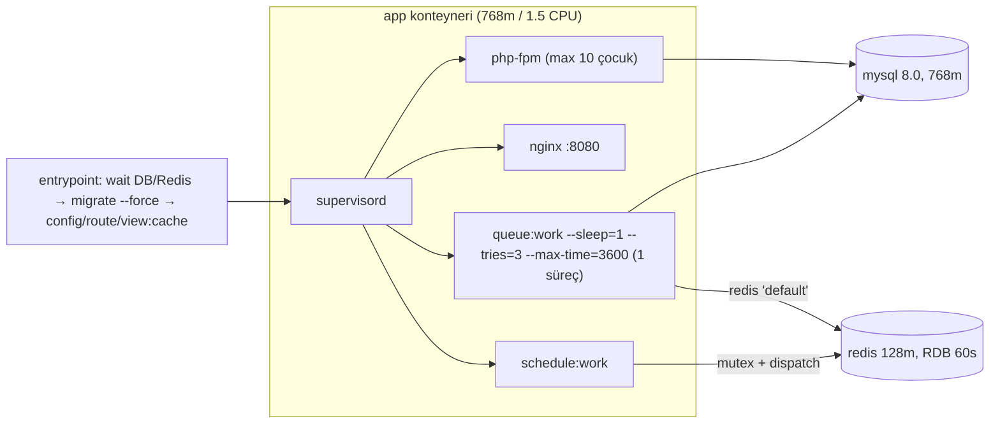

# 11 — Operasyon, altyapı ve gözlemlenebilirlik

**Tarih:** 2026-09-24 · **HEAD:** 8484d37 · **Hazırlayan:** S10 (Operasyon/altyapı/gözlemlenebilirlik denetçisi, Dalga 2)
**Kapsam:** Plane'in kendi çalışma zamanı: `Dockerfile`, `docker-compose.coolify.yml`, `docker/**`, `config/{queue,cache,logging,ops}.php`, `routes/console.php`, `app/Jobs/*` (18), `app/Services/Ops/*`, `docs/runbooks/*`, `docs/modules/deployment.md`. Dalga 1 bulguları (S1–S7) ID ile konsolide edildi, yeniden keşfedilmedi.
**Kapsam dışı:** Canlı Coolify/host (istek atılmadı), CMS kodu, Mailcow ve related-infra, güvenlik sertleştirmesi (S9). Kapasite ve 500 site hesapları → [12-performans-ve-olcek.md](12-performans-ve-olcek.md).

## Özet

- **Plane'in kendi veritabanının yedeği yok** (S10-B13, Kritik). `plane_mysql` tek volume; kaybında Coolify/GitHub/Cloudflare token'ları, her sitenin agent secret'ı ve tüm audit/deploy geçmişi gider. Önceki: Boşluk-B8 yalnız müşteri sitelerini kapsıyordu. Plane DB'si için hiçbir kayıt yok.
- **Tek kuyruk, tek worker, sıfır `failed()`.** 18 iş tipi `default` kuyruğunu tek `queue:work` sürecinde paylaşıyor (S10-B05). Worker timeout'u tüm süreci öldürüyor ve `finally` blokları çalışmıyor (S10-B08). Plane deploy'u koşan işleri 10 sn içinde kesiyor (S10-B01). Sonuç: 11 türde "takılı durum" oluşabiliyor, hiçbiri için watchdog yok (§2.1 tablo).
- **Zamanlayıcı ve worker körlemesine çalışıyor.** Zamanlanmış görev çıktısı `/dev/null`'a gidiyor. Son çalışma zamanı, heartbeat ve `failed_jobs` görünürlüğü yok (S10-B10, S10-B11). `withoutOverlapping` kilidi süreç öldürülürse 24 saat kalıyor (S10-B09). Önceki: D6 Yapılmadı, E1 Yapılmadı, A1 Kısmen.
- **Veri tutma yok.** `audit_logs`, `deployments` ve `ops_background_jobs` sınırsız büyüyor. Activity sayfası bu üç tabloyu her istekte UNION + COUNT ile tarıyor (S10-B12). Önceki A8 Yapılmadı.
- **En değerli öneriler:** tek bir `ops:watchdog` (S10-O02) ile Dalga 1'deki 6 ayrı reconcile önerisini birleştirmek, kuyrukları ayırmak (O01), zarif kapanış (O04), zamanlayıcı gözlemi (O07), günlük DB dökümü ile geri yükleme tatbikatı (O10) ve APP_KEY prosedürü (O17).

## 1. Mevcut durum

### 1.1 Çalışma zamanı topolojisi

Kanıt: `docker/supervisor/supervisord.conf:26-44`, `docker/entrypoint.sh:65-87`, `docker-compose.coolify.yml:30-32,47-49,77,85-87`, `docker/php-fpm/www.conf:6`.

### 1.2 Ana dosyalar

| Dosya | Sorumluluk | Satır | Test |
|-------|------------|-------|------|
| `Dockerfile` | PHP 8.2-fpm + nginx + supervisor imajı, `HEALTHCHECK /up` | 103 | yok |
| `docker-compose.coolify.yml` | app/mysql/redis, limitler (`3874ad2`), env zorlamaları | 93 | `tests/Feature/HealthAndConfigTest.php:32` (compose yolu) |
| `docker/entrypoint.sh` | DB/Redis bekleme, migrate, cache | 87 | yok |
| `docker/supervisor/supervisord.conf` | 4 süreç | 44 | yok |
| `routes/console.php` | 4 schedule | 42 | `tests/Feature/Sites/FleetSnapshotTrendTest.php`, `tests/Feature/Ops/ReconcileDeskronPushTest.php` |
| `app/Jobs/ProcessOpsBackgroundJob.php` | Toplu işler, `ops:coolify-bulk` kilidi | 87 | `tests/Feature/Ops/{OpsBackgroundJob,TruthfulJobCompletion,BulkThrottleResilience}Test.php` |
| `app/Services/Ops/PacedFanout.php` | Seri süpürme, throttle erteleme | 232 | `BulkThrottleResilienceTest` |
| `config/queue.php` / `config/logging.php` | Bağlantı, `retry_after`, log kanalları | 129 / 132 | yok |

### 1.3 Kuyruk: job × timeout × `retry_after` tablosu

Bağlantı `redis` (`docker-compose.coolify.yml:30`). `retry_after` 90 sn (`config/queue.php:71`). Kuyruk adı her iş için `default`: `grep -rn onQueue app` boş. Worker `--timeout` vermiyor, varsayılan 60 sn (`vendor/laravel/framework/src/Illuminate/Queue/Console/WorkCommand.php:49`). İşteki `$timeout` bu değeri ezer (`Worker.php:298`).

| Job | timeout (sn) | tries | backoff | Tekillik | timeout ≥ `retry_after` | Risk notu |
|-----|:-----------:|:-----:|---------|----------|:-----------------------:|-----------|
| CheckSiteHealthJob `:17` | 30 | 1 | — | Unique 240 | hayır | İç bütçe > 30 (S4-B10) |
| ConfigureSiteMailJob `:24` | 60 | 1 | — | UntilProcessing 120 | hayır | reconcile yok (S7-B14) |
| DiagnoseDeploymentJob `:23` | 90 | 1 | — | Unique 120 | **eşit** | öldürülürse düzeltme yarım (S3-B11e) |
| DispatchDeskronPushJob `:16` | 60 | 1 | — | — | hayır | — |
| DispatchPlatformMailPushJob `:16` | 60 | 1 | — | — | hayır | — |
| DispatchSiteHealthChecksJob `:15` | 60 | 1 | — | — | hayır | 2N job basar |
| InspectSiteAppHealthJob `:17` | 45 | 1 | — | Unique 240 | hayır | Coolify 30 sn × 3 deneme > 45 |
| PollDeploymentJob `:29` | 30 | 1 | kendini yeniden kuyruğa atar `:133-134,159-165` | — | hayır | Zincir kopunca satır açık kalır (S3-B06) |
| ProcessOpsBackgroundJob `:18` | **300** | 1 | 20 sn requeue `:59-60` | Cache lock 900 | **evet** | S10-B08 |
| ProvisionSiteJob `:19` | 120 | 1 | — | Unique 3600 | **evet** | takılı `provisioning` (S2-B07) |
| PushDeskronJob `:19` | 30 | 4 | dizi `:33` | UntilProcessing 120 | hayır | tek retry'lı iş |
| PushPlatformMailJob `:19` | 30 | 1 | — | UntilProcessing 120 | hayır | — |
| ReconcileDeskronPushJob `:39` | **900** | 1 | — | — | **evet** | kuyruğu 15 dk tıkar (S7-B08) |
| SwitchSiteChannelJob `:19` | 120 | 1 | — | Unique 3600 | **evet** | takılı `deploying` |
| SyncCoolifyEnvCatalogJob `:18` | (worker 60) | 3 | — | — | hayır | timeout tanımsız |
| ThemeInstallJob `:18` | 120 | 1 | — | Unique 300 | **evet** | smoke 330 sn'ye çıkabilir (S5-B10) |
| ThemeSyncAfterDeployJob `:21` | 120 | 1 | — | Unique 120 | **evet** | — |
| ThemeUpdateJob `:18` | 120 | 1 | — | Unique 300 | **evet** | S5-B10 |

8 iş `retry_after` değerine eşit ya da ondan uzun. Tek worker olduğu sürece ikinci bir çalışma oluşmuyor (S7-B08 ayrıntısı). Ancak süreç öldürüldüğünde (timeout, deploy, OOM) rezervasyon 90 sn sonra geri geliyor, `attempts=2 > tries=1` oluyor, iş **hiç yeniden koşmadan** `failed_jobs`'a düşüyor ve alan durumu takılı kalıyor. **Doğrulanmadı:** canlıda `REDIS_QUEUE_RETRY_AFTER` override'ı var mı. Coolify env listesine bakılmalı; değer bu dokümana yazılmaz.

### 1.4 Zamanlayıcı

| Ad | Tür | Sıklık | withoutOverlapping (varsayılan 1440 dk) | onOneServer | Çıktı | Başarısızlık görünür mü |
|----|-----|--------|:---:|:---:|-------|------|
| `ops-site-agent-health` `routes/console.php:16-19` | job | */5–15 dk | evet | hayır | — | hayır |
| `ops-sync-env-catalog` `:23-26` | komut | saatlik | evet | hayır | `/dev/null` | yalnız stderr log |
| `ops-deskron-push-reconcile` `:31-34` | job | saatlik | evet | hayır | — | hayır |
| `ops-snapshot-fleet` `:38-42` | komut | 23:50 | evet | hayır | `/dev/null` | hayır |

Çalıştırıcı: `schedule:work` (`supervisord.conf:37`), aynı konteynerde. Varsayılan çıktı `Event.php:41` (`$output = '/dev/null'`). `withoutOverlapping` varsayılanı `ManagesAttributes.php:145` (`$expiresAt = 1440`).

### 1.5 Loglama ve sağlık

- Kanal `stderr` (`docker-compose.coolify.yml:20`). Seviye env'den geliyor, varsayılanı `debug` (`config/logging.php:99`). `.env.production.example` içinde yalnız `APP_KEY/APP_TIMEZONE/DB_TIMEZONE/TZ` var. `LOG_LEVEL` ve `LOG_STDERR_FORMATTER` yok (`config/logging.php:104`).
- `app/` altında 29 `Log::warning`, 7 `Log::info`, **0** `Log::error`, 2 `report()` var (`grep -rn "Log::\|report(" app`). `bootstrap/app.php:55-57` exception handler'ı boş.
- Sağlık: yalnız `/up` (`bootstrap/app.php:19`). Docker `HEALTHCHECK` (`Dockerfile:100-101`) yalnız framework'ün açılıp açılmadığını ölçüyor. `DiagnosingHealth` dinleyicisi yok (`grep -rn DiagnosingHealth app bootstrap` boş).

### 1.6 Test kapsamı

| Testli | Testsiz |
|--------|---------|
| Bulk throttle erteleme, işin gerçek sonucu (`TruthfulJobCompletionTest`), Deskron reconcile, snapshot trendi, `/up` 200 | Worker timeout/kill sonrası durum, `failed()` yolu (yok), takılı satır kurtarma, zamanlayıcı kilidinin kalması, entrypoint/migrate hatası, `retry_after` ≥ timeout değişmezi |

## 2. Bulgular

| ID | Tür | Önem | Bulgu | Kanıt | Etki |
|----|-----|------|-------|-------|------|
| S10-B01 | Risk | Yüksek | Plane deploy'u ve konteyner restart'ı koşan işleri keser. supervisord `stopwaitsecs` vermiyor (varsayılan 10 sn), compose'da `stop_grace_period` yok. Worker SIGTERM alınca işi bitirmeye çalışıyor ama 10 sn sonra SIGKILL geliyor. 120–900 sn'lik işler (Provision/Switch/Theme/ProcessOps/Reconcile) `catch`'e ulaşmıyor. | `docker/supervisor/supervisord.conf:26-34` (stop ayarı yok); `docker-compose.coolify.yml:2-50`; `Worker.php:814` (SIGTERM → `shouldQuit`). **Doğrulanmadı:** Coolify compose deploy'unun stop süresi. Doğrulama: Coolify deploy logunda "Stopping/Recreating" zaman damgaları | Her Plane deploy'u takılı `provisioning`/`deploying`/`running`/`installing` üretebilir (§2.1) |
| S10-B02 | Risk | Orta | Sıfır kesinti yok. Migration konteyner açılışında `set -e` ile koşuyor. Migrate hatası konteyneri `restart: unless-stopped` döngüsüne sokuyor. Deploy öncesi döküm, geri dönüş ve runbook yok. | `docker/entrypoint.sh:2,72,81-84`; `docker-compose.coolify.yml:50`; `docs/runbooks/deploy-plane.md:1-53` (geri alma bölümü yok). **Doğrulanmadı:** Coolify'ın compose uygulamasında eski/yeni konteyner örtüşmesi (S7-B08 sorusu). Doğrulama: deploy sırasında `docker ps` oluşturulma zamanları | Hatalı migration panel kesintisi ve yarım şema demek. Kesinti = stop + bekleme + migrate + cache |
| S10-B03 | Eksik | Orta | `/up` sığ. DB, Redis, worker ve scheduler durumunu ölçmüyor. Worker ölüyken konteyner "healthy" görünüyor. Önceki: **D6 Yapılmadı**. | `bootstrap/app.php:19`; `Dockerfile:100-101` | Dış izleme olsa bile asıl arızayı görmez |
| S10-B04 | Risk | Orta | Bellek bütçesi tutarsız: FPM 10 çocuk × `memory_limit` 256M, worker (`--memory` 128 varsayılanı) ve scheduler aynı 768m limitte. Tavan aşılırsa OOM tüm süreçleri (worker dahil) birlikte öldürür. | `docker/php/conf.d/plane.ini:5`; `docker/php-fpm/www.conf:6`; `docker-compose.coolify.yml:47`; `WorkCommand.php:46`. **Doğrulanmadı:** gerçek RSS. Doğrulama: `docker stats`, host `dmesg \| grep -i oom` (Emin) | S10-B01 ile aynı takılı durum zinciri, ayrıca panel kesintisi |
| S10-B05 | Perf/Risk | Yüksek | Tek kuyruk (`default`) ve tek worker 18 iş tipini taşıyor. 900 sn'lik reconcile, 300 sn'lik toplu iş ve 120 sn'lik tema işleri health/poll/webhook kaynaklı kısa işleri bekletiyor. S4-B11 ve S7-B08'i konsolide eder. | `supervisord.conf:27` (`numprocs` ve `--queue` yok); `grep -rn onQueue app` boş; `ReconcileDeskronPushJob.php:39`; `ProcessOpsBackgroundJob.php:18` | `site_down` maili 15 dk'ya kadar gecikiyor, deploy poll'u kayıyor, 500 sitede health turu pencereye sığmıyor ([12 §2](12-performans-ve-olcek.md)) |
| S10-B06 | Borç | Orta | Worker bayrakları bilinçsiz. `--timeout` yok (60), `--memory` yok (128), `--tries=3` her işte ezilmiş (tüm işler `$tries` tanımlıyor), `--max-time=3600` süreci saatte bir yeniliyor (S7-B03 eski SMTP'nin kaynağı). `SyncCoolifyEnvCatalogJob` timeout tanımlamıyor. | `supervisord.conf:27`; `WorkCommand.php:46,49`; `app/Jobs/SyncCoolifyEnvCatalogJob.php:18` | Yapılandırma okunduğu gibi çalışmıyor; ayar değişikliği 1 saate kadar etkisiz |
| S10-B07 | Risk | Orta | 8 işin timeout'u `retry_after`'a (90) eşit ya da daha uzun (§1.3). Süreç ölümünde rezervasyon geri geliyor ve iş koşmadan `failed_jobs`'a yazılıyor. İkinci worker eklenirse aynı iş iki kez koşar. | `config/queue.php:71`; §1.3 tablosu; S7-B08 ayrıntısı | Ölçekleme (numprocs>1) bugünkü haliyle güvenli değil |
| S10-B08 | Hata | Yüksek | Worker timeout'u işi `failed` işaretleyip **tüm worker sürecini öldürüyor**. `ProcessOpsBackgroundJob`'daki `finally { $lock->release() }` çalışmıyor. `ops:coolify-bulk` kilidi 900 sn kalıyor, sonraki bütün Coolify toplu işleri 20 sn'de bir requeue dönüyor. `OpsBackgroundJob` `running` kalıyor. Widget aktif satırları yaş sınırı olmadan gösteriyor, yani S1-B09'daki "2 saat sonra gizliyor" aktif satırlar için geçerli değil. **S1-B09'un Doğrulanmadı sorusunun cevabı: evet, 300 sn aşılıyor.** Throttle altında her erteleme 30 sn'ye kadar uyuyor; 10 erteleme bütçeyi bitiriyor. Throttle olmasa da yaklaşık 230 siteden sonra aşılıyor ([12](12-performans-ve-olcek.md)). | `Worker.php:254,271`; `ProcessOpsBackgroundJob.php:55,65-69,83-85`; `PacedFanout.php:201-213`; `config/ops.php:183,193-195`; `OpsJobController.php:182` | Ölü iş "çalışıyor" görünüyor ve toplu Coolify işlemleri 15 dk kilitleniyor |
| S10-B09 | Risk | Orta | Zamanlayıcı kilidi 24 saat kalabiliyor. `withoutOverlapping()` varsayılan 1440 dk. Komut koşarken konteyner öldürülürse Redis'teki mutex (RDB ile kalıcı) kalıyor ve görev 24 saat sessizce atlanıyor. Hiçbir girişte `onOneServer` yok (S0). | `routes/console.php:19,26,34,42`; `ManagesAttributes.php:145`; `docker-compose.coolify.yml:77` | Env kataloğu ya da günlük snapshot bir gün atlanır; kimse fark etmez |
| S10-B10 | Eksik | Yüksek | Zamanlanmış görevler ve worker için gözlem yok. Komut çıktısı `/dev/null`'a gidiyor, `onFailure`/`onSuccess`/ping yok, son çalışma zamanı tutulmuyor, heartbeat yok. Worker ya da scheduler durunca 30 dk sonra secret'ı olan tüm siteler "stale → unhealthy" görünüyor ama banner ya da alarm çıkmıyor (S4-B22). Önceki: **D6 Yapılmadı, A1 Kısmen**. | `Event.php:41`; `grep -rn "onFailure\|thenPing\|pingOnSuccess" routes app` boş; `routes/console.php:16-42` | Sessiz yanlış durum: filo "sağlıksız" görünür, asıl arıza Plane'dir |
| S10-B11 | Eksik | Yüksek | `failed_jobs` görünmüyor, budanmıyor ve alarm üretmiyor. 18 işin hiçbirinde `failed()` yok. Takılı durumlar için tek bir watchdog yok; §2.1'deki 11 türün yalnız biri (Deskron push) zamanlanmış onarıma sahip. Önceki: **E1 Yapılmadı**. S1-B09, S2-B07, S3-B06, S3-B07, S3-B22, S5-B08, S5-B09, S7-B06 ve S7-B14'ü konsolide eder. | `config/queue.php:123-127`; `grep -rn "function failed" app/Jobs` boş; `grep -rn "queue:prune\|prune-failed" routes app` boş | Başarısızlık yalnız satır yaşına bakan operatörün dikkatine kalıyor |
| S10-B12 | Borç/Perf | Orta | Veri tutma yok (**A8 Yapılmadı**). Activity her sayfada 3 büyüyen tabloyu `UNION ALL` + türetilmiş tablo sıralaması + `COUNT` ile tarıyor; `audit_logs(created_at)` indeksi yok. `deployments` satırı en çok 16 KB log + 8 KB teşhis logu taşıyor. | `app/Support/Ops/ActivityFeed.php:37-43,52-56,112-127`; `database/migrations/2026_08_13_071303_create_audit_logs_table.php:22-23`; `config/ops.php:207,232`; `grep -rn Prunable app` boş | Activity doğrusal yavaşlar, DB ve yedek boyutu sınırsız büyür (§2.2) |
| S10-B13 | Eksik | **Kritik** | Plane MySQL'inin yedeği yok: compose, doküman ya da kodda döküm/yedek yok. Kayıp; filo kaydını, şifreli Coolify/GitHub/Cloudflare kimliklerini, site başına agent secret'ları ve tüm audit'i götürür. | `docker-compose.coolify.yml:61-62,90-93`; `grep -rni "backup\|mysqldump" docs/runbooks docs/modules/deployment.md docker-compose.coolify.yml` → yalnız müşteri tarafı notları; `docs/runbooks/deploy-plane.md:18` (yalnız "DELETE etme"). **Doğrulanmadı:** host düzeyinde VPS snapshot'ı var mı (Emin'e sorulmalı) | Geri dönüşsüz veri kaybı; RTO günler (§2.3) |
| S10-B14 | Risk | Yüksek | APP_KEY tek hata noktası. Yalnız Coolify env'inde duruyor. Kayıp ya da yanlış rotasyon tüm şifreli kolonları okunamaz yapıyor. `APP_PREVIOUS_KEYS` destekleniyor ama runbook bunu "break-glass rebuild" diye geçiyor, prosedür vermiyor. | `config/app.php:105-107`; `docs/runbooks/token-rotation.md:34-36`; `docs/modules/deployment.md:25` | Tüm agent imzaları ve Coolify çağrıları durur; 500 sitede yeniden inject günler alır |
| S10-B15 | Risk | Orta | Redis kuyruk + cache + kilitleri tek örnekte tutuyor. `--save 60 1` ile RDB var, AOF yok. `maxmemory` ve politika yok, konteyner limiti 128m. Çökmede son 60 sn'nin kuyruğu (poll zincirleri, gecikmeli tema update'leri, requeue'lar) sessizce kayboluyor. OOM'da hepsi gidiyor. | `docker-compose.coolify.yml:77,85`; `PollDeploymentJob.php:133-134`; `ProcessOpsBackgroundJob.php:59-60` | Kopan poll zinciri = kalıcı açık deploy satırı (S3-B06) |
| S10-B16 | Eksik | Orta | Log ve hata izleme zayıf. Üretimde seviye `debug`, düz metin, istek/iş/site bağlamı yok (`Context` kullanılmıyor). 11 sessiz `catch` var (S1-B08). Hata izleme aracı yok. Rotasyon Docker log sürücüsüne kalmış. | `config/logging.php:99,104`; `grep -rn "Context::add\|withContext\|shareContext" app` boş; `bootstrap/app.php:55-57`. **Doğrulanmadı:** Docker `json-file` `max-size` ayarı (host) | Olay sonrası inceleme stderr'de aranıyor; tekrar eden hata sayılamıyor |
| S10-B17 | Eksik | Orta | Runbook boşlukları: takılı kuyruk/worker, Plane DB geri yükleme, APP_KEY kaybı/rotasyonu, Coolify token iptali (S3-B14 sahte hata dalgası), GitHub App key rotasyonu (yalnız "operatör değiştirmeli", UI yok), toplu yanlış env prune kurtarma (S3-B01), Redis kaybı, Plane deploy geri alma, SMTP kesintisi. | `docs/runbooks/README.md:5-14` (9 runbook); `docs/runbooks/token-rotation.md:20,34-36`; `grep -rn "failed_jobs\|queue:restart\|queue:retry" docs/runbooks` boş | Olay anında tek kişinin bilgisine bağımlılık |
| S10-B18 | Güvenlik | Düşük | Compose dosyasında DB kullanıcı ve root parolaları sabit literal olarak duruyor (değer yazılmadı: `<gizli>`). Servis ağ dışına açık değil. | `docker-compose.coolify.yml:26,59-60,64` | Repo'yu okuyan herkes DB kimliğini bilir; S9'a devredilir |
| S10-B19 | Eksik | Orta | Kurtarma araçları yalnız konsolda (`ops:heal-throttled-deploys`, `ops:import-coolify-apps`, GitHub PEM değişimi). Panelde tetik yok; sunucu erişimi dar. | `docs/runbooks/coolify-rate-limit.md:40-51`; `docs/runbooks/token-rotation.md:20`; `routes/console.php` (heal zamanlanmamış) | Olay çözümü SSH'ı olan kişiyi bekler |
| S10-B20 | Risk | Orta | Job timeout'ları içlerindeki HTTP bütçesinden kısa: Inspect 45 < Coolify 30 sn × 3 deneme, Poll 30 < aynı (S3-B06), Check 30 < agent 10×2+5 + SMTP (S4-B10), Theme 120 < smoke 330 (S5-B10). Her aşım worker sürecini öldürüyor (S10-B08 mekanizması) ve bir `failed_jobs` satırı yazıyor. | `config/ops.php:111,120-122,156,186-188`; `InspectSiteAppHealthJob.php:17`; `Worker.php:271` | Coolify yavaşladığında her health turu worker'ı defalarca yeniden başlatır |

### 2.1 Takılı durum türleri (konsolide) ve önerilen watchdog eylemi

Yaş eşikleri önerilir; satırlar varsayılan MySQL sözdizimiyle yazıldı.

| # | Durum | Tespit sorgusu | Bugünkü kurtarma | Dalga 1 | Watchdog eylemi (S10-O02) |
|---|-------|----------------|------------------|---------|---------------------------|
| 1 | `ops_background_jobs.status='running'` ölü | `status='running' AND updated_at < NOW()-INTERVAL 10 MINUTE` | Yok; widget sonsuza dek gösteriyor (`OpsJobController.php:182`) | S1-B09 | `failed` + mesaj `worker_lost`; başka koşan Coolify tipi yoksa `ops:coolify-bulk` kilidini bırak |
| 2 | `ops_background_jobs.status='queued'` kayıp | `status='queued' AND created_at < NOW()-INTERVAL 30 MINUTE` | Yok | — | Bir kez yeniden dispatch; ikinci turda `failed` |
| 3 | Site `provisioning`/`deploying`, açık deploy yok | `status IN ('provisioning','deploying') AND updated_at < NOW()-INTERVAL 30 MINUTE AND NOT EXISTS (SELECT 1 FROM deployments d WHERE d.site_id=sites.id AND d.finished_at IS NULL)` | Yalnız `error→active` (`CoolifyDeploymentSync.php:226-242`) | S2-B06, S2-B07, S3-B22 | Coolify'dan son deploy'u oku ve uygula; okunamazsa `error` + audit |
| 4 | Deploy satırı açık | `finished_at IS NULL AND status IN ('queued','in_progress') AND COALESCE(started_at,created_at) < NOW()-INTERVAL 45 MINUTE` | Yalnız widget açıkken ve son 2 saatteyse (`OpsJobController.php:28,230-252`); elle `ops:heal-throttled-deploys` | S3-B06, S3-B13 | Tek seferlik `PollDeploymentJob` (Coolify okuma) |
| 5 | `failed` ama `finished_at IS NULL` | `status='failed' AND finished_at IS NULL` | Yok; kapıyı kilitliyor (`CoolifyDeployGate.php:95-97`) | S3-B07 | `finished_at = updated_at` (yerel; uzak çağrı yok) |
| 6 | Tema `installing`/`updating` | `status IN ('installing','updating') AND updated_at < NOW()-INTERVAL 15 MINUTE` | Yok | S5-B08, S5-B09 | `error` + `theme.install_stale` audit (agent'a dokunma) |
| 7 | Mail configure hiç sonuçlanmadı | `mail_server_id IS NOT NULL AND agent_secret_encrypted IS NOT NULL AND mail_configured_at IS NULL AND mail_configure_failed_at IS NULL` (`Site.php:329-347` → `not_pushed`) | Yok | S7-B14 | `ConfigureSiteMailJob` (idempotent) |
| 8 | Platform mail hiç push edilmedi | `agent_secret_encrypted IS NOT NULL AND platform_mail_pushed_at IS NULL` (platform mail açıkken) | Yok (Deskron'da saatlik var `routes/console.php:31-34`) | S7-B06 | `PushPlatformMailJob` (S7-O06 ile aynı) |
| 9 | Bırakılmış kilitler | Redis: `ops:coolify-bulk`, `laravel_unique_job:*Provision*/*Switch*` (3600 sn), `framework/schedule-*` (24 sa) | Süre dolmasını bekle | S10-B08, S10-B09 | Eşleşen koşan satır yoksa bırak + audit |
| 10 | `failed_jobs` birikimi | `SELECT COUNT(*) FROM failed_jobs WHERE failed_at > NOW()-INTERVAL 1 DAY` | Görünmüyor | E1 | Sayaç + /ops/system rozeti; allowlist'teki idempotent işler için tek retry |
| 11 | Plane poller'ı durdu | `SELECT MAX(last_health_at) FROM sites` < `NOW() - 2×poll` | Yok | S4-B22 | Banner + alarm; stale kaynaklı unhealthy sayımını ayrı tut |

Birleştirilen Dalga 1 önerileri: S1-O07 (`failed()`), S2-O07 (site durum reconcile), S3-O06 (deploy reconcile), S4-O16 (heartbeat), S5-O08 (tema durum makinesi), S7-O06 (platform mail reconcile). Tek komut, tek kill switch ve tek audit öneki (`system.watchdog.*`) önerilir.

### 2.2 Büyüyen tablolar

Kod okumasıyla tahmin, **Doğrulanmadı**. Doğrulama: `SELECT DATE(created_at) d, COUNT(*) FROM <tablo> GROUP BY d ORDER BY d DESC LIMIT 14` ve `information_schema.TABLES.DATA_LENGTH`.

| Tablo | Kaynak | Satır / site / gün (tahmin) | Satır başı | 500 site/yıl | Budama |
|-------|--------|:--------------------------:|------------|:------------:|--------|
| `audit_logs` | 83 action; identity heal, core theme restart, deploy/tema/mail işlemleri | 1–5 | JSON before/after | 180 K – 900 K | yok |
| `deployments` | Plane deploy'ları + webhook'un açtığı auto-deploy satırları (`CoolifyWebhookHandler.php:156`) | 0.3–3 | hata satırında ≤16 KB log + ≤8 KB teşhis | 55 K – 550 K | yok |
| `ops_background_jobs` | Toplu işler (N'den bağımsız 10–50/gün) | — | `result` site listesi (500 site ≈ 75 KB) | 4 K – 18 K | yok |
| `failed_jobs` | Timeout ve istisnalar | olay başına | payload + trace (5–20 KB) | ? | yok |
| `fleet_daily_snapshots` | 1/gün | — | küçük | 365 | gerekmez |
| `sessions` | DB sürücüsü | — | — | — | Laravel lotarisi |

### 2.3 Felaket senaryoları

RTO değerleri kod okumasıyla yapılmış tahmindir; canlıda ölçülmedi.

| Senaryo | Etki | Bugünkü tespit | Kurtarma yolu | RTO (tahmin) | Öneri |
|---------|------|----------------|---------------|:------------:|-------|
| Plane `app` çöker | Panel, health, webhook alımı, CMS→Plane mail proxy durur; müşteri siteleri çalışır | Docker HEALTHCHECK → restart; dış alarm yok | `restart: unless-stopped`; kaçan GitHub push'ları elle "Redeliver" + katalog sync (S5-B18) | dakikalar | O08 dış uptime + catch-up reconcile |
| Plane DB (volume) kaybolur | Filo kaydı, tüm şifreli kimlikler, agent secret'lar, geçmiş gider | Yok | Yedek yok → `ops:import-coolify-apps`, bağlantıları yeniden kur, secret'ları Coolify env'den geri al (**Doğrulanmadı:** token'ın env değeri okuma yetkisi) ya da yeniden inject + her siteye redeploy | 1–3 gün, geçmiş kalıcı kayıp | O10 |
| Redis kaybolur | Kuyruk, gecikmeli işler, kilitler, cache gider; oturumlar DB'de kalır | Yok | Konteyner restart; takılı satırlar elle | dakika + manuel onarım | O13 + O02 |
| Coolify erişilemez | Deploy/provision/inspect başarısız; her site `coolify_unreachable`; poll satırları 8 geçici denemeden sonra `failed` | Site başına app-health sorunu; bağlantı düzeyinde durum yok (S3-B20) | Beklemek + `ops:heal-throttled-deploys` | Coolify'a bağlı | Bağlantı sağlık durumu + duraklatma (S3-B20) + O02 |
| GitHub App askıya alınır / key iptal | Tema install/update/katalog durur; `installation` olayı işlenmediği için bağlantı "bağlı" görünür (S5-B11) | İlk işlem hatası | Yeni key → `github_settings.private_key` elle (UI yok, `token-rotation.md:20`) | saatler | Günlük App probe + key değişim UI |
| Cloudflare token iptal | Domain ekleme/alias/purge DNS'i istek içinde hata verir | Yalnız operatör işleminde | Settings'te token yenile | dakika–saat | Günlük `verifyToken` probe (`CloudflareClient.php:24`) |
| APP_KEY kaybolur | Tüm `*_encrypted` kolonlar okunamaz | `DecryptException` logu | Anahtar yedeği yoksa: tüm token'ları yeniden gir, 500 siteye secret rotate + redeploy | 1–2 gün | O17 |
| Worker ölür / crash-loop | Hiçbir iş koşmaz; 30 dk sonra filo "unhealthy" | Yok (`/up` 200) | supervisord restart | saniye (geçici) / sessiz (kalıcı) | O08 heartbeat |
| Scheduler ölür | Health turu, saatlik katalog ve reconcile koşmaz | Yok | supervisord restart | aynı | O07 |
| Platform SMTP kesilir | Plane alarmları düşer, hata yutulur (S7-B04) | Yok | — | — | S7-O16/S7-O17 ayrı kanal |
| Plane deploy'unda migration hatası | Konteyner restart döngüsü, şema yarım kalabilir | Coolify deploy logu | Coolify'da önceki imaja dön + elle DB | 30–60 dk | O16 |

### 2.4 Runbook boşlukları (S10-B17 ayrıntısı)

| Eksik runbook | Tetikleyici olay | İlk 3 adım (öneri) | İlgili bulgu |
|---------------|------------------|--------------------|--------------|
| Takılı kuyruk / worker | Widget'ta saatlerdir `running` duran iş, health bayatlığı | Kuyruk derinliği ve en eski iş yaşı (O08) → `failed_jobs` son 1 saat → watchdog'u elle koştur (O02) | S10-B05, B08, B11 |
| Plane DB geri yükleme | Volume kaybı, bozuk migration | Uygulamayı durdur → son dökümü geri yükle → `migrate:status` + satır sayısı karşılaştırması | S10-B13 |
| APP_KEY kaybı / rotasyonu | `DecryptException` dalgası, planlı rotasyon | Kasadaki kopyayı geri koy; yoksa O17'deki yeniden kurulum sırası | S10-B14 |
| Coolify token iptali | Poll'ların 401/403 ile toplu `failed` yazması (S3-B14) | Toplu işleri durdur → token'ı yenile → `ops:heal-throttled-deploys --dry-run` | S3-B14, S3-B20 |
| GitHub App key rotasyonu | Key sızıntısı / periyodik | Yeni PEM → `github_settings.private_key` (bugün konsol) → katalog sync + tek tema update testi | `token-rotation.md:20` |
| Yanlış env prune kurtarma | CMS `.env.production.example`'dan satır düşmesi (S3-B01) | Toplu deploy'u durdur → CMS dosyasını düzelt → etkilenen sitelerde `sync_env` + redeploy | S3-B01 |
| Redis kaybı | Konteyner yeniden oluşturuldu, AOF yok | Watchdog'u koştur (§2.1 #2, #4, #9) → gecikmeli tema update'lerini yeniden tetikle | S10-B15 |
| Plane deploy geri alma | Migrate hatası / restart döngüsü | Coolify'da önceki imaja dön → migration durumunu kontrol et → gerekirse döküm | S10-B02 |
| Platform SMTP kesintisi | Alarm maillerinin gitmemesi | Test maili → ayar kontrolü → worker restart (S7-B03 eski transport) | S7-B03, S7-B18 |

### 2.5 Önceki inceleme maddelerinin durumu (bu alan)

Kaynak: [15-onceki-inceleme-durum-takibi.md](15-onceki-inceleme-durum-takibi.md).

| Önceki ID | Durum (15) | Bu rapordaki güncelleme |
|-----------|------------|--------------------------|
| D6 — Plane kendi sağlığı | Yapılmadı | Hâlâ yalnız `/up`; S10-B03, S10-B10 → O07, O08 |
| E1 — Kuyruk görünürlüğü / failed_jobs UI | Yapılmadı | 18 işte `failed()` yok, prune yok; S10-B11 → O03 |
| A1 — Gece bakım zamanlayıcısı | Kısmen | 4 giriş; `onOneServer` yok, mutex 24 sa riski; S10-B09 → O07 |
| A8 / Boşluk-B4 — Veri tutma | Yapılmadı | Büyüme tablosu §2.2, Activity maliyeti; S10-B12 → O09 |
| Boşluk-B8 / F3 — Yedek | Yapılmadı | Müşteri tarafına ek olarak **Plane DB'nin kendisi** yedeksiz; S10-B13 → O10 (Plane), CMS handoff (müşteri) |
| 1.3-e — Plane'in kendi canlı deploy'u | Doğrulanmadı | Deploy hattı (entrypoint/migrate/stop) incelendi; S10-B01, B02. Canlı durum yine Doğrulanmadı |
| Boşluk-B11 / F4 — CMS kuyruk/cron sağlığı | Kısmen | Plane'in kendi kuyruk/cron sağlığı da yok; CMS handoff §6 |

## 3. İyileştirme ve güncelleme önerileri

Öncelik = Etki×2 − Risk + (S=3, M=2, L=1, XL=0). Puana göre sıralı.

| ID | Öneri | Çözdüğü bulgu | Etki | Efor | Risk | Puan | Kabul kriteri |
|----|-------|---------------|:---:|:---:|:---:|:---:|---------------|
| S10-O01 | Kuyrukları ayır: `critical` (poll, provision, kanal, webhook kaynaklı), `default`, `health` (Check/Inspect), `long` (ProcessOps, Reconcile, Theme*). supervisord'da 3 program: `--queue=critical,default`, `--queue=health` (numprocs 2), `--queue=long` (kendi `retry_after`'ı olan ayrı redis bağlantısıyla) | B05, B07 | 5 | M | 2 | **10** | `Queue::assertPushedOn` her iş tipi için; reconcile koşarken bir `PollDeploymentJob` ≤ 60 sn içinde işleniyor (sahte saatli test) |
| S10-O02 | Tek `ops:watchdog` (5 dk, `onOneServer`, `withoutOverlapping(10)`): §2.1'deki 11 tür; tur başına en çok 25 onarım; `ops.watchdog.enabled` kill switch; `system.watchdog.*` audit; günlük özet | B11, B08, B09 | 5 | M | 2 | **10** | Her tür için feature test: yaşlı satır + sahte Coolify → beklenen terminal durum + audit; eşik altı satıra dokunulmuyor; kill switch kapalıyken 0 yazma |
| S10-O04 | Zarif kapanış: worker programına `stopwaitsecs=330` + `stopsignal=TERM`, compose'a `stop_grace_period: 330s`; 900 sn'lik reconcile O06 ile ≤ 240 sn'ye inmeli | B01 | 4 | S | 1 | **10** | Yerel `docker compose stop` sırasında koşan 120 sn'lik sahte iş tamamlanıyor ve `failed_jobs` boş kalıyor. **Doğrulanmadı:** Coolify'ın `stop_grace_period`'a uyması (deploy logundan teyit) |
| S10-O07 | Zamanlayıcı gözlemi: `ScheduledTaskStarting/Finished/Failed` dinleyicisi → `ops_schedule_runs` (ad, başlangıç, süre, sonuç, çıktı kuyruğu 2 KB); `withoutOverlapping(expiresAt)` görev başına (saatlik 55, günlük 60 dk); tüm girişlere `onOneServer` | B09, B10 | 4 | S | 1 | **10** | `/ops/system` her görev için son çalışmayı gösteriyor; öldürülen görev en geç `expiresAt` dolunca yeniden koşuyor (test: mutex elle bırakılmadan) |
| S10-O10 | Plane DB yedeği: günlük `ops:backup-db` (`mysqldump --single-transaction`, gzip, 14 gün) → ayrı `plane_backups` volume; haftalık doğrulama (geçici şemaya geri yükle + satır sayısı karşılaştır); geri yükleme runbook'u. Host dışı kopya hedefi (S3 uyumlu depo vb.) **kapsam dışı: bilinçli karar gerekir** | B13 | 5 | M | 2 | **10** | Son başarılı yedek < 26 saat (/ops/system); doğrulama işi satır sayısı eşitliğini raporluyor; runbook ile boş ortamda geri yükleme ≤ 30 dk |
| S10-O17 | APP_KEY prosedürü: anahtarın kasada ikinci kopyası; `APP_PREVIOUS_KEYS` ile adım adım rotasyon (yeni anahtar → deploy → `ops:reencrypt` → eski anahtarı çıkar); kayıp senaryosu için runbook | B14 | 4 | S | 1 | **10** | `ops:reencrypt --dry-run` şifreli kolon sayısını raporluyor; test: eski anahtarla yazılmış kolon yeni anahtar + previous ile okunuyor ve yeniden şifreleniyor |
| S10-O03 | Durum sahibi 18 işe `failed(Throwable)` (S1-O07 genişletilmiş: alan satırını terminal yap + `report()`); Activity'de "Başarısız kuyruk işleri" sekmesi (super admin, retry/forget); `queue:prune-failed --hours=720` günlük | B11, B20 | 4 | M | 1 | **9** | Her işte timeout simülasyonu → alan satırı `failed/error` oluyor; sekme `failed_jobs` sayısını gösteriyor; 30 günden eski satır kalmıyor |
| S10-O08 | `/ops/system` (super admin): kuyruk derinliği (`LLEN`, delayed/reserved `ZCARD`), en eski iş yaşı, worker heartbeat (`Looping` olayı → 30 sn'de bir cache), scheduler heartbeat, `failed_jobs` sayısı, son health turu süresi, Redis bellek, DB boyutu, son yedek. Token korumalı `/ops/health.json` dış uptime izleyicisi için | B03, B10 | 4 | M | 1 | **9** | Worker durdurulunca 2 dk içinde banner ve JSON `worker: stale`; `/up` Docker için sığ kalıyor (yanlış restart döngüsü olmasın) |
| S10-O09 | Veri tutma: `Prunable` → `AuditLog` 400 gün, `Deployment` site başına son 50 + 180 gün (log/teşhis kolonları 30 günde null), `OpsBackgroundJob` 90 gün; `model:prune` günlük; `audit_logs(created_at)` ve `(action, created_at)` indeksleri; Activity varsayılan penceresi 30 gün | B12 | 4 | S | 2 | **9** | 10 K satırlık fixture'da prune sonrası kalan sayı politika ile eşleşiyor; Activity sayfası `EXPLAIN`'de filesort'suz |
| S10-O05 | Değişmez: her iş için `$timeout < retry_after(bağlantı) − 10` (unit test tüm `app/Jobs`'u tarar); `long` bağlantısında `retry_after` 960; `SyncCoolifyEnvCatalogJob`'a açık timeout | B06, B07 | 3 | S | 1 | **8** | Test yeni eklenen uzun iş bu kuralı çiğnerse kırmızı |
| S10-O06 | Toplu süpürmelere süre bütçesi: tur başına ≤ 240 sn, kalanı `payload.cursor` ile aynı `OpsBackgroundJob`'a yeniden dispatch; kilit `failed()` içinde de bırakılır; ReconcileDeskronPushJob aynı desen (S7-O07) | B08 | 4 | M | 2 | **8** | 500 sahte sitelik bulk deploy ≥ 3 turda tamamlanıyor, hiçbir tur 300 sn'yi aşmıyor; zorla öldürülen tur sonrası kilit ≤ 60 sn içinde serbest |
| S10-O11 | Log: compose'da `LOG_LEVEL=info`, `LOG_STDERR_FORMATTER=Monolog\Formatter\JsonFormatter`; `Context::add` ile `request_id`, `job`, `site_id`; sessiz `catch`'ler S1-O06'ya göre `report()` | B16 | 3 | S | 1 | **8** | Üretim logunda satırlar JSON ve `context.site_id` taşıyor; `debug` satırı yok |
| S10-O13 | Redis: `--appendonly yes --appendfsync everysec`, `maxmemory 96mb`, `maxmemory-policy noeviction`; cache için ayrı DB indeksi zaten var, eviction kuyruğa dokunmaz | B15 | 3 | S | 1 | **8** | Redis restart sonrası gecikmeli bir `PollDeploymentJob` korunuyor (yerel compose testi) |
| S10-O12 | Hafif hata izleme (yeni bağımlılık yok): `$exceptions->report()` → `ops_exceptions` (parmak izi = sınıf + dosya:satır + normalize mesaj; sayaç, ilk/son görülme); `/ops/system` listesi; yeni parmak izi için günlük özet maili; `Exceptions::throttle` ile log taşması önlenir | B16 | 3 | M | 1 | **7** | Aynı istisna 100 kez → 1 satır, sayaç 100; secret içeren mesaj `SecretRedactor`'dan geçiyor |
| S10-O14 | Yeni runbook'lar: takılı kuyruk/worker, Plane DB geri yükleme, APP_KEY, Coolify token iptali, GitHub App key rotasyonu, env prune kurtarma (S3-B01), Redis kaybı, Plane deploy geri alma, SMTP kesintisi | B17 | 3 | M | 1 | **7** | 9 runbook `docs/runbooks/README.md`'de; her birinde "tespit / etki / adımlar / doğrulama" başlıkları |
| S10-O16 | Plane deploy güvenliği: entrypoint'te migrate'ten önce `migrate:status` + yedek yaşını logla, 26 saatten eski yedekte uyarı; geri alma runbook'u (önceki imaj + döküm) | B02 | 3 | S | 2 | **7** | Başarısız migration senaryosu yerel compose'da runbook ile ≤ 30 dk'da geri alınıyor |
| S10-O15 | Bellek bütçesi: `pm.max_children` ölçüme göre (≈6), FPM için `memory_limit=192M`, worker `--memory=192`; limit ölçümü runbook'a | B04 | 2 | S | 1 | **6** | `docker stats` tepe RSS < limitin %80'i (500 sitelik yük testi) |

## 4. Otonomi fırsatları — Plane'in kendi kendini iyileştirmesi

| Akış | Bugünkü seviye | Hedef | Tetik | Ön koşul | Güvenli otomatik adım | Doğrulama | Geri alma | Guardrail/bütçe | Kill switch | Audit | Bildirim |
|------|:---:|:---:|-------|-----------|------------------------|-----------|-----------|-----------------|-------------|-------|----------|
| Ölü `OpsBackgroundJob` | L0 | L4 | watchdog 5 dk, `running` > 10 dk | Redis'te eşleşen rezervasyon yok | `failed` + `worker_lost` | Satır terminal, widget'tan düştü | Yok (satır bilgi amaçlı) | Tur başına ≤ 25 | `ops.watchdog.enabled` | `system.watchdog.job_failed` | Günlük özet |
| Takılı site/deploy durumu (§2.1 #3–5) | L1 (yalnız ekran açıkken) | L4 | watchdog, yaş eşikleri | Bağlantı etkin, host cooldown'da değil | Coolify'dan **yalnız okuma** + uygulama; #5 yerel kapatma | Sonraki turda aynı satır yok | Önceki değerler audit `before`'da | Tur başına ≤ 25 okuma, RateGuard altında | aynı + `ops.watchdog.coolify_reads` | `system.watchdog.site_state` | Özet + `error`'a düşenler anında |
| Tema `installing/updating` | L0 | L4 | watchdog, > 15 dk | Job kuyrukta değil (`laravel_unique_job` yok) | `error` + neden | Durum `error` | Operatör "yeniden dene" | ≤ 25 | aynı | `theme.install_stale` | Özet |
| Bırakılmış kilitler | L0 | L4 | watchdog | Eşleşen `running` satırı ya da koşan komut yok | Kilidi bırak | Sonraki toplu iş kuyruktan çıkıyor | — | Kilit başına tur başına 1 | aynı | `system.watchdog.lock_released` | Özet |
| Worker/scheduler heartbeat | L0 | L2 | Heartbeat > 2 dk / > 2×poll | — | Banner + alarm, stale kaynaklı unhealthy'yi ayrı say | Heartbeat tazelenince banner kalkıyor | — | Alarm 30 dk'da bir | — | `system.heartbeat_stale` | Mail + (S7-O16 webhook) |
| `failed_jobs` | L0 | L3 → L4 | Yeni satır | İş allowlist'te ve idempotent (ConfigureSiteMail, PushDeskron, PushPlatformMail, CheckSiteHealth) | L3: panelde retry; L4: allowlist için tek otomatik retry | Retry sonrası `failed_jobs`'ta yeni satır yok | Forget | İş tipi başına saatte ≤ 10 | `ops.failed_jobs.auto_retry` | `system.failed_job_retried` | Özet |
| Veri tutma | L0 | L4 | Günlük `model:prune` | Son yedek < 26 sa | Politika dışı satırları sil | Silinen sayı ≤ beklenen × 1.2 | Yedekten | Tek turda ≤ 50 K satır | `ops.retention.enabled` | `system.pruned` (tablo, adet) | Özet |
| DB yedeği | L0 | L5 | Günlük 03:00 | Disk boş alanı > döküm × 3 | Döküm + haftalık geri yükleme doğrulaması | Satır sayıları eşleşiyor | Önceki 13 döküm | 14 döküm | `ops.backup.enabled` | `system.backup_{ok,failed}` | Başarısızlık anında |

## 5. Yeni özellik fikirleri

- `/ops/system` "Sistem sağlığı" sayfası: kuyruk, heartbeat, zamanlayıcı geçmişi, `failed_jobs`, yedek, hata parmak izleri (O03/O07/O08/O10/O12).
- Panelden güvenli bakım komutları: `heal-throttled-deploys --dry-run` önizleme + uygula, watchdog'u elle koştur (O02, S10-B19).
- Plane bakım modu: deploy öncesi "yeni toplu iş kabul etme" bayrağı; koşan işler boşalınca deploy (O04'ün UI yüzü).
- Olay zaman çizelgesi: watchdog, heartbeat ve yedek olayları Activity'de `system` türüyle.

## 6. CMS handoff

| Konu | CMS tarafında gereken |
|------|------------------------|
| Müşteri site yedekleri (Boşluk-B8 / F3) | `/internal/control/v1/backup(s)` uç noktası; Plane yalnız tetik ve durum gösterir |
| Kuyruk/cron sağlığı (F4) | Health payload'da kuyruk uzunluğu, son schedule zamanı, `failed_jobs` sayısı |
| DR: agent secret geri kazanımı | Plane DB kaybında secret'ların Coolify env'den okunamadığı durumda CMS'in yeni secret'ı imzasız kabul etmemesi korunmalı; tek yol Coolify env yazımı + redeploy. CMS'ten değişiklik gerekmez, runbook'ta belirtilmeli |

## 7. Açık sorular

| Soru | Önerilen varsayılan |
|------|---------------------|
| Plane DB yedeği host dışına nereye gidecek? | İlk adım aynı host'ta ayrı volume (O10). Host dışı hedef ayrı karar, yeni dış servis gerektirir |
| Host düzeyinde VPS snapshot'ı var mı? | Emin'e sorulmalı. Varsa RTO tablosu güncellenir; yine de mantıksal döküm gerekir (tutarlılık için) |
| Canlıda `REDIS_QUEUE_RETRY_AFTER` / `LOG_LEVEL` override'ı var mı? | Coolify env listesinden anahtar adlarına bakılır (değerler dokümana girmez) |
| Worker sayısı artırılacak mı? | Önce O05 (değişmez) ve O01 (kuyruk ayrımı), sonra `health` kuyruğunda `numprocs=2` |
| Watchdog uzaktaki durumu değiştirebilir mi? | Hayır. Yalnız Coolify okuma + yerel satır düzeltme (L4). Uzak eylem (redeploy/restart) L3'te kalır |
| Plane alarm kanalı mail dışında ne olacak? | S7-O16 kararına bağlı; heartbeat alarmı aynı kanaldan gider |
