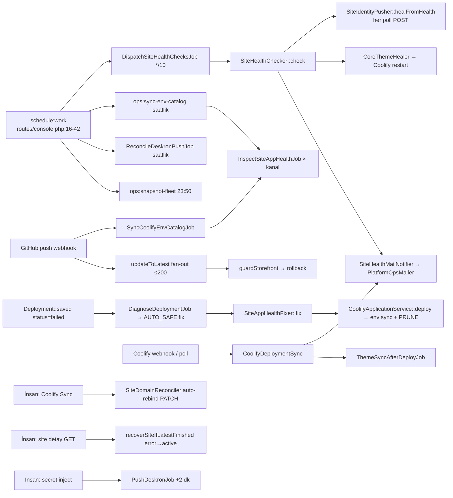
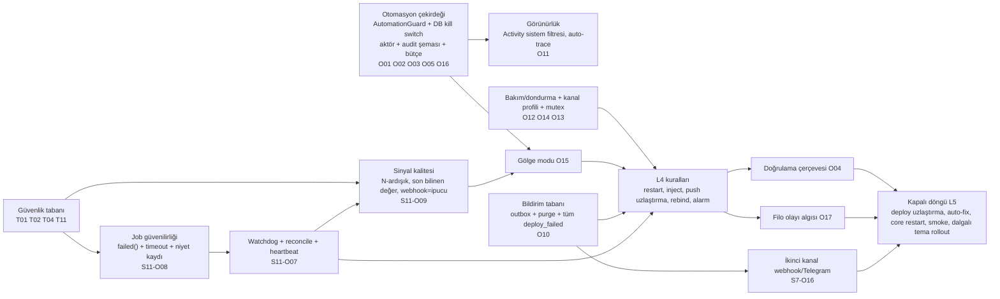

# 13 — Otonomi yol haritası

**Tarih:** 2026-09-24 · **HEAD:** 8484d37 · **Hazırlayan:** S11 — Otonomi yol haritası analisti (Dalga 2)
**Kapsam:** Dalga 1 raporlarının (02–09) §4 otonomi tabloları, bugün insan onayı olmadan çalışan her kod yolu (`config/ops.php`, `routes/console.php`, `app/Services/Sites/Diagnosis/*`, `SiteAppHealthFixer`, `CoreThemeHealer`, `SiteIdentityPusher`, `SiteDomainReconciler`, `CoolifyAppEnvSync`, `CoolifyEnvCatalogSync`, `ReconcileDeskronPushJob`, `GitHubWebhookHandler`, `ThemeRolloutService::guardStorefront`, `SiteHealthMailNotifier`), otopilot politikası · **Kapsam dışı:** Plane'in kendi canlı uygulamasını değiştiren her şey ([deploy-plane runbook](../../runbooks/deploy-plane.md)), CMS kodu, multi-tenant/marketplace/ZIP upload/Mailcow ([related-infra.md](../../related-infra.md)).

Girdi: [01](01-envanter.md), [02](02-mimari-ve-kod-sagligi.md), [03](03-sites-ve-yasam-dongusu.md), [04](04-coolify-deploy-ve-teshis.md), [05](05-agent-saglik-ve-izleme.md), [06](06-temalar-ve-rollout.md), [07](07-domain-cloudflare-dns.md), [08](08-mail-ve-bildirimler.md), [09](09-ui-ux-i18n-erisilebilirlik.md), [15](15-onceki-inceleme-durum-takibi.md). Dalga 2'den [10](10-guvenlik-yetki-denetim.md) (S9) bitiş kontrolünde çıktı ve hesaba katıldı (S9 §4'ün 7 satırı envantere, S9-B02/B03 güvenlik tabanına, S9-B01/B10 politikaya); [11](11-operasyon-altyapi-gozlemlenebilirlik.md) (S10) de bitiş kontrolünde çıktı (S10 §4'ün 8 satırı envantere, S10-B01/B05/B08/B09/B10/B13 güvenlik tabanına). [12](12-performans-ve-olcek.md) (S10, perf) en son çıktı ve işlendi (§5'inin 7 satırı envantere, Coolify çağrı hacmi §8.3'e). Kod yalnız okundu; test koşulmadı (Dalga 1 hedefli koşuları yeterli).

## Özet

- **Bugünkü ortalama seviye L1,38 (45 operasyonel akış) → 90 gün hedefi L3,53.** Bugün 6 akış L4'te ama **hiçbiri** zorunlu 9 alanı (tetik, ön koşul, eylem, doğrulama, geri alma, bütçe, kill switch, audit, bildirim) taşımıyor; guardrail'e göre düzeltilmiş ortalama L1,11 (§4.2).
- **İki geri alınamaz eylem bugün insansız çalışıyor (S11-B09, Kritik):** her Plane deploy'undaki env prune (S3-B01; otomatik `redeploy`/`sync_env` de tetikler) ve tema auto-update'in yanlış branch / CMS < 1.2.32 sitelerde dosya ezmesi (S5-B01, S5-B06). Otonomi artırılmadan önce bunlar insan onayına çekilmeli (S11-O06, 30 gün).
- **Otomasyon çekirdeği yok:** merkezi kapı + çalışma zamanı kill switch'i (S11-B01; env bayrakları `config:cache` yüzünden Plane yeniden başlatılmadan değişmiyor), sistem aktörü/audit şeması (S11-B02), filo bütçesi (S11-B03), doğrulama adımı (S11-B04) ve güvenilir bildirim (S11-B05) eksik. 19 maddelik **otonomi güvenlik tabanı** (§4.3) kapanmadan yeni L4 açılmamalı.
- **AUTO_SAFE ile app-health politikası tek listede uzlaştırıldı (§1.5):** `bind_domains` otomatikten çıkar; `redeploy` yalnız "aynı commit, force'suz, bütçeli, deploy teşhisinden" koşuluyla kalır; `restart_app`, `inject_secret (rotate=false)`, `sync_deployments`, `check_health` otomatik; gerisi insan.
- **En değerli öneriler:** S11-O03 bütçe + döngü koruması (12), S11-O06 geri alınamaz otomatiği durdur (12), S11-O01 `AutomationGuard` + DB kill switch (10), S11-O07 watchdog paketi (10), S11-O04 doğrulama çerçevesi (10), S11-O15 gölge modu (10). Karar belgesi: §8 Otopilot politikası.

## 1. Mevcut durum

### 1.1 Bugün insansız çalışan yollar

### 1.2 Ana dosyalar

| Dosya | Otomasyondaki rolü | Satır | Test |
|-------|--------------------|------:|------|
| `config/ops.php` | 5 otomasyon bayrağı (env): `:45` smoke, `:116-117` core restart, `:157` auto-rebind, `:229-230` teşhis/auto-fix, `:233` tekrar penceresi | 247 | `HealthAndConfigTest` (kısmi) |
| `routes/console.php` | 4 zamanlanmış giriş; watchdog/reconcile/heartbeat yok | 42 | yok |
| `app/Services/Sites/Diagnosis/DeploymentDiagnoser.php` | `applyAutoFix` (`:112-157`), döngü kilidi (`:171-197`) | 198 | `tests/Feature/Sites/DeploymentDiagnosisTest.php` (8) |
| `app/Services/Sites/Diagnosis/DeploymentFailureClassifier.php` | `AUTO_SAFE` (`:17-23`), 23 kural | 375 | `DeploymentFailureClassifierTest` |
| `app/Services/Sites/SiteAppHealthFixer.php` | Fix uygulayıcı, `FIX_ORDER` (`:28-40`; otomatik bayrağı yok) | 368 | `SiteAppHealthTest` |
| `app/Services/Agent/CoreThemeHealer.php` | Stale core tema → restart, site başı 6 sa `Cache::add` | 68 | `ThemeStorefrontGuardTest` |
| `app/Services/Sites/SiteIdentityPusher.php` | Her poll'da ad farkında POST (`:53-74`) | 75 | `tests/Feature/Agent/SiteIdentityAgentTest.php` |
| `app/Services/Sites/SiteDomainReconciler.php` | Auto-rebind PATCH + `verified_at` (`:58-66`) | 153 | `SiteDomainReconcileTest` (3) |
| `app/Services/Coolify/CoolifyAppEnvSync.php` | Deploy öncesi upsert + prune (`:151-190`) | 352 | `tests/Feature/Coolify/CoolifyAppEnvSyncTest.php` |
| `app/Services/Coolify/EnvCatalog/CoolifyEnvCatalogSync.php` | Sil-yaz katalog + kanal reinspect (`:114-151`) | 189 | `CoolifyEnvCatalogSyncTest.php` |
| `app/Jobs/ReconcileDeskronPushJob.php` | Saatlik tek job, 900 sn, `tries=1` (`:36-58`) | 60 | `tests/Feature/Ops/ReconcileDeskronPushTest.php` |
| `app/Services/GitHub/GitHubWebhookHandler.php` | Env katalog tetik (`:37-43`), tema fan-out (`:74-97`) | 218 | `tests/Feature/Webhooks/GitHubWebhookTest.php` (yalnız `main`) |
| `app/Services/Themes/ThemeRolloutService.php` | `guardStorefront` + `rollbackAfterSmoke` (`:490-560`) | 757 | `ThemeStorefrontGuardTest` (8) |
| `app/Services/Mail/SiteHealthMailNotifier.php` | Down/up/sürüm kenar maili (`:16-55`) | 135 | **yok** |
| `app/Services/Coolify/CoolifyDeploymentSync.php` | `deploy_failed` maili (`:186-202`), `error→active` (`:226-242`), ertelenmiş tema sync (`:269`) | 271 | `CoolifySiteSyncTest`, `HealThrottledDeploysCommandTest` |

### 1.3 Test kapsamı (otomasyon davranışı)

| Testli | Testsiz |
|--------|---------|
| Auto-fix uygulanır + 24 sa tekrar kilidi ([04 §1.3](04-coolify-deploy-ve-teshis.md)) | Filo bütçesi, düzeltme sonrası doğrulama, iş ortasında ölme |
| Core restart pencere başına bir kez (`ThemeStorefrontGuardTest`) | Restart sonrası `in_sync=true` doğrulaması |
| Smoke → dosya/sync geri alma | Geri almadan sonra tekrar smoke; auto-update'in dondurulması (P9, [06](06-temalar-ve-rollout.md)) |
| Deskron reconcile 5 senaryo | Süre bütçesi, kuyruk tıkanması (S7-B08) |
| Env prune temel davranış | Katalogdan secret anahtar düşmesi (S3-B01) |
| — | Health bildirici geçişleri, auto-rebind'in gözlemsiz `verified_at`'i, kill switch kapalıyken davranış (env dışı yok) |

### 1.4 Mevcut otomatik eylemlerin denetimi

✅ var · ⚠️ kısmi · ❌ yok. "Kill switch" = çalışma zamanında panelden kapatılabilir mi (env bayrağı ⚠️: production'da `config:cache` çalıştığı için `docker/entrypoint.sh:74-75` değişiklik Plane yeniden başlatması ister).

| # | Otomatik eylem | Kanıt | Bütçe (site / filo) | Döngü koruması | Kill switch | Audit | Bildirim | Doğrulama |
|---|----------------|-------|---------------------|----------------|-------------|-------|----------|-----------|
| M1 | Deploy teşhisi auto-fix (`AUTO_SAFE`) | `DeploymentDiagnoser.php:112-157`, `Classifier.php:23` | ⚠️ site+fix 24 sa / ❌ | ⚠️ yalnız `applied` satırı sayılır (`:171-197`); iş öldürülürse kayıt yok (S3-B11e) | ⚠️ env `:229-230` | ⚠️ yalnız `applied` (`:151`) | ❌ | ❌ `applied` = exception yok |
| M2 | Core tema heal → restart | `CoreThemeHealer.php:23-61` | ⚠️ site 6 sa (`:33-36`) / ❌ | ⚠️ pencere | ⚠️ env `config/ops.php:116` | ✅ `:44-58` | ❌ | ❌ |
| M3 | Identity heal (ad POST) | `SiteIdentityPusher.php:53-74` | ❌ her poll | ❌ (S4-B18, CMS normalizasyonu Doğrulanmadı) | ❌ | ⚠️ yalnız `changed=true` (`:36`) | ❌ | ❌ |
| M4 | Domain auto-rebind (Coolify Sync yan etkisi) | `SiteDomainReconciler.php:58-66`, `CoolifySiteSync.php:38-48` | ❌ | ❌ | ⚠️ env `config/ops.php:157` | ❌ (`grep -c auditLogs` = 0) | ❌ | ❌ `verified_at` gözlemsiz; redeploy yok (S6-B04) |
| M5 | Env katalog sync (saatlik + push) | `routes/console.php:23-26`, `GitHubWebhookHandler.php:37-43`, `CoolifyEnvCatalogSync.php:114-143` | — | — | ❌ | ❌ (S3-B10) | ❌ | ⚠️ yalnız "0 satır" korunur |
| M6 | Env prune (her Plane deploy'u) | `CoolifyAppEnvSync.php:151-190`, `CoolifyApplicationService.php:227-247` | ❌ | ❌ | ❌ | ❌ | ❌ | ❌ **geri alınamaz** (S3-B01) |
| M7 | Katalog değişimi → kanal reinspect | `CoolifyEnvCatalogSync.php:139-151` | ❌ (kanaldaki tüm siteler) | — | ❌ | ❌ | ❌ | — (salt okuma) |
| M8 | Deskron reconcile | `ReconcileDeskronPushJob.php:36-58` | ❌ süre bütçesi yok (900 sn) | ✅ satır kolonları | ❌ | ❌ | ❌ | ⚠️ 2xx |
| M9 | Inject sonrası Deskron push | `SiteAgentSecretInjector.php:51-55` | ✅ tek iş, `tries=4` | ✅ | ⚠️ `isReady()` | ❌ | ❌ | ⚠️ 2xx |
| M10 | Tema auto-update fan-out (webhook) | `GitHubWebhookHandler.php:74-97` | ⚠️ 3'erli/10 sn, 200 kesme | ❌ smoke sonrası dondurma yok (S5-B05) | ⚠️ kurulum başına `auto_update` | ❌ webhook özeti yok (S5-B15) | ❌ | ⚠️ smoke |
| M11 | Smoke → otomatik geri alma | `ThemeRolloutService.php:490-560` | ✅ kurulum başına 1 | ❌ | ⚠️ env `config/ops.php:45` | ✅ `theme.smoke_failed` | ❌ | ❌ tekrar smoke yok |
| M12 | Deploy sonrası ertelenmiş tema sync | `ThemeSyncAfterDeployJob.php:41-65`, `CoolifyDeploymentSync.php:269` | ✅ site başına 1 | ✅ | ❌ | ❌ (S5-B15) | ❌ | ⚠️ smoke |
| M13 | Health down/up/sürüm maili | `SiteHealthMailNotifier.php:16-55` | ❌ | ❌ tek poll yeter (S4-B02) | ⚠️ alıcı opt-out | ❌ | — (kendisi) | ❌ gönderim hatası yutulur, durum ilerler (`:53`, `PlatformOpsMailer.php:79-86`) |
| M14 | `deploy_failed` maili | `CoolifyDeploymentSync.php:186-202` | ❌ | ⚠️ `becameFailed` | ⚠️ opt-out | ❌ | — | ❌ `catch (\Throwable)` yutar |
| M15 | `error→active` kurtarma (GET + sync) | `SiteDetailController.php:34-39`, `CoolifyDeploymentSync.php:226-242` | — | ✅ | ❌ | ❌ (S2-B14) | ❌ | ✅ son satır `finished` |

Sonuç: 15 otomatik eylemin **0'ında** filo bütçesi, **0'ında** doğrulama sonrası eskalasyon, **0'ında** çalışma zamanı kill switch'i, **0'ında** bildirim var; audit yalnız 2'sinde tam (M2, M11), 2'sinde kısmi (M1, M3). Kill switch: 4 env bayrağı (M1, M2, M4, M11), 4 dolaylı (M9, M10, M13, M14), 7 hiç yok. Önceki: A7 (Kısmen) → hâlâ Kısmen.

### 1.5 AUTO_SAFE ↔ app-health politikası uzlaştırması (S3-B27 + S4 açık soru 9)

Bugün iki ayrı liste var: teşhisin `AUTO_SAFE`'i (`DeploymentFailureClassifier.php:17-23`, docblock "commit taşımaz" der) ve `SiteAppHealthFixer::FIX_ORDER` (`:28-40`, otomatik bayrağı yok). S3 `redeploy`/`bind_domains`'i riskli buldu; S4 app-health için `redeploy`/`bind_domains` otomatiğini önermedi. **Tek politika önerisi** (kaynak: `AutomationPolicy` sınıfı, S11-O05; sınıflar §8.1):

| Fix | Bugün AUTO_SAFE | App-health (S4) | Önerilen sınıf | Otomatik koşul (her iki tetikte aynı) |
|-----|:---:|:---:|:---:|------|
| `check_health`, `sync_deployments` | —/✅ | ✅ | C0 | Her zaman; yalnız API bütçesi |
| `restart_app` | ✅ | ✅ (bütçeli) | C1 | `status=active`, açık deploy yok, site 1/6 sa, bağlantı 5/sa, doğrulama 2 poll |
| `inject_secret` (`rotate=false`) | ❌ | ✅ | C1 | Plane'de secret var + Coolify env'de yok (inspect 2 kez), site 1/gün, + restart |
| `sync_env` | ✅ | yalnız non-secret | C2 | Yalnız **ekleme** modu; prune kapalı (S3-O01); secret/generated anahtar yalnız hiç görülmemişse |
| `redeploy` | ✅ | ❌ | C2 | Yalnız deploy teşhisinden; başarısız satırın commit'i = HEAD (değilse `skipped/head_moved`), `force=false`, `registry_rate_limited` için ≥45 dk gecikme, bağlantı 3/sa (S3-O23) |
| `bind_domains` | ✅ (ölü) | ❌ | C2 (insan) | Otomatikten **çıkar**; S6-O03 (PATCH + redeploy + gözlem) sonrasında yalnız A23 kuralıyla yeniden değerlendirilir |
| `migrate_compose`, `stop_then_redeploy`, `rollback_last_good`, `follow_head` | ❌ | ❌ | C2* / C3 | Asla otomatik (commit/altyapı kararı) |

## 2. Bulgular

Otonomiyi engelleyen **yapısal** bulgular; Dalga 1 kaynak bulguları birleştirildi, yeniden keşfedilmedi.

| ID | Tür | Önem | Bulgu | Kanıt | Etki |
|----|-----|------|-------|-------|------|
| S11-B01 | Eksik | Yüksek | Merkezi otomasyon kapısı ve çalışma zamanı kill switch'i yok. 15 otomatik eylemden 4'ü env bayrağıyla, 4'ü yalnız dolaylı koşulla (ayar hazır, kurulum başına `auto_update`, alıcı opt-out), 7'si hiç bayraksız çalışıyor (§1.4). Production'da `config:cache` çalıştığı için env değişikliği Plane konteynerinin yeniden başlamasını ister; bu da otomasyon kapsamı dışındaki Plane self-deploy'udur. Coolify bağlantı `is_enabled` siteye bağlı çağrıları durdurmuyor (S3-B20). Kaynak: S8-B04, S3-B11c | `config/ops.php:45,116,157,229-230`; `docker/entrypoint.sh:74-75`; bayraksız: `SiteIdentityPusher.php:53-74`, `CoolifyAppEnvSync.php:151-190`, `ReconcileDeskronPushJob.php:41-58` | Olay anında otomasyonu durdurmanın hızlı, audit'li yolu yok |
| S11-B02 | Eksik | Yüksek | Otomasyon aktör/kaynak sözleşmesi yok: tek ayırt edici `actor_user_id=null`; audit şemasında `reason`/`rule_id`/`correlation_id` yok; kanal geçişi ve ops job runner insan aktör istiyor. Önceki: C3 (Yapılmadı). Kaynak: S1-B17, S1-B16 | `database/migrations/2026_08_13_071303_create_audit_logs_table.php:13-20`; `ChannelSwitcher.php:49`; `OpsJobRunner.php:400-407`; `app/Support/Ops/ActivityRow.php:47-52` | Otomatik eylemi insan eyleminden, kuralı kuraldan ayırmak ve zincirlemek imkânsız |
| S11-B03 | Risk | Yüksek | Hiçbir otomasyonda filo/bağlantı bütçesi ve filo olayı algısı yok; tek sınır site başı pencere. Tema fan-out'undaki 200 kesmesi bütçe değil, sessiz kesme (S5-B21) | `CoreThemeHealer.php:33-36`; `DeploymentDiagnoser.php:171-197`; `GitHubWebhookHandler.php:90-95`; `grep RateLimiter:: app` → yalnız Fortify login | Registry limiti / Coolify kesintisi gibi filo olayında N site aynı anda restart/redeploy; paylaşılan host'ta yük (`config/ops.php:165` tek build) |
| S11-B04 | Eksik | Yüksek | Otomatik eylemlerin hiçbiri sonuç doğrulamıyor: auto-fix `applied` = exception yok; core restart ve smoke geri alması tekrar ölçülmüyor; auto-rebind `verified_at`'i gözlemsiz yazıyor. Önceki: A7 (Kısmen). Kaynak: S3-B11b, S5-B05, S6-B04/B05 | `DeploymentDiagnoser.php:136-156`; `CoreThemeHealer.php:40-61`; `ThemeRolloutService.php:542-560`; `SiteDomainReconciler.php:58-66` | L5 imkânsız; başarısız "düzeltme" başarı gibi görünür |
| S11-B05 | Eksik | Yüksek | Otomatik eylemler hiç bildirim üretmiyor; tek bildirim yolu güvenilmez: `PlatformOpsMailer` yalnız health bildiricisi + `deploy_failed` + test'ten çağrılıyor; gönderim hatası yutuluyor, bildirici durumu yine ilerletiyor; mailer süreçte önbellekli. Önceki: D1, D2, Boşluk-B5 (Yapılmadı). Kaynak: S7-B03, B04, B05, B18 | `grep -rn "PlatformOpsMailer::class" app` → `CoolifyDeploymentSync.php:188`, `PlatformMailSettingsController.php:127`; `PlatformOpsMailer.php:79-86`; `SiteHealthMailNotifier.php:53-55` | L4'ün "sonradan bildirim" şartı karşılanamıyor; alarm kaybı sessiz |
| S11-B06 | Eksik | Yüksek | Kapalı döngünün zamanlayıcı ayağı yok: 4 girişten hiçbiri watchdog/reconcile/heartbeat değil; hiçbiri `onOneServer` değil; durum düzeltmesi sayfa GET'ine bağlı. Önceki: A1 (Kısmen), A2, D6 (Yapılmadı). Kaynak: S3-B06, S2-B07, S4-B22, S10-B09/B10/B11 | `routes/console.php:16-42`; `SiteDetailController.php:34-39` | Takılı durumlar kimse bakmazsa kalıcı; poller ölürse tüm filo "stale→unhealthy" |
| S11-B07 | Risk | Yüksek | Otomatik adım yarıda ölebilir ve iz bırakmaz: 18 job'un hiçbirinde `failed()` yok; niyet kaydı eylemden **sonra** yazılıyor; iş zaman aşımları en kötü süreden kısa. Kaynak: S1-B09, S3-B06/B11e/B22, S5-B09/B10, S7-B08, S10-B01/B08/B20 | `grep -rn "function failed" app/Jobs` → 0; `DiagnoseDeploymentJob.php:23` (90 sn), `PollDeploymentJob.php:29` (30 sn), `ThemeUpdateJob.php:18` (120 sn; smoke en kötü 330 sn) | Yarım eylem + kilidin görmediği tekrar; döngü koruması delinir |
| S11-B08 | Risk | Yüksek | Tetik sinyalleri güvenilmez: 429/`needs_secret` "down" sayılıyor (S4-B01); tek poll alarm (S4-B02); başarısız poll bilinen sürümü siliyor (S4-B03); webhook payload Coolify'dan üstün ve başka açık satıra yapışıyor (S3-B05/B08); her branch push'u `latest_sha` (S5-B01); `verified_at` bayat (S6-B05); env kataloğu okunamazsa beklenen liste boşalıyor (S1-B08) | `SiteHealthMailNotifier.php:19-21`; `SiteHealthChecker.php:27-28`; `CoolifyWebhookHandler.php:133-147`; `GitHubWebhookHandler.php:57-67`; `SiteDomainReconciler.php:62`; `SiteAppHealthInspector.php:328-332` | Otomasyon gürültüye veya sahte/uzaktan üretilmiş olaya eylemle cevap verir |
| S11-B09 | Risk | **Kritik** | İki geri alınamaz eylem bugün insansız çalışıyor: (a) env prune — katalogda olmayan her anahtar her Plane deploy'unda silinir; otomatik `redeploy`/`sync_env` de tetikler; (b) tema auto-update her branch push'unu ve CMS < 1.2.32 sitede dosya ezmeyi yayar. Kaynak: S3-B01, S5-B01, S5-B06 (hepsi Kritik) | `CoolifyAppEnvSync.php:151-190`; `CoolifyApplicationService.php:227-231`; `DeploymentFailureClassifier.php:23`; `GitHubWebhookHandler.php:74-97` | Kanal çapında secret/DB erişim kaybı; müşteri tema düzenlemelerinin kaybı |
| S11-B10 | Hata | Yüksek | `AUTO_SAFE` kendi sözleşmesine ve app-health politikasına aykırı: docblock "commit taşımaz" derken `redeploy` HEAD'i izleyen sitede yeni commit çıkarır; `bind_domains` ölü ama listede; iki ayrı otomatik liste. Kaynak: S3-B27, S4 açık soru 9 | `DeploymentFailureClassifier.php:17-23`; `SiteAppHealthFixer.php:28-40`; §1.5 | Yeni kural eklenirken yanlış eylem sessizce otomatikleşir |
| S11-B11 | Eksik | Orta | Otomasyon izi kısmi ve dağınık: env prune, auto-rebind, Deskron reconcile, katalog değişimi, health geçişleri audit'siz; Activity'de "Sistem" filtresi yok. Kaynak: S8-B04, S6-B08, S3-B10, S4-B13 | `grep -c auditLogs` → 0: `SiteDomainReconciler.php`, `CoolifySiteSync.php`, `ReconcileDeskronPushJob.php`, `DeskronConfigurer.php`, `CoolifyAppEnvSync.php`, `CoolifyEnvCatalogSync.php`, `SiteHealthMailNotifier.php`, `GitHubWebhookHandler.php` | "Plane ne yaptı?" sorusu cevapsız; güven inşa edilemez |
| S11-B12 | Eksik | Orta | Site/filo istisnası yok: bakım, dondurma penceresi, site opt-out; otomasyon `stopped` siteye saygı göstermiyor. Önceki: Öneri-B6 (Kısmen), Öneri-B11 (Yapılmadı). Kaynak: S2-B08, S2-B09, S4-B02 | `grep -rn "maintenance_until\|automation\|freeze" app config database/migrations` → boş; `DispatchSiteHealthChecksJob.php:19-27`; `CoreThemeHealer.php:29` (durum kontrolü yok) | Kapatılmış site restart/redeploy alabilir; kampanya döneminde değişiklik durdurulamaz |
| S11-B13 | Risk | Orta | İnsan ve otomasyon aynı kaynağa kilitsiz dokunuyor: deploy kapısı "say sonra POST" (TOCTOU); tema update/sync/deploy arasında mutex yok; auto-fix ayrı worker'da. Kaynak: S3-B19, S5-B20 | `CoolifyDeployGate.php:57-68`; `ThemeSyncAfterDeployJob.php:50-53` (yalnız açık deploy kontrolü) | Otomatik düzeltme ile operatör eylemi çakışır; limit üstü paralel build |
| S11-B14 | Eksik | Orta | Otomasyon kanal-kör: alpha/beta/main aynı kurallarla; tema fan-out kanal sırası izlemez. Önceki: A5, A6 (Yapılmadı). Kaynak: S5-B04 | `grep -n channel DeploymentDiagnoser.php CoreThemeHealer.php` → boş; `GitHubWebhookHandler.php:74-82` (sorguda kanal yok); `config/ops.php:15` | Riskli değişiklik önce alpha'da denenmeden main'e gider |
| S11-B15 | Risk | Orta | Plane'in kendi uygulaması için koruma örtük ve dağınık: attach reddi, import dışlama, env sync'in site olmayan app'i atlaması ayrı ayrı; otomasyon kurallarının miras alacağı merkezi "asla dokunma" listesi yok | `SiteAttacher.php:116-118`; `config/ops.php:238-239`; `CoolifyApplicationService.php:235-238`; [deploy-plane.md](../../runbooks/deploy-plane.md) "do not treat this as a customer site" | Doğrudan Coolify app listesi üzerinde çalışacak gelecekteki yetim/envanter otomasyonu Plane'e dokunabilir |

Önem kırılımı: Kritik 1 · Yüksek 9 · Orta 5 (toplam 15).

## 3. İyileştirme ve güncelleme önerileri

Öncelik puanı = Etki × 2 − Risk + (S=3, M=2, L=1, XL=0). Her öneri bir bulguya bağlı.

| ID | Öneri | Çözdüğü bulgu | Etki (1–5) | Efor | Risk (1–5) | Öncelik puanı | Kabul kriteri |
|----|-------|---------------|:---:|:---:|:---:|:---:|---------------|
| S11-O03 | Bütçe + döngü koruması: `AutomationBudget` (`RateLimiter` anahtarları: kural×site/gün, kural×bağlantı/saat, kural×filo/saat); aynı site + aynı kural pencere içinde 1; `unresolved` doğrulama → kural o site için duraklar | S11-B03 | 5 | S | 1 | **12** | Test: 6. restart bağlantı bütçesinden `skipped/budget`; `unresolved` sonrası aynı site için ikinci deneme yok, audit `automation.paused_for_site` |
| S11-O06 | Geri alınamaz otomatiği durdur (taban dilimi): env prune'u "yalnız ekleme" moduna al, kaldırmalar "bekleyen" (S3-O01 ilk dilimi); tema webhook branch filtresi (S5-O01) + 1.2.32 kapısı (S5-O06) | S11-B09 | 5 | S | 1 | **12** | Katalogdan anahtar düşünce deploy `DELETE /envs` göndermez; `feature/*` push `fanout:0`; CMS 1.2.20 sitede agent `themes/update` çağrısı 0 (P1/P6 senaryoları) |
| S11-O01 | `AutomationGuard::allows(rule, site)` + DB kill switch hiyerarşisi (§8.4); Settings → Otomasyon bölümü (önce salt-okunur S8-O01, sonra Super Admin yazma + audit); env değeri taban olarak kalır | S11-B01 | 5 | M | 2 | **10** | 15 otomatik yolun (§1.4) hepsi guard'dan geçer (arch test: guard çağırmayan otomatik giriş yok); DB'de kapatılan kural bir sonraki çalışmada uygulanmaz, Plane yeniden başlamadan |
| S11-O04 | Doğrulama çerçevesi: her C1/C2 eylem `VerifyAutomationJob` kurar (gecikme kural başına); sonuç `verified` / `unresolved`; `unresolved` → eskalasyon bildirimi + site için kural duraklatma | S11-B04 | 5 | M | 2 | **10** | Core restart sonrası `in_sync=false` kalırsa `unresolved` + bildirim; auto-fix sonrası yeni deploy `finished` ise `verified` (feature test, `Http::fake`) |
| S11-O05 | Tek politika kataloğu `AutomationPolicy` (§1.5): `AUTO_SAFE` ve `FIX_ORDER` otomatik kararlarını buradan okur; `bind_domains` çıkar; `redeploy` S3-O23 koşulları | S11-B10 | 4 | S | 1 | **10** | `AUTO_SAFE` sabiti kaldırılmış; HEAD ilerlemiş sitede otomatik redeploy `skipped/head_moved`; katalog tablo testi her fix için sınıf döner |
| S11-O07 | Watchdog paketi: heartbeat (S4-O16), `ops:reconcile-deployments` (S3-O06), takılı site (S2-O07), tema kurulumu (S5-O08), stale ops job (S1-O07 süpürme); hepsi tek `ops:watchdog` komutunda (S10-O02) + `withoutOverlapping(expiresAt)->onOneServer()` (S10-O07) | S11-B06 | 5 | M | 2 | **10** | `schedule:list` 5 yeni giriş; tohumlanmış takılı satırlar tek turda terminal; heartbeat 25 dk eskiyse banner |
| S11-O08 | Job güvenilirliği + niyet kaydı: durum sahibi job'lara `failed()`, timeout hizası (S3-O07), `retry_after` > en uzun iş; otomatik eylemden **önce** `automation_runs.status=running` | S11-B07 | 4 | S | 1 | **10** | `failed()` doğrudan çağrısında satır terminal; öldürülmüş auto-fix sonrası döngü kilidi yine devrede (test) |
| S11-O15 | Gölge (shadow) modu: her yeni L4 kuralı önce 14 gün yalnız "yapardım" kaydı üretir; terfi ölçütü §8.9 | S11-B08, S11-B04 | 4 | S | 1 | **10** | `mode=shadow` kural Coolify'a yazma isteği göndermez, `automation_runs.decision=shadow` yazar; panoda kural başına shadow sayısı |
| S11-O10 | Bildirim tabanı: outbox + retry + teslim kaydı (S7-O04), `Mail::purge` (S7-O03), tüm `deploy_failed` yolları (S7-O05) + yeni olay `automation_unresolved` ve günlük "otomatik işlemler" özeti | S11-B05 | 5 | M | 2 | **10** | SMTP hatası 3 denemeyle yeniden gönderilir; `unresolved` doğrulama tek bildirim üretir; günlük özet teslim kaydında |
| S11-O11 | Otomasyon görünürlüğü: Activity `actor=system` filtresi, `<x-ops.auto-trace>` bileşeni (Fleet "son 24 sa otomatik", site detay bandı), S8-O01'in genişlemesi | S11-B11 | 4 | M | 1 | **9** | `activity?actor=system` yalnız otomasyon satırları; core restart yapılan sitede detayda "Plane otomatik: …" bandı (feature test) |
| S11-O02 | Sistem aktörü + audit şeması: `ChannelSwitcher::start(?User)`, runner `system` job (S1-O23); `automation_runs` tablosu + `audit_logs.after` içinde `source/rule_id/correlation_id/reason` (Önceki C3) | S11-B02, S11-B11 | 4 | M | 2 | **8** | Her otomatik audit satırında 4 alan dolu; `correlation_id` ile tetik → eylem → doğrulama zinciri tek sorguda |
| S11-O09 | Sinyal güven sözleşmesi: guard yalnız teyitli sinyalle tetikler (N ardışık, Coolify'dan yeniden okunmuş, son bilinen değer korunmuş); kaynak düzeltmeler S4-O01/O02/O03, S3-O05, S6-O04 | S11-B08 | 4 | M | 2 | **8** | Tek 429/timeout hiçbir kuralı tetiklemez; webhook payload'ı tek başına auto-fix tetiklemez (test) |
| S11-O12 | Bakım / dondurma / opt-out: `sites.automation_paused_until`, `maintenance_until`; filo ve kanal dondurma penceresi; `stopped`/`draft` site otomasyon dışı (S2-O08 ile) | S11-B12 | 4 | M | 2 | **8** | Dondurma içinde C2 kural `skipped/freeze`; stopped sitede core restart yok; bakım bitince özet |
| S11-O13 | Site başına ops mutex'i `Cache::lock("site-ops:{id}")` (insan + otomasyon ortak); atomik deploy kapısı (S3-O17), tema mutex (S5-O17) | S11-B13 | 4 | M | 2 | **8** | Operatör redeploy'u sürerken aynı sitede auto-fix `skipped/locked`; paralel iki deploy'dan biri `POST /deploy` |
| S11-O14 | Kanal profili: `config/ops.php` `automation.channels.{alpha,beta,main}` (mod, bütçe çarpanı, sessiz saat); guard okur; tema dalgası kanal sırası (S5-O04 önkoşulu) | S11-B14 | 3 | S | 1 | **8** | Aynı kural alpha'da `live`, main'de `shadow` çalışır (test); profil Settings'te görünür |
| S11-O16 | Plane öz-koruma listesi: `ProtectedApps` (exclude needles + config'teki Plane app kimliği); guard her Coolify mutasyonunda reddeder | S11-B15 | 3 | S | 1 | **8** | Plane repo'lu app için guard `denied/protected_app`; attach/import/env sync aynı listeyi kullanır |
| S11-O17 | Filo olayı algılayıcı: aynı teşhis kodu / aynı sinyal 15 dk'da ≥3 sitede → kural filo çapında duraklar, tek `fleet.incident_opened` bildirimi (S3 §4) | S11-B03 | 4 | M | 2 | **8** | 3 sitede `registry_rate_limited` → 4. site için auto-fix `skipped/fleet_incident`; tek bildirim |

Öncelik sırası: O03 12 · O06 12 · O01 10 · O04 10 · O05 10 · O07 10 · O08 10 · O10 10 · O15 10 · O11 9 · O02 8 · O09 8 · O12 8 · O13 8 · O14 8 · O16 8 · O17 8.

### 3.1 30 / 60 / 90 gün otonomi hedefi

| Ufuk | Kapsam | Seviye çıktısı | Ortalama (45 akış) |
|------|--------|----------------|:---:|
| Bugün | — | 6 akış L4, hepsi guardrail eksik | **1,38** |
| 30 gün | Güvenlik tabanı T01–T19'un S efor dilimi (§4.3); S11-O06, O08, O03, O05, O16; O01 (salt-okunur + DB anahtarı); O07'den heartbeat; S1-O06, S3-O02/O04/O08, S4-O01/O05, S7-O03, S9-O20, S2-O09 | A17, A21, A42 → L4; A30, A33 → L2; mevcut 6 L4'e bütçe + kill switch | **1,69** |
| 60 gün | O07 tamamı, O02, O09, O10, O11, O12, O13, O15 (gölge başlar), O17; S10-O01/O03/O04/O07; S10-O10 günlük döküm (T18); A8 prune | Watchdog/alarm/push uzlaştırma/audit saklama L4; Coolify 429 geri çekilmesi L4; core restart + smoke L5 | **2,56** |
| 90 gün | O04 doğrulama → L5; O14; S5-O04 dalgalı rollout; S7-O16 ikinci kanal; S6-O03/O04; S10-O10 haftalık geri yükleme doğrulaması | Deploy uzlaştırma + teşhis + Plane DB yedeği L5; host drift, TLS, özet, `failed_jobs` retry, uyarlanır health sıklığı (S10-PO02/PO11) | **3,53** |

## 4. Otonomi fırsatları

### 4.1 Birleşik otonomi envanteri

Dalga 1 §4 tablolarındaki 62 satır + S9 (10 raporu) §4'ün 7 + S10 (11 raporu) §4'ün 8 + 12 raporu §5'inin 7 satırı = **84 satır → 47 satır** (birleştirmeler "Kaynak" sütununda; `S3§4-2` = 04 raporunun §4 tablosundaki 2. satır, `S9§4-n` = 10, `S10§4-n` = 11, `P§5-n` = 12 raporu). A37–A38 altyapı satırıdır, ortalamaya girmez. Seviye kanıtı kaynak raporun §4'ündeki bugünkü seviye hücresidir; ek kod kanıtı sütunda.

| # | Kaynak | Akış | Bugün + kanıt | Hedef (90 g) | Tetik | Ön koşul | Eylem | Doğrulama | Geri alma | Bütçe/limit | Kill switch | Audit | Bildirim |
|---|--------|------|---------------|:---:|-------|----------|-------|-----------|-----------|-------------|-------------|-------|----------|
| A01 | S1§4-2, S3§4-1, S3§4-2, S4§4-7 | Deploy satırı uzlaştırma (A2) | L1 — yalnız `/jobs` açıkken, son 2 sa (`OpsJobController.php:28-34`); throttle satırları için CLI L3 | L5 | 5 dk schedule; satır >10 dk açık / `coolify_timeout` | uuid; bağlantı `auth_failed_at` boş | Coolify'dan oku, terminal yaz, gerekirse poll kur; uuid'siz açık satırı kapat | Satır = uzak durum; kapı sayacı düşer | `before` audit'ten | Tur ≤50 satır, host rate guard | `automation.rule.deploy_reconcile` | `deployment.reconciled` | Günlük özet |
| A02 | S1§4-1, S2§4-1, S2§4-8, S3§4-3, S5§4-4, S10§4-1..4 | Takılı durum watchdog'u (site `provisioning/deploying`, ops job `running`, tema `installing/updating`, bırakılmış `ops:coolify-bulk` kilidi) + `error→active` | L0 — kurtarma yok; `error→active` GET'te audit'siz (`SiteDetailController.php:34-39`) | L4 | 10 dk schedule; yaş eşiği (site 30 dk, job timeout+5 dk, tema 15 dk) | Trashed değil; son 30 dk otomasyon yok | Sahibinin geçişi (`markSucceeded/markFailed`), job/tema `error` | Sonraki turda durum terminal | Operatör retry (L3) | Tur ≤20 site / ≤50 job / ≤200 tema | `automation.rule.stale_sweep` | `site.state_reconciled`, `ops_job.stale_failed`, `theme.install_stalled` | Widget + günlük özet |
| A03 | S3§4-4, S8§4-1 | Deploy teşhisi + güvenli düzeltme | L4 guardrail'siz (`DeploymentDiagnoser.php:112-157`) | L5 | Satır `failed` | §1.5 koşulları; niyet kaydı; bütçe | Tek politika fix'i | 10 dk sonra `VerifyAutomationJob` | Aynı kodu tekrar deneme yok; `rollback_last_good` **önerisi** | Bağlantı 5/sa, site+fix 24 sa | Genel + kod başına DB | `site.deploy_auto_fix` + `_skipped/_failed/_verified` | Teşhis bildirimi (neden+eylem+sonuç) |
| A04 | S3§4-10 | Filo olayı algısı | L0 — site başı düzeltme sınırsız yayılır | L4 | Aynı kod 15 dk'da ≥3 site | — | Kuralı filo çapında duraklat, tek olay aç | Olay kapanınca toplu eylem **önerisi** | Olay kapatma | Olay açıkken kural kapalı | `automation.enabled` | `fleet.incident_opened/closed` | Tek bildirim + Fleet kartı |
| A05 | S3§4-5 | Env kataloğu yayılımı | L4 — saatlik + push, deploy'da prune (`CoolifyAppEnvSync.php:151-190`) | L4 ekleme / L3 kaldırma | Katalog yenileme | Parse ≥1 satır; önceki kataloga fark | Ekleme uygula; kaldırma "bekleyen" | Deploy sonrası `missing_env` boş | Silinen değer 30 gün şifreli | Kaldırma Super Admin; secret asla | `automation.rule.env_prune` (vars. kapalı) | `env_catalog.changed` | Settings rozeti + bildirim |
| A06 | S3§4-6 | Coolify envanter senkronu | L3 — buton | L4 | Gecelik, bağlantı başına | Token geçerli, bağlantı `is_enabled` | Allowlist + hedef doldurma | Sayılar önceki turdan >%50 düşmedi | Silme yerine `inactive` | Boş liste = silme yok | Bağlantı `is_enabled` (S3-O18) | `coolify.inventory_synced` | Yetim çıkarsa dikkat kartı |
| A07 | S2§4-4, S3§4-7 | Yetim / ikiz tespiti (app 404, aynı uuid) | L0 — `CoolifySiteTargetSync` hatayı `continue` ile atlar (S3-B18) | L2 | Envanter/site sync | 2 ardışık 404 | Bayrak + neden + öneri | 200 gelince kalkar | Salt okuma | Silme asla otomatik | `automation.rule.orphan_scan` | `site.coolify_app_missing` | Fleet dikkat kartı |
| A08 | S3§4-8, P§5-5 | Toplu deploy bekleyen kova + poll bütçesi tükenince duraklatma | L3 | L4 | Sweep sonunda bekleyen; son 1 sa `coolify_timeout` > 10 | Kapı slotu boş | Bekleyeni sıraya al; tükenmede yeni build'i duraklat (S10-PO05) | Her biri `in_progress` | Widget iptali | İlk seçim kadar, 6 deneme | Ops job iptali | Ops job özeti | Widget |
| A09 | S1§4-3 | Koşullu toplu redeploy / kanal terfisi (A6) | L3 — insan (`OpsJobRunner`) | L3 (bilinçli) | Sürüm yayını + `outdated` | S2-B01/B02, S3-B03 kapalı | — (90 günde otomatik yok) | — | — | — | — | — | — |
| A10 | S2§4-2 | Kanal geçişi ayrışması telafisi | L1 — Sync sonrası görünür | L4 | Switch `markFailed`, deploy hiç başlamadı | Uuid; `deploying` değil | Coolify dalını eski değere PATCH (deploy yok) | `git_branch == channel` | Ters PATCH (audit'te) | Site 1/gün | `automation.rule.channel_compensate` | `site.channel_compensated` | Widget + bildirim |
| A11 | S4§4-1, S7§4-1, S2§4-3 | Down/up alarmı (+ stopped hariç) | L1 — kenar maili, tek poll (`SiteHealthMailNotifier.php:19-21`) | L4 | 2 ardışık `unhealthy` | `active`; bakım yok; deploy son 10 dk yok; heartbeat taze | Kuyruklu bildirim + teşhis eki; 30 dk hatırlatma | 1 ok poll → up | Hatırlatma iptali | Site 3 hatırlatma/gün; 10 dk'da >5 site → tek toplu | `automation.rule.health_alerts` | `site.health_down/up` | Mail + webhook (S7-O16) |
| A12 | S4§4-2 | Konteyner düştü → restart | L3 (`SiteAppHealthFixer.php:302-314`) | L4 | 2 ardışık `proxy_fallback` / Coolify `exited` | `active`; deploy yok; son 6 sa otomatik restart yok | `restartApplication` | 2 poll içinde `ok` | Yok (idempotent); başarısızsa site için kural durur | Site 1/6 sa, bağlantı 5/sa | `automation.rule.restart_app` (ilk 14 gün gölge) | `site.app_auto_restarted/_failed` | Bildirim |
| A13 | S4§4-3, S5§4-3, S8§4-2 | Core tema stale → restart | L4 (`CoreThemeHealer.php:23-61`), görünürlük L1 | L5 | `core_theme_in_sync=false` | Uuid; pencere boş; `deploying` değil | Mevcut restart | Sonraki poll `in_sync=true` + smoke | — | Site 6 sa | Env + DB kuralı | `site.core_theme_restarted` + `_verified/_unresolved` | `unresolved` → bildirim; site detay bandı |
| A14 | S2§4-7, S4§4-4 | Agent secret eksik → inject (+ import A3) | L3 — inspect fix / manuel sweep | L4 | Inspect `missing_env:CONTROL_PLANE_AGENT_SECRET` ×2; `--apply` sonrası `missing` | Plane'de secret var; `active`; deploy yok | `inject(rotate:false)` + restart | Sonraki poll 200 JSON | Env önceki değere | Site 1/gün, tur ≤25 | `automation.rule.inject_secret` | `site.agent_secret_injected` `origin=auto` | Bildirim |
| A15 | S4§4-5 | `bad_signature` resync | L2 — yalnız `check_health` CTA | L3 | JSON 401 ×2 | Coolify env okunabilir | Hash karşılaştır → "yeniden yaz + restart" düğmesi | 200 JSON | Env eski değere | Site 1/gün | — | `site.agent_secret_resynced` | Bildirim |
| A16 | S4§4-6, S9§4-6 | Secret rotasyonu | L3 — tek adım, kesintili (S4-B06) | L3 (grace sonrası L5) | Operatör / takvim (90 gün) | S4-O05, S4-O06, CMS çift secret | — (90 günde otomatik yok) | — | — | Sonraki hedef: günde ≤10 site, host 1 | Site `secret_rotation_paused` | `site.agent_secret_rotated` | — |
| A17 | S4§4-8, S4§4-9, S7§4-7, S10§4-5, P§5-2 | Plane öz-gözetimi (worker/scheduler heartbeat, kuyruk birikimi, snapshot, alarm kanalı) | L0 (`routes/console.php` heartbeat yok) | L4 | Heartbeat > 2×poll; 23:55 snapshot yok; bildirim 3 kez başarısız | — | Banner, stale verdict bastır, snapshot upsert, ikinci kanala düş | Heartbeat tazelenir | — | Günde 1 snapshot | — (her zaman açık) | `ops.poller_stalled/resumed` | Global alıcı + ikinci kanal |
| A18 | S5§4-1, S5§4-5, P§5-6 | Tema auto-update rollout (push + kaçan webhook; 200 kesmesi görünür) | L4 guardrail'siz (`GitHubWebhookHandler.php:74-97`) | L4 guardrail'li | Default branch push (S5-O01), idempotent teslimat, saatlik katalog sync | `active`, held değil, CMS ≥ min ve ≥1.2.32, deploy açık değil | Dalga dalga (alpha→beta→main) `ThemeUpdateJob` | Dalga başına smoke 0 fail + health ok | Başarısız sitede dosya geri alma; plan `halted` | Dalga ≤3, soak ≥30 dk, eşik 1 | `automation.rule.theme_rollout` + plan duraklat | `theme.rollout_*` | `theme_rollout_halted` |
| A19 | S5§4-2 | Smoke → geri alma | L4 (`ThemeRolloutService.php:490-560`) | L5 | `guardStorefront` fail | Aktif tema, geri alma noktası var | Geri al + hold (S5-O05) | Tekrar smoke | Başarısızsa `error` + insan | Kurulum 1/push | Env `:45` + DB | `theme.smoke_failed` + `recheck` | Bildirim |
| A20 | S5§4-6 | Deploy sonrası ertelenmiş tema sync | L4 (`ThemeSyncAfterDeployJob.php:41-65`) | L4 + görünürlük | Deploy `finished` | `pending_sync_after_deploy` | `syncNow` | Smoke | `rollbackLastSync` | Site 1 | DB kuralı (yeni) | `theme.sync_deferred/_dropped` | Düşürülen sync için Activity |
| A21 | S5§4-7 | GitHub installation kaldırıldı | L0 (S5-B11) | L4 | `installation.deleted/suspend` | İmza geçerli | Bağlantı `status=error` | Sonraki sync tutarlı | `unsuspend` → `connected` | — | — | `theme_git.installation_*` | Bildirim |
| A22 | S5§4-8 | CMS gerçek tema SHA uzlaştırma | L0 | L2 | Health / `GET /themes` | CMS SHA bildirir (handoff) | `reported_sha` yaz | Fark rozeti | — | Poll'a bağlı | — | `theme.drift_detected` | UI rozeti |
| A23 | S6§4-1, S8§4-3 | Coolify↔Plane host drift / auto-rebind | L1 — live inspect; Sync yan etkisi PATCH-only, gözlemsiz (`SiteDomainReconciler.php:58-66`) | L4 | Saatlik `ops:reconcile-domains` | S6-O03/O04; zone aktif; son 30 dk deploy yok | `setDomains` + force'suz redeploy | `getApp` host içerir + https 200/3xx | Önceki `docker_compose_domains` PATCH | Saatte ≤5 site, site 1/gün | `config/ops.php:157` + DB kuralı | `site.domain_auto_rebound` | Günlük özet |
| A24 | S6§4-5 | Toplu bind | L3 — etkisiz, redeploy yok (S6-B03) | L3 (doğru) | Operatör | S6-O03 | PATCH + paced redeploy | `coolify_bound_at` | Önceki host listesi | Mevcut bulk limitleri | `/jobs` iptali | Site başına | Widget |
| A25 | S6§4-2 | Pending zone aktivasyonu | L1 — elle "DNS'i güncelledim" (`SiteLanding.php:118-149`) | L4 | Saatlik `getZone` | `zone_status=pending`, temp host var | `confirmDns` | Yeni hostlar Coolify'da; probe 200 | Temp host'u yeniden bağla | Site 24 GET/gün; 7 gün sonra 1 | `automation.rule.auto_confirm_dns` | `site.dns_confirmed` `auto=true` | 7/21 gün kartı |
| A26 | S6§4-3 | TLS sertifika sağlığı | L0 (Önceki Öneri-B8) | L2 | Günlük probe | DNS origin'i gösteriyor | Neden sınıfı | `not_after` > 30 gün | — | Host 1/gün | `automation.rule.tls_probe` | `site.tls_checked` (değişimde) | ≤14 gün kart + bildirim |
| A27 | S6§4-4, S6§4-6 | DNS çöp toplama (yetim A + preview host) | L0 (`SiteLanding.php:152-158` hata yutuluyor) | L3 | Haftalık tarama | Plane zone'u, içerik = origin, `*/@/www` değil | Liste + onaylı "serbest bırak"; preview GC L4 | Kayıt yok | Audit payload'undan yeniden oluştur | Tık başına ≤20, preview ≤50/gün | `automation.rule.dns_gc` | `cloudflare.dns_released` | Activity |
| A28 | S6§4-7 | DNS şablon sapması | L1 | L2 | Zone sayfası / haftalık | S6-O01 | Beklenen↔mevcut fark | — | — | Salt okuma | — | — | Zone rozeti |
| A29 | S7§4-2, S7§4-3, S7§4-4 | CMS konfig push uzlaştırması (platform mail L1 / Deskron L4 / Hostinger L3 → medyan) | L3 (`ReconcileDeskronPushJob.php:36-58`) | L4 | Saatlik; inject; provizyon başarısı | Ayar `isReady()`, secret var; T16 kapalı (hedef değişince secret yeniden onaylı) | Paced push job'ları | 2xx + `*_pushed_at`; CMS health hash (handoff) | Önceki ayar sürümünü push | Tur ≤240 sn, site 24/gün | Kural başına DB | `*.push_queued` + sonuç | 24 sa başarısız → özet |
| A30 | S3§4-9, S7§4-5, S9§4-4 | Dış kimlik sağlığı (Coolify 401/403, Cloudflare/Hostinger token yoklaması) | L1 — tekil hata metinleri | L2 | Herhangi çağrıda 401/403; günlük probe | — | `auth_failed` işaretle, poll beklet | Sonraki başarılı çağrı temizler | Otomatik | Sunucu 1/gün | — | `coolify.connection_auth_failed`, `mail_server.probed` | Banner + tek bildirim |
| A31 | S7§4-6 | Mailbox isteği bildirimi | L1 | L2 | Yeni `storeRequest` | — | Bildirim + filo sayacı | Operatör kararı | — | İstek 1 | — | `mail.mailbox_requested` | Mail/webhook |
| A32 | S7§4-8 | Haftalık ops + otomasyon özeti (A9) | L0 | L4 | Pazartesi 08:00 | Kanal hazır | Özet üret + gönder | Teslim kaydı | — | Haftada 1 | `ops_weekly_digest` | Gönderim satırı | Mail |
| A33 | S1§4-4 | Sessiz hata görünürlüğü | L0 — 11 yutma (S1-B08) | L2 | Her sync/inspect | S1-O06 | Sonuca `partial_errors` + rozet | Sonraki tur 0 | — | — | — | Sync audit'ine alan | Kart rozeti |
| A34 | S1§4-5 | Site güncelleme yan etkisi yeniden deneme | L1 — yalnız flash (`SiteController.php:1079-1083`) | L3 | `SiteUpdateOutcome` başarısız adım | S1-O01 | Adımı job olarak yeniden kuyrukla | Adım `ok` | Adımlar idempotent | Adım ≤3 | `automation.enabled` | `site.update_step_retried` | "Bekleyen adım" satırı |
| A35 | S2§4-5 | Arşivli ama çalışan site | L1 — arşiv sayfası | L3 | Arşivde 7 gün + app `running` | Trashed, uuid | "Coolify'da durdur" önerisi | GET `exited` | Restore + activate | Otomatik stop yok | — | `site.archived_stopped` | Arşiv rozeti |
| A36 | S2§4-6 | Provision sonrası ilk admin daveti (A4) | L0 | L4 | İlk `ok` health + e-posta dolu | CMS ≥1.2.18; davet gönderilmemiş | `createAdmin(invite)` tek sefer | Admin listesinde e-posta | Super Admin siler | Site 1 + 1 retry | `automation.rule.auto_invite` | `site.admin.created` `auto=true` | Widget + audit |
| A37 | S8§4-4, S8§4-5 | Otomasyon kontrol yüzeyi (kill switch paneli, sistem filtresi) | L0 — yalnız `.env` | L3 | Operatör | Super Admin | DB bayrağı | Sonraki çalışma okur | Aynı ekran | Değişiklik başına audit | Kendisi | `settings.automation_changed` | Flash + Activity |
| A38 | S1§4-6, S8§4-6 | Geliştirme kalite kapısı (pint/stan/i18n/onay/kontrast) | L0 | L4 | Her ajan commit'i / test koşusu | S1-O15, S8-O07/O10/O13 | Kırmızıysa commit yok | Çıkış kodu 0 | `git restore` | ≤3 dk | Yok (bilinçli) | Commit özeti | Oturum çıktısı |
| A39 | S9§4-1 | Secret sızıntı taraması (audit, deployments, teşhis, health payload) | L0 | L3 (S9: L4) | Gece | Genişletilmiş redaktör desenleri (S9-B11) | Rapor + tek tık yerinde `[redacted]` | Tekrar tarama 0 | Yok — tek yönlü; bu yüzden §8.1'e göre C3 → otomatik değil | Tur ≤500 satır | `automation.rule.secret_scan` | `security.secret_redacted` | Bildirim |
| A40 | S9§4-2 | Webhook imza reddi anomalisi | L0 (yalnız log) | L2 | 10 dk'da ≥20 red | S9-O04 | Teşhis kartı (IP sayısı, header tipi) | — | — | Saatte 1 bildirim | Bayrak | `security.webhook_rejects_spike` | Bildirim |
| A41 | S9§4-3 | Başarısız login patlaması | L0 | L2 | Aynı e-posta 15 dk'da ≥10 | Auth olayları audit'te (S9-B10) | Kullanıcıya + SA'ya bildirim | — | — | Kullanıcı 1/gün | Bayrak | `auth.login_failed_burst` | Bildirim |
| A42 | S9§4-5, P§5-4 | Tehlikeli toplu işlem koruması + süre ön kontrolü (`bulk/purge`, `all=1`, tahmini > 240 sn) | L1 — yalnız evet/hayır (S2-B10) | L4 | Tehlikeli toplu istek | S2-O09 / S9-O02 | Eşik/filtre genişlemesinde sunucu reddeder, SA onayı ister | `expected_count` = gerçek sayı | İstek uygulanmaz | Eşik 5–10 site (config) | `ops.bulk.danger_threshold` | `site.bulk_blocked` | Flash + Activity |
| A43 | S9§4-7, S10§4-7, P§5-7 | Veri tutma: audit/deployments/ops job + tablo büyüme uyarısı (Önceki A8) | L0 (`Prunable` yok) | L4 | Gece | S9-O07; dışa aktarım başarılı; son Plane DB yedeği < 26 sa (T18) | >365 gün satırları JSONL'e aktar, sonra sil; hash özeti | Aktarılan = silinen | Dosyadan geri yükleme (C2) | Tur ≤50k satır | Bayrak | `security.audit_pruned` | Haftalık özet |
| A44 | S10§4-6 | `failed_jobs` retry (idempotent iş allowlist'i) | L0 (UI yok, Önceki E1) | L4 | Yeni `failed_jobs` satırı | İş allowlist'te: ConfigureSiteMail, PushDeskron, PushPlatformMail, CheckSiteHealth | Tek otomatik retry (L3: panelde retry/forget) | Retry sonrası yeni satır yok | Forget | İş tipi ≤10/sa | `ops.failed_jobs.auto_retry` | `system.failed_job_retried` | Günlük özet |
| A45 | S10§4-8 | Plane DB yedeği + geri yükleme doğrulaması | L0 (S10-B13, yedek yok) | L5 | Günlük 03:00 | Disk boş alanı > döküm × 3 | `mysqldump` + haftalık geçici şemaya geri yükleme | Satır sayıları eşit | Önceki 13 döküm | 14 döküm | `ops.backup.enabled` | `system.backup_{ok,failed}` | Başarısızlık anında |
| A46 | P§5-1 | Uyarlanır health sıklığı (tur aşımı) | L0 (sabit `*/N`, `routes/console.php:13-19`) | L4 | Tur süresi > aralığın %80'i, art arda 2 tur | Kapasite metriği (S10-PO11) | Sonraki turda inspect atlanır, aralık bir kademe büyür (≤15 dk) | Sonraki tur < %60 | 6 normal turdan sonra eski aralık | Aralık ≤15 dk | `ops.capacity.adaptive_health` | `system.capacity.health_throttled` | Banner + özet |
| A47 | P§5-3 | Coolify 429 geri çekilmesi | L1 (satırda hata) | L4 | Saatte >20 adet 429 | — | Health inspect 1 sa duraklar; otomasyon C1/C2 bekler | 429/saat < 5 | Süre dolunca otomatik | 1 sa | `ops.capacity.coolify_backoff` | `system.capacity.coolify_throttled` | Banner |

Birleştirme özeti: A02 (9 satır), A17 (5), A01 (4), A11/A13/A18/A29/A30/A43 (3'er), A03/A07/A08/A14/A16/A23/A27/A37/A38/A42 (2'şer) → 84 kaynak satır, 47 hedef satır. A39'da S9'un L4 hedefi bilinçli olarak L3'e çekildi (redaksiyon geri alınamaz, §8.1 C3). Kaynak seviye çelişkisinde düşük olan alındı (A13: eylem L4, görünürlük L1 → L4 sayıldı, görünürlük hedefte).

### 4.2 Merdivende konumlama

Yöntem: A01–A36 + A39–A47 (45 operasyonel akış) için satırdaki tek tamsayı seviye; ortalama = Σ seviye / 45. Birden çok alt akış içeren satırda (A29) medyan. Hedef satırı 90 günlük değerdir; ufuk ataması §3.1'deki dilimlerle (30: A05, A17, A20, A21, A30, A33, A42 · 60: A02, A04, A06, A07, A10, A11, A13, A14, A15, A18, A19, A25, A29, A31, A35, A40, A41, A43, A47 · 90: kalanlar, A44/A45/A46 dahil). **Guardrail düzeltmesi:** bugünkü 6 L4 akışın hiçbiri 9 zorunlu alanı taşımadığı için L2 sayılırsa ortalama (62 − 12) / 45 = **1,11**.

| Seviye | Bugün | 30 gün | 60 gün | 90 gün |
|--------|:---:|:---:|:---:|:---:|
| L0 Görünmez | 18 | 15 | 9 | 0 |
| L1 Görünür | 12 | 10 | 4 | 0 |
| L2 Teşhis | 1 | 3 | 6 | 9 |
| L3 Tek tık | 8 | 8 | 7 | 8 |
| L4 Koşullu otomatik | 6 | 9 | 17 | 23 |
| L5 Kapalı döngü | 0 | 0 | 2 | 5 |
| **Ortalama** | **1,38** | **1,69** | **2,56** | **3,53** |

Hesap: bugün 0×18 + 1×12 + 2×1 + 3×8 + 4×6 = 62 → 62/45; 30 g +14 (A17 +4, A21 +4, A42 +3, A30 +1, A33 +2) = 76; 60 g +39 = 115; 90 g +44 (A44 +4, A45 +5, A46 +4 dahil) = 159 → 159/45. Toplam doğrulaması: 90 gün 2×9 + 3×8 + 4×23 + 5×5 = 159.

### 4.3 Otonomi güvenlik tabanı (yeni L4 açılmadan önce ZORUNLU)

| # | Kaynak bulgu(lar) | Neden önkoşul | Kapatan öneri | Efor |
|---|-------------------|---------------|---------------|:---:|
| T01 | S3-B01 | Otomatik `redeploy`/`sync_env` her çalıştığında prune çalışır; otomasyon filo çapında secret silme hızını artırır | S3-O01 (ilk dilim S11-O06), S9-O20 (korumalı anahtar listesi + silme eşiği) | S→M |
| T02 | S5-B01, S5-B03, S5-B06 | Mevcut L4 tema fan-out'u yanlış SHA'yı ve dosya ezmeyi otomatik yayar; replay ile filo eski commit'e düşer | S5-O01, S5-O03 / S9-O05, S5-O06 | S/M/S |
| T03 | S1-B09, S3-B06, S3-B07, S2-B07 (+S3-B22, S5-B09, S10-B01, S10-B08, S10-B20) | Otomasyon "çalışıyor" ile "ölü" ayrımı yapamaz; uuid'siz açık satır bağlantıdaki tüm deploy'ları kilitler; worker timeout'u tüm süreci öldürüp `ops:coolify-bulk` kilidini 900 sn bırakıyor; Plane deploy'u koşan işi 10 sn'de kesiyor | S1-O07, S3-O06/O07/O08, S2-O07, S5-O08, S10-O03/O04/O05 | S/M |
| T04 | S3-B02, S2-B03 | Yanlış (eski) satır `failed` olunca `Deployment::saved` teşhisi ve auto-fix'i tetikler (`app/Models/Deployment.php:60-72`) | S3-O02 | S |
| T05 | S3-B05, S3-B08 | Webhook payload'ı otomatik redeploy/restart tetikleyebilir; token sızarsa uzaktan tetik | S3-O04, S3-O05 | S/M |
| T06 | S4-B01, S4-B02, S7-B17 | Tetik ve eskalasyon sahte down'a göre çalışır; alarm körlüğü | S4-O01, S4-O02, S7-O15 | S/M |
| T07 | S4-B03 | Başarısız poll sürümü siler; sürüm kapısı ve tema kararı boş veriyle geçer | S4-O03 | M |
| T08 | S7-B04, S7-B03, S7-B05 | L4 tanımı "sonradan bildirim" ister; bugün kayıp sessiz | S7-O03, S7-O04, S7-O05 | S/M/S |
| T09 | S8-B04, S3-B11c, S3-B20 | Kill switch yalnız env + `config:cache`; olayda kapatmak Plane yeniden başlatması ister | S8-O01, S11-O01, S3-O18 | M |
| T10 | S1-B17 | Kanal geçişi ve runner insan ister; otomasyon ya sahte kullanıcı ya kod kopyası üretir | S1-O23, S11-O02 | M |
| T11 | S1-B08 | Sessiz catch doğrulama adımını kör eder ("sorunsuz" görünür) | S1-O06 | S |
| T12 | S3-B27, S6-B03, S6-B04 | `AUTO_SAFE` commit değiştirir / host değiştirir; bind PATCH-only etkisiz | S3-O23, S11-O05, S6-O03 | S/M |
| T13 | S3-B19, S5-B20 | Otomatik ve insan eylemi aynı siteye kilitsiz; limit üstü build | S3-O17, S5-O17, S11-O13 | S/M |
| T14 | S2-B08, S2-B09 | Otomasyon müşterinin kapattığı siteyi yeniden ayağa kaldırabilir | S2-O06, S2-O08 | M/S |
| T15 | S4-B22 | Poller ölünce tüm filo "stale→unhealthy"; otomasyon filo çapında yanlış pozitife eylem yapar | S4-O16 | S |
| T16 | S9-B02 (S3-B09 dahil) | Hedef host/URL secret yeniden girilmeden değişebiliyor; A29 push uzlaştırması L4'e çıkarsa SMTP parolası ve DeskRon `master_key` her saat yeni hedefe **otomatik** gider (`app/Services/Sites/SitePrimaryDomain.php:86-93` → `app/Services/Mail/PlatformMailConfigurer.php:48-57`) | S9-O03 | S |
| T17 | S9-B03, S6-B09 | Bağlantı/hesap silinince site çağrıları sessizce varsayılan kimliğe düşer (`app/Services/Coolify/CoolifyApplicationService.php:37-45`); otomatik restart/redeploy yanlış Coolify'a, otomatik DNS yanlış hesaba gider | S9-O11, S6-O07 | S |
| T18 | S10-B13 | Plane DB yedeği yok: otomatik veri tutma (A43) ve DB'de tutulacak kill switch/`automation_runs` durumu yedeksiz; otomatik silme yedek olmadan başlamamalı | S10-O10 | M |
| T19 | S10-B05, S10-B09, S10-B10 | Tek kuyruk + 24 sa kalabilen `withoutOverlapping` kilidi + gözlemsiz zamanlayıcı: watchdog ve otomasyon işlerinin kendisi sessizce atlanır ya da 15 dk gecikir | S10-O01, S10-O07, S10-PO02/PO03 | M/S |

Kural: T01, T02, T04, T09 (salt-okunur + DB anahtarı), T11, T16, T17 kapanmadan **mevcut** L4'ler bütçesiz çalışmaya devam etmemeli → 30 gün diliminin ilk haftası.

### 4.4 Bağımlılık sırası

## 5. Yeni özellik fikirleri (bu alana özgü)

- **Otopilot sayfası** (`/settings#automation`): kural listesi (sınıf, mod: kapalı/gölge/canlı, kanal profili), son 7 gün karar sayıları (applied/skipped/shadow/unresolved), tek tık duraklat.
- **Otomasyon karnesi:** kural başına doğrulama oranı (verified/applied), yanlış pozitif, ortalama düzelme süresi (MTTR); terfi/indirme önerisi §8.9 ölçütlerine göre.
- **Olay (incident) nesnesi:** A04 filo olayı + A11 toplu down → tek kayıt; ilgili otomatik kararlar `correlation_id` ile bağlanır; kapanışta özet (Önceki Öneri-B10 ile birleşir).
- **"Neden yapılmadı?" açıklayıcısı:** site detayında son `skipped` kararların nedeni (bütçe, dondurma, mutex, gölge).
- **Runbook bağlantısı:** her kural `runbook` alanı taşır; `unresolved` bildiriminde tıklanabilir link (Önceki Öneri-B12, Kısmen).

## 6. CMS handoff

| Konu | CMS'ten beklenen | Plane bağımlılığı |
|------|------------------|-------------------|
| Doğrulama sinyali | Health payload'da çalışan commit SHA'sı (S3 §6) | A03 L5 doğrulaması |
| Konfig doğrulama | Health'te `platform_mail_config_hash`, `deskron_configured`, `mail_plugin_enabled` (S7 §6) | A29 L5 |
| Tema SHA | Health / `GET /themes` içinde aktif tema `sha` (S5 §6) | A22 |
| Grace rotasyon | Opsiyonel `CONTROL_PLANE_AGENT_SECRET_PREVIOUS` (S4 §6) | A16 L5 |
| Yetenek haritası | `contract_version` / `capabilities[]` (S4 §6) | Guard'ın sürüm koşulları (§8.2) |
| Env göçü | Secret/generated anahtar kaldırma bir sürüm "deprecated" (S3 §6) | T01 |

## 7. Açık sorular

| # | Soru | Önerilen default |
|---|------|------------------|
| 1 | Kill switch kaynağı env mi DB mi? | DB (Super Admin + audit); env "taban": env `false` iken DB açamaz |
| 2 | `redeploy` otomatik kalsın mı? | Evet, yalnız deploy teşhisinden ve §1.5 koşullarıyla; app-health `deploy_failed` → hayır |
| 3 | Yeni L4 kuralları varsayılan açık mı? | Hayır: 14 gün gölge, sonra alpha → beta → main terfisi (§8.5, §8.9) |
| 4 | Otomatik restart `main`'de mesai dışında çalışsın mı? | Evet (C1 kesinti düzeltir); C2 (deploy sınıfı) main'de sessiz saatte **ertelenir**, site down ise çalışır |
| 5 | Audit için ayrı `automation_runs` tablosu mu, yalnız `audit_logs.after` mı? | İkisi: karar/doğrulama için `automation_runs` (gölge dahil, 90 gün prune), eylem için `audit_logs` (kalıcı) |
| 6 | Env prune tamamen kapatılsın mı? | Otomatikte kapalı; kaldırma Super Admin onaylı (S3 açık sorusu ile aynı) |
| 7 | Otomasyon bütçesi Coolify API bütçesinden ayrı mı yönetilsin? | Hayır, tek havuz: S10-PO04 (Redis token bucket) gelince otomasyon ≤ %20 pay alır; 429 görülünce ilk duran otomasyon olur (A47) |

## 8. Otopilot politikası taslağı (karar belgesi)

### 8.1 Aksiyon sınıfları

| Sınıf | Tanım | Örnekler (bugünkü kod) | İnsan onayı olmadan çalışır mı? |
|-------|-------|------------------------|--------------------------------|
| C0 Salt-okuma / yenileme | Dış sistemde hiçbir şey değiştirmez; yalnız Plane durumunu gerçeğe hizalar | health poll, inspect, `sync_deployments`, `check_health`, deploy/zone/envanter okuma, snapshot, TLS probe, `error→active` | Evet — yalnız API bütçesi |
| C1 Geri alınabilir, düşük risk | Idempotent; veri/commit değiştirmez; en kötü etki kısa kesinti | `restart_app`, konfig push (platform mail/Deskron/Hostinger), identity push, takılı durumu `error`'a çekme, `inject_secret(rotate=false)`, bildirim | Evet — guard + bütçe + doğrulama |
| C2 Geri alınabilir, orta risk | Canlı içerik/yapı değişir ama bilinen geri alma yolu var | aynı commit `redeploy`, ekleme-modu `sync_env`, bind + redeploy, tema dalga update, smoke geri alma, kanal telafi PATCH, `confirmDns`, preview DNS GC, veri tutma (yalnız dışa aktarım + yedek sonrası, A43) | Yalnız kural `live` + kanal profili izin verirse + dondurma yoksa |
| C2* İş kararı | Geri alınabilir ama müşteri/ürün kararı | kanal geçişi, `follow_head`, `rollback_last_good`, pin, activate/deactivate, toplu redeploy | **Hayır** (öneri L2/L3) |
| C3 Geri alınamaz | Veri/secret/kayıt kaybı | env prune, purge/`forceDelete`, Coolify app/volume silme, zone/DNS silme (Plane'e ait olmayan), katalog prune cascade, `migrate_compose`, secret rotasyonu (grace'siz), mailbox oluştur/sil/parola, unsubscribe | **Asla** |

### 8.2 Aksiyon başına koşul

Her C1/C2 kararı sırayla: (1) global/sınıf/kural/bağlantı/site kill switch açık, (2) site `active` ve bakım/dondurma yok, (3) site mutex alınabildi, (4) sinyal teyitli (N ardışık veya Coolify'dan yeniden okunmuş), (5) CMS yetenek/sürüm koşulu (`ControlPlaneAgentContract`), (6) bütçe var, (7) döngü koruması temiz, (8) Plane korumalı app değil (S11-O16), (9) niyet kaydı yazıldı → eylem → doğrulama işi kuruldu. Herhangi biri başarısız → `skipped/<neden>` + `automation_runs` satırı.

### 8.3 Bütçeler ve Coolify API bütçesiyle ilişki

| Kapsam | C1 (restart/push) | C2 (deploy sınıfı) | C0 (okuma) |
|--------|-------------------|--------------------|------------|
| Site | kural başına 1/6 sa; tüm otomasyonlar 3/24 sa | 1/24 sa | — |
| Bağlantı (Coolify host) | 5/sa | 3/sa; aynı anda ≤ `max_concurrent_per_server` (`config/ops.php:165`, vars. 1) | Tur ≤100 GET |
| Filo | 20/sa | 10/sa | — |
| API payı | Otomasyon, `CoolifyRateGuard` cooldown'u aktifken (`config/ops.php:182-183`) **çalışmaz** ve insan işlerine yol verir; health inspect fan-out'u (S4-B11) okuma bütçesinden sayılır: bugün 50 sitede ≈600, 500 sitede ≈6000 çağrı/saat ([12 §2.1](12-performans-ve-olcek.md)); kademeli tarama (S10-PO02) otomasyon okumalarına pay açmadan C0 bütçesi büyütülmez; saatte >20 adet 429 → A47 geri çekilmesi | | |

### 8.4 Döngü koruması ve eskalasyon

| Durum | Davranış |
|-------|----------|
| Aynı site + aynı kural pencere içinde tekrar | `skipped/repeated` (bugünkü 24 sa kilidi genellenir) |
| Aynı site + aynı hata kodu, otomatik düzeltmeden sonra yine | Dur; kural site için duraklar; `automation_unresolved` bildirimi; operatöre L3 önerisi |
| Doğrulama `unresolved` | Aynı eylemi bir daha deneme; bir üst sınıfı otomatik deneme (ör. restart → redeploy yok) |
| Aynı kod 15 dk'da ≥3 site | Filo olayı (A04): kural filo çapında durur, tek bildirim |
| Site 24 sa'de 3 otomatik eylem | Site için tüm C1/C2 durur, insan onayı ile açılır |

### 8.5 Kanal farkı

| Kanal | C1 varsayılan | C2 varsayılan | Bütçe çarpanı | Sessiz saat (Europe/Istanbul) | Yeni kural terfisi |
|-------|---------------|---------------|:---:|-------------------------------|--------------------|
| alpha | canlı | canlı | ×2 | yok | Gölge 3 gün → canlı |
| beta | canlı | canlı (alpha'da 7 gün temiz sonrası) | ×1 | yok | Gölge 7 gün |
| main | canlı | gölge; kural başına açık seçim (alpha+beta 14 gün temiz) | ×0,5 | C2 22:00–08:00 ertelenir (site down hariç); bildirimler özetlenir | Gölge 14 gün + Super Admin onayı |

Dondurma penceresi (Önceki Öneri-B11): filo / kanal / site düzeyinde; içinde C2 çalışmaz, C1 yalnız site down ise çalışır.

### 8.6 Kill switch hiyerarşisi (Settings → Otomasyon)

| Katman | Anahtar | Kim | Yer |
|--------|---------|-----|-----|
| 0 Env tabanı | mevcut `OPS_DIAGNOSIS_AUTO_FIX`, `OPS_CORE_THEME_AUTO_RESTART`, `COOLIFY_AUTO_REBIND_DOMAINS` (`config/ops.php:116,157,230`) | Deploy | `.env` — `false` ise DB açamaz |
| 1 Global | `automation.enabled` | Super Admin (`ops.danger` Gate'i, S9-O02; bugün rol modeli iki basamaklı, S9-B01) | Settings → Otomasyon üst anahtar (tek tık "tümünü durdur"; S9 "break-glass" fikriyle birleşir) |
| 2 Sınıf | `automation.class.{c1,c2}` | Super Admin | aynı bölüm |
| 3 Kural | `automation.rule.<id>` = kapalı/gölge/canlı | Super Admin | kural listesi |
| 4 Bağlantı | Coolify `is_enabled` (gerçek, S3-O18) | Super Admin | Coolify bağlantı sayfası |
| 5 Site | `sites.automation_paused_until`, `maintenance_until` | Operatör | Site detay → Tehlike/Altyapı sekmesi |

Değerlendirme: herhangi bir katman kapalı → reddet. Her değişiklik `settings.automation_changed` audit (önce/sonra, neden zorunlu).

### 8.7 Audit şeması

| Alan | `automation_runs` (karar, 90 gün) | `audit_logs` (eylem, kalıcı) |
|------|-----------------------------------|------------------------------|
| aktör | `actor=system` | `actor_user_id=null`, `after.source='automation'` |
| kural | `rule_id` (ör. `deploy.autofix.restart_app`), `class` | `after.rule_id` |
| neden | `trigger` (olay + ref id), `reason` (sinyal özeti) | `after.reason` |
| karar | `decision` = applied/skipped/shadow/denied + `skip_reason` | yalnız applied |
| önce/sonra | `before`, `after` (secret'sız, `SecretRedactor`) | `before`, `after` |
| zincir | `correlation_id` (tetik→eylem→doğrulama→bildirim) | `after.correlation_id` |
| bütünlük | Salt-ekleme (güncelleme yok) | Append-only + saklama/hash özeti (S9-B10, A43) |
| doğrulama | `verify_status` pending/verified/unresolved, `verified_at` | ayrı satır `*_verified/_unresolved` |
| geri alma | `rollback_ref` | `*_rolled_back` |

### 8.8 Bildirim ve görünürlük

- Kanal: bugün tek kanal mail (S7-B18). Önce outbox + retry (S7-O04), sonra imzalı webhook/Telegram (Önceki D1, S7-O16). Otomasyon olayları müşteri alıcısına gitmez; yalnız ops alıcıları.
- Olay tipleri: `automation_unresolved` (anında), `fleet_incident` (anında), `automation_paused` (anında), diğer `applied/verified` → günlük özet (A32).
- "Plane bunu otomatik düzeltti" (S8-O01, S11-O11): Fleet'te "son 24 sa otomatik" satırı, site detayında `<x-ops.auto-trace>` bandı ("Plane otomatik: {eylem} · {neden} · {zaman} · [bu site için kapat]"), Activity'de `actor=system` filtresi ve rozet.

### 8.9 Terfi / indirme ölçütleri

| Geçiş | Ölçüt |
|-------|-------|
| Gölge → canlı (alpha) | ≥20 gölge kararı, operatör incelemesinde yanlış pozitif 0 |
| alpha → beta → main | Önceki kanalda 7 / 14 gün: doğrulama oranı ≥%80, `unresolved` ≤1, filo olayı 0 |
| Canlı → gölge (otomatik indirme) | 7 günde `unresolved` ≥3 veya doğrulama oranı <%60 |

### 8.10 Kapsam sınırı

- Plane'in kendi uygulaması (compose, env, volume, deploy, migrate, restart) otomasyon dışında; Plane'in **iç durumu** üzerindeki işler (watchdog, heartbeat, DB yedeği A45, veri tutma A43, `failed_jobs` retry A44) kapsamda, çünkü konteyneri/yapılandırmayı değiştirmez; [deploy-plane runbook](../../runbooks/deploy-plane.md) insan işidir. Guard, Plane repo'lu app'e her mutasyonu reddeder (S11-O16); bugünkü dağınık korumalar `SiteAttacher.php:116-118`, `config/ops.php:238-239`, `CoolifyApplicationService.php:235-238`.
- C3 hiçbir kanal/profil ile otomatikleşmez; yalnız öneri (L2) veya onaylı tek tık (L3).
- Kapsam dışı — bilinçli karar gerekir: müşteri tarafında otomasyon tercihi (multi-tenant sınırı), Cloudflare proxied/WAF otomasyonu (S6 §5).
