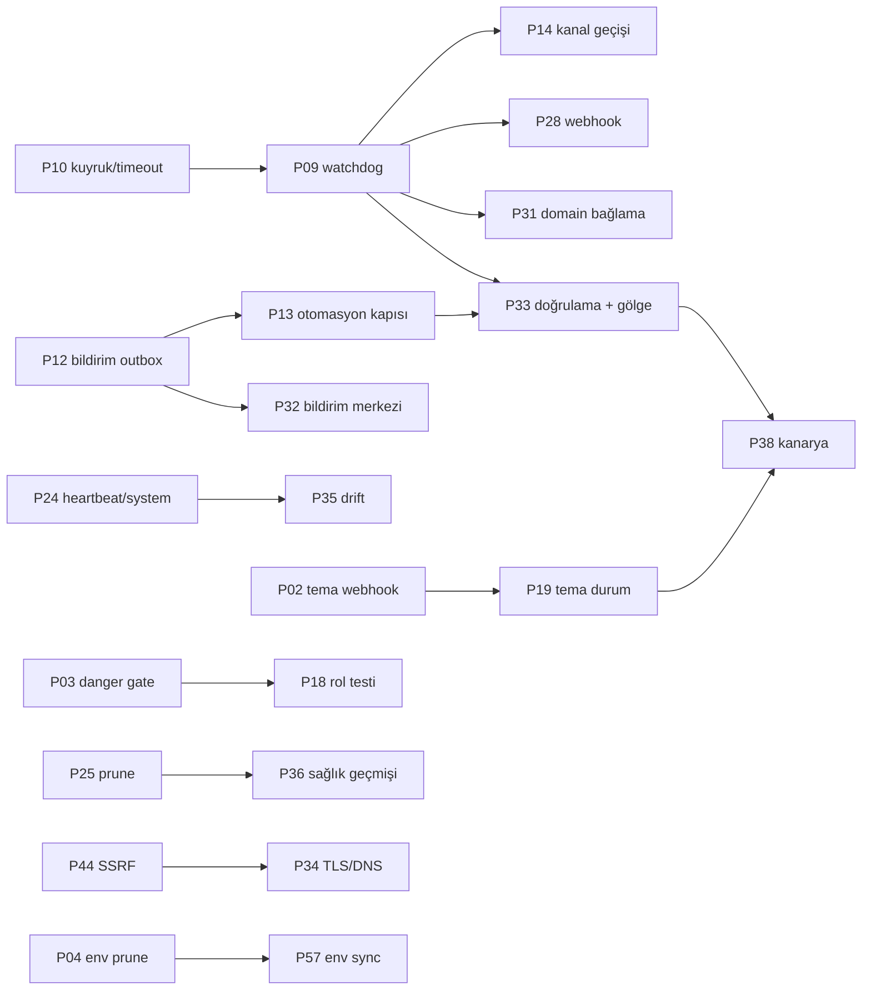

# 16 — Yol haritası ve birleşik backlog

**Tarih:** 2026-09-24 · **HEAD:** 8484d37 · **Hazırlayan:** Orkestratör (Dalga 3)
**Girdi:** 02–14 raporlarındaki 258 öneri satırı (S1–S12), [13](13-otonomi-yol-haritasi.md) otonomi güvenlik tabanı (T01–T19), [15](15-onceki-inceleme-durum-takibi.md) önceki inceleme durumu.

## Nasıl okunur

- **Puan** = `Etki × 2 − Risk + (S=3, M=2, L=1, XL=0)`. Birleşen maddede **Etki** ve **Risk** kaynakların en yükseği, **Efor** en büyük tek dilimin eforudur (birleşik madde birden çok dilimle teslim edilir). Kaynak raporlarda puan hatası yok: 258 öneri satırı betikle kontrol edildi.
- **Faz:** Şimdi (0–30 gün) = Kritik/Yüksek bulgu kapatanlar + puanı ≥ 8 olan S/M işler. Sonra (30–90 gün) = otonomi L3→L4 geçişleri, orta boy modüller, Orta bulgular. Belki / Araştır = XL, CMS'e bağımlı, kapsam kararı gerektiren işler.
- **Şimdi** fazı kendi içinde iki dilime ayrıldı. **Hafta 1** = 7 kök Kritik bulguyu kapatan 6 madde (P01, P02, P04–P07) + geri alınamaz işlem ve secret sızıntısı riski için iki Yüksek madde (P03, P08). [13](13-otonomi-yol-haritasi.md)'ün ilk hafta şartı (T04, T09, T11) için üç küçük dilim de Hafta 1'e çekilir (§8). Kalan Şimdi maddeleri puan sırasıyla gelir.
- **CMS** sütunu "Evet" ise [17](17-cms-handoff.md)'de karşılık gelen bir istek var. "Opsiyonel" ise Plane tarafı CMS değişikliği olmadan da çalışır.
- **Spec** sütunu önerilen tasarım dosyasıdır: `docs/superpowers/specs/2026-10-XX-<slug>-design.md`. "—" olan maddeler spec gerektirmeyecek kadar küçüktür; doğrudan dilim olarak yapılabilir.

## Özet

| Faz | Madde | Kaynak öneri (ilk eşlendiği madde) | Kritik bulgu kapatan |
|-----|------:|-----------------------------------:|----------------------|
| Şimdi — Hafta 1 | 8 | 27 | 7 kök Kritik bulgunun tamamı: S2-B04, S3-B01, S5-B01, S5-B06, S6-B01, S7-B01, S10-B13 (S11-B09 ve S12-B13, S3-B01'in yeniden ifadesidir) |
| Şimdi — kalan | 23 | 106 | — |
| Sonra | 27 | 108 | — |
| Belki / Araştır | 10 | 17 | — |
| **Toplam** | **68** | **258** / 258 | |

Her kaynak öneri en az bir maddede geçiyor (betikle doğrulandı: eksik 0). Birden çok maddeye katkı veren öneri, ilk geçtiği maddede sayıldı.

---

## 1. Şimdi — Hafta 1 (Kritik bulgu kapatanlar)

| ID | Başlık | Kaynak ID'ler | Modül | E | Efor | R | Puan | Bağımlılık | Kabul kriteri | CMS | Spec |
|----|--------|---------------|-------|--:|------|--:|-----:|------------|---------------|-----|------|
| P01 | **Mail proxy'de mailbox sahiplik kontrolü** | S7-O01, S9-O01 · bulgu S7-B01 (Kritik) | Mail | 5 | S | 1 | 12 | — | Başka sitenin mailbox ID'siyle `password`/`destroy` 404 döner ve audit yazar; `listAllMailboxes($site)` 60 sn önbellekli; feature testi var; `docs/security.md:33` gerçeği anlatır | Opsiyonel (404 mesajı) | `mail-proxy-ownership` |
| P02 | **Tema webhook güvenliği**: yalnız default branch, CMS 1.2.32 kapısı, manifest yeniden okuma | S5-O01, S5-O06, S5-O07, S5-O03, S9-O05, S11-O06 (tema kısmı) · bulgu S5-B01, S5-B06 (Kritik), S5-B02, S5-B07 | Themes | 5 | M | 2 | 10 | — | `feature/*` push'u `latest_sha`'yı değiştirmez; `release` olayı SHA olmayan değer yazmaz; CMS < 1.2.32 veya sürümü bilinmeyen sitede auto-update atlanır ve `theme.update_skipped_version` audit'i yazılır; `minimum_deamon_version` push'lanan SHA'daki `theme.json`'dan okunur; aynı `X-GitHub-Delivery` ikinci kez 200 no-op döner, `before ≠ latest_sha` olan push fan-out yapmaz. Her biri için test | Hayır | `theme-webhook-safety` |
| P03 | **Kalıcı silme ve tehlikeli işlemler Super Admin'e (`ops.danger` Gate)** | S9-O02, S2-O09, S9-O11, S6-O07, S6-O08 · bulgu S2-B10, S9-B01, S9-B03, S6-B09, S6-B10 | Güvenlik / Sites | 5 | M | 2 | 10 | — | [10 §1.4](10-guvenlik-yetki-denetim.md)'teki 16 ❌ route Operator için 403 döner; toplu purge beklenen sayı + slug onayı ister; kullanımdaki Coolify bağlantısı, Cloudflare hesabı ve zone silinemez; `forceDelete` = SA | Hayır | `ops-danger-gate` |
| P04 | **Env prune korkuluğu**: ekleme otomatik, kaldırma SA onaylı, secret/generated asla silinmez | S3-O01, S9-O20, S12-M16, S11-O06 (env kısmı) · bulgu S3-B01, S11-B09, S12-B13 (Kritik) | Coolify / EnvCatalog | 5 | M | 2 | 10 | — | Katalogdan `DB_PASSWORD` satırı düşünce deploy'da `DELETE` sayısı 0 (test); korumalı liste `APP_KEY`, `DB_*`, `MYSQL_*`, `CONTROL_PLANE_AGENT_SECRET`, `MAIL_*` ve bir kez generated görülen her anahtarı kapsar; kaldırma adayları fark ekranında bekler, SA onayı `env.prune_approved` audit'i yazar | Opsiyonel (C01 env göç kuralı) | `coolify-env-prune-guard` |
| P05 | **Attach tekilliği ve Coolify hedef kilidi** | S2-O04, S2-O05 · bulgu S2-B04 (Kritik), S2-B05 | Sites | 5 | S | 2 | 11 | — | Aynı `coolify_app_uuid` ikinci siteye bağlanamaz (`withTrashed` benzersizlik; DB unique index ayrı karar); attach listesi bağlı uygulamaları göstermez; uuid'li sitede bağlantı/sunucu/proje alanları sunucuda `prohibited` | Hayır | `site-attach-uniqueness` |
| P06 | **DNS şablonu üzerine yazmaz** + `mail_template_enabled` okunur | S6-O01, S6-O12, S6-O20 · bulgu S6-B01 (Kritik), S6-B14, S6-B21 | Cloudflare | 5 | M | 2 | 10 | — | Mevcut `@` TXT, `_dmarc` ve MX kayıtları içerik farklıysa değişmez, yalnız eksikse eklenir (test); mail şablonu bayrak kapalıyken yazılmaz; alias eklemede yalnız yeni host işlenir; koddaki sabit origin IP fallback'i kaldırılır | Hayır | `cloudflare-dns-template-safe` |
| P07 | **Plane DB yedeği, APP_KEY prosedürü, geri yükleme runbook'u** | S10-O10, S10-O17, S10-O16, S10-O14 · bulgu S10-B13 (Kritik), S10-B14, S10-B02 | Ops altyapı | 5 | M | 2 | 10 | — | Günlük `mysqldump --single-transaction` 14 gün ayrı volume'da; geri yükleme runbook'u yerelde denenmiş; entrypoint migrate öncesi yedek yaşını loglar (26 sa üstü uyarı); `APP_PREVIOUS_KEYS` rotasyon adımları `token-rotation.md`'de | Hayır | `plane-backup-and-keys` |
| P08 | **Hedef değişince secret yeniden girişi** | S9-O03, S3-O12 · bulgu S9-B02, S3-B09, S3-B10 | Güvenlik | 4 | S | 1 | 10 | — | Coolify `base_url`, platform SMTP host/port veya Hostinger hedefi değişince saklı secret temizlenir ve yeniden istenir; Coolify `test` kayıtlı token'ı yalnız kayıtlı `base_url` ile kullanır; test | Hayır | (P03 spec'i) |

## 2. Şimdi — kalan (0–30 gün)

| ID | Başlık | Kaynak ID'ler | Modül | E | Efor | R | Puan | Bağımlılık | Kabul kriteri | CMS | Spec |
|----|--------|---------------|-------|--:|------|--:|-----:|------------|---------------|-----|------|
| P09 | **Watchdog + `failed()` + doğru satır atfı** | S10-O02, S10-O03, S1-O07, S1-O05, S2-O07, S2-O03, S3-O06, S3-O08, S3-O02, S3-O14, S5-O08 (durum kısmı), S11-O07, S11-O08 | Ops / Deploy | 5 | M | 2 | 10 | P10 | [11 §2.1](11-operasyon-altyapi-gozlemlenebilirlik.md)'deki 11 takılı durum türü 5 dk'da bir tespit edilir; 18 job'un durum sahiplerinde `failed()` var; `markFailed` yalnız kendi denemesinin satırını alır; `finished_at`'sız `failed` satır deploy kapısını kilitlemez; tur başına ≤ 25 onarım, audit `actor=system` | Hayır | `ops-watchdog` |
| P10 | **Zarif kapanış, timeout değişmezi, kuyruk ayrımı** | S10-O04, S10-O05, S10-O01, S10-O06, S3-O07, S4-O10, S5-O09, S7-O07, S10-PO03 | Ops altyapı | 5 | M | 2 | 10 | — | `stopwaitsecs` ve `stop_grace_period` ≥ 330 sn; unit test her `app/Jobs` sınıfında `timeout < retry_after − 10` şartını doğrular; `critical`/`default`/`health`/`long` kuyrukları ve supervisor programları; toplu süpürmeler ≤ 240 sn dilimlerle devam eder | Hayır | `queue-topology` |
| P11 | **Sağlık sinyali doğruluğu** | S4-O01, S4-O02, S4-O03, S4-O04, S2-O08, S11-O09, S10-PO02 (atlama kısmı) | Agent / Health | 5 | M | 2 | 10 | — | 429 / `needs_secret` / `no_base_url` down maili üretmez; 2 ardışık hata eşiği; stopped/draft/provisioning siteler agent taramasına girmez; hata poll'u `deamon_version`'ı silmez (düz kolon); HTML 200 "verified" sayılmaz. Her biri için test | Hayır | `health-signal-truth` |
| P12 | **Bildirim güvenilirliği tabanı (outbox)** | S7-O04, S7-O03, S7-O05, S3-O10, S11-O10 | Mail / Bildirim | 5 | M | 2 | 10 | — | `ops_notifications` outbox + 3 deneme + teslim kaydı; SMTP ayarı değişince worker yeni ayarı kullanır (`Mail::purge`); provizyon, kanal geçişi ve `failWithoutSiteChange` dahil tüm `deploy_failed` yolları bildirim üretir | Hayır | `ops-notification-outbox` |
| P13 | **Otomasyon kapısı, kill switch, AUTO_SAFE sıkılaştırma, bütçe** | S11-O01, S11-O03, S11-O05, S11-O17, S8-O01, S12-M19, S3-O23, S3-O09 (önceki A7) | Otonomi | 5 | M | 2 | 10 | P12 | Settings → Otomasyon (SA yazar, audit); env `false` iken DB açamaz; `bind_domains` AUTO_SAFE'ten çıkar; otomatik `redeploy` yalnız aynı commit, `force=false`, gecikmeli; kural×site/gün ve kural×bağlantı/saat bütçesi; aynı kod 15 dk'da ≥ 3 sitede görülünce kural filo çapında durur | Hayır | `automation-guard` |
| P14 | **Kanal geçişi bütünlüğü** | S2-O01, S2-O02, S2-O14, S3-O03, S3-O16, S3-O22, S1-O10 | Deploy | 5 | M | 2 | 10 | P09 | Deploy kapısı ve env ön kontrolü PATCH'ten önce; meşgulse `release(delay)`; deploy hiç başlamadıysa Coolify dalı geri alınır; `desired_channel` temizlenir; `assertCoolifyReady` sitenin bağlantısını kullanır; `database` kuyruk sürücülü toplu geçiş testi | Hayır | `channel-switch-integrity` |
| P15 | **Unsubscribe POST ile** | S7-O02, S9-O06 | Mail | 4 | M | 1 | 9 | — | GET yalnız onay sayfası; durum POST ile değişir; `List-Unsubscribe-Post` başlığı; audit; geri açma bağlantısı | Hayır | (P12 spec'i) |
| P16 | **Agent secret rotate sırası** | S4-O05 | Agent | 4 | S | 1 | 10 | — | Coolify env yazımı başarısızsa DB'deki secret değişmez (test); rotate sonrası restart seçeneği ve uyarısı | Hayır | — |
| P17 | **Sessiz `catch` politikası** | S1-O06 | Mimari | 4 | S | 1 | 10 | — | 11 yutan `catch (Throwable)` `report()` veya bağlamlı `Log::warning` yazar; yeni yutmayı yakalayan grep testi | Hayır | — |
| P18 | **Rol matrisi testi + güvenlik test paketi** | S9-O21, S1-O14 (önceki C4, C5) | Güvenlik | 4 | M | 1 | 9 | P03 | `route:list`'ten türetilen her yazma route'u × 3 rol testi; nonce replay/skew testleri; Blade'de encrypted kolon sızıntısı genel testi | Hayır | — |
| P19 | **Tema job durum makinesi + smoke hold** | S5-O05, S5-O08, S5-O09, S5-O13 | Themes | 4 | M | 2 | 8 | P02 | activate hatası `theme.activate_failed` + `markError`; exception'da satır `installing`/`updating`'de kalmaz; smoke hatası `auto_update_held_sha` yazar ve fan-out o kurulumu atlar; smoke bütçesi job timeout'undan kısa; `updateToLatest` flash'ı kuyruğa alındı/atlandı ayrımını söyler | Hayır | (P02 spec'i) |
| P20 | **Yeni siteye platform mail push + reconcile** | S7-O06, S7-O12, S7-O13 | Mail | 4 | S | 1 | 10 | — | Secret inject ve provizyon başarısında push; saatlik reconcile; mail sunucusu değişince site başına configure job; durum çipi son başarılı push'u gösterir | Hayır | — |
| P21 | **Plane hesapları + 2FA + oturum sertleştirme** | S9-O08, S9-O09, S12-M13 (Öneri-B1, Öneri-B2, C2) | Auth | 5 | L | 2 | 9 | — | `/users` (SA): davet, rol değişimi, devre dışı bırakma, oturum düşürme; Fortify reset + TOTP; SA ve Operator için 2FA zorunlu; `SESSION_ENCRYPT`, `logoutOtherDevices`; alarm alıcıları role göre | Hayır | `plane-accounts-2fa` |
| P22 | **Audit kapsamı + `AuditRecorder`** | S9-O07, S6-O06, S1-O11, S2-O13, S5-O12, S7-O18, S11-O02 | Güvenlik | 4 | M | 1 | 9 | — | [10 §1.6](10-guvenlik-yetki-denetim.md)'daki ❌ yüzeylerin hepsi audit yazar (domain, Cloudflare, bağlantılar, ayarlar, auth olayları); tek `AuditRecorder`; `actor`, `source`, `reason`, `rule_id` alanları | Hayır | `audit-recorder` |
| P23 | **Apex için Public Suffix List** | S6-O02 | Cloudflare | 4 | S | 2 | 9 | — | `apex('shop.x.com.tr') = x.com.tr` ve `co.uk` testleri; PSL anlık görüntüsü repoda, runtime'da indirme yok | Hayır | — |
| P24 | **Scheduler gözlemi, heartbeat, `/ops/system`, `failed_jobs` UI** | S10-O07, S10-O08, S4-O16, S12-M20, S12-O02, S12-O04 (önceki D6, E1) | Ops | 4 | M | 1 | 9 | — | `ops_schedule_runs` kaydı; heartbeat > 2× aralık → Fleet banner'ı; kuyruk derinliği ve en eski iş yaşı; `failed_jobs` listesi + retry; tüm schedule girişleri `onOneServer` | Hayır | `system-and-automation-panel` (P13 ile tek spec) |
| P25 | **Veri tutma (prune)** | S10-O09, S12-O01 (önceki A8) | Ops | 4 | S | 2 | 9 | — | `Prunable`: `audit_logs` 400 gün, `deployments` site başına son 50 + 180 gün, `ops_background_jobs` 30 gün; `model:prune` schedule'da; yeni tablo açan her spec prune kuralıyla gelir | Hayır | `data-retention` |
| P26 | **Sunucu tarafı i18n + onay yedeği** | S8-O02, S8-O03, S8-O04, S8-O07, S1-O09, S5-O19 | UI | 4 | M | 1 | 9 | — | 13 flash ve servis exception metinleri lang anahtarında; DELETE formlarında "Delete site" yedeği görünmez (ConfirmMatrix testi); platform mail katalog metinleri lang'de; TR testi büyük/küçük harf duyarsız | Hayır | — |
| P27 | **Performans hızlı kazanımları** | S10-PO01, S10-PO08, S10-PO09, S10-PO10, S1-O20, S2-O17 | Perf | 3 | S | 1 | 8 | — | 500 sitede Sites sayfası soğuk cache ≤ 150 sorgu (bugün 552); Activity 30 gün penceresi + `simplePaginate`; nginx gzip; `reportedDeamonVersions` istek başına memoize | Hayır | — |
| P28 | **Coolify webhook sertleştirme + atomik deploy kapısı** | S3-O04, S3-O05, S3-O17, S9-O04 | Deploy | 4 | M | 2 | 8 | P09 | `channel_switch` satırı `ChannelSwitcher`'a gider; bilinmeyen uuid başka açık satıra yapışmaz; webhook yalnız "Coolify'dan yeniden oku" tetikler; bağlantı başına `hmac_only`; deploy kapısı `Cache::lock` ile atomik | Hayır | `coolify-webhook-hardening` |
| P29 | **Yaşam döngüsü guard matrisi** | S2-O06, S2-O10, S2-O11, S2-O12 | Sites | 4 | M | 2 | 8 | — | provisioning/deploying sitede arşiv yok; stopped sitede redeploy/pin/bind yok; activate deploy yolundan geçer; import Plane'e ait alanları ezmez; purge `Throwable`'a dayanıklı | Hayır | `site-lifecycle-guard` |
| P30 | **GitHub installation olayları + güvenli bağlantı kesme** | S5-O10, S5-O11 | Themes | 4 | M | 2 | 8 | — | `installation` deleted/suspend → bağlantı durumu + audit; bağlantı kesme kurulum kayıtlarını silmez, temayı arşivler; onay modalı etkilenen site sayısını gösterir | Hayır | — |
| P31 | **Domain bağlama doğruluğu** | S6-O03, S6-O04, S6-O09, S6-O10, S6-O13 | Domains | 4 | M | 3 | 7 | P09, P10 | Toplu bind, `bind_domains` fix'i ve Sync auto-rebind PATCH'ten sonra tempolu, force'suz deploy yapar (site başına 60 sn birleştirme); `coolify_bound_at` yalnız gözlemle yazılır; toplu clear `removeAlias` yolunu kullanır | Hayır | `domain-binding-truth` |

## 3. Sonra (30–90 gün)

| ID | Başlık | Kaynak ID'ler | Modül | E | Efor | R | Puan | Bağımlılık | Kabul kriteri | CMS | Spec |
|----|--------|---------------|-------|--:|------|--:|-----:|------------|---------------|-----|------|
| P32 | **Bildirim merkezi**: imzalı webhook kanalı, bastırma/eskalasyon, haftalık özet | S12-M01, S12-M21, S7-O15, S7-O16, S7-O17, S4-O20 (önceki D1, D2, A9) | Bildirim | 5 | L | 2 | 9 | P12 | Olay × kanal matrisi; imzalı genel webhook (Slack/Telegram uyumlu); 30 dk ve 2 sa hatırlatma, günde ≤ 3; ops alarmı ile yazılım maili ayrı; Pazartesi özeti | Hayır | `notification-center` |
| P33 | **Otonomi doğrulama çerçevesi + gölge mod + sistem aktörü** | S11-O02, S11-O04, S11-O11, S11-O13, S11-O14, S11-O15, S11-O16, S1-O23 | Otonomi | 5 | M | 3 | 9 | P13, P09 | Her otomatik eylem `VerifyAutomationJob` kurar (`verified`/`unresolved`); yeni L4 kuralı 14 gün gölge modda çalışır; `automation_runs` tablosu; kanal profili (alpha → beta → main); site ops mutex'i; Plane'in kendi uygulaması korumalı | Hayır | `automation-verification` |
| P34 | **TLS/DNS gözetimi + zamanlanmış live probe** | S6-O14, S6-O15, S4-O19, S12-M03 (Öneri-B8) | Domains / Health | 4 | M | 1 | 9 | P44 (SSRF) | Saatlik tempolu probe; sertifika `notAfter` < 14 gün ve DNS A ≠ beklenen origin dikkat kartına düşer; pending zone yaşı görünür | Hayır | `tls-dns-watch` |
| P35 | **Drift dedektörü + zamanlanmış senkronlar** | S12-M17, S3-O13, S6-O05, S5-O15 (önceki A1 kalanı) | Entegrasyon | 5 | L | 2 | 9 | P24 | Gecelik envanter, saatlik katalog ve domain taraması; Plane↔Coolify↔Cloudflare↔CMS sapmaları (ikiz attach, yetim app, bayat `verified_at`, env ve tema SHA sapması) dikkat listesinde; MVP yalnız tespit | Opsiyonel (tema SHA) | `drift-detector` |
| P36 | **Sağlık geçmişi + iç uptime raporu** | S4-O12, S12-M02 (önceki D4, D5) | Health | 4 | M | 2 | 8 | P25 | `site_health_events` (90 gün); site detayında 30 günlük şerit; aylık uptime | Opsiyonel (F4) | `health-history` |
| P37 | **Bakım penceresi, deploy dondurma, otomasyon duraklatma** | S12-M09, S11-O12 (Öneri-B6, Öneri-B11) | Deploy / Otonomi | 4 | M | 2 | 8 | P13 | `maintenance_until`, `automation_paused_until`; filo/kanal dondurma penceresi; pencere içinde deploy SA onayı ister; bakımdaki site alarm üretmez | Hayır | `maintenance-freeze` |
| P38 | **Tema kanarya rollout + toplu güncelleme** | S5-O04, S5-O14, S5-O17, S5-O18, S12-M07, S12-O03, S10-PO07 (önceki A5) | Themes | 5 | L | 3 | 8 | P02, P19, P33 | `theme_rollouts` + hedefler; dalga alpha → beta → main, 3 site, 30 dk soak, ilk smoke hatasında dur; "N geride kurulumu güncelle" (L3); pinned → latest sapma rozeti; site başına tema mutex'i | Hayır | `theme-canary-rollout` |
| P39 | **Ölçek: kademeli tarama, health kuyruğu, RateGuard Redis, toplu deploy yuvarlama** | S10-PO02, S10-PO03 (pool), S10-PO04, S10-PO05, S10-PO06, S10-PO11, S4-O09, S4-O13 | Perf | 5 | L | 3 | 8 | P10 | 500 site senaryosunda health turu 600 sn pencereye sığar; Coolify'a en çok K build ileride; poll bütçesi kuyrukta beklemeyi saymaz; iş tipi başına süre metrikleri | Hayır | `fleet-scale-500` |
| P40 | **PHP 8.4 + `composer audit` + Larastan + pint** (2026-12-31 öncesi) | S1-O15, S1-O16, S9-O18 | Mimari | 3 | M | 2 | 6 | — | Dockerfile ve `config.platform` 8.4; `composer check` (pint --test + stan seviye 5 baseline + hedefli testler); deploy öncesi `composer audit --locked` | Hayır | — |
| P41 | **Nonce atomikliği + retry'de yeni imza** | S4-O14, S4-O15, S7-O09 | Agent | 2 | S | 1 | 6 | — | Gelen nonce `Cache::add`; TTL ≥ 2× skew; giden retry her denemede yeni nonce/timestamp | Doğrula (nonce sırası) | — |
| P42 | **Entegrasyon bağlantı durumu** | S3-O11, S3-O18, S7-O21 | Entegrasyon | 3 | S | 1 | 8 | P24 | Coolify 401/403 → `auth_failed_at` + banner, satırlar düşmez; pasif bağlantı exception atar; günlük Hostinger token probe | Hayır | — |
| P43 | **Redis kalıcılığı, JSON log, bellek bütçesi, hafif hata izleme** | S10-O11, S10-O12, S10-O13, S10-O15 | Ops | 3 | M | 1 | 7 | — | Redis `appendonly` + `noeviction`; JSON log + request/job bağlamı; `ops_exceptions` parmak izi tablosu (yeni bağımlılık yok); FPM/worker bellek limitleri ölçüme göre | Hayır | — |
| P44 | **Web güvenliği: başlıklar, trusted proxies, URL/SSRF, redaktör, stub route'lar** | S9-O10, S9-O13, S9-O15, S9-O16, S9-O17, S9-O19 | Güvenlik | 3 | S | 2 | 7 | — | CSP (önce report-only), HSTS, Referrer-Policy; `base_url` yalnız https ve özel IP reddi; probe/smoke redirect'lerinde iç IP engeli; redaktör genel secret desenleri; `security.md` kodla hizalı | Hayır | — |
| P45 | **Grace'li agent secret rotasyonu** | S4-O06 (Öneri-B4) | Agent | 4 | M | 3 | 7 | P16 | Önceki secret grace süresince kabul/deneme; rotasyon kesintisiz; sağlık OK olunca eski silinir | Opsiyonel (`..._PREVIOUS`) | `agent-secret-grace` |
| P46 | **Olay defteri + site zaman çizelgesi + müşteri kartı** | S12-M14, S12-M11 (Öneri-B5, Öneri-B10) | Sites | 3 | M | 1 | 7 | P22 | Site/fleet notu; site zaman çizelgesi (audit + deploy + sağlık); müşteri kartı yalnız iletişim ve sözleşme tarihi | Hayır | `site-timeline-customers` |
| P47 | **Kapasite paneli** | S12-M08 (Öneri-B9) | Coolify | 3 | M | 1 | 7 | Coolify API spike | Sunucu başına site sayısı ve kuyruk; yeni sitede en az yüklü sunucu önerisi; metrik ucu yoksa yerel sayımlar | Hayır | `capacity-panel` |
| P48 | **Mailbox istekleri ve proxy korumaları** | S7-O10, S7-O11, S7-O14, S7-O20 | Mail | 3 | M | 1 | 7 | — | Yeni istek bildirimi + sayaç; site bazlı 60/dk rate limit; bir order'ın ikinci siteye bağlanması onay ister; push hatalı site listesi | Opsiyonel | — |
| P49 | **Coolify kısmi başarı telafisi, compose snapshot, import `--connection`** | S3-O15, S3-O19, S3-O20 | Coolify | 3 | S | 2 | 7 | — | Pin/follow deploy hatasında ayna yazılır + audit; compose geçişi şifreli snapshot'tan geri yüklenebilir; import bağlantı kimliği yazar | Hayır | — |
| P50 | **Domain küçükleri** | S6-O16, S6-O17, S6-O18, S6-O19 | Domains | 3 | S | 2 | 7 | — | Kullanılmayan `PATCH /domains/{domain}` kaldırılır; pending zone'lu alias bekletilir; Sync flash'ı domain sonucunu gösterir; DB kısmı transaction'da | Hayır | — |
| P51 | **Site/agent küçükleri ve test açıkları** | S2-O15, S2-O18, S4-O07, S4-O08, S4-O11, S4-O17, S4-O18, S4-O21, S7-O19 (önceki A3/1.3-c, A4) | Sites / Agent | 3 | M | 1 | 7 | — | Admin reset danger onayı; provision sonrası ilk admin daveti; hata sınıflandırması (dns/tls/refused/timeout); payload şema kontrolü; tek tazelik politikası; identity heal throttle; eksik testler; `ops:import-coolify-apps --apply --inject-secret` ile import sonrası agent secret (önceki A3) | Opsiyonel (yetenek haritası) | — |
| P52 | **Mimari: action katmanı ve controller bölme** | S1-O01, S1-O02, S1-O03, S1-O04, S1-O08, S1-O12, S1-O13 | Mimari | 4 | L | 3 | 6 | P33 (sistem aktörü) | `app/Actions/Sites/*` (girdi DTO, sonuç nesnesi); `SiteController` < 600 satır; tek toplu işlem yolu (`PacedFanout`); `SignedAgentRequest`; `OpsActionException` (i18n anahtarı) | Hayır | `actions-layer` |
| P53 | **HTTP retry trait'i (Cloudflare, Hostinger, GitHub) + token önbelleği** | S1-O22, S6-O11, S5-O16 | Entegrasyon | 3 | M | 2 | 6 | — | 429/5xx için `Retry-After`'lı sınırlı retry; installation token ≤ 50 dk şifreli cache | Hayır | — |
| P54 | **Runbook bağlantılı hata ekranları** | S12-M18 (Öneri-B12) | UI | 2 | S | 1 | 6 | — | Teşhis kodu ve dikkat kartları ilgili runbook'a tıklanabilir link verir | Hayır | — |
| P55 | **Paylaşılan sırların etki alanını daraltma** | S7-O22, S9-O14 | Mail / Güvenlik | 4 | L | 3 | 6 | P12 | Plane alarm SMTP'si CMS platform SMTP'sinden ayrı; rotasyon runbook'u; site başına DeskRon/SMTP anahtarı fizibilitesi | Evet (DeskRon) | `shared-secret-blast-radius` |
| P56 | **UI erişilebilirlik ve CSS/JS borcu** | S8-O05, S8-O06, S8-O08, S8-O09, S8-O10, S8-O11, S8-O12, S8-O13, S8-O14, S8-O15, S8-O16, S8-O17 | UI | 3 | L | 2 | 5 | — | `<main>`, skip link, `aria-current`, `aria-live`; `--text-faint` ≥ 4.5:1; stale tema override'ları silinir; mobil off-canvas nav; tek `:root` paleti; `PlaneUI.http()`; genel onay sözleşmesi testi | Hayır | `ui-a11y-debt` |
| P57 | **Env kataloğu yeni anahtar senkronu** | S3-O21 | Coolify | 3 | M | 3 | 5 | P04 | Katalogda yeni required/generated anahtar görülünce kanal sitelerine deploy'suz env sync kuyruğu | Evet (eksik env davranışı) | — |
| P58 | **Domain detay sayfası** | S8-O18 | UI / Domains | 2 | M | 2 | 4 | P31 | Salt-okunur domain sayfası: site, Cloudflare kaydı, Coolify bağ durumu, geçmiş | Hayır | — |

## 4. Belki / Araştır

| ID | Başlık | Kaynak ID'ler | Modül | E | Efor | R | Puan | Neden bekliyor | CMS | Spec |
|----|--------|---------------|-------|--:|------|--:|-----:|----------------|-----|------|
| P59 | Site yedek orkestrasyonu (DB + storage; geri yükleme v2, ayrı karar) | S12-M04 (önceki F3, Boşluk-B8) | CMS / Deploy | 5 | L | 4 | 7 | Coolify zamanlanmış yedek API spike'ı sonucu bekleniyor; uygunsa CMS'e gerek kalmaz | Evet | `site-backup-orchestration` |
| P60 | Uzak bakım komutları + log kuyruğu | S12-M15 (önceki F1, F2) | CMS / Sites | 3 | M | 2 | 6 | CMS allowlist uçları gerekir | Evet | `remote-maintenance` |
| P61 | CMS kanal terfisi (release train) | S12-M06 (önceki A6) | Deploy | 4 | L | 4 | 5 | P38 rollout şemasını paylaşır; CMS uyumluluk bayrağı yok | Evet (`requires_env[]`) | `release-train` |
| P62 | HMAC v2 (metot + yol + yön) | S7-O08, S9-O12 | Agent | 3 | L | 3 | 4 | İki repoda eşzamanlı sürüm ister | Evet | `hmac-v2` |
| P63 | Staging / preview klon | S12-M05 (Öneri-B7) | Sites | 3 | L | 3 | 4 | P59'a bağlı (DB kopyası) | Evet | `preview-clone` |
| P64 | Temizlik: ölü kod, legacy `coolify_settings`, test hızı, enum, `SiteStatus::Archived` | S1-O17, S1-O18, S1-O19, S1-O21, S2-O16, S7-O23 (önceki E5) | Mimari | 2 | M | 2 | 4 | Fırsatçı; P52 ile birlikte yapılabilir | Hayır | — |
| P65 | Salt-okunur API / CLI | S12-M12 (Öneri-B13) | Platform | 2 | M | 3 | 3 | P21'e bağlı; somut tüketici yok | Hayır | — |
| P66 | Operatör playbook motoru | S12-M10 | Otonomi | 3 | XL | 4 | 2 | P33 olgunlaşmadan erken | Hayır | — |
| P67 | Domain bitiş takibi (RDAP) | S12-M22 | Domains | 2 | S | 2 | 5 | **Kapsam dışı — bilinçli karar gerekir** (registrar verisi) | Hayır | — |
| P68 | Müşteriye açık status sayfası; site bazlı viewer görünürlüğü | S12-M23, S12-M24 (önceki D3, C6) | Platform | 2 | M | 3–4 | 2–3 | **Kapsam dışı — bilinçli karar gerekir** (müşteri yüzü / multi-tenant eğilimi) | Hayır | — |

---

## 5. Otonomi güvenlik tabanı → backlog eşlemesi

[13](13-otonomi-yol-haritasi.md) mevcut L4 otomasyonların bütçesiz çalışmayı sürdürmemesi için T01–T19 maddelerini önkoşul sayıyor. Özellikle T01, T02, T04, T09, T11, T16 ve T17 ilk haftada kapanmalı. Aşağıdaki eşleme bunun backlog karşılığıdır.

| Taban | Kaynak | Backlog | Faz |
|-------|--------|---------|-----|
| T01 | S3-B01 | P04 | Hafta 1 |
| T02 | S5-B01, B03, B06 | P02 | Hafta 1 |
| T03 | S1-B09, S3-B06/B07, S2-B07, S10-B01/B08 | P09, P10 | Şimdi |
| T04 | S3-B02, S2-B03 | P09 (doğru satır dilimi Hafta 1) | Hafta 1 |
| T05 | S3-B05, S3-B08 | P28 | Şimdi |
| T06 | S4-B01, B02, S7-B17 | P11, P32 | Şimdi / Sonra |
| T07 | S4-B03 | P11 | Şimdi |
| T08 | S7-B03, B04, B05 | P12 | Şimdi |
| T09 | S8-B04, S3-B11, S3-B20 | P13 (ilk dilim Hafta 1), P42 | Hafta 1 / Sonra |
| T10 | S1-B17 | P33 | Sonra |
| T11 | S1-B08 | P17 | Hafta 1 |
| T12 | S3-B27, S6-B03, S6-B04 | P13 (AUTO_SAFE), P31 | Şimdi |
| T13 | S3-B19, S5-B20 | P28, P33, P38 | Şimdi / Sonra |
| T14 | S2-B08, S2-B09 | P29, P11 | Şimdi |
| T15 | S4-B22 | P24 | Şimdi |
| T16 | S9-B02 | P08 | Hafta 1 |
| T17 | S9-B03, S6-B09 | P03 | Hafta 1 |
| T18 | S10-B13 | P07 | Hafta 1 |
| T19 | S10-B05, B09, B10 | P10, P11, P24, P39 | Şimdi / Sonra |

**Not (T02):** GitHub teslimat idempotency'si (S5-O03, S9-O05) P02 ile aynı dosyaya dokunduğu için P02 spec'inin ikinci dilimi olarak planlandı.

## 6. Bağımlılık grafiği (Şimdi + Sonra çekirdeği)

## 7. Birleştirme kaydı

Tekrar eden öneri kümeleri ve birleştikleri madde:

| Küme | Birleşen kaynaklar | Madde |
|------|--------------------|-------|
| Takılı durum / reconcile / `failed()` | S1-O07, S2-O07, S3-O06, S3-O14, S10-O02, S10-O03, S11-O07, S11-O08 | P09 |
| Yanlış satırı `failed` yapma | S1-O05, S2-O03, S3-O02, S3-O08 | P09 |
| Kuyruk/timeout hizası | S3-O07, S4-O10, S5-O09, S7-O07, S10-O01, S10-O04, S10-O05, S10-O06, S10-PO03 | P10 |
| Env prune | S3-O01, S9-O20, S12-M16, S11-O06 | P04 |
| Mail proxy sahipliği | S7-O01, S9-O01 | P01 |
| Unsubscribe | S7-O02, S9-O06 | P15 |
| Kalıcı silme / tehlikeli işlem yetkisi | S2-O09, S9-O02, S9-O11, S6-O07, S6-O08 | P03 |
| Audit kapsamı | S1-O11, S2-O13, S5-O12, S6-O06, S7-O18, S9-O07, S11-O02 | P22 (+ P33 otomasyon şeması) |
| Bildirim | S3-O10, S7-O03, S7-O04, S7-O05, S11-O10 → P12; S4-O20, S7-O15, S7-O16, S7-O17, S12-M01, S12-M21 → P32 | P12, P32 |
| Kill switch / otomasyon görünürlüğü | S8-O01, S11-O01, S11-O11, S12-M19 | P13, P33 |
| AUTO_SAFE | S3-O09, S3-O23, S11-O05 | P13 |
| Heartbeat / sistem sayfası | S4-O16, S10-O07, S10-O08, S12-M20, S12-O02, S12-O04 | P24 |
| Nonce | S4-O14, S4-O15, S7-O09 | P41 |
| HMAC v2 | S7-O08, S9-O12 | P62 |
| Hedef değişince secret | S3-O12, S9-O03 | P08 |
| 2FA / hesaplar | S9-O08, S9-O09, S12-M13 | P21 |
| PHP sürümü | S1-O16, S9-O18 | P40 |
| TLS/DNS gözetimi | S4-O19, S6-O14, S6-O15, S12-M03 | P34 |
| Tema rollout | S5-O04, S5-O18, S10-PO07, S12-M07, S12-O03 | P38 |
| `reportedDeamonVersions` | S1-O20, S2-O17 | P27 |
| Drift / zamanlanmış senkron | S3-O13, S5-O15, S6-O05, S12-M17 | P35 |
| Sağlık tarama kapsamı (stopped siteler) | S2-O08, S4-O02, S10-PO02 | P11 (atlama), P39 (kademe) |

## 8. Kapasite notu

Şimdi fazında 31 madde var. Tek geliştirici ve ajan destekli dilimlerle 30 günde bitmesi gerçekçi değil. Önerilen sıra:

1. Hafta 1: P01–P08 (3 S + 5 M, birbirinden bağımsız, paralel yürüyebilir) + [13](13-otonomi-yol-haritasi.md) ilk hafta şartı için üç küçük dilim: **P17** (sessiz `catch`, S), **P09'un doğru satır dilimi** (S3-O02, S2-O03: `markFailed` yalnız kendi satırı, S) ve **P13'ün ilk dilimi** (S8-O01 salt-okunur Otomasyon bölümü + env tabanı, AUTO_SAFE'ten `bind_domains` çıkarma).
2. Hafta 2–3: P10 → P09 → P11 → P12 → P13. Bu zincir otonomi tabanıdır.
3. Hafta 3–4: puan sırasıyla P14–P31. P21 (hesaplar + 2FA) L boydadır; ayrı spec ile paralel başlatılmalı.

Taşan maddeler Sonra fazının başına kayar. Hafta 1 ve otonomi zinciri kaymamalı.
